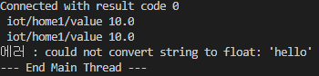
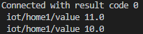
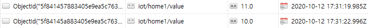

# MQTT Python Client - Paho

### Paho 모듈

**paho-mqtt 모듈**

-   MQTT Python Client 모듈
-   설치
    -   `sudo pip3 install paho-mqtt`
    -   `pip install paho-mqtt`
-   api 문서
    -   https://www.eclipse.org/paho/clients/python/docs/

<br>

**구독자(Subscriber) 개발 절차**

-   MQTT 클라이언트 클래스 인스턴스화 
-   브로커 연결 
-   토픽 구독 신청 
-   토픽 수신시 호출할 핸들러 등록 
-   토픽 수신 대기 
-   토픽 수신시 처리 - 핸들러 호출

<br>

**발행자(Publisher) 개발 절차**

-   MQTT 클라이언트 클래스 인스턴스화 
-   브로커 연결 
-   필요시 토픽 발행(전송)

<br>

<br>

**클라이언트 클래스 인스턴스화하기 : Client( )**

```python
Client(client_id="", clean_session=True, userdata=None, protocol=MQTTv311, transport="tcp")
```

-   `client_id`
    -   브로커에 연결할 때 사용되는 고유 클라이언트 ID 문자열
    -   비어있거나 None인 경우, 무작위로 결정
        -   이 경우 clean_session은 True여야함
-   `clean_session`
    -   브로커와의 연결이 끊어졌을 때 브로커가 클라이언트의 정보를 지울지 여부
-   `userdata`
    -   핸들러에서 사용한 사용자 정의 데이터 타입
-   `protocol`
    -   MQTT 버전( MQTTv31 or MQTTv311)
-   `transport`
    -   전송 프로토콜("tcp" 또는 "websocket")

```python
import paho.mqtt.client as mqtt
mqttc = mqtt.Client()
```

<br>

**연결 : connect( )**

```python
connect(host, port=1883, keepalive=60, bind_address="")
```

-   `host`
    -   브로커의 호스트명 또는 IP 주소
-   `port`
    -   브로커의 포트 번호
-   `keepalive`
    -   브로커와의 통신 사이에 허용되는 최대 기간 (초)
    -   다른 메시지가 교환되지 않으면 클라이언트가 브로커에 ping 메시지를 보낼 속도 를 제어
-   `bind_address`
    -   네트워크 인터페이스(랜카드)가 여러 개 인 경우, 바인딩할 IP 주소
-   `콜백(Callback)`
    -   연결 성공시 on_connect() 콜백 호출

<br>

**비동기 연결 : connect_async ( )**

```python
connect_async(host, port=1883, keepalive=60, bind_address="")
```

-   loop_start () 와 함께사용 하여 비 차단 방식으로 연결

<br>

**재연결 : reconnect( )**

-    이전에 사용했던 접속 정보로 다시 접속 시도

```python
reconnect()
```

<br>

**연결 끊기 : disconnect( )**

```python
disconnect()
```

<br>

<br>

**네트워크 루프(프로그래밍)**

-   메시지 수신 처리를 위해서는 스레드로 구현 필요
-   `loop()`
    -   1개의 네트워크 이벤트 처리
-   `loop_start()`
    -   새로운 스레드를 실행하여 loop()를 무한 실행
-   `loop_forever()`
    -   현재 스레드에서 loop()를 무한 실행

<br>

<br>

**토픽 발간하기 : publish( )**

```python
publish (topic, payload = None, qos = 0, retain = False)
```

-   `topic`
    -   메시지를 게시 할 주제
-   `payload`
    -   전송할 메시지
    -   문자열 또는 바이트 데이터(struct.pack() 필요)
-   `qos`
    -   qos(quality of service) 수준
-   `retain`
    -   True 설정한 경우, 해당 토픽에 대한 가장 최근의 메시지 유지

<br>

**구독/구독 취소: subscribe( ) / unsubscribe( )**

```python
subscribe(topic, qos=0)
unsubscribe(topic)
```

<br>

<br>

**콜백**

-   특정 이벤트(접속 성공, 메시지 수신 등)가 발생했을 때 호출되는 핸들러 (함수)
-   `on_connect(client, userdata, flags, rc)`
    -   브로커가 연결 요청에 응답 할 때 호출
    -   `client`
        -   이 콜백의 클라이언트 인스턴스
    -   `userdata`
        -   Client() 또는 user_data_set()에서 설정한 사용자 데이터
    -   `flags`
        -   브로커가 보낸 응답 플래그
    -   `rc`
        -   연결 결과 
        -   0 : 연결 성공 
        -   1~5 : 연결 거부 
        -   6-255 : 현재 사용되지 않습니다.
-    `on_disconnect(client, userdata, rc)`
    -   브로커와 연결이 끊어질때 호출
    -   `client`
        -   이 콜백의 클라이언트 인스턴스
    -   `userdata`
        -   Client() 또는 user_data_set()에서 설정한 사용자 데이터
    -   `rc`
        -   처리 결과 
        -   0 : 정상적으로 끊김 
        -   0이 아닌 값 : 예외에 의해 끊어짐

**콜백 : 연결 및 연결 끊기 처리**

```python
def on_connect(client, userdata, flags, rc):
	print("Connection returned result: "+ rc)

def on_disconnect(client, userdata, rc):
	if rc != 0:
		print("Unexpected disconnection.")

mqttc.on_connect = on_connect
mqttc.on_disconnect = on_disconnect
```

<br>

-    `on_message(client, userdata, message)`
    -   subscriber에서 메시지(토픽)가 수신됬을 때 호출
    -   `client`
        -   이 콜백의 클라이언트 인스턴스
    -   `userdata`
        -   Client() 또는 user_data_set()에서 설정한 사용자 데이터
    -   `message`
        -   MQTTMessage 인스턴스
        -   속성 : **topic , payload , qos , retain**

**콜백 : 메시지 수신 처리**

```python
def on_message(client, userdata, message):
    print("Received message '" + str(message.payload) +
        "' on topic '" + message.topic +
        "' with QoS " + str(message.qos))
    
mqttc.on_message = on_message
```

<br>

<br>

**Subscriber 구현**

```python
import paho.mqtt.client as mqtt

# 브로커 접속 시도 결과 처리 콜백 함수
def on_connect(client, userdata, flags, rc):
    print("Connected with result code "+ str(rc))
    if rc == 0:
        client.subscribe("iot/#") # 연결 성공시 토픽 구독 신청
    else:
        print('연결 실패 : ', rc)
        
# 관련 토픽 메시지 수신 콜백 함수
def on_message(client, userdata, msg):
    value = float(msg.payload.decode())
    print(f" {msg.topic} {value}")
    # MongoDB에 데이터 저장하는 코드가 여기에서 이루어짐
    
# 1. MQTT 클라이언트 객체 인스턴스화
client = mqtt.Client()

# 2. 관련 이벤트에 대한 콜백 함수 등록
client.on_connect = on_connect
client.on_message = on_message

try :
    # 3. 브로커 연결
    client.connect("localhost")
    
    # 4. 메시지 루프 - 이벤트 발생시 해당 콜백 함수 호출됨
    client.loop_forever()

    # client.loop_start()
    # 새로운 스래드를 가동해서 운영 - daemon 스레드  Thread.setDaemon(True)
except Exception as err:
	print('에러 : %s'%err)
    
print("--- End Main Thread ---")
```

>   실행 상태에서 cmd
>
>   \> mosquitto_pub -h localhost -t iot/home1/value -m 10
>
>   \> mosquitto_pub -h localhost -t iot/home1/value -m "10"
>
>   \> mosquitto_pub -h localhost -t iot/home1/value -m "10"
>
>     

---

<br>

Subscriber 구현 - MongoDB 연동

```python
import paho.mqtt.client as mqtt
from pymongo import MongoClient
from datetime import datetime

mongodb = MongoClient("mongodb://localhost:27017/")
db = mongodb.iot_service

# 브로커 접속 시도 결과 처리 콜백 함수
def on_connect(client, userdata, flags, rc):
    print("Connected with result code "+ str(rc))
    if rc == 0:
        client.subscribe("iot/#") # 연결 성공시 토픽 구독 신청
    else:
        print('연결 실패 : ', rc)
        
# 관련 토픽 메시지 수신 콜백 함수
def on_message(client, userdata, msg):
    value = float(msg.payload.decode())
    print(f" {msg.topic} {value}")
    # MongoDB에 데이터 저장하는 코드가 여기에서 이루어짐
    doc = {
        "topic" : msg.topic,
        "value" : value,
        "reg_date" : datetime.now()
    }
    db.sensors.insert_one(doc)
    
# 1. MQTT 클라이언트 객체 인스턴스화
client = mqtt.Client()

# 2. 관련 이벤트에 대한 콜백 함수 등록
client.on_connect = on_connect
client.on_message = on_message

try :
    # 3. 브로커 연결
    client.connect("localhost")
    
    # 4. 메시지 루프 - 이벤트 발생시 해당 콜백 함수 호출됨
    client.loop_forever()

    # client.loop_start()
    # 새로운 스래드를 가동해서 운영 - daemon 스레드  Thread.setDaemon(True)
except Exception as err:
	print('에러 : %s'%err)
    
print("--- End Main Thread ---")
```

>   실행 상태에서 cmd
>
>   \> mosquitto_pub -h localhost -t iot/home1/value -m 11
>
>   \> mosquitto_pub -h localhost -t iot/home1/value -m 10
>
>     
>
>     

<br>

**Publisher 구현**

```python
import paho.mqtt.client as mqtt
from time import sleep
from random import random

# 1. MQTT 클라이언트 객체 인스턴스화
client = mqtt.Client()

try :
    # 2. 브로커 연결
    client.connect("localhost")
    
    # 3. 토픽 메시지 발행
    while True:
        client.publish("iot/home2/temp", 25+random())
        client.loop(2)
        sleep(2)
except Exception as err:
	print('에러 : %s'%err)
```

>   Subscriber + Publisher 동시 실행 시 2초 간격으로 MongoDB에 값이 저장

<br>