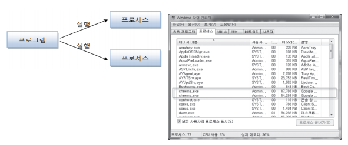

# 스레드

### 멀티 스레드

**프로세스(process)**

-   실행 중인 하나의 프로그램
-   하나의 프로그램이 여러 프로세스로 만들어짐

  

<br>

**멀티 태스킹(multi tasking)**

-   두 가지 이상의 작업을 동시에 처리하는 것
-   멀티 프로세스
    -   독립적으로 프로그램들을 실행하고 여러 가지 작업 처리
-   멀티 스레드
    -   한 개의 프로그램을 실행하고 내부적으로 여러 가지 작업 처리

  

<br>

**메인(main) 스레드**

-   모든 프로그램은 메인 스레드가 실행하며 시작
-   실행 파일의 첫 코드부터 아래로 순차적으로 실행
-   더 이상 실행할 코드가 없는 경우 종료

  

-   실행 종료 조건
    -   마지막 코드 실행
    -   return 문을 만나면
-   main 스레드는 작업 스레드들을 만들어 병렬로 코드들 실행
    -   멀티 스레드 생성해 멀티 태스킹 수행
-   프로세스의 종료
    -   싱글 스레드: 메인 스레드가 종료하면 프로세스도 종료
    -   멀티 스레드: 실행 중인 스레드가 하나라도 있다면, 프로세스 미종료

<br>

**멀티 스레드로 실행하는 어플리케이션 개발**

-   몇 개의 작업을 병렬로 실행할지 결정하는 것이 선행되어야

  

<br>

**threading 모듈**

-   Thread 클래스
-   스레드 운영 방법
    -   Thread에게 작업 함수를 전달해서 실행
    -   Thread 클래스를 상속 받아 재정의
        -   run() 메서드 재정의
    -   스레드의 기동
        -   start() 호출

<br>

<br>

### 스레드 함수

**threading 모듈**

-   threading.Thread() 함수를 호출하여 Thread 객체 생성
    -   생성자에 실행 함수와 인자를 전달
-   Thread 객체의 start() 메서드 호출

```python
import threading

def sum(low, high):
    total = 0
    for i in range(low, high):
        total += i
    print("Subthread", total)

t = threading.Thread(target=sum, args=(1, 10000000))
t.start()

print("Main Thread")
```

  

---

>   Main Thread는 바로 종료 Subthread는 계속 진행된다. 
>   Ctrl + C로도 종료안됨

<br>

**인터넷으로 파일 다운로드 받기**

-   **requests** 모듈
-   get(url)
    -   지정한 url을 요청하고 웹 서버로부터 받은 응답(response)을 리턴
-   response
    -   text
        -   웹 서버가 리턴한 텍스트 저장
    -   content
        -   웹 서버가 리턴한 실제 데이터 저장

```python
from threading import Thread
import requests
import time

def getHtml(url):
    resp = requests.get(url)
    time.sleep(1)
    print(url, len(resp.text), resp.text)
    
t1 = Thread(target=getHtml, args=('https://naver.com',))
t1.start()
```

<br>

**이미지 데이터 다운로드**

-   response객체의 content 속성에 저장됨

```python
from threading import Thread
import requests
import time

def getHtml(url):
    resp = requests.get(url)
    with open('./image.png', 'wb') as f:
        f.write(resp.content)
        
url ='https://www.google.com/images/branding/googlelogo/2x/googlelogo_color_92x30dp.png'
t1 = Thread(target=getHtml, args=(url,))
t1.start()
```

  

---

<br>

<br>

### 스레드 클래스

-   Thread 상속 방법

```python
from threading import Thread
class WorkerThread(Thread):
    def __init__(self):
        super().__init__()
        # 속성 초기화
    def run(self):
        # 워커 스레드 작업 정의
        pass
    
t = WorkerThread()
t.start()
```

<br>

**threading 모듈**

-   Thread 클래스 상속 방법
-   run() 메서드 구현

```python
import threading, requests, time

class HtmlGetter (threading.Thread):
    def __init__(self, url):
        threading.Thread.__init__(self)
        # 다중상속한 경우 ≒ super.__init__()
        self.url = url

    def run(self):
        resp = requests.get(self.url)
        time.sleep(1)
        print(self.url, len(resp.text), resp.text)

t = HtmlGetter('https://google.com')
t.start()

print("### End ###")
```

<br>

