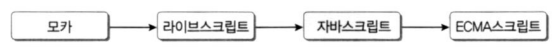

# 자바스크립트

<br>

## Javascript 개요

-   ECMAScript (European Computer Manufacturers Association Script)

    

-   https://developer.mozilla.org/ko/

-   https://developer.mozilla.org/ko/docs/Web/JavaScript

<br>

-   버전
    -    ES3 (1999) 
    -   ES4 (폐기) 
    -   ES5 (2009, HTML5와 함께 등장) 
    -   ES6 (2015, ES2015)

  <br>

-   자바스크립트
    -   ES + DOM(Document Object Model) + BOM(Browser Object Model)

  <br><br>

## Node.js 설치

### Node.js

-   처음에 Javascrpit는 웹 브라우저에서만 운영
-   Javascript를 일반 운영체제 명령으로 실행할 수 있는 프레임워크
-   크롬의 자바스크림트 인터프리터인 V8을 그대로 사용
-   https://nodejs.org

  <br>

### 다운로드

-   12.18.3 LTS - dfault

<br>

### 설치 확인

```
C:\Users\student>node --version
v11.3.0

C:\Users\student> node
> console.log('hello')
hello
undefined
> .exit

C:\Users\student>
```

>   확장팩 Code runner 설치

