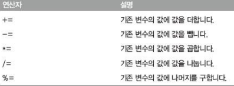
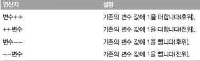

# 기본 연산자

  <br>

### 복합 대입 연산자

-   대입 연산자와 다른 연산자를 함께 사용하는 연산자



  

### 증감 연산자

-   복합 대입 연산자를 간략하게 사용한 형태



  <br>

### 단항 연산자

- 양수를 음수로 바꾸거나 음수를 양수로 바꾸는 -기호

    -   -52
    -   -(-52)

    >   \+ : 부호 유지

- typeof 연산자

    >   data type 문자열로 출력

    -   typeof 52

        >   number

    -   typeof(typeof 52)

        >   string

- typeof 연산자의 괄호 사용

    -   typeof 1 + '문자열'

    -   typeof(1 + '문자열')

    -   typeof(1) + '문자열'

          <br>

### 이항 연산자

- 양쪽에 항을 써서 사용 : + 연산자/\*연산자

>   다항 연산자가 이항 연산자보다 우선순위가 높다.

  <br>

### 자료형을 출력하는 예제 코드

- undefined
    -   정의하지 않은 자료형 의미
    -   선언하지 않은 식별자 alpha 사용

```js
> typeof 5
'number'
> typeof 'String'
'string'
> typeof true 
'boolean'
> typeof function(){}
'function'
> typeof {}
'object'
> typeof variable
'undefined'
```

  <br>

### undefined 자료형

- '존재하지 않는 것'은 undefined 자료형으로 표현

- 변수로 선언하지 않은 식별자가 갖는 자료형

```js
> typeof variable
'undefined'
```

- 변수를 선언했지만 초기화하지 않았을 때 undefined 자료형을 갖음

```js
> var variable
> typeof variable
'undefined'
```

  <br>

### 문자열과 숫자를 더하는 자료형

- 숫자와 문자열을 덧셈 연산하면 문자열 우선

```js
> '52 + 273'
'52 + 273'
> '52'+'273'
'52273'
> '52' + 273
'52273'
> 52+273
325
> 52 + '273'
'52273'
```

  <br>

### 문자열과 숫자를 곱하는 자료형

- 더하기 연산자를 제외한 사칙 연산자는 숫자가 우선
    -   첫 번째를 제외하면 14196을 출력

```js
> '52*273'
'52*273'
> 52*273
14196
> '52'*273
14196
> 52*'273'
14196
> '52'*'273'
14196
```

  <br>

## 예제

```js
//arithmetic

var a = 5;
var b = 3;

console.log("a + b = " + (a + b));
console.log("a - b = " + (a - b));
console.log("a * b = " + (a * b));
console.log("a / b = " + (a / b));
```

a + b = 8

a - b = 2

a * b = 15

a / b = 1.6666666666666667

---

  <br>

```js
//increase

var a = 2;
var b = a++;
console.log("a = " + a + ", b = " + b);

var a = 2;
var b = ++a;
console.log("a = " + a + ", b = " + b);
```

a = 3, b = 2

a = 3, b = 3

---

  <br>

```js
//stringincrease

var a = "3";
a++;
console.log("a = " + a + ", type = " + typeof(a));

var a= "3";
a += 1;
console.log("a = " + a + ", type = " + typeof(a));

var a= "3";
a = a + 1;
console.log("a = " + a + ", type = " + typeof(a));
```

a = 4, type = number

a = 31, type = string

a = 31, type = string

---

  <br>

```js
//plusequal

// 많이 쓰이는 기법
// 기존 문자열에 추가
var order = "";
order += "date : 2014-06-29";
order += "\n"
order += "item : notebook";
order += "\n"
order += "price : 134";

console.log(order);
```

date : 2014-06-29

item : notebook

price : 134

---

  
