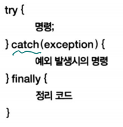

# 예외처리

  <br>

### 예외처리



```js
//trycatch

// 예외 처리

console.log("실행을 시작합니다.");
try {
    console.log(value);
} catch(e) {
    console.log("예외가 발생했습니다.");
    console.log(e);
}
console.log("실행을 완료하였습니다.");
```

실행을 시작합니다.

예외가 발생했습니다.

ReferenceError: value is not defined

  at Object.\<anonymous> (c:\workspace\03_webclient\javascript\4\27_trycatch.js:5:17)

  at Module._compile (internal/modules/cjs/loader.js:1137:30)

  at Object.Module._extensions..js (internal/modules/cjs/loader.js:1157:10)

  at Module.load (internal/modules/cjs/loader.js:985:32)

  at Function.Module._load (internal/modules/cjs/loader.js:878:14)

  at Function.executeUserEntryPoint [as runMain] (internal/modules/run_main.js:71:12)

  at internal/main/run_main_module.js:17:47

실행을 완료하였습니다.

---

  <br>

```js
//throw

// 라이브러리 내부
function func() {
    if (true)
        throw "예외가 발생했습니다";
}
    
// 라이브러리 사용
try {
    func();
} catch(exception) {
    console.log(exception);
}
console.log("실행을 완료하였습니다.");
```

예외가 발생했습니다

실행을 완료하였습니다.

---

>   배열 뒤에 한번 더 나와서 넘어감

