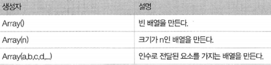
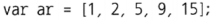
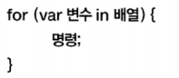
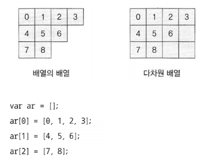

# 배열

  <br>

### 배열 생성자



### 리터럴을 통한 생성



  <br>

**01\_ intarray.js**

```js
var ar = [1, 2, 5, 9, 15];
//var ar = new Array(1, 2, 5, 9, 15);

for (var i = 0; i < ar.length; i++) {
	console.log("ar[" + i + "] =" + ar[i]);
}
```

  <br>

**02\_ arraylength.js**

```java
var ar = ["태연", "유리", "윤아", "써니"];

for (var i = 0; i < ar.length; i++) {
	console.log("ar[" + i + "] =" + ar[i]);
}
```

  <br>

**03\_ arraymix.js**

```js
var ar = [1234, "문자열", true, { name:"김상형", age:29 }];
for (var i = 0; i < ar.length; i++) {
	console.log("ar[" + i + "] =" + ar[i]);
}
```

  <br>

**04\_ dynamiclength.js**

```js
var ar = [0, 1, 2, 3];
ar[6] = 6;

for (var i = 0; i < ar.length; i++) {
	console.log("ar[" + i + "] =" + ar[i]);
}

console.log("ar[" + 100 + "] =" + ar[100]);
```

  <br>

**05\_ sparsearray.js**

```js
var ar = [0, 1, 2, 3,,,6];

for (var i = 0; i < ar.length; i++) {
	console.log("ar[" + i + "] =" + ar[i]);
}
```

  <br>

**06\_ deleteitem.js**

```js
var ar = [0, 1, 2, 3];
delete ar[2];

for (var i = 0; i < ar.length; i++) {
	console.log("ar[" + i + "] =" + ar[i]);
}
```

  <br>

**07\_ changelength.js**

```js
var ar = [0, 1];
ar.length = 5;
for (var i = 0; i < ar.length; i++) {
	console.log("ar[" + i + "] =" + ar[i]);
}

console.log("--------");

var ar= [0, 1, 2, 3, 4, 5, 6, 7];
ar.length = 3;
for (var i = 0; i < ar.length; i++) {
	console.log("ar[" + i + "] =" + ar[i]);
}
```

  <br>

**08\_ stringindex.js**

```js
var ar = [0, 1, 2, 3];
console.log("ar[1] = " + ar[1]);

ar["korea"]=4;
console.log('ar["korea"] = ' + ar["korea"]);
console.log('ar.korea = ' + ar.korea);

ar[-3.14]=5;
console.log("ar[3.14] = " + ar["-3.14"]);
```

  <br>

<br>

### 배열의 순회



**09\_forin.js**

```js
var arScore = [88, 78, 96, 54, 23];

for (var st in arScore) {
	console.log(st + "번째 학생의 성적 : " + arScore[st]);
}
```

  <br>

**09\_forin2.js**

```js
var arScore = [88, 78, 96, 54, 23];
delete(arScore[2]);
arScore["반장"] = 100;

for (var st in arScore) {
	console.log(st + "번째 학생의 성적 : " + arScore[st]);
}

console.log("--------");

for (var st = 0; st < arScore.length; st++) {
	console.log(st + "번째 학생의 성적 : " + arScore[st]);
}
```

<br>

<br>

### 다차원 배열



**10\_nestarray.js**

```js
var ar = [
    [0, 1, 2, 3],
    [4, 5, 6],
    [7, 8]
];

for (var i = 0; i < ar.length; i++) {
    for (var j = 0; j < ar[i].length; j++) {
    	console.log("ar" + i + " =" + ari);
    }
    console.log();
}
```

  <br>

### 유사 배열

-   객체의 속성 명으로 인덱스(숫자)를 사용

**11\_arraylike.js**

```js
var human = {
    name: "김상형",
    age: 29
};
human[0] = 87;
human[1] = 79;
human[2] = 92;
human.length = 3;

for (var i = 0; i < human.length; i++) {
	console.log("human[" + i + "] =" + human[i]);
}

console.log("--------");

for (var i in human) {
	console.log("human[" + i + "] =" + human[i]);
}
```

  <br>

### 딕셔너리

-   객체의 속성명을 문자열로 운영

-   해시 맵 역할

**12\_dictionary.js**

```js
var cap = new Object(); // var cap = {};

cap["한국"] = "서울";
cap["미국"] = "워싱턴";
cap["일본"] = "독교";
cap["영국"] = "런던";
cap["프랑스"] = "파리";

console.log("영국의 수도는 " + cap["영국"] + "입니다.");
```


