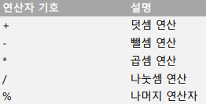
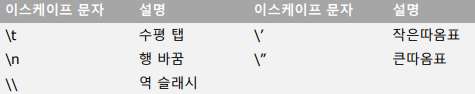
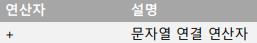
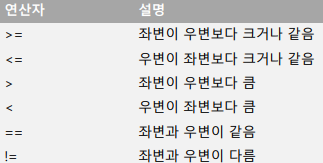
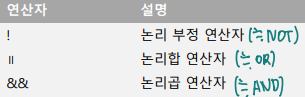

# 데이터 타입

### 자바스크립트 자료형의 종류

-   숫자 
-   문자열
-   불리언
-   함수
-   객체
-   정의되지 않은 자료형 (≒None)

  

### 숫자

-   정수와 실수를 구붂하지 않음
-   연산자 우선순위 고려해 프로그래밍해야 함



  

### 문자열

-   문자의 집합

  

### 문자열 생성 방법

-   큰따옴표 안에 문자를 넣는 방법
-   작은따옴표 안에 문자를 넣는 방법(추천)
-   문자열 안에 따옴표를 넣을 경우
    -   서로 다른 따옴표로 문자열을 감싸줌

  

### 이스케이프 문자

-   특수 기능 수행

    

  

### 문자열은 문자열 연결 연산자를 사용하여 합칠 수 있음



  

```js
//newline

var a = 100
console.log("토끼\n거북이");
console.log("아주 엄청나게 긴 문자열을 한 행에 입력할 때는 \
            백슬레시를 행 끝에 붙이고 다음 줄로 내려 쓸 수 있습니다.");
console.log(`아주 엄청나게 긴 문자열을 한 행에 입력할 때는
            백슬레시를 행 끝에 붙이고 다음 줄로 내려 쓸 수 있습니다.
a = ${a}`);
```

토끼
거북이
아주 엄청나게 긴 문자열을 한 행에 입력할 때는             백슬레시를 행 끝에 붙이고 다음 줄로 내려 쓸 수 있습니다.
아주 엄청나게 긴 문자열을 한 행에 입력할 때는
            백슬레시를 행 끝에 붙이고 다음 줄로 내려 쓸 수 있습니다.
a = 100

---

  

### 불리언

-   결과를 참과 거짓으로 표현할 때 사용

    

-   문자열도 비교 가능

    -    국어 사전의 앞쪽에 위치할수록 값이 작음

  

### 논리 연산자



-   논리 부정 연산자
    -   참 → 거짓, 거짓 → 참으로 바꿈
-   논리합 연산자
    -   양쪽이 모두 거짓 → 거짓, 나머지는 참
-   논리곱 연산자
    -   양쪽이 모두 참 → 참, 나머지는 거짓

```js
//boolean

var a = 1;
if (a == 3) {
    console.log("a는 3입니다.");
} else {
    console.log("a는 3이 아닙니다.");
}
```

a는 3이 아닙니다.

---


