# 함수

  <br>

## 함수의 형식

### 함수란?

- 코드의 집합

- 함수의 정의  
    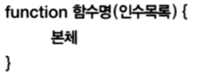

- 함수 호출  
    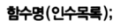

  <br>

### 선언적 함수

- 선언적 함수 생성
    -   함수 정의시 이름 배정

```js
function fnName() {
	console.log('Hello javascript')
}
fnName();
```

Hello javascript

---

  <br>

-   선언적 함수의 재정의

    >   나중 정의된 것으로 결정

```js
function fn() {
	console.log('Hello javascript 1')
}

function fn() {
	console.log('Hello javascript 2')
}

fn()
```

Hello javascript 2

---

  <br>

- 선언적 함수의 재정의
    -   호출문이 선언문 앞에 올 수 있음 --> 호출 가능

```js
fn2()		// ?

function fn2() {
	console.log('Hello javascript 1')
}

function fn2() {
	console.log('Hello javascript 2')
}
```

  <br>

```js
//function

function add(a, b) {
    return a + b;
    }
console.log("2 + 3 = " + add(2, 3));
console.log("java + script = " + add("java", "script"));
```

2 + 3 = 5

java + script = javascript

---

  <br>

```js
//sum

function sum(n) {
    var s = 0;
    for (var i = 1; i <= n; i++) {
        s += i;
    }
    return s;
}
console.log("1~100 = " + sum(100));
console.log("1~200 = " + sum(200));
```

1~100 = 5050

1~200 = 20100

---

  <br>

### 인수(매개변수)

- 함수 호출과 함수 연결의 매개가 되는 변수

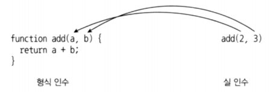

  <br>

### 매개변수

- 함수 생성 시 지정한 매개 변수의 수가 많거나 적은 사용도 허용

- 지정하지 않은 매개변수는 undefined로 입력

```js
function fn(a, b, c) {
	console.log(a, b, c);
}

fn() 			// undefined undefined undefined
fn(10)			// 10 undefined undefined
fn(10, 20) 		// 10 20 undefined
fn(10, 20, 30) 	// 10 20 30
```

>   모두 가능

  <br>

```js
//noargument

function hello() {
    console.log("안녕하세요. ");
    console.log("좋은 아침입니다. ");
}
hello();
hello();
```

안녕하세요. 

좋은 아침입니다. 

안녕하세요. 

좋은 아침입니다. 

---

  <br>

```js
//extraargument

function add(a, b) {
    return a + b;
}

console.log(add(2, 3));
console.log(add(2, 3, 4));  // 4는 무시됨
console.log(add(2));  // 나머지 하나는 undefined
```

5

5

NaN

---

  <br>

```js
//defaultargument

function sum(n) {
    if (n == undefined)  // defualt 값 줄 때
        n = 100;
    //  n = n || 100;  // 이렇게도 짧게 가능하다. 값이 없다면 결정된 순간의 값인 100이 들어간다.

    var s = 0;
    for (var i = 0; i <= n; i++) {
        s += i;

    }
    return s;
}

console.log("1~10 = " + sum(10));
console.log("1~100 = " + sum());


function sum(n=100) {  // 이제는 defualt 값 이렇게 준다.
    var s = 0;
    for (var i = 0; i <= n; i++) {
        s += i;
    }
    return s;
}
console.log("1~10 = " + sum(10));
console.log("1~100 = " + sum());
```

1~10 = 55

1~100 = 5050

1~10 = 55

1~100 = 5050

---

  <br>

### 가변 인자 함수란?

- 매개변수의 개수가 변할 수 있는 함수

- 매개변수가 선언된 형태와 다르게 사용했을 때 매개변수를 모두 활용하는

함수를 의미

-   가변인자 함수의 예 : Array( ) 함수

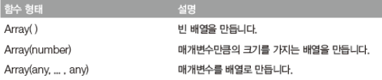

>   가변인자 → 배열로 처리된다.

  <br>

### sumAll( ) 함수

- arguments
    -   자바스크립트 내부 변수의 기본으로 제공
    -   매개변수의 배열

```js
function sumAll() {
    var sum = 0;
    
    for(var i=0; i<arguments.length; i++) {
    	sum += arguments[i];
    }
    return sum;
}

console.log(sumAll(1,2,3,4,5,6,7,8,9))
```

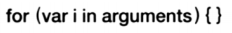

  <br>

```js
//arguments

// sumAll() 함수

function sumAll() {
    var sum = 0;

    // for (var i=0; i<arguments.length; i++) {
    //     sum += arguments[i];
    // }

    for (let value of arguments) {
        sum += value;
    }
    return sum;
}

console.log(sumAll(1,2,3,4,5,6,7,8,9));
```

45

---

  <br>

### 리턴값

- 리턴 키워드
    -   함수 실행 중 함수를 호출한 곳으로 돌아가라는 의미
    -   리턴 타입을 지정하지 않음
    -   리턴 값이 없는 경우 undefined 리턴

```js
function sumAll() {
    var sum = 0;
    
    for(var i=0; i<arguments.length; i++) {
    	sum += arguments[i];
    }
}

console.log(sumAll(1,2,3,4,5,6,7,8,9))
```

undefined

---

  <br>

  <br>

## 함수 고급

### 내부 함수

- 프로그램 개발 시 읷어나는 네임 충돌을 막는 방법

- 내부 함수는 함수 내부에 선언

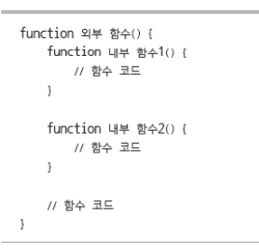

  <br>

### 내부 함수 이용으로 함수 충돌을 막는 법

- 내부 함수 사용 시 내부 함수 우선
    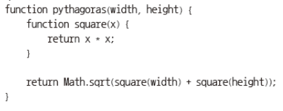

- 외부에서는 내부 함수를 호출 할 수 없음

  ```js
  //nestfunction
  ```

// 함수 고급

function sum(n) {
    function add(a, b) {
    	return a + b;
    }
    var s = 0;
    for (var i = 0; i <= n; i++) {
    	s = add(s, i);
    }
    return s;
}

console.log("1~100 = " + sum(100));
console.log("2 + 3 = " + add(2 + 3));// 에러
  ```

1~100 = 5050
c:\workspace\03_webclient\javascript\6\09_nestfunction.js:14
console.log("2 + 3 = " + add(2 + 3));// 에러
        ^

ReferenceError: add is not defined
...

---

  

​```js
// closer
function outer() {
    var outvalue = 5678;
    
    function inner() {
        var invalue = 1234;
        console.log("outvalue = " + outvalue);
    }
    inner();
        console.log("invalue = " + invalue);  // 에러
}
outer();
  ```

  <br>

### 익명 함수

- 이름을 가지지 않는 함수

    -   변수에 익명 함수에 대한 참조를 저장하여 사용

    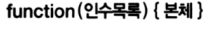

- 함수 호출 : 함수 참조(함수명)뒤에 괄호표기후 코드를 실행

```js
//funcliteral

// 익명 함수 : 일급 시민

var fn = function() {
    console.log('Hello javascript')
}

console.log(fn);  // [Function]

fn();  // Hello javescript
```

[Function: fn]
Hello javascript

---

>   예제는 넘어간다.

  <br>

### 함수를 매개변수로 전달하기

- 함수적 프로그래밍

```js
//funcargument

var add = function(a, b) {
    return a+b;
}

var multi = function(a, b) {
    return a*b;
}

function calc(a, b, f) {
    return f(a,b);
}

console.log("2 + 3 = " + calc(2, 3, add));
console.log("2 * 3 = " + calc(2, 3, multi));

console.log("2 + 3 = " + calc(2, 3, (a,b)=>a+b));  // Python의 람다함수와 비슷
console.log("2 * 3 = " + calc(2, 3, (a,b)=>a*b));  // JS의 화살표 함수 (인수)=>(리턴값)
```

2 + 3 = 5
2 * 3 = 6
2 + 3 = 5
2 * 3 = 6

---

  <br>

### 함수를 리턴하는 함수

- 함수를 리턴하는 함수의 사용은 클로저 때문임

```js
// 함수를 리턴하는 함수

function outer() {
    return function() {
        console.log('Hello Function...!');
    };
}

// 호출 1
outer()();
// 호출 2
var fn = outer();
fn();
```

Hello Function...!

Hello Function...!

---

  <br>

### 클로저

- 지역 변수의 유효 범위
    -   함수 안의 지역 변수는 함수 외부에서 사용 불가능
    -   지역 변수는 함수 실행 시 생성되고 종료 시 사라짐

```js
// 지역 변수의 life time

function test(name) {
	var output = 'Hello ' + name + '...!';
}

console.log(output)  // 오류
```

  <br>

- 클로저 특징 : 규칙 위반 가능

```js
function test(name) {
    var output = 'Hello ' + name + '...!';

    return function() {
    	console.log(output)
    }
}

test('Javascript')();
```

Hello Javascript...!

---

- 지역 변수를 남겨두는 현상

- test( ) 함수로 생성된 공간

- 리턴된 함수 자체

- 살아남은 지역 변수 output(반드시 리턴된 클로저 함수 사용)

  <br>

### 클로저 정의

```js
// 클로저 정의

function test(name) {
    var output = 'Hello ' + name + '...!';
    
    return function() {
        console.log(output)
    }
}

var test_1 = test('Node');
var test_2 = test('Javascript');

test_1();
test_2();
```

Hello Node...!

Hello Javascript...!

---

>   외부함수가 호출될 때 만들어지고 (호출당 한개 독립적으로)
>
>   내부함수를 호출했을 때 사용된다.

  

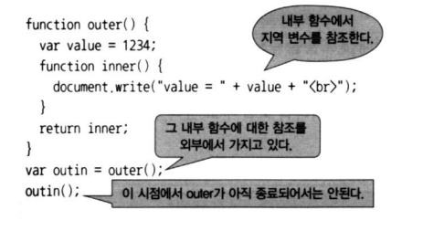

```js
// closure 예제(1) 타이머

function outcount() {
    var count = 0;  // 내부함수가 변수를 계속 쓰고 있다. 지워지지 않는다.

    setInterval(function() {
        count++;
        console.log(count + "초 지났습니다.");
    }, 1000); // ms 단위 (1초)
}
outcount();
```

1초 지났습니다.

2초 지났습니다.

3초 지났습니다.

4초 지났습니다.

...

---

  <br>

```js
// closure 예제(2) 타이머 중지

function outcount(interval) {
    var count = 0;  // 내부함수가 변수를 계속 쓰고 있다. 지워지지 않는다.

    var id = setInterval(function() {
        count++;
        if(count == 2) {
            clearInterval(id);
        }
        console.log(count + "초 지났습니다.");
    }, interval); // ms 단위 (1초)
}
outcount(1000); // 값을 넣어주어서 interval 조정 가능
```

1초 지났습니다.

2초 지났습니다.

---

  <br>

>   이 밑으로는 수업 때는 언급 정도만

<br>

### 재귀호출

- 자기 자신을 호출하는 함수

  <br>

### callee

- arguments의 속성
    -   해당 함수를 호출한 함수에 대한 참조
    -   익명 함수의 재귀호출에 사용
        -   함수의 이름이 없으로 함수명으로 호출 불가

  <br>

  <br>

## 내장 함수

### 타입 변환 함수

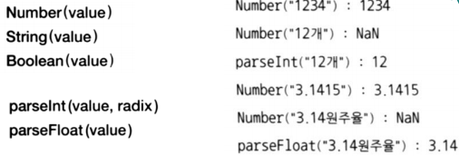

  <br>

### 값의 상태 점검

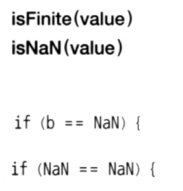

  <br>

### 인코딩

-   인터넷 URL : 영문알파벳과 몇 개의 특수 기호만 가능

- utf-8 한글의 경우
    -   한글자 3자리 → URL 인코딩

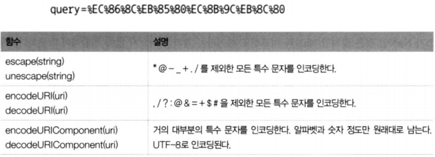

  <br>

### 타이머 함수

- 특정한 시간에 특정한 함수를 실행 가능하게 함

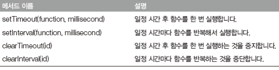

>   클로저에서 함

  <br>

### 타이머 함수

- setTimeout ( ) 메서드 : 특정한 시간 후에 함수를 한 번 실행

- setInterval ( ) 메서드 : 특정한 시간마다 함수를 실행

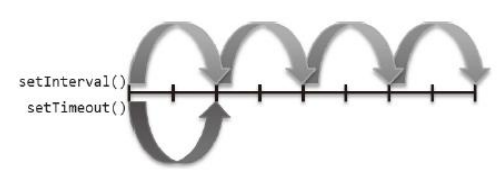

  <br>

### 타이머 함수

- setTimeout ( ) 함수의 주의사항 : 특별히 없음

- setInterval ( ) 함수의 주의사항 : 지속적 자원의 소비

- 해결 방법 : 타이머를 멈춤

- clearTimeout ( )함수/clearInterval ( ) 함수를 사용

  <br>

### 코드 실행 함수

- 자바스크립트는 문자열을 코드로 실행할 수 있는 특별한 함수를 제공

- eval( ) 함수는 문자열을 자바스크립트 코드로 실행하는 함수

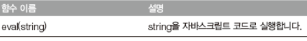

