# 객체

  

### 배열의 자료형

-   자바스크립트의 기본 자료형
    -   숫자, 문자열, 불, 함수, undefined

- 객체의 타입
    -   typeof [ ] → object

- 배열의 선언
    -   `var array = ['사과', '바나나', '망고', '딸기'];`

  

### 배열의 선언

- 배열의 구성 : 인덱스와 요소

    -   배열 요소를 사용하려면 배열 이름 뒤에 인덱스로 접근
        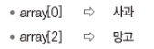

    -   배열의 인덱스와 요소
        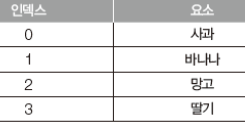

          

### 객체와 배열

- 배열은 객체를 기반으로 함

- 배열은 요소에 인덱스로 접근/객체는 요소에 키로 접근

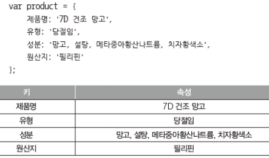

  

```js
//humanobject

// 배열도 객체다.
// 키를 인덱스로 접근하는 객체가 배열이다.
// 키 part에 ""를 안붙여도 된다. (문자열로 본다.)

var human = {
    name: "김상형",
    age: 29
};

console.log("name = " + human.name);
console.log("age = " + human.age);
```

name = 김상형

age = 29

---

  

```js
//dogobject

var dog = {
    type: "치와와",
    weight: 2,
    male: true
};

console.log("종류 = " + dog.type);
console.log("무게 = " + dog.weight);
console.log("숫컷 = " + dog["male"]);
// 변수에 문자열이 있을 때 이렇게도 사용 가능
```

종류 = 치와와

무게 = 2

숫컷 = true

---

  

### 멤버의 참조

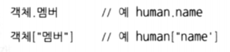

  

### 객체의 사용

- 객체 뒤에 대괄호를 사용하고 키를 표시 → 요소에 접근
    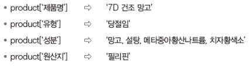
- 대괄호 외 일반적으로 사용하는 방법
    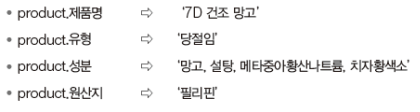

  

### 객체의 사용

- 보조기능 사용
  
-   대괄호 외 일반적인 방법을 사용하는 이유 : 보조기능 사용이 가능
    
- 객체의 키

    -   식별자 또는 문자열 모두 사용 가능

    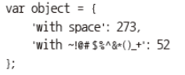

- 식별자가 아닌 문자를 키로 사용 하려면 대괄호를 사용해야 함
    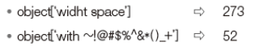

  

```js
//accessmember

var human = {
    name: "김상형",
    age: 29
};

var name = 'age';

console.log("name = " + human["name"]);
console.log("age = " + human["age"]);
console.log("name = " + human[name]);
```

name = 김상형

age = 29

name = 29

---

  

```js
//runtimename

var human = {
    name: "김상형",
    age: 29,
    score1: 99,
    score2: 88,
    score3: 82
};
for (var i = 1; i <= 3; i++) {
    console.log(i + "학년 성적 = " + human["score" + i] + "점");
}
```

1학년 성적 = 99점

2학년 성적 = 88점

3학년 성적 = 82점

---

  

```js
//shortcopy

var human = {
    name: "김상형",
    age: 29
};
var h = human;  // 참조

console.log("name = " + h.name);
console.log("age = " + h.age);
```

name = 김상형

age = 29

---

  

### 값과 참조

```js
//objectref

var human = {
    name: "김상형",
    age: 29
};

var kim = human;
kim.name = "김태희";

console.log("name = " + human.name);
console.log("age = " + human.age);
```

name = 김태희

age = 29

---

  

```js
//objectargument 전과 같은 작업

var human = {
    name: "김상형",
    age: 29
};
function changeName(h) {
    h.name = "김태희";
}
changeName(human);
console.log("name = " + human.name);
console.log("age = " + human.age);
```

name = 김태희

age = 29

---

  

### 속성

- 요소 : 배열 내부에 있는 값
- 속성 : 객체 내부에 있는 값


- 객체의 속성으로 가질 수 있는 값

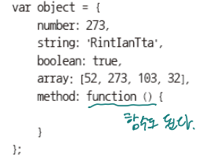

  

### 메서드

- 객체의 속성 중 함수 자료형인 속성

- 속성과 메서드의 구분

    -   객체 person : name 속성, eat 속성
    -   eat 속성은 함수 자료형이므로 eat( ) 메서드라 부름

    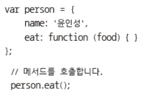

  

- this 키워드
    -   자기 자신이 가진 속성을 출력하고 싶을 때
    -   자신이 가진 속성임을 표시하는 방법

```js
//attribute
// 매개변수로 안하고 this로 자동 설정.

var person = {
    name : '홍길동',
    eat : function(food) {
        console.log(this.name + '이 ' +
                    food + '을/를 먹습니다.');
    }
}

person.eat('피자');
```

홍길동이 피자을/를 먹습니다.

---

>   접근자 제한이 없다. 모두 다 퍼블릭이다.

  

```js
//nestobject

var human = {
    name: "김상형",
    age: 29,
    address: {
        city: "하남시",
        dong: "덕풍동",
        bunji: 638
    }
};
console.log("name = " + human.name +
    ", 나이 = " + human.age);
console.log("주소 = " + human.address.city + " " +
    human.address.dong + " " +
    human.address.bunji);
```

name = 김상형, 나이 = 29

주소 = 하남시 덕풍동 638

---

  

```js
//intro

var human = {
    name: "김상형",
    age: 29,
    intro: function() {
        console.log("name = " + this.name);
        console.log("age = " + this.age);
    }
}

human.intro();
console.log(human);  // 객체의 인스턴스를 출력
```

name = 김상형

age = 29

{ name: '김상형', age: 29, intro: [Function: intro] }

---

  

### 동적 속성 편집

- 객체 생성 이후 속성을 추가하거나 제거
    -   동적으로 속성을 추가한다
    -   동적으로 속성을 제거한다

  

### 속성 추가

- 빈 객체 생성
- 동적으로 속성 추가

```js
//dynamicattribute

var student = { };

// 동적으로 속성 추가

student.name = '홍길동';
student.hobby = '악기';
student.special = '프로그래밍';
student.department = '생명공학과';
console.log(student);

for(let key in student) {
    console.log(key, student[key]);
}
```

{ name: '홍길동', hobby: '악기', special: '프로그래밍', department: '생명공학과' }

name 홍길동

hobby 악기

special 프로그래밍

department 생명공학과

---

  

- 동적으로 속성 추가

```js
// ...이어서 (속성 추가)

student.toString = function() {
    for(var key in this) {
        if(key != 'toString') {
            console.log(key + '\t' + this[key])
        }
    }
}

student.toString();
```

name	홍길동
hobby	악기
special	프로그래밍
department	생명공학과

---

  

### 속성 제거 : delete 키워드 사용

- delete 키워드 뒤에 삭제하고자 하는 객체의 속성을 입력

```js
// ...이어서 (속성 제거)


delete student.hobby
student.toString();
```

name  홍길동

special 프로그래밍

department 생명공학과

---

  

### 객체와 반복문

- 객체는 단순 for 반복문으로 객체의 속성을 살펴보는것이 불가능

- 객체의 속성을 모두 살펴보려면 for in 반복문 사용

```js
//in

var product = {
    name: 'Microsoft Office 2016',
    price: '15,000,000원',
    language: '한국어',
    supportOS: 'Win 32/64',
    subscription: true
}

for (var key in product) {
    console.log(key + ' : ' + product[key]);
}
```

name : Microsoft Office 2016

price : 15,000,000원

language : 한국어

supportOS : Win 32/64

subscription : true

---

  

### 객체 관련 키워드

- in 키워드

    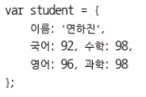

    >   JS의 객체가 python의 사전 역할도 겸하고 있다.

- 이름 속성 : true

- 성별 속성 : false
