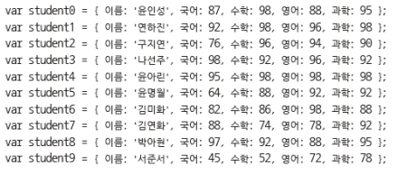
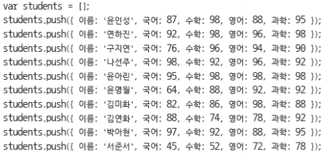
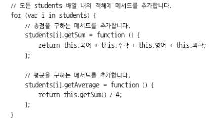
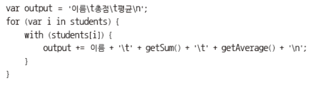
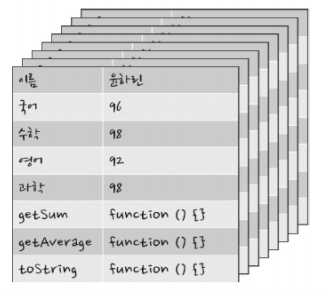
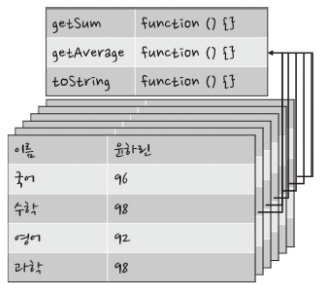
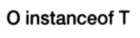

# 클래스

>   ES6은 더 간단하다. But. cross brousing을 위해!

 <br>

### 객체와 배열을 사용한 데이터 관리

- 추상화
  
-   현실에 존재하는 객체의 필요한 속성을 추출하는 작업
    
- 학생의 성적 총점과 평균을 계산하는 예제 작성

    

  <br>

### 객체와 배열을 사용한 데이터 관리

- 배열에 데이터 추가  
    

  <br>

### 객체와 배열을 사용한 데이터 관리

- 메서드 추가  
    

  <br>

### 객체와 배열을 사용한 데이터 관리

- 학생 성적 출력  
    

  <br>

  <br>

## 함수를 사용한 객체 생성

- 객체의 반영
    -   하나씩 만들어 배열에 사용 : 서로 다른 형태의 객체를 배열 안에 넣을 수 있는 장점
    -   개별적 객체를 만드는 것이 객체의 특성을 정확히 반영

```js
function makeStudent(name, korean, math, english, science) {
    var student = {
        name : name,
        korean : korean,
        math : math,
        english : english,
        science : science,
        
        getSum : function() {
        return this.korean + this.math + this.english + this.science;
        },
        
        getAverage : function() {
        return this.getSum() / 4;
        },
        
        toString : function() {
        return `${this.name}\t${this.getSum()}\t${this.getAverage()}`);
        }
    };
    return student;
}

var students = [];
students.push(makeStudent('윤인성', 90, 83, 76, 89));
students.push(makeStudent('박찬호', 90, 83, 76, 89));
students.push(makeStudent('류현진', 90, 83, 76, 89));
students.push(makeStudent('이세돌', 90, 83, 76, 89));
students.push(makeStudent('김세진', 90, 83, 76, 89));
students.push(makeStudent('이하나', 90, 83, 76, 89));

var output ='name\t총점\t평균\n';
for(var i in students) {
	output += students[i].toString()+ '\n';
}

console.log(output);
```

>   팩토리 함수 기법

  <br>

  <br>

## 생성자 함수란?

>   예전 style, 아래 예제를 위한 작업

- new 키워드를 사용해 객체 생성할 수 있는 함수

  <br>

### 생성자

- student 생성자 함수를 만드는 코드
    ` function Student () { } `

​    <br>

### new 키워드

- new 키워드로 객체 생성

- 생성자 호출시 사용
    -   new 생성자()
        -   새로운 인스턴스가 생성되고 this에 배정
        -   this의 값이 리턴

- new 없이 생성자 호출시

    >   일반함수 호출

    -   생성자()
    -   새로운 인스턴스가 생성되지 않고, this에 변화가 없음
    -   undefined 리턴

  <br>

### this 키워드

- 생성자 함수로 생성될 객체의 속성 지정

  <br>

### 메서드 생성

```js
//studentObject

function Student(name, korean, math, english, science) {  // student 객체의 student 생성자 함수
    this.name = name;
    this.korean = korean;
    this.math = math;
    this.english = english;
    this.science = science;


    // 메서드 생성
    this.getSum = function () {
        return this.korean + this.math + this.english + this.science;
    }
    this.getAverage = function () {
        return this.getSum() / 4;
    }
    this.toString = function () {
        return `${this.name}\t${this.getSum()}\t${this.getAverage()}`;
    }


}  // 자동으로 this의 값이 리턴

var student = new Student('김세진', 90, 83, 76, 89);
console.log(student)
// Heap에 새로운 인스턴스가 생성되고 this에 배정
// new 생성자() 가 있어야 새로운 인스턴스가 생성된다.

var student2 = Student('김세진', 90, 83, 76, 89);
console.log(student2)
// new가 없으면 일반 함수 호출과 같다. (리턴값이 없으니 undefined)
```

Student {

 name: '김세진',

 korean: 90,

 math: 83,

 english: 76,

 science: 89,

 getSum: [Function],

 getAverage: [Function],

 toString: [Function]

}

undefined

---

  <br>

  <br>

## 생성자 함수를 사용한 객체 배열 생성

```js
//objectArray

function Student(name, korean, math, english, science) { 
    this.name = name;
    this.korean = korean;
    this.math = math;
    this.english = english;
    this.science = science;

    this.getSum = function () {
        return this.korean + this.math + this.english + this.science;
    }
    this.getAverage = function () {
        return this.getSum() / 4;
    }
    this.toString = function () {
        return `${this.name}\t${this.getSum()}\t${this.getAverage()}`;
    }

}

var students = [];

students.push(new Student('윤인성', 90, 83, 76, 89));
students.push(new Student('박찬호', 90, 83, 76, 89));
students.push(new Student('류현진', 90, 83, 76, 89));
students.push(new Student('이세돌', 90, 83, 76, 89));
students.push(new Student('김세진', 90, 83, 76, 89));
students.push(new Student('이하나', 90, 83, 76, 89));

var output = 'name\t총점\t평균\n';
for(var i in students) {
    output += students[i].toString()+ '\n';
}

console.log(output);
```

name	총점	평균
윤인성	338	84.5
박찬호	338	84.5
류현진	338	84.5
이세돌	338	84.5
김세진	338	84.5
이하나	338	84.5

---

  <br>

### 생성자 함수

- 기존의 객체 구조

    -   이름, 국어, 수학,영어, 과학 속성
    -   getSum ( ), getAverage ( ),toString ( ) 메서드

    

    >   비효율적이다.

  <br>

### 메모리에 따른 문제 해결

- 프로토타입
    -   동일한 함수 생성에 따른 비효율적인 메모리 이용을 해결
    -   생성자 함수로 생성된 객체가 공통으로 가지는 공간

- 프로토타입을 사용한 객체 구조  
    

    >   데이터는 각자 쓰지만 메서드는 공유하자.

<br>

### 생성자 함수 구성

- 한 개의 메서드로 모든 객체가 사용

- 생성자 함수로 객체를 만들 때 → 생성자 함수 내부에 속성만 넣음

### 프로토타입

- 자바스크립트의 모든 함수는 변수 prototype을 갖음

- prototype은 객체

```js
//prototype

function Student(name, korean, math, english, science) {
    this.name = name;
    this.korean = korean;
    this.math = math;
    this.english = english;
    this.science = science;
} // 생성자 함수 내부에 속성만 넣음


// 한 개의 메서드로 모든 객체가 사용
Student.prototype.getSum = function () {
    return this.korean + this.math + this.english + this.science;
}
Student.prototype.getAverage = function () {
    return this.getSum() / 4;
}
Student.prototype.toString = function () {
    return `${this.name}\t${this.getSum()}\t${this.getAverage()}`;
}
```

>
>   상속 메커니즘
>   이후 ES6으로!

  <br>

  <br>

### 상속이란?

- 기존의 생성자 함수나 객체를 기반으로 새로운 생성자 함수나 객체를 쉽게 만드는 것

- 상속으로 만들어지는 객체는 기존 객체의 특성이 모두 있음
- 상속을 사용하면 이전에 만들었던 객체와 비슷한 객체를 쉽게 만들 수 있음

  <br>

### instanceof

- 객체가 특정 타입인지 검사  
    
    -   객체 O가 T 생성자로부터 나왔으면 true
    -   객체 O가 T의 prototype을 상속했는지 점검
