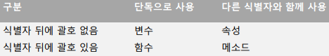
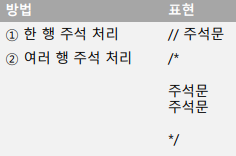

# 변수

  

## 변수

### 변수

- 값을 저장할 때 사용하는 식별자

- 숫자뿐만 아니라 모든 자료형 저장 가능

  

### 변수의 사용 과정

- 변수 선언 (var 키워드 사용)
    -   `var a;`

- 변수 초기화 (처음 값을 할당)
    -   `var a = 12;`

- 연속 선언
    -   `var a, b=3, c;`

```js
//var

var a = 12;
var b = "korea";
var c
console.log("a = " + a);
console.log("b = " + b);
console.log("c = " , c);
console.log("d = " , d);
```

a = 12

b = korea

c = undefined

c:\workspace\03_webclient\javascript\2\03_var.js:7

console.log("d = " , d);

​           ^


ReferenceError: d is not defined

...

---

  

### 선언없이 사용하기

```js
a = 12;

b = 'Korean';
```

- **선언없이 사용한 변수는 전역 변수가 됨**

  

### 동적 타입

- 변수의 타입은 언제든지 변경 가능

```js
//dynamictype

a = 12;
console.log("a = " + a);
a = "korea";
console.log("a = " + a);
// 자동으로 type 변환
```

a = 12

a = korea

---

  

### 식별자

- 자바스크립트에서 이름을 붙일 때 사용하는 단어

  

### 식별자의 규칙

- 키워드를 사용하면 안 된다.
- 특수문자는 \_과 $만 허용한다.
- 숫자로 시작하면 안 된다.
- 공백은 입력하면 안 된다.

>   Camel Case

  

### 식별자를 만들 때 지키는 관례

- 생성자 함수의 이름은 항상 대문자로 시작한다.

- 변수, 인스턴스, 함수, 메소드의 이름은 항상 소문자로 시작한다.

- 여러 단어로 이뤄진 식별자는 각 단어의 첫 글자를 대문자로 한다.

  

### 식별자의 종류

- 변수
- 속성
- 함수
- 메소드



someName : 변수

someName( ) : 함수

xxx.someName : 속성

xxx. someName( ) : 메서드

  

### 주석

- 프로그램의 진행에 전혀 영향을 주지 않는 코드

- 프로그램을 설명하는데 사용



  

### 변수의 범위

- 전역, 전역변수

- 지역, 지역변수

- 주의사항)

    -   함수 내에서 변수 선언 없이 새로운 변수에 값 대입하면 전역변수가 됨

    >   실행하기 전 식별자 조사를 먼저하고 값이 없으면 Undefined

  

```js
//varscope

var global = "전역";  // 맨 뒤로 옮기면 오류가 아닌 undefined
function func() {  // 함수 선언 (호출 뒤에 와도 무방)
    var local = "로컬";
    console.log("함수안 local = " + local);
    console.log("함수안 global = " + global);
}

func(); // 함수 호출
// console.log("함수밖 local = " + local);  // 오류
console.log("함수밖 global = " + global);

// hoisting : JS는 한줄 씩 실행하기 전 식별자 조사를 먼저한다.
```

함수안 local = 로컬

함수안 global = 전역

함수밖 global = 전역

---

  

```js
//nameconflict

var score = 100;

function func() {
    var score = 77; // 함수 안에서 변수 선언
    console.log("함수안 score = " + score);  // 지역변수로 본다.
}

func();

console.log("함수밖 score = " + score);
```

함수안 score = 77

함수밖 score = 100

---

  

```js
//novar

var score = 100; // 이게 없어도 함수 안의 score가 전역변수로 선언된다.

function func() {
    score = 77;  // 전역변수 score에 77을 쓴다.
    console.log("함수안 score = " + score); 
}

func();

console.log("함수밖 score = " + score);
```

함수안 score = 77

함수밖 score = 77

---

  

```javascript
//blockscope

for (var i = 0; i < 3; i++) {
    var k = 1234;
    console.log("i = " + i);
}

console.log("i = " + i + " , k = " + k);  // 여전히 살아있다.

// let 키워드 : 블록 범위 변수 선언 (ES6부터 추가)
// 블록 시작 ~ 블록 벗어날 때
```

i = 0

i = 1

i = 2

i = 3 , k = 1234

---

- let 키워드
    -   블록 범위 변수 선언

  

### 상수

- const 키워드

```js
//const

const MILE = 1.609;

var marathon = 42.195;

console.log("마라톤 코스의 길이는 " +
                (marathon / MILE) + "마일이다.");
```

마라톤 코스의 길이는 26.22436295835923마일이다.

---

  

### 특수한 값

- null
    -   아무것도 참조하지 않음을 나타냄

- undefined
    -   초기화 되지않은 변수가 가지는 값

- NaN
    -   연산결과가 숫자가 아님

- infinite
    -   무한대 숫자 (나누기 0)

```js
//undefined

var notinit;
console.log("초기화 되지 않은 변수 : " + notinit);
console.log("존재 하지 않는 변수 : " + ghost)
```

초기화 되지 않은 변수 : undefined

c:\workspace\03_webclient\javascript\2\11_undefined.js:3

console.log("존재 하지 않는 변수 : " + ghost);

​                ^


ReferenceError: ghost is not defined

...

---

  

```js
//nan

var veryBig = 1234/0;
console.log("veryBig = " + veryBig);  // 1234/0 : Infinity

var noNumber = Math.sqrt(-2);
console.log("noNumber = " + noNumber);  // √(-2) : NaN
```

veryBig = Infinity

noNumber = NaN

---


