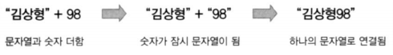

# 타입 변환

  

### 암시적 변환

- 연산자

    -   문자열이 우선
    -   문자열이 아닌 타입 → 문자열

    

- 다른 연산자
    -   숫자가 우선
        -   숫자 이외의 타입 → 숫자

```js
//implicit

var name = "김상형 : ";
var score = 98;
console.log(name + score);

var value1 = "8";
var value2 = "6";
var add = value1 + value2;
console.log("add : " + add);

var sub = value1 - value2;
console.log("subtract : " + sub);
console.log(name - score);  // 문자열을 숫자로
```

김상형 : 98

add : 86

subtract : 2

NaN

---

  

### 명시적 변환

- Number()
    -   숫자 이외의 값이 포함되어 있으면 NaN 배정

- parseInt(), parseFloat()
    -   숫자 이외의 값이 포함되어 있으면 숫자 부분만 해석

```js
//explicit

var korean = "82";
var english = "75";
var total = korean + english;
console.log("총점은 " + total + "이다.");
```

총점은 8275이다.

---

  

```js
//tonumber

var korean = "82";
var english = "75";
var total = Number(korean) + Number(english);
console.log("총점은 " + total + "이다.");

var korean = "82점";
var english = "75점";
var total = parseInt(korean) + parseInt(english); // 정수부분만 읽는다.
console.log("총점은 " + total + "이다.");
```

총점은 157이다.

총점은 157이다.

---

  

### 숫자를 문자열로 변환

- String()

```js
//tostring

var staff = "김상형 : ";
var salary = 320;
console.log(staff + String(salary) + "만원");
```

김상형 : 320만원

---

  

```js
//tostring2

var staff = "김상형 : ";
var salary = 320;
var bonus = 160;
console.log(staff + salary + bonus + "만원");  // 왼쪽부터 암시적 변환

var staff = "김상형 : ";
var salary = 320;
var bonus = 160;
console.log(staff + String(salary + bonus) + "만원");

var staff = "김상형 : ";
var salary = 320;
var bonus = 160;
console.log(salary + bonus + "만원" + staff);  // 왼쪽부터 암시적 변환
```

김상형 : 320160만원

김상형 : 480만원

480만원김상형 : 

---

  

### 논리형 변환

- false로 해석하는 경우
    -   0
    -   ""
    -   null
    -   undefined
    -   NaN

- 나머지는 true로 해석
- 변환함수
    -   Boolean()

```js
//toboolean

if (0) {
    console.log("참입니다.");
} else {
    console.log("거짓입니다.");
}
```

거짓입니다.

---


