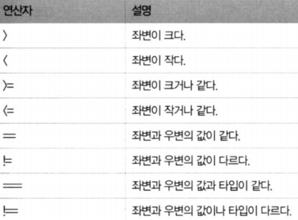
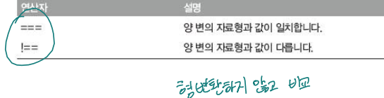
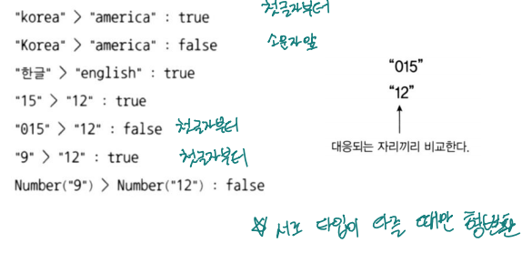
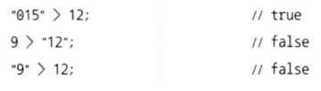
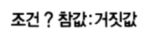
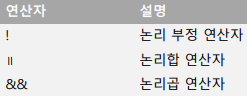
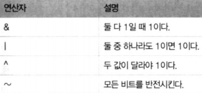
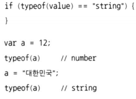

# 비교 연산자

  

### 비교 연산자



>   "9"==9 → 9==9 → True

  

### 일치 연산자

- 자료형이 다른 것을 확실하게 구분 짓고 싶을 때 사용
    -   예제 코드의 결과는 모두 false



  

### 일치 연산자의 용도

- 자료형이 다른 것을 확실하게 구분 짓고 싶을 때 사용

```js
> '' == false
true
> '' === false
false
> '' == 0
true
> '' === 0
false
> '273' == 273
true
> '273' === 273
false
```

  

### 문자열 비교



  

### 다른 데이터 타입의 비교

- 동일 데이터 타입으로 변환한 후 비교



  

```js
//stringcompare

console.log('"korea" > "america" : ' + ("korea" > "america"));
console.log('"Korea" > "america" : ' + ("Korea" > "america"));
console.log('"한글" > "english" : ' + ("한글" > "english"));
console.log('"15" > "12" : ' + ("15" > "12"));
console.log('"015" > "12" : ' + ("015" > "12"));
console.log('"9" > "12" : ' + ("9" > "12"));
console.log('Number("9") > Number("12") : ' + (Number("9") > Number("12")));
```

"korea" > "america" : true

"Korea" > "america" : false

"한글" > "english" : true

"15" > "12" : true

"015" > "12" : false

"9" > "12" : true

Number("9") > Number("12") : false

---

  

```js
//equal

var a = 2;
var b = "2";

if (a == b) {
console.log("== 비교 : 같음");
} else {
console.log("== 비교 : 다름");
}
if (a === b) {
console.log("=== 비교 : 같음");
} else {
console.log("=== 비교 : 다름");
}
```

== 비교 : 같음

=== 비교 : 다름

---

  

### 삼항 연산자



```js
//question

var a = 3;
var b = (a % 2 == 0) ? "짝":"홀"

console.log("a는 " + b + "수이다.");

a = 2;
b = "2";

console.log("== 비교 : " + (a == b ? "같음":"다름"));  // 암묵적 형변환

```

a는 홀수이다.

== 비교 : 같음

---

>   Python
>
>   b = "짝" if (a%2==0) else "홀"

  

### 논리 연산자



  

### 비트 연산자



-   <<, >>
    -   비트 이동 연산자

  

### typeof()

-   데이터 타입을 문자열로 출력

    -   string 
    -   number 
    -   boolean 
    -   function 
    -   object 
    -   undefined

    

  

### 기타 연산자

-   void
    -   피연산자를 무시하고 항상 undefined를 리턴
    -   `var value = void sum(1, 2)`
        -   sum() 함수가 무엇을 반홖하던 항상 undefined 리턴
-   , 연산자
    -   왼쪽에서 오른쪽으로 순서대로 평가한 후 마지막(가장 오른쪽) 값을 리턴