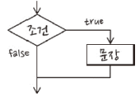

# 조건문


### if 조건문

-   자바스크립트에서 가장 일반적인 

    -   형태
        

    -   불리언 표현식이 true면 문장 실행

    -   false면 문장 무시

        -   조건문에 의해 여러 문장을 실행핛 때는 중괄호로 감싸야 함

            

```js
//ifcondition

var num = 14;
if (num % 2 == 0)
    console.log(num + "는 짝수입니다.");
// 한 줄만 {} 생략가능

var num = 4;
if (num % 2 == 0) {
    console.log(num + "는 짝수입니다.");
    console.log("짝수는 2로 나누어 떨어지는 수입니다.");
}

var num = 4;
if (num % 2 == 0)
    console.log(num + "는 짝수입니다.");
    console.log("짝수는 2로 나누어 떨어지는 수입니다.");
```

14는 짝수입니다.

4는 짝수입니다.

짝수는 2로 나누어 떨어지는 수입니다.

4는 짝수입니다.

짝수는 2로 나누어 떨어지는 수입니다.

---

  

### if else 

- 서로 반대되는 조건에 사용하는 

- else 키워드는 if 과 함께 사용하는 키워드
    -   if 의 바로 뒤에 붙여 사용

- 조건문의 형태
    

  ```js
//ifelse

var num = 4;

if (num % 2 == 0) {
    console.log(num + "는 짝수입니다.");
} else {
    console.log(num + "는 홀수입니다.");
}
  ```

4는 짝수입니다.

---

  


### 중첩 조건문

-   조건문 안에 을 중첩해 사용하는 형식

- 중첩 조건문의 형태

    -   여러 번 중첩해도 상관 없음

    

  

### If else if 조건문

- If else if 조건문의 형태

- 중첩 조건문을 if else if 조건문의 형태로 변경

    -   한쌍의 중괄호를 삭제

    

```js
//ifelseif

var num = 2;

if (num == undefined) {
    console.log("숫자를 입력해 주십시오.");
} else {
    if (num > 0) {
        console.log(num + "는 양수입니다.");
    } else if (num < 0) {
        console.log(num + "는 음수입니다.");
    } else {
        console.log(num + "은 틀림없이 0입니다.");
    }
}
```

2는 양수입니다.

---

>   Python은 elif

  

  

### switch 조건문의 기본 형태

- default 부분은 생략 가능

```js
swtich(비교값) {
case 값:
	문장
	break;
case 값:
	문장
	break;
default:
	문장
	break;
}
```

  

### break 키워드의 의미

- switch 조건문이나 반복문을 빠져 나가려고 사용하는 키워드

- switch 의 괄호 안에는 비교할 값을 입력

    -   입력한 값을 기준으로 특정 코드 실행
    -   입력한 표현식과 case 키워드 옆의 표현식이 같음
        -   case 키워드 바로 다음에 오는 문장 실행

    

```js
//switch

var menu = 1;

switch (Number(menu)) {
    case 1:
        console.log("전화를 겁니다.");
        break;  // 없으면 아래꺼 바로 실행
    case 2:
        console.log("문자를 보냅니다.");
        break;
    case 3:
        console.log("영상 통화를 연결합니다.");
        break;
    default:
        console.log("잘못 입력하셨습니다.");
        break;
}
```

전화를 겁니다.

---

  

```js
//switchstring

var menu = "짬뽕";
switch (menu) {
    case "짜장면":
        console.log("수타면으로 준비해 드리겠습니다.");
        break;
    case "짬뽕":
        console.log("시원한 홍합 짬뽕입니다.");
        break;
    case "탕수육":
        console.log("소고기 탕수육입니다.");
        break;
    default:
        console.log("군만두나 드세요.");
        break;
}
```

시원한 홍합 짬뽕입니다.

---

  

```js
//fallthrough

var yoil = "월";

switch (yoil) {
    case "월":
        console.log("일주일의 시작입니다.");
        break;
    case "화":
    case "수":
    case "목":
        console.log("열심히 일해야 할 때입니다.");
        break;
    case "금":
        console.log("불타는 금요일 보내세요.");
        break;
    case "토":
    case "일":
        console.log("편안핚 주말 보내세요.");
        break;
}
```

일주일의 시작입니다.

---

  

### 논리 연산자가 가지고 있는 특성을 조건문으로 사용

- 논리합 연산자를 사용한 표현식은 뒤에 어떠한 값이 들어가도 항상 참
    -   true || OOO

```js
function fn(a) {
	a = a || 10;
	:
}
```

  

### 논리 연산자를 이용한 짧은 조건문

- 논리합 연산자

    **(조건식) || (조건식이 거짓일 때 실행할 문장)**

- 논리곱 연산자
    **(조건식) && (조건식이 참일 때 실행할 문장)**