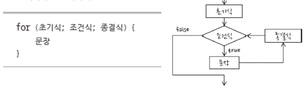

# 반복문


### 배열이란?

- 여러 개의 변수를 한꺼번에 다룰 수 있는 자료형

- 객체 중 하나

- 대괄호([ ])로 생성 / 대괄호 사용 후 안에 쉼표로 구분해 자료를 입력

```js
> var array = [273, 32, 103, 57, 52];
undefined
> array
[ 273, 32, 103, 57, 52 ]
```

  

### 배열 요소

- 다른 언어에서는 동일한 데이터 타입에 대해서 배열 생성 가능

- 자바스크립트는 어떠한 종류의 자료형도 배열 요소가 될 수 있음
    -   자바스크립트의 모든 자료형을 넣을 수 있음

```js
> var array = [
    273,			// Number
    'String' 		// String
    ,true, 			// Boolean
    function() {}, 	// Function
    {},				// Object
    [273, 103] 		// Array
];
> array
[ 273, 'String', true, [Function], {}, [ 273, 103 ] ]
```

  

### for 반복문

- 조건(while 반복문)보다 휫수에 비중을 둘 때 사용 하는 반복문

- 초기식과 종결식이 있음
    

- 초기식 실행

- 조건식 비교/ 조건이 거짓이면 반복문 종료

- 문장을 실행

- 종결식 실행

-   다시 '조건식 비교' 이후를 반복

  

### for 반복문 사용

- 초기문에 선언하는 변수는 간단핚 핚 글자로 만듦

- 단순 for 반복문 : `for (var i = 0; i < length; i++ )`와 같은 형태

- 역 for 반복문 : 배열 요소를 역으로 출력


  

```js
//forloop

for (var i = 0; i < 5; i++) {
    console.log("좋은 아침입니다.");
}
```

좋은 아침입니다.

좋은 아침입니다.

좋은 아침입니다.

좋은 아침입니다.

좋은 아침입니다.

---

  

```js
//forloop2

var arScore = [88, 78, 96, 54, 23];

for (var st = 0; st < 5; st++) {
    console.log(st + "번째 학생의 성적 : " + arScore[st]);
}
```

0번째 학생의 성적 : 88

1번째 학생의 성적 : 78

2번째 학생의 성적 : 96

3번째 학생의 성적 : 54

4번째 학생의 성적 : 23

---

  

```js
//forloop3

var sum = 0;
for (var i = 1; i <= 100; i++) {
    sum = sum + i;
}

console.log("1~100까지의 합 = " + sum);
```

1~100까지의 합 = 5050

---

  

```js
//forloop4

var arScore = [88, 78, 96, 54, 23];

var sum = 0;

for (var st = 0; st < arScore.length; st++) {  // .length : 배열의 길이
    sum += arScore[st];
}

console.log("총점 : " + sum + ", 평균 : " + sum/arScore.length);
console.log(`총점 : ${sum}, 평균 : ${sum/arScore.length}`);

```

총점 : 339, 평균 : 67.8

총점 : 339, 평균 : 67.8

---

  

### for in 반복문의 형태

- for in 반복문은 단순 for 반복문과 같은 기능


  

```js
//forloop5

var arScore = [88, 78, 96, 54, 23];

var sum = 0;

for (let ix in arScore) {
    sum += arScore[ix];
}

console.log("총점 : " + sum + ", 평균 : " + sum/arScore.length);
console.log(`총점 : ${sum}, 평균 : ${sum/arScore.length}`);
```

총점 : 339, 평균 : 67.8

총점 : 339, 평균 : 67.8

---

  

```js
//forloop6

// for of 반복문

var arScore = [88, 78, 96, 54, 23];

var sum = 0;

for (let score of arScore) {  // 인덱스는 필요없고 값만 필요할 때
    sum += score;
}

console.log("총점 : " + sum + ", 평균 : " + sum/arScore.length);
console.log(`총점 : ${sum}, 평균 : ${sum/arScore.length}`);

```

총점 : 339, 평균 : 67.8

총점 : 339, 평균 : 67.8

---

  

  

### while 반복문

- 가장 간단한 반복문

- if 조건문 형태가 비슷


  

### while 반복문

- while 반복문 종료

- 숫자 증가

- 내부적으로 변화

```js
var value=0;

while(value<5){
	value++;
}
```

  

```js
//while

var size = 1024;
var upload = 0;
while (upload <= size) {
    upload += 200;
    console.log(upload + "M 업로드중.... ");
}
console.log("업로드를 완료하였습니다");
```

200M 업로드중.... 

400M 업로드중.... 

600M 업로드중.... 

800M 업로드중.... 

1000M 업로드중.... 

1200M 업로드중.... 

업로드를 완료하였습니다

---

  

```js
//whilesum

var sum = 0;
var i = 1;

while (i <= 100) {
    sum = sum + i;
    i++;
}
console.log("1~100까지의 합 = " + sum);
```

1~100까지의 합 = 5050

---

  

### do While 반복문

- 조건의 참 거짓 여부와 상관없이 내부의 문장을 최소한 한 번은 실행해야

하는 경우 사용

- while 반복문과 형태가 비슷

    >   cf. 조건을 먼저 판독

- do while 반복문의 기본 형태


  ```js
//dowhile

// 최소 한 번은 실행

var sum = 0;
var num;
do {
    num = prompt("숫자를 입력하세요(끝낼 때는 0)", "2");
    sum += Number(num);
} while (num != 0);

console.log("입력한 모든 숫자의 합 = " + sum);
  ```

`1` `2` `3`

입력한 모든 숫자의 합 = **6**

---

  

### 다중 루프

```js
//nestarray

// 다중 루프
var ar = [[0, 1, 2, 3], [4, 5, 6], [7, 8]];

for (var i = 0; i < ar.length; i++) {
    for (var j = 0; j < ar[i].length; j++) {
    console.log("ar[" + i + "][" + j +"] =" + ar[i][j]);
    }
    console.log();
}
```

ar\[0][0] =0

ar\[0][1] =1

ar\[0][2] =2

ar\[0][3] =3


ar\[1][0] =4

ar\[1][1] =5

ar\[1][2] =6


ar\[2][0] =7

ar\[2][1] =8

---

  

### break 키워드

- switch 조건문이나 반복문을 벗어날 때 사용

- 다음 반복문은 조건이 항상 참으로 무한 반복

- 무한루프는 break 키워드 사용으로 탈출

  

### continue 키워드

- 현재 반복을 멈추고 다음 반복을 진행


### 무한 루프

