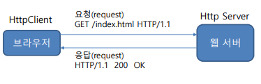
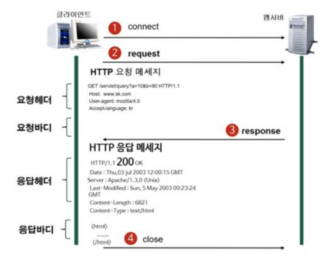
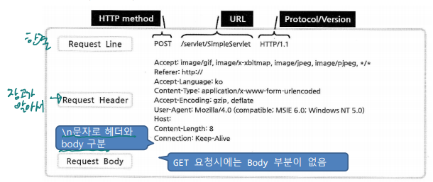
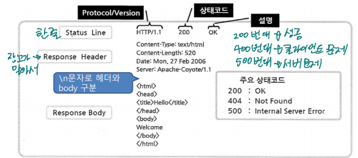
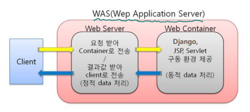
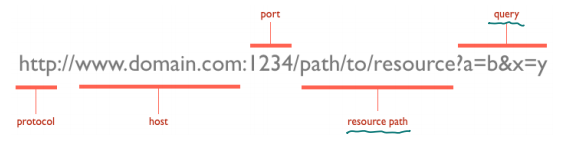

# HTTP 프로토콜

 

### HTTP 클라이언트와 서버

**Http 프로토콜**

-   주요 특징
    -   문자 기반 프로토콜 
    -   디폴트로 80 포트 사용 
    -   클라이언트가 서버로 요청을 보내면 서버는 요청 내용을 클라이언트로 응답 후 접속 해제
        -   서버 측에서 접속에 대한 상태 유지 하지 않음 : stateless
            -   이후 접속 시에 누구인지, 이젂에 어떤 작업을 했는지에 대한 상태 정보 없음

 

 

**HTTP Request : 요청**

-   요청 라인(Request Line) 
    -   HTTP 메서드 방식 및 요청 URL과 프로토콜 정보 
-   요청 헤더(Request Header) 
    -   웹 브라우저 정보, 언어, 인코딩 방식, 요청 서버 정보 등 추가 정보 
-   요청 본체(Request Body) 
    -   요청에 필요한 내용

 

**HTTP Response : 응답**

-   상태 라인
    -   응답 상태 코드 및 프로토콜 정보
-   응답 헤더
    -   응답 처리 날짜, 인코딩 방식, 요청 서버 정보 등과 같은 추가 정보
-   응답 본체
    -   응답에 필요한 내용. 일반적으로 HTML 문서

 

**WEB 서버와 WAS**

 

**URL**

 