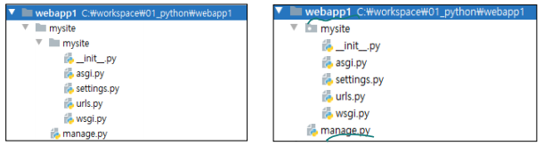
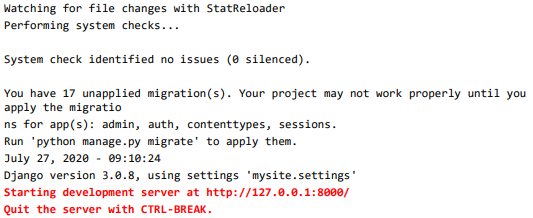

# Django 프로젝트 만들기

>   HeidiSQL > root로 진행

 

## 데이터베이스 만들기

### django_ex_db 만들기

MariaDB [mysql]> `create database django_ex_db;`

MariaDB [mysql]> `show databases;`

 

### 사용자 계정 만들기/권한 부여

MariaDB [mysql]> `create user 'webuser'@'%' identified by '1234';`  

MariaDB [mysql]> `grant all privileges on django_ex_db.* to 'webuser'@'%';`

 

## Django 프로젝트 만들기

### PyCharm 프로젝트 생성

-   프로젝트명 webapp1
-    패키지 설치
    -   (webapp1)> `pip install django mysqlclient`
-   Django 프로젝트 템플릿 만들기
    -   (webapp1)> `django-admin startproject mysite`

 

### 프로젝트 디렉토리/파일 구조 조정

 

### 테스트

-   (webapp1)> `python manage.py runserver`

-   웹 브라우저  
    http://127.0.0.1:8000/

 