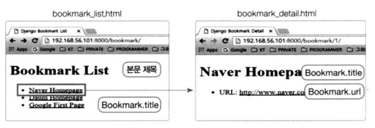
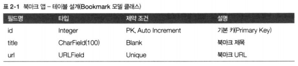
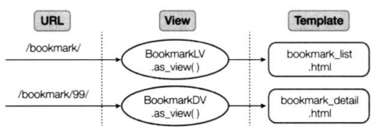
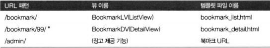
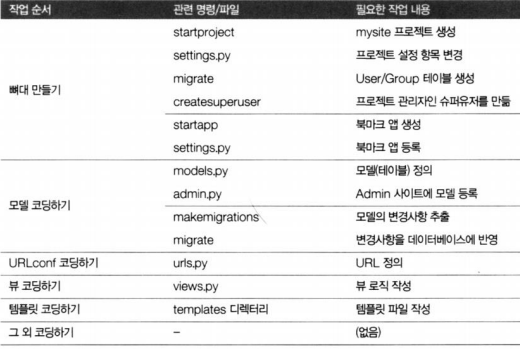
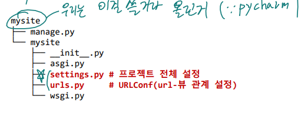
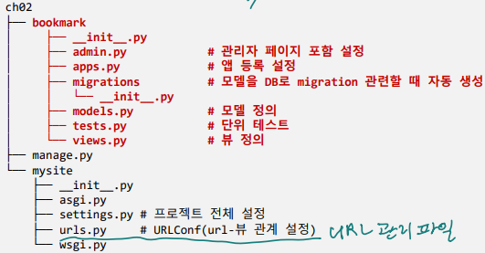
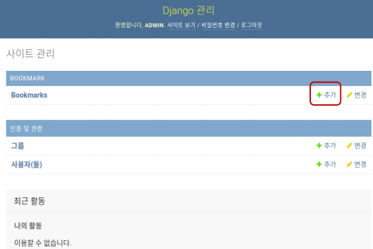
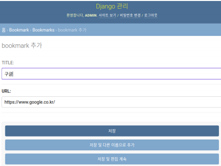
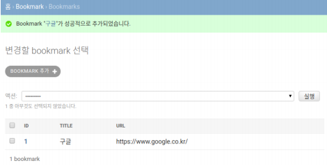

# 실전 프로그램 개발 - Bookmark 앱

<br>

### Bookmark 앱

**작업 순서**

-   프로젝트 뼈대 만들기 
    -   프로젝트 및 앱 개발에 필요한 디렉토리와 파일 생성 
-   모델 코딩하기 
    -   테이블 관련 사항 개발 
    -   models.py, admin.py 
-   URLconf 코딩하기 
    -   URL 및 뷰 매핑 관계 정의 
    -   urls.py 
-   ○ 뷰 코딩하기 
    -   애플리케이션 로직 개발 
    -   views.py 
-   ○ 템플릿 코딩하기 
    -   화면 UI 개발 
    -   templates/ 디렉토리 하위의 html 파일들

<br>

**settings.py 주요 사항**

-   프로젝트 설정 파일
-   필수 항목
    -   데이터베이스 설정 
    -   애플리케이션 등록 
    -   템플릿(TEMPLATES) 항목 설정 
    -   정적 파일 항목(STATIC_URL) 설정 
    -   타임존 지정 등

<br>

**화면 UI**



<br>

**테이블 설계**

-   Bookmark 모델 클래스



<br>

**로직 설계**

-   처리 흐름을 설계
-   로직 : URL을 받아 최종 HTML 템플릿 파일을 만드는 과정



<br>

**URL 설계**

-   URLconf 코딩에 반영
-   urls.py 파일
-   URL 패턴, 뷰 이름, 템플릿 파일 이름 및 뷰에서 어떤 제너릭 뷰를 사용할 지 결정



<br>

**작업순서**



<br>

<br>

### 프로젝트 뼈대 만들기

**프로젝트 만들기**



<br>

**mysite/settings.py**

```python
import os

# 가장 먼저 working directory를 살피므로 현재 directory 포함
BASE_DIR = os.path.dirname(os.path.dirname(os.path.abspath(__file__)))

SECRET_KEY = '0qn3imc3z()emde*68kqje6+6rwtc*ivm0yawv$(+0u1^r@j1%'

DEBUG = True  # 수정하면 바로 반영

ALLOWED_HOSTS = []  # 어떤 web server 허용인지

# Application definition
INSTALLED_APPS = [
    'django.contrib.admin',  # 관리
    'django.contrib.auth',  # 인증
    'django.contrib.contenttypes',
    'django.contrib.sessions',
    'django.contrib.messages',
    'django.contrib.staticfiles',
]  # 앱을 만들 때 등록해야함

MIDDLEWARE = [
    'django.middleware.security.SecurityMiddleware',
    'django.contrib.sessions.middleware.SessionMiddleware',
    'django.middleware.common.CommonMiddleware',
    'django.middleware.csrf.CsrfViewMiddleware',
    'django.contrib.auth.middleware.AuthenticationMiddleware',
    'django.contrib.messages.middleware.MessageMiddleware',
    'django.middleware.clickjacking.XFrameOptionsMiddleware',
]
ROOT_URLCONF = 'mysite.urls'
# 나중에 이걸로 import하라는 의미
# URL 패턴 -> 객층화 시킨다. (tree 구조)

TEMPLATES = [
    {
    'BACKEND': 'django.template.backends.django.DjangoTemplates',
    'DIRS': [],
    'APP_DIRS': True,
    'OPTIONS': {
        'context_processors': [
            'django.template.context_processors.debug',
            'django.template.context_processors.request',
            'django.contrib.auth.context_processors.auth',
            'django.contrib.messages.context_processors.messages',
            ],
        },
    },
]
WSGI_APPLICATION = 'mysite.wsgi.application'

DATABASES = {
    'default': {
        'ENGINE': 'django.db.backends.sqlite3',
        'NAME': os.path.join(BASE_DIR, 'db.sqlite3'),
    }
}
AUTH_PASSWORD_VALIDATORS = [
{
    'NAME':  'django.contrib.auth.password_validation.UserAttributeSimilarityValidator',
    },
    {
    'NAME': 'django.contrib.auth.password_validation.MinimumLengthValidator',
    },
    {
    'NAME': 'django.contrib.auth.password_validation.CommonPasswordValidator',
    },
    {
    'NAME': 'django.contrib.auth.password_validation.NumericPasswordValidator',
    },
]

LANGUAGE_CODE = 'en-us'
TIME_ZONE = 'UTC'
USE_I18N = True
USE_L10N = True
USE_TZ = True

STATIC_URL = '/static/'
```

>   mysite : 모듈을 모아둔 directory -> 패키지(\_\_init\_\_.py 있다.)

<br>

**settings.py 수정**

-   DATABASE 
    -   SQLite3 → MariaDB 설정으로 변경 
    -   mysql 연동 라이브러리 설치 필요 
        \> `pip install mysqlclient` (이미 함)
-   언어 설정(LANGUAGE_CODE) 
-   타임존 설정(TIME_ZONE, USE_TZ) 
-   정적 파일 경로 설정(STATIC, STATICFILES_DIRS) 
-   미디어 파일 경로용 설정(MEDIA_URL, MEDIA_ROOT) 
    -   파일 업로드시 사용

```python
DATABASES = {
    'default': {
        'ENGINE': 'django.db.backends.mysql',
        'NAME': 'django_ex_db', # 데이터베이스 명
        'HOST': 'localhost', # 서버 IP
        'PORT': '3306', # 포트번호
        'USER': 'webuser', # 사용자 ID
        'PASSWORD': '1234' # 비밀번호
    }
}

LANGUAGE_CODE = 'ko'
TIME_ZONE = 'Asia/Seoul'
USE_TZ = False

STATIC_URL = '/static/'
STATICFILES_DIRS = [os.path.join(BASE_DIR, 'static')]

MEDIA_URL = '/media/'
MEDIA_ROOT = os.path.join(BASE_DIR, 'media')
```

<br>

**urls.py**

```python
from django.contrib import admin
from django.urls import path

urlpatterns = [
	path('admin/', admin.site.urls),
]
```

>   여기에 없는 주소 사용하면 404 에러


-   admin/
    -   관리자 페이지를 django가 자동으로 생성해줌
-   urlpatterns
    -   처리할 url의 목록을 가짐
-   path(<url 문자열>, <뷰 함수>, [name])

<br>

**기본 테이블 생성**

-   django 애플리케이션 생성시 사용자 관리 테이블 및 모델 기본 제공
-   데이터베이스에 사용자 관리 테이블 생성 작업 필요

$ `python manage.py migrate`

<br>

**admin 계정 생성**

$ `python manage.py createsuperuser`

Username (leave blank to use 'gusu'): `admin`  

Email address: admin@gmail.com   

Password: `1234 `   

Password (again): `1234 ` 

This password is too short. It must contain at least 8 characters.   

This password is too common.   

This password is entirely numeric.   

Bypass password validation and create user anyway? [y/N]: `y `  

Superuser created successfully.  

---

<br>

<br>

### bookmark 애플리케이션 생성

**애플리케이션 생성**

-   python manage.py startapp <애플리케이션 명>
    -   애플리케이션명 디렉토리 생성

\> `python manage.py startapp bookmark`



<br>

**apps.py**

```python
from django.apps import AppConfig

class BookmarkConfig(AppConfig):
	name = 'bookmark'
```

-   애플리케이션 구성 클래스
-   settings.py에 등록해야만 사용 가능 

<br>

**mysite/settings.py**

```python
INSTALLED_APPS = [ 
    'django.contrib.admin', 
    'django.contrib.auth', 
    'django.contrib.contenttypes', 
    'django.contrib.sessions', 
    'django.contrib.messages', 
    'django.contrib.staticfiles', 
    'bookmark.apps.BookmarkConfig', # 추가 
]
```

<br>

**모델 정의(테이블 정의)**

-   django.db.models.Model을 상속 받아 정의
-   클래스 필드(컬럼 정의)
    -   models.CharField : 가변길이 텍스트 필드 
    -   models.SlugField : 이미 확보된 데이터로부터 유효한 URL을 만드는 방법 
    -   models.DecimalField : 숫자 필드 
    -   models.TextField : 길이 제한이 없는 텍스트 필드 
    -   models.DateTimeField : 날짜 필드
-   필드 생성자의 주요 인자
    -   max_length : 필드의 최대 길이 
    -   verbose_name : 사람 친화적 필드명(공백이 있는 경우 실제로는 _로 대체) 
    -   unique : 중복허용 여부(True/False) 
    -   allow_unicode : 유니코드 허용여부 
    -   blank : 공백 허용여부(True/False) 
    -   help_text : 설명문 
    -   max_digits : 숫자 최대 자리수 
    -   decimal_places : 소수점 이하 자리수 
    -   auto_now_add : 레코드가 생성될 때 시간 자동 설정 
    -   auto_now : 레코드가 저장(수정)될 때 시간 자동 설정

<br>

**bookmark/models.py**

```python
from django.db import models

class Bookmark(models.Model):
    title = models.CharField('TITLE', max_length=100, blank=True)
    url = models.URLField('URL', unique=True)
    
    def __str__(self):
    	return self.title
```

-   클래스명(Bookmark)
    -   실제 테이블명(<앱명칭>_<클래스명>s)
        -   bookmark_bookmarks
-   \_\_str\_\_(self)
    -    모델 인스턴스의 출력 문자열
    -   print(model)을 사용했을 때 출력할 문자열

>   변수 하나가 컬럼 정의
>   클래스 변수 : 모든 인스턴스 접근
>   ID 컬럼은 자동으로 들어간다.

<br>

**Admin 사이트내 테이블 반영**

-    models.py 파일에 정의한 모델(테이블)을 Admin 사이트에 보이도록 등록

<br>

**bookmark/admin.py**

```python
from django.contrib import admin

# Register your models here.
from bookmark.models import Bookmark

@admin.register(Bookmark)  # 데코레이터
class BookmarkAdmin(admin.ModelAdmin):
	list_display = ('id', 'title', 'url') # 사이트에서 출력할 컬럼 목록
```

<br>

**데이터베이스 변경 반영**

$ `python manage.py makemigrations bookmark`

$ `python manage.py migrate`

>   지금까지 과정을 통해 SQL 안쓰고 class로 DB table을 수정 -> ORM

<br>

**서버 기동**

$ `python manage.py runserver`

$ `python manage.py runserver 3000` # 포트 변경시

<br>

**http://localhost:8000/admin/**

-   admin 로그인 필요







>   bookmark/admin.py에서 list_display 선언해둬서 확인 가능

<br>

<br>

### 개발 코딩하기 - 뷰

**bookmark/views.py**

```python
from django.shortcuts import render

from django.views.generic import ListView, DetailView
from bookmark.models import Bookmark

class BookmarkLV(ListView):  # 목록 : .all()
	model = Bookmark
    
class BookmarkDV(DetailView):  # 하나를 자세히 : .get()
	model = Bookmark
```

>**QuerySet 확인**
>
>$ `python manage.py shell`  # settings.py가 적용된 python shell  
>
>\>\>\> `from bookmark.models import Bookmark`  
>
>\>\>\> `marks=Bookmark.objects.all()`  or `mark=Bookmark.objects.get(id=1)`
>
>\>\>\> `marks` or `mark`
>
>  
>
>**insert 방법**
>
>\>\>\> `m1 = Bookmark(title='',url='')`
>
>\>\>\> `m1.save()`
>
>  
>
>**update 방법**
>
>\>\>\> `m2.title = ''`
>
>\>\>\> `m2.save()`
>
>  
>
>**delete 방법**
>
>\>\>\> `m2.delete()`

<br>

<br>

### 개발 코딩하기 - 템플릿

**컨텍스트**

-   뷰에서 템플릿으로 전달하는 사전 
-   이 사전에 저장된 키(컨텍스트 변수)-값 쌍을 템플릿에서 이용 
    -   object_list : ListView에서 넘겨주는 컨텍스트 변수 
    -   object: DetailView에서 넘겨주는 컨텍스트 변수
-   컨텍스트 변수의 출력
    -   {{변수명}}
-   루프 블록
    -    
        ... 
        

<br>

**디폴트 템플릿 파일 경로**

-   ListView
    -   templates/<앱명칭>/모델명_list.html
-   DetailView
    -   templates/<앱명칭>/모델명_detail.html
-   template_name 필드 재정의하여 변경 가능

<br>

**템플릿 파일 경로 검색 순서**

-   settings.py에 정의된
    -   TEMPLATES.DIR
    -   INSTALLED_APPS에 등록된 앱 경로

<br>

**bookmark/templates/bookmark/bookmark_list.html**

```html
<div>
    <h1>Bookmark List</h1>
    <ul>
        
            <li>
            	<a href="">{{bookmark}}</a>
            </li>
        
    </ul>
</div>
```

-   url 블록: 링크 url 생성
    -    :
        -   현재 url : http://localhost:8000/bookmark
        -   값: 1
        -   생성 url : http://localhost:8000/bookmark/1

<br>

**bookmark/templates/bookmark/bookmark_detail.html**

```html
<div>
    <h1>Bookmark List</h1>
    <div>
    <h1>{{object.title}}</h1>
    <ul>
    	<li>URL : <a href="{{object.url}}">{{object.url}}</a></li>
    </ul>
    </div>
</div>
```

<br>

**mysite/urls.py**

```python
from django.contrib import admin
from django.urls import path
from bookmark.views import BookmarkLV, BookmarkDV

urlpatterns = [
    path('admin/', admin.site.urls),

    # class-based views
    path('bookmark/', BookmarkLV.as_view(), name='index'),
    path('bookmark/<int:pk>', BookmarkDV.as_view(), name='detail'),
]
```

>   pip install httpie : http 프로토콜 간 text 기반 header 체크

<br>

<br>

### ArchiveView

-   날짜 필드로 필터링
-   년도별/월별/일별/오늘 목록 얻을 때 사용
    -   ArchiveIndexView _archive.html 
    -   YearArchiveView _archive_year.html 
    -   MonthArchiveView _archive_month.html 
    -   DayArchiveView _archive_day.html 
    -   TodayArchiveView _archive_day.html
-   model, date_field 필드 정의 필요

<br>

### 개발 코딩하기 - 뷰

**bookmark/views.py**

```python
from django.views.generic import ListvView, DetailView
from django.views.generic.dates
import ArchiveIndexView, YearArchiveView, MonthArchiveView, DayArchiveView, TodayArchiveView

:
# ArchiveView
class PostAV(ArchiveIndexView):
    model= Post
    date_field = 'modify_dt'
    
class PostYAV(YearArchiveView):
    model= Post
    date_field = 'modify_dt'
    make_object_list = True
    
class PostMAV(MonthArchiveView):
    model= Post
    date_field = 'modify_dt'
    
class PostDAV(DayArchiveView):
    model= Post
    date_field = 'modify_dt'
    
class PostTAV(TodayArchiveView):
    model= Post
    date_field = 'modify_dt'
```

<br>

### 개발 코딩하기 - URLConf

**blog/urls.py**

```python
 :
urlpatterns = [
  :
# Example: /blog/archive/
path('archive/', views.PostAV.as_view(), name='post_archive'),
    
# Example: /blog/archive/2019/
path('archive/<int:year>/', views.PostYAV.as_view(), name='post_year_archive'),
    
# Example: /blog/archive/2019/nov/
path('archive/<int:year>/<str:month>/', views.PostMAV.as_view(), name='post_month_archive'),
    
# Example: /blog/archive/2019/nov/10/
path('archive/<int:year>/<str:month>/<int:day>/', views.PostDAV.as_view(), name='post_day_archive'),
    
# Example: /blog/archive/today/
path('archive/today/', views.PostTAV.as_view(), name='post_today_archive'),
]
```

<br>

### 개발 코딩하기 - 템플릿

**bookmark/templates/bookmark/post_archive.html**

```html
<h1>Post Archives until </h1>
<ul>
    
    <li style="display: inline;">
        <a href="">
        	Year-{{ date|date:"Y" }}</a></li>
    
</ul>
<br/>

<div>
    <ul>
        
        <li>{{ post.modify_dt|date:"Y-m-d" }}&nbsp;&nbsp;&nbsp;
        <a href="{{ post.get_absolute_url }}">
        	<strong>{{ post.title }}</strong></a></li>
        
    </ul>
</div>
```

<br>

**bookmark/templates/bookmark/post_archive_year.html**

```html
<h1>Post Archives for {{ year|date:"Y" }}</h1>

<ul>
    
    <li style="display: inline;">
    	<a href="">{{ date|date:"F" }}</a></li>
    
</ul>
<br>

<div>
    <ul>
        
        <li>{{ post.modify_dt|date:"Y-m-d" }}&nbsp;&nbsp;&nbsp;
        <a href="{{ post.get_absolute_url }}">
            <strong>{{ post.title }}</strong></a></li>
        
    </ul>
</div>
```

<br>

**bookmark/templates/bookmark/post_archive_month.html**

```html
<h1>Post Archives for {{ month|date:"N, Y" }}</h1>

<div>
    <ul>
        
        <li>{{ post.modify_dt|date:"Y-m-d" }}&nbsp;&nbsp;&nbsp;
        <a href="{{ post.get_absolute_url }}">
        	<strong>{{ post.title }}</strong></a></li>
        
    </ul>
</div>
```

<br>

**bookmark/templates/bookmark/post_archive_day.html**

```html
<h1>Post Archives for {{ day|date:"N d, Y" }}</h1>

<div>
    <ul>
        
        <li>{{ post.modify_dt|date:"Y-m-d" }}&nbsp;&nbsp;&nbsp;
        <a href="{{ post.get_absolute_url }}">
        	<strong>{{ post.title }}</strong></a></li>
        
    </ul>
</div>
```

<br>

**bookmark/templates/bookmark/post_archive_today.html**

```html
<h1>Post Archives for {{ day|date:"N d, Y" }}</h1>

<div>
    <ul>
        
        <li>{{ post.modify_dt|date:"Y-m-d" }}&nbsp;&nbsp;&nbsp;
        <a href="{{ post.get_absolute_url }}">
        	<strong>{{ post.title }}</strong></a></li>
        
    </ul>
</div>
```

<br>