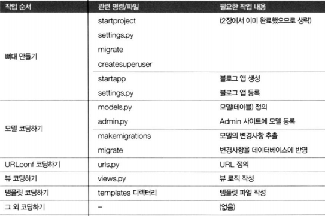
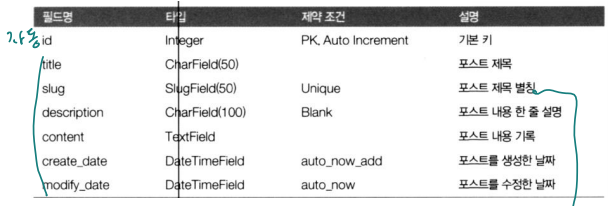
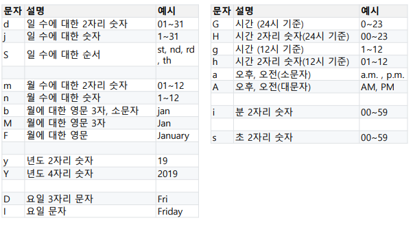

# 실전 프로그램 개발 - Blog 앱

<br>

## bookmark 앱 URLConf 조정

### 라우팅의 분리 – urls 모듈 분리

-   애플리케이션 마다 자체 urls 모듈 운영
-   mysite/urls.py에서 모듈 단위로 라우팅 연결

<br>

**bookmark/urls.py**

```python
from django.urls import path
from bookmark.views import BookmarkLV, BookmarkDV

app_name = 'bookmark' # 해당 애플리케이션의 네임스페이스명

urlpatterns = [
    path('', BookmarkLV.as_view(), name='index'),
    path('<int:pk>/', BookmarkDV.as_view(), name='detail'),
]
```

**mysite/urls.py**

```python
from django.contrib import admin
from django.urls import path, include

urlpatterns = [
    path('admin/', admin.site.urls),
    path('bookmark/', include('bookmark.urls')),
]
```

**bookmark/templates/bookmark_list.html**

```html
<div>
    <h1>Bookmark List</h1>
    <ul>
        
        <li>
            <a href="">
                {{bookmark}}</a>
        </li>
        
    </ul>
</div>
```

-   url 블록

    -   app_name:경로이름 --> bookmark:detail  

          

        app_name = 'bookmark' # 해당 애플리케이션의 네임스페이스명  
        path('/', BookmarkDV.as_view(), name='detail'),

**bookmark/templates/bookmark_detail.html**

```html
<div>
    <h1>Bookmark List</h1>
    <div>
        <h1>{{bookmark.title}}</h1>
        <ul>
            <li>URL : <a href="{{bookmark.url}}" target="_blank">
                {{bookmark.url}}</a></li>
        </ul>
    </div>
    <a href="">목록으로</a>
</div>
```

<br>

## blog 앱 개발하기

### 작업 순서

  

<br>

**뼈대 만들기**

-   $ `python manage.py startapp blog`

<br>

**mysite/setttings.py**

```python
INSTALLED_APPS = [
    'django.contrib.admin',
    'django.contrib.auth',
    'django.contrib.contenttypes',
    'django.contrib.sessions',
    'django.contrib.messages',
    'django.contrib.staticfiles',
    'bookmark.apps.BookmarkConfig', # 추가
    'blog.apps.BlogConfig', # 추가
]
```

<br>

### 모델 정의

  

<br>

**모델 정의: blog/models.py**

```python
from django.db import models
from django.urls import reverse
class Post(models.Model):
    title = models.CharField(verbose_name='TITLE', max_length=50)
    slug = models.SlugField('SLUG', unique=True, allow_unicode=True, help_text='one word for title alias.')
    description = models.CharField('DESCRIPTION', max_length=100, blank=True, help_text='simple description text.')
    content = models.TextField('CONTENT')
    create_dt = models.DateTimeField('CREATE DATE', auto_now_add=True)
    modify_dt = models.DateTimeField('MODIFY DATE', auto_now=True)
    
    class Meta:
        verbose_name = 'post'
        verbose_name_plural = 'posts'
        db_table = 'blog_posts' # 테이블명 재정의
        ordering = ('-modify_dt',) # orderby 절, -이면 내림차순
        
    def __str__(self):
        return self.title
    
    def get_absolute_url(self): # 현재 데이터의 절대 경로 추출
        return '' # reverse('blog:post_detail', args=(self.slug,))
    
    def get_previous(self): # 이전 데이터 추출
        return self.get_previous_by_modify_dt()
    
    def get_next(self): # 다음 데이터 추출
        return self.get_next_by_modify_dt()
```

-   reverse('앱명칭:url명' [, args=(경로변수…)])
    -   템플릿의 과 같은 동작

<br>

**blog/admin.py**

```python
from django.contrib import admin
from blog.models import Post
@admin.register(Post)
class PostAdmin(admin.ModelAdmin):
    list_display = ('id', 'title', 'modify_dt')
    list_filter = ('modify_dt',)
    search_fields = ('title','content')
    prepopulated_fields = { 'slug' : ('title', )}
```

>   title의 값으로 slug에 준다.
>   127.0.0.1:8000/admin > blog > post 추가 > tile에 공백 생기면 SLUG에 -로 채움

<br>

### 데이터베이스반영

-   $ `python manage.py makemigrations blog`
-   $ `python manage.py migrate`

<br>

**URLConf : mysite/urls.py**

```python
from django.contrib import admin
from django.urls import path, include

urlpatterns = [
    path('admin/', admin.site.urls),
    path('bookmark/', include('bookmark.urls')),
    path('blog/', include('blog.urls')),
]
```

>   지금은 오류, 아직 blog.urls 없음

<br>

**URLConf : blog/urls.py (목록보기)**

```python
from django.urls import path, re_path
from blog.views import *

app_name = 'blog'

urlpatterns = [
    path('', PostLV.as_view(), name='index'),
]
```

<br>

**뷰 정의 : blog/views.py (목록보기)**

```python
from django.views.generic import ListView, DetailView
from blog.models import Post

# ListView
class PostLV(ListView):
    model = Post
    template_name = 'blog/post_all.html' # 템플릿 파일명 변경
    context_object_name = 'posts' # 컨텍스트 객체 이름 변경(object_list)
    paginate_by = 2 # 페이지네이션, 페이지당 문서 건 수
    
# DetailView
class PostDV(DetailView):
    model = Post
```

<br>

### 페이지네이션 객체 page_obj

-   컨텍스트 변수로 자동 추가됨 
-   page_obj.has_previous : 이전 페이지 존재 여부 
-   page_obj.has_next : 이후 페이지 존재 여부 
-   page_obj.previous_page_number : 이전 페이지 번호 
-   page_obj.next_page_number : 다음 페이지 번호 
-   page_obj.number : 현재 페이지 번호 
-   page_obj.paginator.num_pages : 전체 페이지 수

<br>

**템플릿 정의 : blog/templates/blog/post_all.html (목록보기)**

```html
<h1>Blog List</h1>
<br>

    <h3><a href="{{post.get_absolute_url}}">{{post.title}}</a></h3>
    	{{post.modify_dt|date:"N d, Y"}}
    <p>{{post.description}}</p>

<br>
<div>
    <span>
        
        <a href="?page={{page_obj.previous_page_number}}">Prev</a>
        
        Page {{ page_obj.number }} of {{ page_obj.paginator.num_pages}}
        
        <a href="?page={{page_obj.next_page_number}}">Next</a>
        
    </span>
</div>
```

<br>

**URLConf : blog/urls.py (상세보기)**

```python
from django.urls import path, re_path
from blog.views import *

app_name = 'blog'

urlpatterns = [
    path('', PostLV.as_view(), name='index'),
    re_path(r'^(?P<slug>[-\w]+)/$', PostDV.as_view(), name='detail'),
]
```

-   re_path(정규식 패턴, view, name=)
    -   정규표현식 패턴에 대응하는 url과 view를 매핑
    -   모델에서 reverse() 함수로 전달한 인자(<인자명>)로 url을 재구성
        -   reverse('blog:post_detail', args=(self.slug,))

>   공백없이 글자, 숫자, -만 허용하고 마지막에 /로 끝나야한다.

<br>

**뷰 정의 : blog/views.py (상세보기)**

```python
:
# DetailView
class PostDV(DetailView):
    model = Post
```

>   context_object_name='post' 추가하면 html에서 detail의 object를 post로 바꿀 수 있음

<br>

**템플릿 정의 : blog/templates/blog/post_detail.html (상세보기)**

```html
<h2>{{object.title}}</h2>
<p>
    
    <a href="{{object.get_previous.get_absolute_url}}"
       title="이전 글">prev</a>
    
    
    <a href="{{object.get_next.get_absolute_url}}"
       title="다음 글">next</a>
    
</p>
<p>{{object.modify_dt | date:"j F Y"}}</p>
<br>
<div>
    {{object.content | linebreaks}}
</div>
```

>   "j F Y" : 일 월 년
>
>   linebreaks 필터 : 개행 문자를 br 또는 p tag로 묶어주는 filter

<br>

**모델 정의: blog/models.py**

```python
    def __str__(self):
        return self.title
    def get_absoulte_url(self): # 현재 데이터의 절대 경로 추출
        return reverse('blog:detail', args=(self.slug,))
    def get_previous(self): # 이전 데이터 추출
        return self.get_previous_by_modify_dt()
    def get_next(self): # 다음 데이터 추출
        return self.get_next_by_modify_dt()
```

-   reverse('앱명칭:url명' [, args=(경로변수…)])
    -   템플릿의 과 같은 동작

>   한글 한글자 3Byte
>
>   ex) 종 : %EC%A2%85% 16진수

<br>

<br>

# 실전 프로그램 개발 - Blog 앱 ArchiveView

<br>

### ArchiveView

-   날짜 필드로 필터링
-   년도별/월별/일별/오늘 목록 얻을 때 사용
    -   ArchiveIndexView    \<model>\_archive.html
    -   YearArchiveView    \<model>\_archive_year.html
    -   MonthArchiveView    \<model>\_archive_month.html
    -   DayArchiveView    \<model>\_archive_day.html
    -   TodayArchiveView    \<model>\_archive_day.html
-   model, date_field 필드 정의 필요

<br>

### 개발 코딩하기 - 뷰

**blog/views.py**

```python
from django.views.generic import ListvView, DetailView
from django.views.generic.dates import ArchiveIndexView, YearArchiveView, MonthArchiveView, DayArchiveView, TodayArchiveView

:
    # ArchiveView
class PostAV(ArchiveIndexView):
    model= Post
    date_field = 'modify_dt'
        
class PostYAV(YearArchiveView):
    model= Post
    date_field = 'modify_dt'
    make_object_list = True
            
class PostMAV(MonthArchiveView):
    model= Post
    date_field = 'modify_dt'
    month_format = '%m'
                
class PostDAV(DayArchiveView):
    model= Post
    date_field = 'modify_dt'
    month_format = '%m'
                
class PostTAV(TodayArchiveView):
    model= Post
    date_field = 'modify_dt'
    month_format = '%m'
```

>   YearArchiveView 상속에서 default로는 object_list가 넘어오지 안음

<br>

### 개발 코딩하기 - URLConf

**blog/urls.py**

```python
	:
urlpatterns = [
    :
    # Example: /blog/archive/
    path('archive/archive/', PostAV.as_view(), name='post_archive'),
    
    # Example: /blog/archive/2019/
    path('archive/<int:year>/', PostYAV.as_view(), name='post_year_archive'),
    
    # Example: /blog/archive/2019/nov/
    path('archive/<int:year>/<str:month>/', PostMAV.as_view(), name='post_month_archive'),
    
    # Example: /blog/archive/2019/nov/10/
    path('archive/<int:year>/<str:month>/<int:day>/', PostDAV.as_view(), name='post_day_archive'),
    # Example: /blog/archive/today/
    path('archive/today/', PostTAV.as_view(), name='post_today_archive'),
]
```

>   re_path 때문에 오류 : archive/가 조건을 만족 > slug의 url과 안겹치게 조정
>   'archive/' 부분을 'archive/archive/'로 수정한 것

<br>

### 개발 코딩하기 - 템플릿

**date 템플릿 필터**

  

<br>

**blog/templates/blog/post_archive.html**

```html
<h1>Post Archives until </h1>
<ul>
    
    <li style="display: inline;">
        <a href="">
            Year-{{ date|date:"Y" }}</a></li>
    
</ul>
<br/>
<div>
    <ul>
        
        <li>{{ post.modify_dt|date:"Y-m-d" }}&nbsp;&nbsp;&nbsp;
            <a href="{{ post.get_absolute_url }}">
                <strong>{{ post.title }}</strong></a></li>
        
    </ul>
</div>
```

<br>

**blog/templates/blog/post_archive_year.html**

```html
<h1>Post Archives for {{ year|date:"Y" }}</h1>
<ul>
    
    <li style="display: inline;">
        <a href="">{{ date|date:"F" }}</a></li>
    
</ul>
<br>
<div>
    <ul>
        
        <li>{{ post.modify_dt|date:"Y-m-d" }}&nbsp;&nbsp;&nbsp;
            <a href="{{ post.get_absolute_url }}">
                <strong>{{ post.title }}</strong></a></li>
        
    </ul>
</div>
```

<br>

**blog/templates/blog/post_archive_month.html**

```html
<h1>Post Archives for {{ month|date:"N, Y" }}</h1>
<div>
    <ul>
        
        <li>{{ post.modify_dt|date:"Y-m-d" }}&nbsp;&nbsp;&nbsp;
            <a href="{{ post.get_absolute_url }}">
                <strong>{{ post.title }}</strong></a></li>
        
    </ul>
</div>
```

<br>

**blog/templates/blog/post_archive_day.html**

```html
<h1>Post Archives for {{ day|date:"N d, Y" }}</h1>
<div>
    <ul>
        
        <li>{{ post.modify_dt|date:"Y-m-d" }}&nbsp;&nbsp;&nbsp;
            <a href="{{ post.get_absolute_url }}">
                <strong>{{ post.title }}</strong></a></li>
        
    </ul>
</div>
```

>   접근 할 때 URL 뒤에 /05/처럼 일을 붙어주어 접근

<br>

>   today archive는 urls에서 설정한 /today/로 자동 접근

<br>