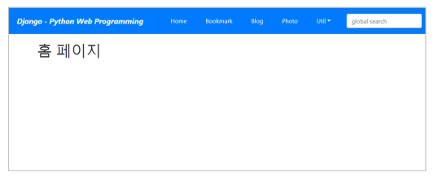
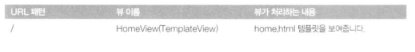
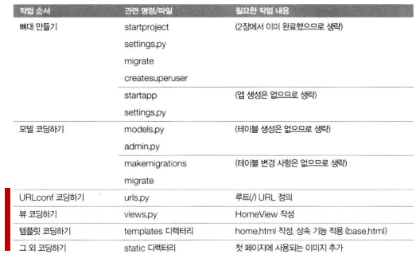

# 프로젝트 첫 페이지 만들기

<br>

### 첫 페이지 만들기

  

<br>

**레이아웃 기반 페이지 만들기**

-   공통으로 사용되는 요소를 레이아웃 템플릿으로 정의
    -   헤더 
    -   메뉴 
    -   내용 
    -   풋터
-   개별 페이지는 레이아웃에서 필요한 부분만 재정의
    -   레이아웃 페이지를 상속
    -   템플릿 블록을 재정의

<br>

**첫 페이지**

  

<br>

**작업순서**

  

<br>

**mysite/views.py**

```python
from django.views.generic import TemplateView
# TemplateView
class HomeView(TemplateView):
    template_name = 'home.html'
```

<br>

**mysite/settings.py**

```python
TEMPLATES = [
    {
        'BACKEND': 'django.template.backends.django.DjangoTemplates',
        'DIRS': [
            os.path.join(BASE_DIR, 'templates') #
        ],
        'APP_DIRS': True,
        'OPTIONS': { … },
    },
]
```

>   BASE_DIR : 프로젝트 디렉토리

<br>

**mysite/urls.py**

```python
from django.contrib import admin
from django.urls import path, include

from mysite.views import HomeView

urlpatterns = [
    path('', HomeView.as_view(), name='home'),
    path('admin/', admin.site.urls),
    path('bookmark/', include('bookmark.urls')),
    path('blog/', include('blog.urls')),
]
```

<br>

### 템플릿 레이아웃 만들기

**기본 형식**

-   디폴트 값
    -   
        -   페이지 타이틀
    -   
        -   페이지별 스타일
    -   
        -   페이지 내용
    -   
        -   페이지별 자바스크립트

<br>

**레이아웃 페이지**

-   templates/base.html에 정의

<br>

**개별 페이지**

-   templates/home.html
-   로 시작

<br>

**STATICS**

-   정적 파일을 배치하는 디렉토리

    -   image, css, js 등의 파일들

        >   내용을 바꾸는게 아님

    -   settings.py의 STATIC_URL 속성값을 추가해 줌

        -   STATIC_URL= '/static'

        >   프로젝트 폴더에 디렉토리 추가

    -   템플릿 파일에서 STATIC 사용하기

        -   을 반드시 먼저 지정하고 사용

    -   변환 예

          

          

        → /static/img/logo.png  

<br>

**templates/menu.html**

```html
<nav class="navbar navbar-expand-lg navbar-dark bg-primary fixed-top">
    <span class="navbar-brand mx-5 mb-0 font-weight-bold font-italic">
        Django - Python Web Programming</span>
    <button class="navbar-toggler" type="button" data-toggle="collapse"
            data-target="#navbarSupportedContent">
        <span class="navbar-toggler-icon"></span>
    </button>
    <div class="collapse navbar-collapse" id="navbarSupportedContent">
        <ul class="navbar-nav mr-auto">
            <li class="nav-item mx-1 btn btn-primary">
                <a class="nav-link text-white" href="">Home</a></li>
            <li class="nav-item mx-1 btn btn-primary">
                <a class="nav-link text-white"
                   href="">Bookmark</a></li>
            <li class="nav-item mx-1 btn btn-primary">
                <a class="nav-link text-white"
                   href="">Blog</a></li>
            <li class="nav-item mx-1 btn btn-primary">
                <a class="nav-link text-white" href="">Photo</a></li>
            <li class="nav-item dropdown mx-1 btn btn-primary">
                <a class="nav-link dropdown-toggle text-white" href="#"
                   data-toggle="dropdown">Util</a>
                <div class="dropdown-menu">
                    <a class="dropdown-item" href="">Admin</a>
                    <div class="dropdown-divider"></div>
                    <a class="dropdown-item"
                       href="">Archive</a>
                    <a class="dropdown-item" href="">Search</a>
                </div>
            </li>
        </ul>
        <form class="form-inline my-2" action="" method="post"> 
            <input class="form-control mr-sm-2" type="search"
                   placeholder="global search" name="search_word">
        </form>
    </div>
</nav>
```

<br>

**templates/base.html**

```html

<!DOCTYPE html>
<html lang="ko">
    <head>
        <meta charset="utf-8">
        <meta http-equiv="X-UA-Compatible" content="IE=edge">
        <meta name="viewport" content="width=device-width, initial-scale=1">
        <title>Django Web Programming</title>
        <link rel="stylesheet"
              href="https://use.fontawesome.com/releases/v5.8.2/css/all.css"/>
        <link rel="stylesheet"
              href="https://maxcdn.bootstrapcdn.com/bootstrap/4.5.0/css/bootstrap.min.css">
        
    </head>
    <body style="padding-top:90px;">
        
        <div class="container">
            
        </div>
    </body>
    <script src="https://ajax.googleapis.com/ajax/libs/jquery/3.5.1/jquery.min.js"></script>
    <script src="https://cdnjs.cloudflare.com/ajax/libs/popper.js/1.16.0/umd/popper.min.js">
    </script>
    <script src="https://maxcdn.bootstrapcdn.com/bootstrap/4.5.0/js/bootstrap.min.js">
    </script>
    
</html>
```

>   블록 4개를 각각 커스터마이징 할 수 있다.

<br>

**templates/home.html**

```html


Home


<h1>홈 페이지</h1>

```

>   base.html을 상속 받겠다.

<br>