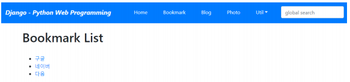
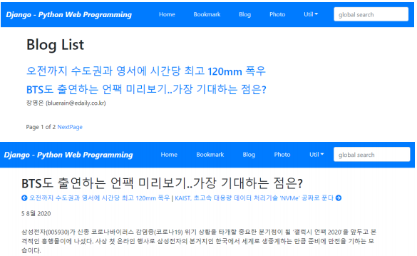
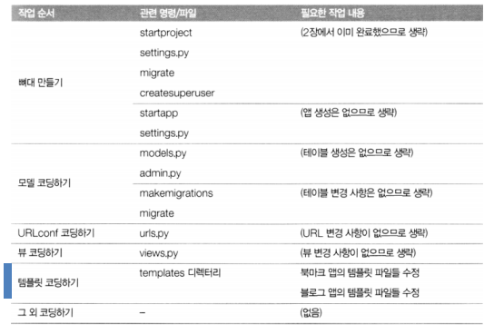

# 기존 앱 개선하기 - Bookmark 앱, Blog 앱 -

<br>

### 기존 앱 개선 설계하기

**Bookmark**

  

<br>

**Blog**

  

<br>

**작업 절차**

  

<br>

### 개발 코딩하기

**bookmark/templates/bookmark/bookmark_list.html**

```html


bookmark_list.html



<h1>Bookmark List</h1>
<br>
<ul>
    
    <li><a href="">
        {{ bookmark }}</a></li>
    
</ul>


```

<br>

**bookmark/templates/bookmark/bookmark_detail.html**

```html


bookmark_detail.html



<h1>{{ object.title }}</h1>
<ul>
    <li>URL: <a href="{{ object.url }}">{{ object.url }}</a></li>
</ul>
<a href="">목록으로</a>


```

<br>

**blog/templates/blog/post_all.html**

```html


post_all.html


<h1>Blog List</h1>
<br>

<h3><a href='{{ post.get_absolute_url }}' target="_blank">
    {{ post.title }}</a></h3>
{{ post.modify_date|date:"N d, Y" }}
<p>{{ post.description }}</p>

<br>
<div>
    <span>
        
        <a href="?page={{ page_obj.previous_page_number }}">PreviousPage</a>
        
        Page {{ page_obj.number }} of {{ page_obj.paginator.num_pages }}
        
        <a href="?page={{ page_obj.next_page_number }}">NextPage</a>
        
    </span>
</div>

```

<br>

**blog/templates/blog/post_detail.html**

```html


post_detail.html


<h2>{{ object.title }}</h2>
<p>
    
    <a href="{{ object.get_next.get_absolute_url }}"
       title="View previous post">
        <i class="fas fa-arrow-circle-left"></i> {{ object.get_next }}
    </a>
    
    
    | <a href="{{ object.get_previous.get_absolute_url }}"
         title="View next post">
    {{ object.get_previous }} <i class="fas fa-arrow-circle-right"></i>
    </a>
    
</p>
<div>{{ object.modify_dt|date:"j F Y" }}</div>
<br>
<div>
    {{ object.content|linebreaks }}
</div>

```

<br>

**blog/templates/blog/post_archive.html**

```html


post_archive.html



<h1>Post Archives until </h1>

<a href=""
   class="btn btn-outline-primary btn-sm mx-1">
    Year-{{ date|date:"Y" }}</a>

<br><br>
<div>
    <ul>
        
        <li class="h5">
            {{ post.modify_dt|date:"Y-m-d" }}&emsp;
            <a href="{{ post.get_absolute_url }}">
                <strong>{{ post.title }}</strong></a>
        </li>
        
    </ul>
</div>

```

<br>

**blog/templates/blog/post_archive_year.html**

```html


post_archive_year.html



<h1>Post Archives for {{ year|date:"Y" }}</h1>

<a href=""
   class="btn btn-outline-primary btn-sm mx-1">
    {{ date|date:"F" }}</a>

<br><br>
<div>
    <ul>
        
        <li class="h5">
            {{ post.modify_dt|date:"Y-m-d" }}&emsp;
            <a href="{{ post.get_absolute_url }}">
                <strong>{{ post.title }}</strong></a>
        </li>
        
    </ul>
</div>

```

<br>

**blog/templates/blog/post_archive_month.html**

```html


post_archive_month.html


<h1>Post Archives for {{ month|date:"N, Y" }}</h1>
<br><br>
<div>
    <ul>
        
        <li class="h5">
            {{ post.modify_dt|date:"Y-m-d" }}&emsp;
            <a href="{{ post.get_absolute_url }}">
                <strong>{{ post.title }}</strong></a>
        </li>
        
    </ul>
</div>

```

<br>

**blog/templates/blog/post_archive_day.html**

```html


post_archive_day.html


<h1>Post Archives for {{ day|date:"N d, Y" }}</h1>
<br><br>
<div>
    <ul>
        
        <li class="h5">
            {{ post.modify_dt|date:"Y-m-d" }}&emsp;
            <a href="{{ post.get_absolute_url }}">
                <strong>{{ post.title }}</strong></a>
        </li>
        
    </ul>
</div>

```

<br>