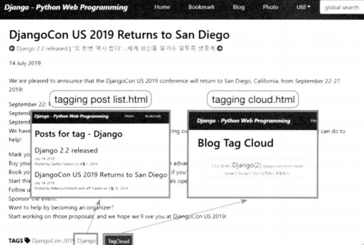
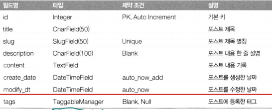
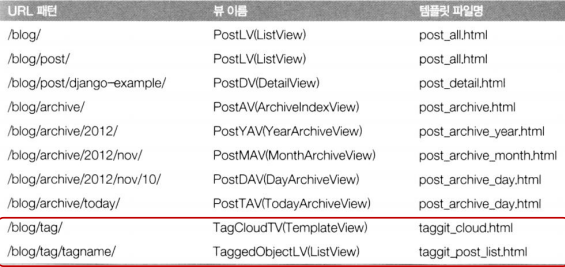
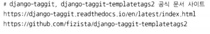

# Blog 앱 확장 - Tag 달기 -

<br>

### 애플리케이션 설계하기

**화면 설계**

  

<br>

**테이블 설계**

-   Post 모델 클래스

  

<br>

**URL 설계**

  

<br>

**작업절차**

  

<br>

<br>

### 개발 코딩하기

**태깅 지원 패키지 설치**

$ `pip install django-taggit django-taggit-templatetags2`

또는 

$ `conda install django-taggit django-taggit-templatetags2`

  

<br>

**mysite/settings.py**

```python
INSTALLED_APPS = [
    'django.contrib.admin',
    'django.contrib.auth',
    'django.contrib.contenttypes',
    'django.contrib.sessions',
    'django.contrib.messages',
    'django.contrib.staticfiles',

    'taggit.apps.TaggitAppConfig',
    'taggit_templatetags2',

    'bookmark.apps.BookmarkConfig',
    'blog.apps.BlogConfig',
]

:
TAGGIT_CASE_INSENSITIVE = True
TAGGIT_LIMIT = 50
```

<br>

**blog/models.py**

```python
from django.db import models
from django.urls import reverse
from taggit.managers import TaggableManager
class Post(models.Model):
    title = models.CharField(verbose_name='TITLE', max_length=50)
    slug = models.SlugField('SLUG', unique=True, allow_unicode=True, help_text='one word for title alias.')
    description = models.CharField('DESCRIPTION', max_length=100, blank=True, help_text='simple description text.')
    content = models.TextField('CONTENT')
    create_dt = models.DateTimeField('CREATE DATE', auto_now_add=True)
    modify_dt = models.DateTimeField('MODIFY DATE', auto_now=True)
    tags = TaggableManager(blank=True)
    :
```

<br>

**데이터베이스에 모델 반영하기**

$ `python manage.py makemigrations blog`

$ `python manage.py migrate`

<br>

**blog/admin.py**

```python
from django.contrib import admin
from blog.models import Post
@admin.register(Post)
class PostAdmin(admin.ModelAdmin):
    list_display = ('id', 'title', 'modify_dt', 'tag_list')
    list_filter = ('modify_dt',)
    search_fields = ('title', 'content')
    prepopulated_fields = {'slug': ('title',)}
    
    def get_queryset(self, request):
        return super().get_queryset(request).prefetch_related('tags')
    def tag_list(self, obj):
        return ', '.join(o.name for o in obj.tags.all())
```

<br>

**blog/views.py**

```python
from django.views.generic import ListView, DetailView, TemplateView
:
#--- Tag View
class TagCloudTV(TemplateView):
    template_name = 'taggit/taggit_cloud.html'
    
class TaggedObjectLV(ListView):
    template_name = 'taggit/taggit_post_list.html'
    model = Post
    
    def get_queryset(self):
        return Post.objects.filter(tags__name=self.kwargs.get('tag'))
    def get_context_data(self, **kwargs):
        context = super().get_context_data(**kwargs)
        context['tagname'] = self.kwargs['tag']
        return context
```

>   filter로 where절 구성  
>   언더바 2개 : 모델 멤버명  
>   'tag' : 쿼리 파라메타  
>
>   가변인수 *args 튜플, 키워드 가변인수 **kwargs 사전

<br>

**blog/urls.py**

```python
from django.urls import path, re_path
from blog import views

app_name = 'blog'
urlpatterns = [
    :
    # Example: /blog/tag/
    path('tag/', TagCloudTV.as_view(), name='tag_cloud'),
    # Example: /blog/tag/tagname/
    path('tag/<str:tag>/', TaggedObjectLV.as_view(), name='tagged_object_list'),
]
```

>   slug 파트서 겹쳐서 거기에 post 추가

<br>

**blog/templates/blog/post_detail.html**

```html


post_detail.html


<h2>{{ object.title }}</h2>
<p>
    
    <a href="{{ object.get_next.get_absolute_url }}"
       title="View previous post">
        <i class="fas fa-arrow-circle-left"></i> {{ object.get_next }}
    </a>
    
    
    | <a href="{{ object.get_previous.get_absolute_url }}"
         title="View next post">
    {{ object.get_previous }} <i class="fas fa-arrow-circle-right"></i>
    </a>
    
</p>
<div>{{ object.modify_dt|date:"j F Y" }}</div>
<br>
<div>
    {{ object.content|linebreaks }}
</div>
<br>
<div>
    <b>TAGS</b> <i class="fas fa-tag"></i>
    
    
    
    <a href="">{{tag.name}}</a>
    
    &emsp;<a href="">
    <span class="btn btn-info btn-sm">TagCloud</span> </a>
</div>

```

<br>

**blog/templates/taggit/taggit_cloud.html**

```html

taggit_cloud.html

<style type="text/css">
    .tag-cloud {
        width: 40%;
        margin-left: 30px;
        text-align: center;
        padding: 5px;
        border: 1px solid orange;
        background-color: #ffc;
    }
    .tag-1 {font-size: 12px;}
    .tag-2 {font-size: 14px;}
    .tag-3 {font-size: 16px;}
    .tag-4 {font-size: 18px;}
    .tag-5 {font-size: 20px;}
    .tag-6 {font-size: 24px;}
</style>



<h1>Blog Tag Cloud</h1>
<br>
<div class="tag-cloud">
    
    
    
    <span class="tag-{{tag.weight|floatformat:0}}">
        <a href="">
            {{tag.name}}({{tag.num_times}})</a>
    </span>
    
</div>

```

<br>

**blog/templates/taggit/taggit_post_list.html**

```html


taggit_post_list.html



<h1>Posts for tag - {{ tagname }}</h1>
<br>

<h2><a href='{{ post.get_absolute_url }}'>{{ post.title }}</a></h2>
{{ post.modify_dt|date:"N d, Y" }}
<p>{{ post.description }}</p>



```

<br>

