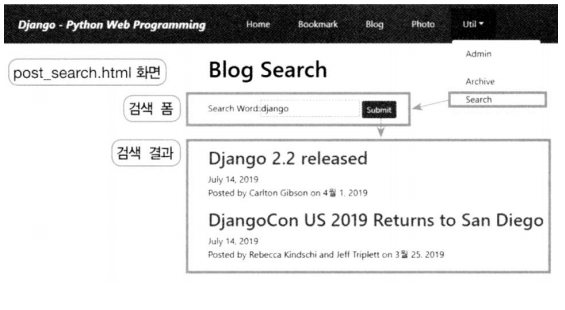
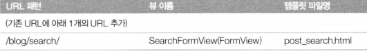
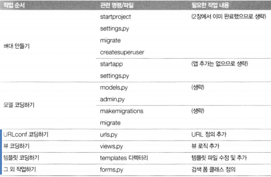

# Blog 앱 확장 - 검색 기능 -

<br>

### 애플리케이션 설계하기

**화면 구성**

  

<br>

**URL 설계**

  

<br>

**작업 절차**

  

<br>

### 개발 코딩하기

**blog/forms.py**

```python
from django import forms

class PostSearchForm(forms.Form):
    search_word = forms.CharField(label='Search Word')
```

>   html로 구성 안하고 여기에 form 관련 내용 집어 넣음

<br>

**blog/views.py**

```python
 :
from django.views.generic import FormView
from django.db.models import Q
from django.shortcuts import render
from blog.forms import PostSearchForm

:
#--- FormView
class SearchFormView(FormView):
    form_class = PostSearchForm
    template_name = 'blog/post_search.html'
    
    def form_valid(self, form):
        searchWord = form.cleaned_data['search_word']
        post_list = Post.objects.filter(
            Q(title__icontains=searchWord) |
            Q(description__icontains=searchWord) |
            Q(content__icontains=searchWord)
        ).distinct()
        
        context = {}
        context['form'] = form
        context['search_term'] = searchWord
        context['object_list'] = post_list
        
        return render(self.request, self.template_name, context)
```

>   post_list ≒ TITLE LIKE '%search_word%'

<br>

**blog/urls.py**

```python
from django.urls import path, re_path
from blog import views

app_name = 'blog'
urlpatterns = [
    :
    # Example: /blog/search/
    path('search/', SearchFormView.as_view(), name='search'),
]
```

<br>

**menu.html**

```html
:
<li class="nav-item dropdown mx-1 btn btn-primary">
    <a class="nav-link dropdown-toggle text-white" href="#"
       data-toggle="dropdown">Util</a>
    <div class="dropdown-menu">
        <a class="dropdown-item" href="">Admin</a>
        <div class="dropdown-divider"></div>
        <a class="dropdown-item" href="">
            Archive</a>
        <a class="dropdown-item" href="">Search</a>
    </div>
</li>
</ul>
:
```

<br>

**blog/templates/blog/post_search.html**

```html


post_search.html



<h1>Blog Search</h1>
<br>
<form action="." method="post"> 
    {{ form.as_table }}
    <input type="submit" value="Submit" class="btn btn-primary btn-sm">
</form>
<br/><br/>


        
        <h2><a href='{{ post.get_absolute_url }}'>{{ post.title }}</a></h2>
        {{ post.modify_dt|date:"N d, Y" }}
        <p>{{ post.description }}</p>
        

    
    <b><i>Search Word({{ search_term }}) Not Found !</i></b>
    

```

>   소스보기로 {{ form.as_table }} 확인 가능

<br>

