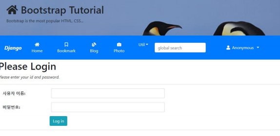
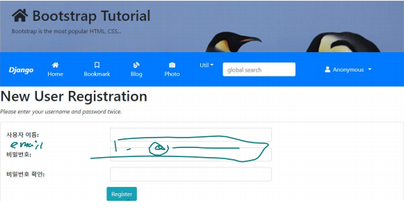
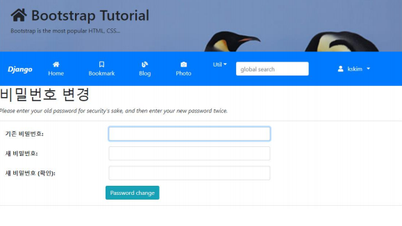
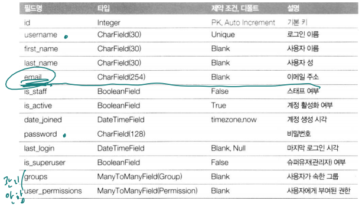
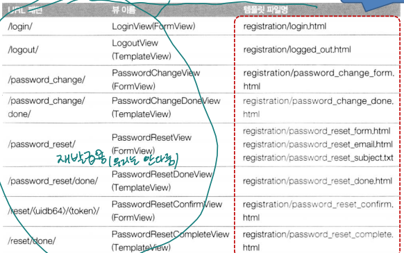
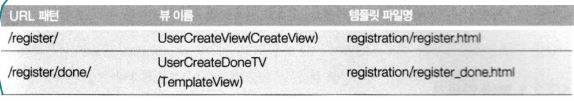
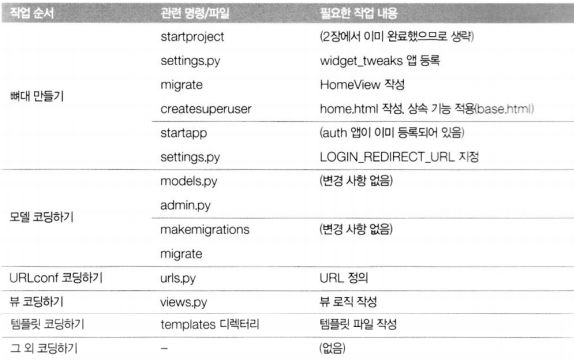
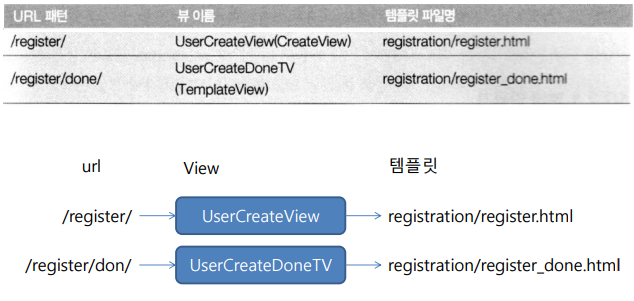
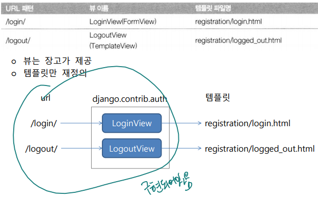
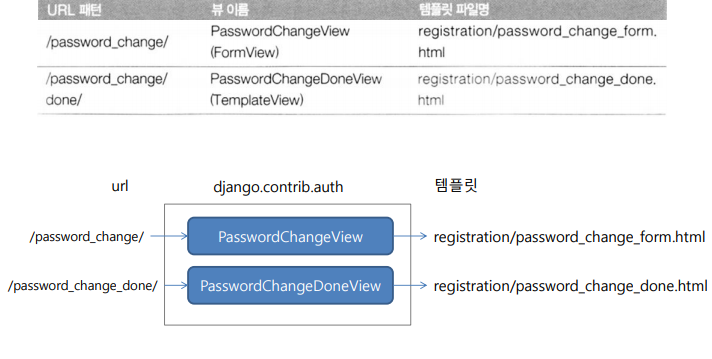

# 실전 프로그램 개발 - 인증 기능 -

<br>

### 애플리케이션 설계하기

**인증 기능**

-   django에서 기본 앱으로 제공
    -   django.contrib.auth 앱
    -   관련 모델과 뷰가 제공됨
    -   기본 제공 뷰를 이용하는 경우 템플릿만 정의

mysite/settings.py

```python
INSTALLED_APPS = [
    'django.contrib.admin',
    'django.contrib.auth',
    'django.contrib.contenttypes',
    'django.contrib.sessions',
    'django.contrib.messages',
    'django.contrib.staticfiles',
    :
]
```

<br>

**화면 설계**

  

<br>

  

<br>

  

<br>

**django 제공 User 모델**

  

<br>

**url 설계(django.contrib.auth에서 이미 정의되어 있음)** 

  

  

<br>

**작업순서**

  

<br>

### 개발 코딩하기

**django-widget-tweaks 패키지 설치**

$ `pip install django-widget-tweaks`

또는  

$ `conda install django-widget-tweaks`

-   템플릿에서 Form모델을 렌더링할 때 attribute와 class 설정 지원

    >   as_table 예전 스타일이라 반응형을 위해

<br>

**mysite/settings.py**

```python
INSTALLED_APPS = [
    :
    'widget_tweaks',
    'bookmark.apps.BookmarkConfig',
    'blog.apps.BlogConfig',
    'photo.apps.PhotoConfig',
]

# 로그인 관련 URL 디폴트 값
# LOGIN_URL = '/accounts/login/' # 로그인 페이지 URL
# LOGIN_REDIRECT_URL = '/accounts/profile' # 로그인 성공시 리다이렉트할 URL
# LOGOUT_REDIRECT_URL = '/' # 로그 아웃시 리다이렉트할 URL

LOGIN_REDIRECT_URL = '/' # 로그인 성공시 리다이렉트할 URL
```

>   `pip install httpie` > http -v GET VH 로 확인 가능

<br>

**메뉴 구성**

-   로그인 상태관리 컨텍스트 변수
    -   user
        -   user.is_active :로그인 여부
        -   user.get_username : 사용자 계정명
    -   계정 관리 메뉴
        -   로그인 상태

<br>

**templates/menu.html**

```html
:
</form>
<ul class="navbar-nav ml-5 mr-5">
    <li class="nav-item dropdown mx-1 btn btn-primary">
        
        <a class="nav-link dropdown-toggle text-white" href="#"
           data-toggle="dropdown">
            <i class="fas fa-user"></i>
            {{user.username }} </a>
        <div class="dropdown-menu">
            <a class="dropdown-item" href="">Logout</a>
            <a class="dropdown-item" href="">
                Change Password</a>
        </div>
        
        <a class="nav-link dropdown-toggle text-white" href="#"
           data-toggle="dropdown">
            <i class="fas fa-user"></i>Anonymous</a>
        <div class="dropdown-menu">
            <a class="dropdown-item" href="">Login</a>
            <a class="dropdown-item" href="">Register</a>
        </div>
        
    </li>
</ul>
</div>
</nav>
```

>   `` : 로그인 확인  
>
>   `{{user.username }}` : 사용자

<br>

### 개발 코딩하기(회원가입)

**회원가입**

  

<br>

**mysite/views.py**

```python
from django.views.generic import TemplateView, CreateView
from django.contrib.auth.forms import UserCreationForm
from django.urls import reverse_lazy

#--- Homepage
class HomeView(TemplateView):
    template_name = 'home.html'
    
#--- User Creation
class UserCreateView(CreateView):
    template_name = 'registration/register.html'
    form_class = UserCreationForm
    success_url = reverse_lazy('register_done')
    
class UserCreateDoneTV(TemplateView):
    template_name = 'registration/register_done.html'
```

>   `form_class` : 장고가 form 가지고 있다.

<br>

**mysite/urls.py**

```python
from django.conf import settings
from django.conf.urls.static import static
from django.contrib import admin
from django.urls import path, include

from mysite.views import HomeView, UserCreateView, UserCreateDoneTV

urlpatterns = [
    # 로그인, 로그아웃, 비밀번호 변경 등 담당
    path('accounts/', include('django.contrib.auth.urls')),
    # 회원 가입 및 처리
    path('accounts/register/', UserCreateView.as_view(), name='register'),
    path('accounts/register/done/', UserCreateDoneTV.as_view(), name='register_done'),
    :
] + static(settings.MEDIA_URL, document_root=settings.MEDIA_ROOT)
```

<br>

**templates/registration/register.html**

```html



register.html



<h1>New User Registration</h1>
<p class="font-italic">Please enter your username and password twice.</p>

<div class="alert alert-danger">
    <div class="font-weight-bold">
        Wrong! Please correct the error(s) below.
    </div>
    {{ form.errors }}
</div>

<form action="." method="post" class="card pt-3">
    <div class="form-group row">
        {{ form.username| add_label_class:"col-form-label col-sm-3 ml-3 font-weight-bold" }}
        <div class="col-sm-5">
            {{ form.username|add_class:"form-control"|attr:"autofocus" }}
        </div>
    </div>
    <div class="form-group row">
        {{ form.password1| add_label_class:"col-form-label col-sm-3 ml-3 font-weight-bold" }}
        <div class="col-sm-5">
            {{ form.password1|add_class:"form-control" }}
        </div>
    </div>
    <div class="form-group row">
        {{ form.password2|add_label_class:"col-form-label col-sm-3 ml-3 fontweight-bold" }}
        <div class="col-sm-5">
            {{ form.password2|add_class:"form-control" }}
        </div>
    </div>
    <div class="form-group">
        <div class="offset-sm-3 col-sm-5">
            <input type="submit" value="Register" class="btn btn-info"/>
        </div>
    </div>
</form>

```

>   `` : form 유효성 검사 ex) 비밀번호 너무 짧음

<br>

**templates/registration/register_done.html**

```html


register_done.html


<h1>Registration Completed Successfully</h1>
<br>
<p>Thank you for registering.</p>
<p class="font-italic"><a href="">Log in</a> </p>


```

<br>

### 개발 코딩하기(로그인)

**로그인**

  

<br>

**templates/registration/login.html**

```html



login.html



<h1>Please Login</h1>
<p class="font-italic">Please enter your id and password.</p>


<div class="alert alert-danger">
    <div class="font-weight-bold">
        Wrong! Please correct the error(s) below.
    </div>
    {{ form.errors }}
</div>


<form action="." method="post" class="card pt-3">
    
    
    <div class="form-group row">
        {{ form.username| add_label_class:"col-form-label col-sm-2 ml-3 font-weight-bold" }}
        <div class="col-sm-5">
            {{ form.username|add_class:"form-control"|attr:"autofocus" }}
        </div>
    </div>
    
    <div class="form-group row">
        {{ form.password| add_label_class:"col-form-label col-sm-2 ml-3 font-weight-bold" }}
        <div class="col-sm-5">
            {{ form.password|add_class:"form-control" }}
        </div>
    </div>
    
    <div class="form-group">
        <div class="offset-sm-2 col-sm-5">
            <input type="submit" value="Log in" class="btn btn-info"/>
            <input type="hidden" name="next" value="{{ next }}" />
        </div>
    </div>
</form>


```

<br>

### 개발 코딩하기(로그아웃)

**templates/registration/logged_out.html**

```html


logged_out.html



<h1>Logged out</h1>
<br>
<div>
    <i class="fas fa-quote-left"></i>
    <span class="h6">&ensp;Thanks for spending your quality time with this web
        site today.&ensp;</span>
    <i class="fas fa-quote-right"></i>
</div>
<p class="font-italic"><a href="">Log in again</a></p>


```

<br>

### 개발 코딩하기(비밀번호 변경)

**비밀번호 변경**

  

<br>

**templates/registration/password_change_form.html**

```html



password_change_form.html



<h1>{{ title }}</h1>
<p class="font-italic">Please enter your old password for security's sake, and then enter your new password twice.</p>


<div class="alert alert-danger">
    <div class="font-weight-bold">
        Wrong! Please correct the error(s) below.
    </div>
    {{ form.errors }}
</div>


<form action="." method="post" class="card pt-3">
    <div class="form-group row">
        {{ form.old_password| add_label_class:"col-form-label col-sm-3 ml-3 font-weight-bold" }}
        <div class="col-sm-5">
            {{ form.old_password|add_class:"form-control"|attr:"autofocus" }}
        </div>
    </div>
    <div class="form-group row">
        {{ form.new_password1| add_label_class:"col-form-label col-sm-3 ml-3 font-weight-bold" }}
        <div class="col-sm-5">
            {{ form.new_password1|add_class:"form-control" }}
        </div>
    </div>
    <div class="form-group row">
        {{ form.new_password2| add_label_class:"col-form-label col-sm-3 ml-3 font-weight-bold" }}
        <div class="col-sm-5">
            {{ form.new_password2|add_class:"form-control" }}
        </div>
    </div>
    <div class="form-group">
        <div class="offset-sm-3 col-sm-5">
            <input type="submit" value="Password change" class="btn btn-info"/>
        </div>
    </div>
</form>

```

<br>

**templates/registration/password_change_done.html**

```html


password_change_done.html



<h1>{{ title }}</h1>
<br>
<p>Your password was changed!</p>


```

