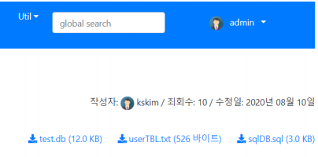

# 실전 프로그램 개발 - 아바타 -

<br>

**아바타**

  

<br>

**main 앱 만들기**

-   python manage startapp main

<br>

**settings.py**

```python
INSTALLED_APPS = [
    :
    'blog.apps.BlogConfig',
    'main.apps.MainConfig',
]
```

<br>

**main/models.py**

```python
from django.db import models
from django.contrib.auth.models import User

class Avata(models.Model):
    owner = models.ForeignKey(User, on_delete=models.CASCADE, verbose_name='User', blank=True, null=True)
    image = models.FileField(upload_to="avatas", null=True, blank=True, verbose_name='아바타 이미지 파일')
    
    def __str__(self):
        return self.owner
```

<br>

**모델 반영**

`python manage.py makemigrations main`

`python manage.py migrate`

<br>

**아바타를 등록하지 않은 사용자를 위한 아바타 등록**

-   /media/avatas/avata.png 파일 배치

<br>

**mysite/views.py**

```python
from django.views.generic import CreateView
from django.urls import reverse_lazy
from django.contrib.auth.mixins import LoginRequiredMixin
from main.models import Avata

class AvataView(LoginRequiredMixin, CreateView):
    model = Avata
    fields = ['image']
    template_name = "registration/avata_form.html"
    success_url = reverse_lazy('home')
    
    def form_valid(self, form):
        form.instance.owner = self.request.user
        
        try : # 기존 아바타가 있으면 삭제
            avata = Avata.objects.get(owner_id=self.request.user.id)
            file_path = os.path.join(settings.MEDIA_ROOT, str(avata.image))
            os.remove(file_path)
            avata.delete()
        except: pass
        
        return super().form_valid(form) # Post 모델 저장, self.object
```

<br>

**main/templates/avata_form.html**

```html


logged_out.html


<h1> {{user}}의 Avata 설정 </h1>


<form action="." method="post" enctype="multipart/form-data">
    
    <div class="form-group row">
        {{ form.image|add_label_class:"col-form-label col-sm-2 ml-3 font-weightbold" }}
        <div class="col-sm-5">
            {{ form.image}}
        </div>
    </div>
    <div class="form-group">
        <div class="offset-sm-2 col-sm-5">
            <input type="submit" value="확인" class="btn btn-info"/>
        </div>
    </div>
</form>

```

<br>

**mysite/views.py**

```python
:
import os
from mysite import settings
from django.http import HttpResponse
:
def avata_view(request, id):
    try:
        avata = Avata.objects.get(owner_id=id)
        file_path = os.path.join(settings.MEDIA_ROOT, str(avata.image))
    except: # 등록된 아바타가 없는 경우 디폴트 아바타 이미지 사용
        file_path = os.path.join(settings.MEDIA_ROOT, 'avatas/avata.png')
    return HttpResponse(open(file_path, 'rb') , content_type="image/*")
```

<br>

**main/urls.py**

```python
:
from mysite.views import *
urlpatterns = [
    path('avata/<int:pk>/add/', AvataView.as_view(), name='avata_add'),
    path('avata/<int:id>', avata_view, name='avata'),
]
```

<br>

**mysite/urls.py**

```python
:
from mysite.views import *
urlpatterns = [
    :
    path('', HomeView.as_view(), name='home'),
    path('main/', include('main.urls')),
    path('admin/', admin.site.urls),
    path('bookmark/', include('bookmark.urls')),
    path('blog/', include('blog.urls')),
    path('photo/', include('photo.urls')),
    path('tinymce/', include('tinymce.urls')),
]
```

<br>

**statics/css/style.css**

```css
.avata-sm {
    border-radius: 50%;
    width: 25px;
    height: 25px; 
}

.avata {
    border-radius: 50%;
    width: 50px;
    height: 50px; 
}

.avata-lg {
    border-radius: 50%;
    width: 75px;
    height: 75px; 
}
```

<br>

**template/base.html**

```html
:
<link rel="stylesheet"
      href="https://use.fontawesome.com/releases/v5.7.0/css/all.css"
      integrity="sha384-lZN37f5QGtY3VHgisS14W3ExzMWZxybE1SJSEsQp9S+oqd12jhcu+A56Ebc1zFSJ" crossorigin="anonymous">
<link rel="stylesheet" href="https://stackpath.bootstrapcdn.com/bootstrap/4.3.1/css/bootstrap.min.css" integrity="sha384-ggOyR0iXCbMQv3Xipma34MD+dH/1fQ784/j6cY/iJTQUOhcWr7x9JvoRxT2MZw1T" crossorigin="anonymous">

<link rel="stylesheet" href="">
:
```

<br>

**templates/menu.html**

```html
:
<ul class="navbar-nav ml-5 mr-5">
    <li class="nav-item dropdown mx-1 btn btn-primary">
        
        <a class="nav-link dropdown-toggle text-white" href="#"
           data-toggle="dropdown">
            
            &ensp;{{user.username}}&ensp;</a>
        <div class="dropdown-menu">
            <a class="dropdown-item" href="">Avata</a>
            <a class="dropdown-item" href="">Logout</a>
            <a class="dropdown-item" href="">
                Change Password</a>
        </div>
        
        :
```

<br>

**blog/templates/blog/post_detail.html**

```html
:
<div class="text-right">
    작성자: 
    {{post.owner}} /
    죄회수: {{post.read_cnt}} /
    수정일: {{ post.modify_dt|date:"Y년 m월 d일" }}</div>
<br>
:
```

