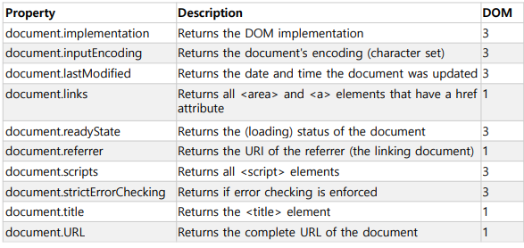

# DOM (Document Object Model)

**HTML DOM (Document Object Model)**

```html
<html>
    <head>
        <title>My title</title>
    </head>
    <body>
        <a href="https://www.google.co.kr">My link</a>
        <h1>My header</h1>
    </body>
</html>
```

  

<br>

**엘리먼트 검색**

  

<br>

**HTML 엘리먼트 찾기**

-   id로 찾기
    -   `var myElement = document.getElementById("intro");`
-   태그명으로 찾기
    -   `var x = document.getElementsByTagName("p");`
    -   `var x = document.getElementById("main");`
    -   `var y = x.getElementsByTagName("p");`
-   클래스명으로 찾기
    -   `var x = document.getElementsByClassName("intro");`
-   CSS 셀렉터로 찾기
    -   `var x = document.querySelectorAll("p.intro");`

<br>

**기본 골격(내부 스크립트)**

```html
<html>
    <body>
        <p id="demo"></p>
    </body>
    <script>
        document.getElementById("demo").innerHTML = "Hello World!";
    </script>
</html>
```

-   `document`
    -   DOM의 루트 엘리먼트
-   `getElementById()`
    -   id로 엘리먼트 찾기
    -   없으면 null 리턴
-   `innerHTML`
    -   엘리먼트의 컨텐트를 설정 - 컨텐트를 HTML 태그 문서로 해석

<br>

**HTML 엘리먼트 변경**

  

<br>

**엘리먼트 변경**

```html
<html>
    <body>
        <p id="demo"></p>
        
    </body>
    
    <script>
        let el = document.getElementById("demo");
        el.innerHTML = "Hello World!";
        console.log(el);
        el.style.color = 'red';
        
        let images = document.getElementsByTagName("img");
        console.log(images.length)
        console.log(images)
        images[0].width = "200";
    </script>
</html>
```

<br>

**노드간 이동**

-   parentNode
-   childNodes[nodenumber]
-   firstChild
-   lastChild
-   nextSibling
-   previousSibling

```html
<p id="demo">목록 보기</p>
<ul id="item-list">
    <li class="list-item">item - 1</li>
    <li class="list-item">item - 2</li>
    <li class="list-item">item - 3</li>
    <li class="list-item">item - 4</li>
</ul>
<script>
    let items = document.getElementsByClassName("list-item")
    for(let item of items) {
        item.onclick = function(e) {
            let target = e.target;
            let parent = target.parentNode;
            console.log(parent);
            console.log(parent.parentNode);
        }
    }
</script>
```

<br>

**엘리먼트 프로퍼티**

-   nodeName
-   nodeValue
-   nodeType

  

<br>

**노드 간 탐색**

```html
<html>
<body>
    
<h1 id="id01">My First Page</h1>
<p id="id02"></p>
    
<script>
document.getElementById("id02").innerHTML = document.getElementById("id01").firstChild.nodeValue;
</script>
    
</body>
</html>
```

<br>

```html
<html>
<body>
    
<h1 id="id01">My First Page</h1>
<p id="id02">Hello!</p>
    
<script>
document.getElementById("id02").innerHTML = document.getElementById("id01").childNodes[0].nodeValue;
</script>
    
</body>
</html>
```

<br>

**엘리먼트의 추가/삭제**

  

```html
<html>
    <body>
        <p id="demo"></p>
        <ul id="item-list">
        </ul>
    </body>
    <script>
        let itemList = document.getElementById('item-list');
        for(let i=0; i<5; i++) {
            let item = document.createElement('li'); // 엘리먼트 생성
            item.innerHTML = "item-" + i;
            itemList.append(item); // 마지막 자식으로 추가
        }
        let item = document.createElement('li');
        item.innerHTML = "first-item";
        itemList.prepend(item); // 첫번째 자식으로 추가
        itemList.getElementsByTagName('li')[3].remove(); // 지정한 엘리먼트 삭제
    </script>
</html>
```

<br>

**HTML 객체 찾기**

  

  

<br>

**폼 처리하기**

-   document.forms
    -   현재 문서에 포함된 form의 유사 배열
    -   인덱스로 접근하기
        -   myForm = document.forms[0]
    -   id로 접근하기
        -   myForm = document.forms["my-form"]
    -   주요 속성
        -   length: form 요소의 개수
        -   elements: form 요소 배열
-   폼 요소 접근
    -   myForm.elements[0].value
    -   myForm.elements.namedItem("요소명").value

<br>

**HTML 객체 콜렉션으로 엘리먼트 찾기**

```html
<form id="frm1" action=".">
    First name: <input type="text" name="fname" value="Donald"><br>
    Last name: <input type="text" name="lname" value="Duck"><br><br>
    <input type="submit" value="Submit">
</form>
<button onclick="myFunction()">Try it</button>
<p id="demo"></p>

<script>
    function myFunction() {
        var x = document.forms["frm1"];
        var text = "";
        var i;
        for (i = 0; i < x.length ;i++) {
            text += x.elements[i].value + "<br>";
        }
        document.getElementById("demo").innerHTML = text;
        console.log(x.elements.namedItem("fname").value);
        x.elements.namedItem("lname").value = "길동";
    }
</script>
```

<br>