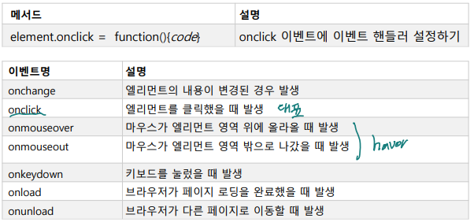

# DOM 이벤트

<br>

**이벤트 핸들러 추가하기**

  

-   전체 이벤트 보기
    -   https://www.w3schools.com/jsref/dom_obj_event.asp

<br>

**이벤트 사용하기**

```html
<!DOCTYPE html>
<html>
<body>
    
<h1 id="id1">My Heading 1</h1>
<button type="button" onclick="document.getElementById('id1').style.color = 'red'"> Click Me!</button>
    
</body>
</html>
```

<br>

**DOM 이벤트**

```html
<!DOCTYPE html>
<html>
<body>
    
<h1 onclick="this.innerHTML = 'Ooops!'">Click on this text!</h1>
    
</body>
</html>
```

>   JS code : 비권장 (html 문 안에 JS code)

<br>

```html
<p id="demo">목록 보기</p>
<ul id="item-list">
    <li class="list-item">item - 1</li>
    <li class="list-item">item - 2</li>
    <li class="list-item">item - 3</li>
    <li class="list-item">item - 4</li>
</ul>
<script>
    function click(e) {
        let target = e.target;
        console.log(target);
        target.style.color = 'red';
    }
    let items = document.getElementsByClassName("list-item")
    console.log(items)
    for(let i=0; i<items.length; i++) {
        items[i].onclick = click; // onclick 이벤트 핸들러 설정
    }
</script>
```

<br>

```html
<p id="demo">목록 보기</p>
<ul id="item-list">
    <li class="list-item">item - 1</li>
    <li class="list-item">item - 2</li>
    <li class="list-item">item - 3</li>
    <li class="list-item">item - 4</li>
</ul>
<script>
    let items = document.getElementsByClassName("list-item")
    console.log(items)
    for(let i=0; i<items.length; i++) {
        items[i].onclick = function(e) { // 익명 함수 배정
        let target = e.target;
        console.log(target);
        target.style.color = 'red';
        }
    }
</script>
```

<br>

```html
<p id="demo">목록 보기</p>
<ul id="item-list">
    ...
</ul>
<script>
    let items = document.getElementsByClassName("list-item")
    for(let item of items) {
        console.log(item);
        item.onclick = function(e) {
            let target = e.target;
            target.style.color = 'red';
        }
        item.onmouseover = function(e){
            let target = e.target;
            target.style.cursor = 'pointer';
        }
        item.onmouseout = function(e){
            let target = e.target;
            target.style.cursor = 'default';
        }
    }</script>
```

<br>

**onmouseover , onmouseout 이벤트**

```html
<!DOCTYPE html>
<html>
<body>
    
<div onmouseover="mOver(this)" onmouseout="mOut(this)"
style="background-color:#D94A38;width:120px;height:20px;padding:40px;"> Mouse Over Me</div>
    
<script>
function mOver(obj) {
    obj.innerHTML = "Thank You"
}
function mOut(obj) {
    obj.innerHTML = "Mouse Over Me"
}
</script>
    
</body>
</html> 
```

<br>

**onmousedown, onmouseup , onclick 이벤트**

```html
<!DOCTYPE html>
<html>
<body>
    
<div onmousedown="mDown(this)" onmouseup="mUp(this)"
style="background-color:#D94A38;width:90px;height:20px;padding:40px;">Click Me</div>
    
<script>
function mDown(obj) {
    obj.style.backgroundColor = "#1ec5e5";
    obj.innerHTML = "Release Me";
}
function mUp(obj) {
    obj.style.backgroundColor="#D94A38";
    obj.innerHTML="Thank You";
}
</script>
</body>
</html> 
```

<br>

**HTML DOM EventListener**

-   el.addEventListener(이벤트명, 이벤트 핸들러)
    -   지정한 이벤트명에 여러개의 이벤트 핸들러 함수를 등록할 수 있음
-   el.removeEventListner(이벤트명, 이벤트 핸들러)
    -   등록된 이벤트 핸들러 삭제

<br>

**addEventListener(이벤트명, 이벤트 핸들러)**

```html
<button id="myBtn">Try it</button>

<p id="demo"></p>

<script>
document.getElementById("myBtn").addEventListener("click", displayDate);
    
function displayDate() {
    document.getElementById("demo").innerHTML = Date();
}
</script>
```

<br>

**익명 구현 객체로 이벤트 핸들러 설정하기**

```html
<button id="myBtn">Try it</button>

<script>
document.getElementById("myBtn").addEventListener("click", function() {
    alert("Hello World!");
});
</script>
```

<br>

**여러 개의 이벤트 핸들러 등록하기**

```html
<button id="myBtn">Try it</button>

<script>
var x = document.getElementById("myBtn");
x.addEventListener("click", myFunction);
x.addEventListener("click", someOtherFunction);
function myFunction() {
    alert ("Hello World!");
}
    
function someOtherFunction() {
    alert ("This function was also executed!");
}
</script>
```

>   등록된 순서대로 호출

<br>

```html
<button id="myBtn">Try it</button>

<p id="demo"></p>

<script>
var x = document.getElementById("myBtn");
x.addEventListener("mouseover", myFunction);
x.addEventListener("click", mySecondFunction);
x.addEventListener("mouseout", myThirdFunction);
    
function myFunction() {
    document.getElementById("demo").innerHTML += "Moused over!<br>";
}
    
function mySecondFunction() {
    document.getElementById("demo").innerHTML += "Clicked!<br>";
}
    
function myThirdFunction() {
    document.getElementById("demo").innerHTML += "Moused out!<br>";
}
</script>
```

<br>

**윈도우 객체 이벤트 핸들러**

```html
<!DOCTYPE html>
<html>
<body>
<h2>JavaScript addEventListener()</h2>
<p>This example uses the addEventListener() method on the window object.</p>
<p>Try resizing this browser window to trigger the "resize" event handler.</p>
<p id="demo"></p>
    
<script>
window.addEventListener("resize", function(){
    document.getElementById("demo").innerHTML = Math.random();
});
</script>
    
</body>
</html>
```

<br>

**이벤트 버블링**

-   자식 엘리먼트 영역에서 발생한 이벤트를 부모 엘리먼트로 전파하는 것

**이벤트 캡처링**

-   자식 엘리먼트 영역 에서 발생한 이벤트를 부모 엘리먼트가 가로채서 자식 에게 전달하지 않는 것
-   addEventListener(이벤트명, 핸들러, useCapture)
    -   useCapture = false → 버블링
    -   useCaptuer = true → 캡처링

<br>

**이벤트 버블링, 캡처링**

```html
<!DOCTYPE html>
<html>
<head>
<style>
#myDiv1, #myDiv2 {
    background-color: coral;
    padding: 50px;
}
    
#myP1, #myP2 {
    background-color: white;
    font-size: 20px;
    border: 1px solid;
    padding: 20px; 
}
</style>
</head>
    
<body>
<h2>JavaScript addEventListener()</h2>
<div id="myDiv1">
    <h2>Bubbling:</h2>
    <p id="myP1">Click me!</p>
</div><br>
<div id="myDiv2">
    <h2>Capturing:</h2>
    <p id="myP2">Click me!</p>
</div>
    
<script>
document.getElementById("myP1").addEventListener("click", function() {
    alert("You clicked the white element!");
}, false);
    
document.getElementById("myDiv1").addEventListener("click", function() {
    alert("You clicked the orange element!");
}, false);
    
document.getElementById("myP2").addEventListener("click", function() {
    alert("You clicked the white element!");
}, true);
    
document.getElementById("myDiv2").addEventListener("click", function() {
    alert("You clicked the orange element!");
}, true);
</script>
</body>
</html>
```

<br>

**static/js/common.js**

```js
// 위임으로 이벤트 처리하기
HTMLElement.prototype.on = function (eventName, selector, handler){
    let self = this;
    
    self.addEventListener(eventName, function(e){
        elements = self.querySelectorAll(selector);
        let target = e.target;
        elements.forEach(item=>{
            if(item == target) {
                handler.call(target, e);
            }
        });
    });
}
HTMLCollection.prototype.on = function(eventName, handler) {
    let self = this;
    for(let el of self) {
        el.addEventListener(eventName, handler);
    }
}
HTMLCollection.prototype.off = function(eventName, handler) {
    let self = this;
    for(let el of self) {
        el.removeEventListener(eventName, handler);
    }
}
```

