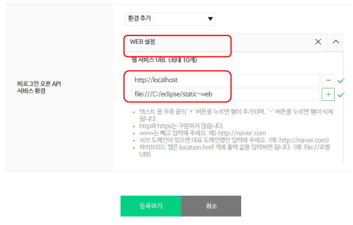
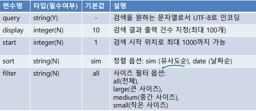

# 이미지 검색 API

>   get_context_data(): 안에 넣어주면 된다. 함수/객체

<br>

**https://developers.naver.com/main/**

-   개발자 가입
-   Documents > 서비스 API > 검색

<br>

**Application > 애플리케이션 등록**

  

<br>

**Application > 애플리케이션 등록**

  

<br>

**Client ID, Client Secret 확인**

-   애플리케이션 > 내 애플리케이션에서 확인 가능

  

<br>

**준비사항**

-   애플리케이션 등록
-   클라이언트 ID와 secret 확인
-   API 권한 설정
    -   '내 애플리케이션'의 'API 권한관리' 탭 --> 해당 API 체크 여부 확인
    -   체크되어 있지 않을 경우 403 에러(API 권한 없음)가 발생

**API 기본 정보**

-   GET https://openapi.naver.com/v1/search/image.xml XML
-   GET https://openapi.naver.com/v1/search/image JSON

<br>

**요청 변수**

  

<br>

**출력 결과**

  

<br>

**응답 결과**

```python
{
    "lastBuildDate": "Thu, 07 Mar 2019 10:09:30 +0900",
    "total": 4637078,
    "start": 1,
    "display": 10,
    "items": [
        {
            "title": "고화질 자동차 수퍼카 허머 컴퓨터바탕배경화면",
            "link": "http://...",
            "thumbnail": "http://...",
            "sizeheight": "800",
            "sizewidth": "1280"
        },
        :
    ]
}
```

<br>

**URL 요소 분석**

-   urllib.parse 모듈

  

<br>

**파일 경로 분석**

-   os.path 모듈

  

<br>

**naver_image_api.py**

```python
import requests
import os
# 네이버 검색 클라이언트 ID, Secret ID 헤더 설정
HEADERS = {
    "X-Naver-Client-Id" : "",
    "X-Naver-Client-Secret" : ""
}
# 검색 url
IMAGE_SEARCH_URL = "https://openapi.naver.com/v1/search/image"

def search_image(keyword) :
    # 검색 파라미터
    params = {
        "query" : keyword,
        "start" : 1
    }
    image_list = []
    
    res = requests.get(IMAGE_SEARCH_URL, headers=HEADERS, params=params)
    if res.status_code == 200 :
        image_list = res.json()
        
    return image_list
```

<br>

**image_search.py**

```python
import naver_image_api as ni
import urllib.parse as parse
import os

def main():
    image_list = ni.search_image("자동차")
    for ix, item in enumerate(image_list["items"]):
        title = item["title"] # 이미지 타이틀
        link = item["link"] # 이미지 링크
        info = parse.urlparse(link) # 이미지 링크 url 분석
        file_name = os.path.split(info.path)[1] # 이미지 파일명 추출
        print(ix, title, file_name, sep="::")
        print(f" {link}")

if __name__ == "__main__":
    main()
```

<br>

**naver_image_api.py**

```python
:
def download(link, file_name):
    res = requests.get(link)

    if res.status_code == 200:
        dest = os.path.join("c:/temp/download", file_name)
        with open(dest, 'wb') as f:
            f.write(res.content)
            print(f"저장완료 : {dest}")
```

<br>

**image_download.py**

```python
import naver_image as ni
import urllib.parse as parse
import os
def main():
    image_list = ni.search_image("자동차")
    for item in image_list["items"]:
        link = item["link"] # 이미지 링크
        info = parse.urlparse(link) # 이미지 링크 url 분석
        file_name = os.path.split(info.path)[1] # 이미지 파일명 추출
        ni.download(link, file_name)
        
if __name__ == "__main__":
    main()
```


<br>

<br>

<br>

<br>