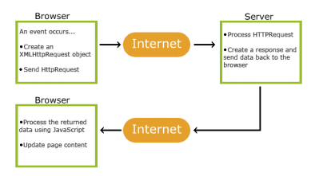
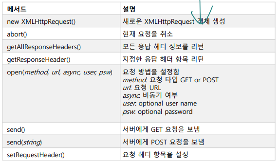
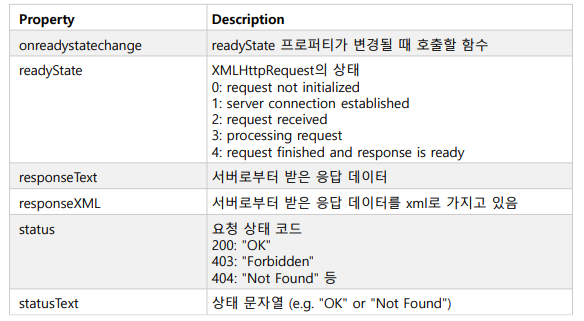
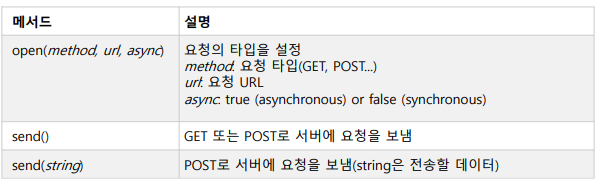
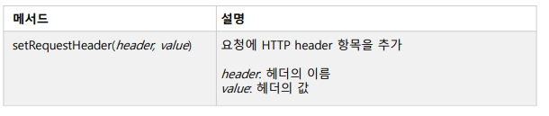
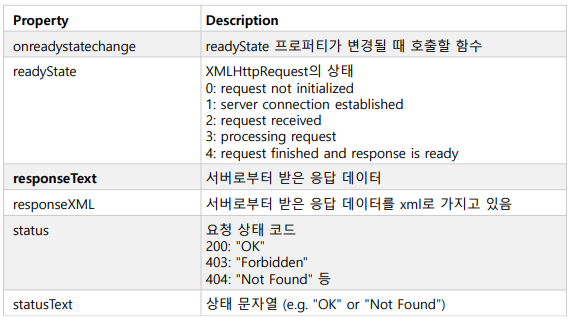

# Ajax

<br>

>   동기함수 : 호출했다가 리턴되면 이어서 실행 ex) input()
>
>   비동기함수 : 바로 리턴 ex> request GET

<br>

**Ajax(Asyncronous javascript and xml)**

  

>   현재 페이지 유지, 일부만 내용 변경 지원 ex) 지도, 댓글

<br>

**XMLHttpRequest**

-   Ajax를 지원하는 브라우저의 객체

<br>

/static/ajax_info.txt

```
Ajax 테스트 입니다.
```

<br>

/static/ajax_ex01.html

```html
<!DOCTYPE html>
<html>
<body>
<h2>The XMLHttpRequest Object</h2>
<p id="demo">Let AJAX change this text.</p>
<button type="button" onclick="loadDoc()">Change Content</button>
<script>
function loadDoc() {
    var xhttp = new XMLHttpRequest();
    xhttp.onreadystatechange = function() {
        if (this.readyState == 4 && this.status == 200) {
            document.getElementById("demo").innerHTML = this.responseText;
        }
    };
    xhttp.open("GET", "/static/ajax_info.txt", true);
    xhttp.send();
}
</script>
</body>
</html>
```

>   `xhttp.open("GET", "/static/ajax_info.txt", true);` : 비동기(False 동기)  
>
>   오버해드가 커서 라이브러리 쓰는게 좋다.

<br>

>   아래는 설명 X

<br>

**XMLHttpRequest Object Methods**

  

<br>

**XMLHttpRequest Object Properties**

  

<br>

**서버로 요청 보내기**

  

```html
<!DOCTYPE html>
<html>
<body>
<h2>The XMLHttpRequest Object</h2>
<button type="button" onclick="loadDoc()">Request data</button>
<p id="demo"></p>
<script>
function loadDoc() {
    var xhttp = new XMLHttpRequest();
    xhttp.onreadystatechange = function() {
        if (this.readyState == 4 && this.status == 200) {
            document.getElementById("demo").innerHTML = this.responseText;
        }
    };
    xhttp.open("POST", "demo_post.asp", true);
    xhttp.send();
}
</script>
</body>
</html>
```

<br>

**요청 헤더 설정**

  

```html
<!DOCTYPE html>
<html>
<body>
<h2>The XMLHttpRequest Object</h2>
<button type="button" onclick="loadDoc()">Request data</button>
<p id="demo"></p>
<script>
function loadDoc() {
    var xhttp = new XMLHttpRequest();
    xhttp.onreadystatechange = function() {
        if (this.readyState == 4 && this.status == 200) {
            document.getElementById("demo").innerHTML = this.responseText;
        }
    };
    xhttp.open("POST", "demo_post2", true);
    xhttp.setRequestHeader("Content-type", "application/x-www-form-urlencoded");
    xhttp.send("fname=Henry&lname=Ford");
}
</script>
</body>
</html>
```

<br>

**응답 처리하기**

  

```html
<!DOCTYPE html>
<html>
<body>
<div id="demo">
<h2>The XMLHttpRequest Object</h2>
<button type="button" onclick="loadDoc('ajax_info.txt', myFunction)">Change Content </button>
</div>

<script>
function loadDoc(url, cFunction) {
    var xhttp;
    xhttp=new XMLHttpRequest();
    xhttp.onreadystatechange = function() {
        if (this.readyState == 4 && this.status == 200) {
            cFunction(this);
        }
    };
    xhttp.open("GET", url, true);
    xhttp.send();
}
function myFunction(xhttp) {
    document.getElementById("demo").innerHTML = xhttp.responseText;
}
</script>
</body>
</html>
```

<br>

**응답 헤더 추출**

```html
<!DOCTYPE html>
<html>
<body>
<p id="demo"></p>
<script>
var xhttp = new XMLHttpRequest();
xhttp.onreadystatechange = function() {
    if (this.readyState == 4 && this.status == 200) {
        document.getElementById("demo").innerHTML =
            this.getAllResponseHeaders();
    }
};
xhttp.open("GET", "ajax_info.txt", true);
xhttp.send();
</script>
</body>
</html>
```

```html
<!DOCTYPE html>
<html>
<body>
<p>Last modified: <span id="demo"></span></p>
<script>
var xhttp=new XMLHttpRequest();
xhttp.onreadystatechange = function() {
    if (this.readyState == 4 && this.status == 200) {
        document.getElementById("demo").innerHTML =
            this.getResponseHeader("Last-Modified");
    }
};
xhttp.open("GET", "ajax_info.txt", true);
xhttp.send();
</script>
</body>
</html>
```

<br>