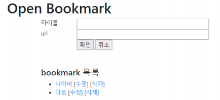

# REST 서비스

>   다른 머신의 데이터를 조작

<br>

### REST 서비스

<br>

**REST(Representational State Transfer)**

-   자원을 이름(자원의 표현)으로 구분하여 해당 자원의 상태(정보)를 주고 받는 모든 것을 의미
-   즉, 자원(resource)의 표현(representation)에 의한 상태 젂달
-   자원(resource)의 표현(representation)
    -   자원: 해당 소프트웨어가 관리하는 모든 것
        -   Ex) 문서, 그림, 데이터, 해당 소프트웨어 자체 등
    -   자원의 표현: 그 자원을 표현하기 위한 이름
        -   Ex) DB의 학생 정보가 자원일 때, ‘students’를 자원의 표현으로 정한다.
    -   상태(정보)
        -   전달데이터가 요청되어지는 시점에서 자원의 상태(정보)를 전달
        -   JSON 혹은 XML를 통해 데이터를 주고 받는 것이 일반적
-   네트워크 상에서 Client와 Server 사이의 통신 방식 중 하나

<br>

**REST 구성 요소**

-   자원(Resource) URI
    -   모든 자원에 고유핚 ID가 존재, 이 자원은 Server에 존재
    -   자원을 구별하는 ID는 '/groups/:group_id'와 같은 HTTP URI
    -   Client는 URI를 이용해서 자원을 지정하고 해당 자원의 상태(정보)에 대핚 조작 을 Server에 요청
-   행위(Verb)
    -   HTTP MethodHTTP 프로토콜의 Method를 사용
        -   GET, POST, PUT, DELETE 등
-   표현(Representation of Resource)
    -   Client가 자원의 상태(정보)에 대해 조작 요청시 Server는 이에 적젃핚 응답 (Representation)을 내보냄
    -   표현 방식
        -   JSON, XML, TEXT, RSS 등
    -   JSON을 통해 데이터를 주고 받는 것이 일반적임

<br>

**REST 표현 방식**

-   자원명 : bookmark
    -   기본 URL: /api/bookmark
    -   목록 요청: GET /api/bookmark
    -   단일 항목 요청: GET /api/bookmark/2
    -   생성: POST /api/bookmark
    -   수정: PUT /api/bookmark/2
    -   삭제: DELETE /api/bookmark/2

>   CRUD를 http 프로토콜의 메서드 이용

<br>

**REST API**

-   REST기반으로 서비스 API를 구현핚 것
    -   REST URI(Verbose)를 처리하는 View에서 REST 표현을 해석하고 처리
    -   응답 시 Json으로 응답
-   OpenAPI(구글 맵, 공공 데이터 등) 제공시 REST API를 제공

<br>

<br>

### Django로 rest api 만들기

**api 앱 생성**

-   `python mange.py startapp api`

<br>

**mysite/settings.py**

```python
INSTALLED_APPS = [
    :
    'api.apps.ApiConfig'
]
```

<br>

**api/models.py**

```python
from django.db import models

class OpenBookmark(models.Model):
    title = models.CharField('TITLE', max_length=100, blank=True)
    url = models.URLField('URL', unique=True)
    
    def __str__(self):
        return self.title
```

>   migrate

<br>

**api/views.py**

```python
from django.views.generic import View
from django.views.decorators.csrf import csrf_exempt
from django.utils.decorators import method_decorator
from django.http import JsonResponse
from django.forms.models import model_to_dict
import json

from api.models import OpenBookmark

class BaseApiView(View):
    @method_decorator(csrf_exempt)
    def dispatch(self, request, *args, **kwargs):
        return super().dispatch(request, *args, **kwargs)
    
class BookmarkApi(BaseApiView):
    def get(self, request, id=None):
        if id : # 단일 항목 요청
            bookmark = OpenBookmark.objects.get(id=id)
            data = model_to_dict(bookmark)
            return JsonResponse(data)
        else : # 목록 요청
            datas = list(map(model_to_dict, OpenBookmark.objects.all()))
            return JsonResponse({"datas" : datas})
    def post(self, request):
        json_data = json.loads(request.body.decode("utf-8"))
        print(json_data)
        bookmark = OpenBookmark(**json_data)
        bookmark.save()
        data = model_to_dict(bookmark)
        return JsonResponse(data)
        
    def put(self, request, id):
        bookmark = OpenBookmark.objects.get(id=id)
        json_data = json.loads(request.body.decode("utf-8"))
        bookmark.title = json_data["title"]
        bookmark.url = json_data["url"]
        bookmark.save()
        data = model_to_dict(bookmark)
        return JsonResponse(data)
        
    def delete(self, request, id):
        bookmark = OpenBookmark.objects.get(id=id)
        bookmark.delete()
        return JsonResponse({"result": "OK"})
```

<br>

**api/urls.py**

```python
from django.urls import path, re_path
from api.views import *

urlpatterns = [
    path('bookmark', BookmarkApi.as_view()),
    path('bookmark/<int:id>', BookmarkApi.as_view()),
]
```

<br>

**mysite/urls.py**

```python
urlpatterns = [
    :
    path('api/', include('api.urls')),
]
```

<br>

**httpie로 rest api 호출하기**

-   http [flags] [METHOD] URL [ITEM [ITEM]]

    -   ITEM  

        -   이름==값  
            쿼리 파라미터로 URL뒤에 ?로 연결   
        -   이름=값  
            POST/PUT의 파라미터로 BODY에 저장되어 전달   
            값 부분이 따움표로 묶임   
        -   이름:=값  
            값 부분을 따움표로 묶지 않음

    -   디폴트로 Json 형식으로 요청

        -   --json 이 디폴트  

          

    -   목록 요청

        -   http -v GET http://127.0.0.1:8000/api/bookmark

    -   단일 항목 요청

        -   http -v GET http://127.0.0.1:8000/api/bookmark/1

    -   생성

        -   http -v POST http://127.0.0.1:8000/api/bookmark title="test" url="http://daum2.net" owner:=1

    -   수정

        -   http -v PUT http://127.0.0.1:8000/api/bookmark/13 title="test2" url="http://daum2.net"

    -   삭제

        -   http -v DELETE http://127.0.0.1:8000/api/bookmark/13

<br>

<br>

### Javascript로 rest api 호출

**Ajax 기술로 Rest api 호출**

  

-   axios 라이브러리 활용 
    -   https://github.com/axios/axios
-   CDN
    -   \<script src="https://unpkg.com/axios/dist/axios.min.js">\</script>
-   주요 메서드
    -   axios.request(config) 
    -   axios.get(url[, config]) 
    -   axios.delete(url[, config]) 
    -   axios.head(url[, config]) 
    -   axios.options(url[, config]) 
    -   axios.post(url[, data[, config]]) 
    -   axios.put(url[, data[, config]]) 
    -   axios.patch(url[, data[, config]])

<br>

**axios 메서드 형식**

-   axios.메서드()

```
.then(res=>{ // 호출 성공 시 호출핛 함수
 // res.data에 서버 응답 내용이 저장되어 있음
})
.catch(e=>{ // 호출 실패 시 실행핛 함수
});
```

<br>

**static/openbookmark.html**

```html
<!DOCTYPE html>
<html lang="en">
<head>
<meta charset="UTF-8">
<title>Title</title>
<link rel="stylesheet" href="https://stackpath.bootstrapcdn.com/bootstrap/4.3.1/css/bootstrap.min.css" >
</head>
    
<body>
<div>
    <h1>Open Bookmark</h1>
    <div class="w-75 mx-auto">
        <form id="frm">
            <input type="hidden" name="id" id="item-id">
            <div class="row">
                <div class="col-sm-2">타이틀</div>
                <div class="col-sm-8">
                    <input type="text" name="title" class="w-100">
                </div>
            </div>
            <div class="row">
                <div class="col-sm-2">url</div>
                <div class="col-sm-8">
                    <input type="text" name="url" class="w-100">
                </div>
            </div>
            <div class="row">
                <div class="col-sm-2"></div>
                <div class="col-sm-8">
                    <input type="button" id="submit-btn" value="확인">
                    <input type="button" id="reset-btn" value="취소">
                </div>
            </div>
        </form>
        <div class="my-5">
            <h4>bookmark 목록</h4>
            <ul id="bookmark-list"></ul>
        </div>
    </div>
</div>
</body>

<script src="https://unpkg.com/axios/dist/axios.min.js"></script>
<script src="/static/js/common.js"></script>
<script src="/static/js/openbookmark.js"></script>
</html>
```

<br>

**static/js/common.js**

```js
// 이벤트 처리 위임
HTMLElement.prototype.on = function (eventName, selector, handler){
    let self = this;
    self.addEventListener(eventName, function(e){
        elements = self.querySelectorAll(selector);
        let target = e.target;
        elements.forEach(item=>{
            if(item == target) {
                handler.call(target, e);
            }
        });
    });
}
```

<br>

**static/js/openbookmark.js**

```js
// 전역변수

// form
let frm = document.forms["frm"];
// 버튼들
let addBtn = document.getElementById("submit-btn");
let resetBtn = document.getElementById("reset-btn");
// 북마크 리스트
let bookmarkList = document.getElementById("bookmark-list");
// form reset
function reset() {
    frm.elements.namedItem("id").value = ''
    frm.elements.namedItem("title").value = '';
    frm.elements.namedItem("url").value = '';
}
// 취소 버튼 핸들러 등록
resetBtn.addEventListener("click", reset);


// 초기 목록 구축

// DOM에 새로운 bookmark 정보 추가
function addItem(bookmark) {
    let templ = '
        <a href="${bookmark.url}" class="bookmark-link">${bookmark.title}</a>
        [<a href="#" class="edit-btn">수정</a>]
        [<a href="#" class="delete-btn">삭제</a>]
    ';
    let el = document.createElement('li');
    el.dataset.itemId = bookmark.id;
    el.classList.add("list-item");
    el.innerHTML = templ;
    bookmarkList.appendChild(el);
}
// 초기 목록 얻기
axios.get("http://127.0.0.1:8000/api/bookmark")
.then(res=>{
    res.data.datas.forEach(item=>addItem(item));
}).catch(e=>console.log(e));


// 추가하기

// 폼 입력 확인
function check_frm() {
    let title = frm.elements.namedItem("title").value;
    if(!title) return alert("title을 입력하세요");
    let url = frm.elements.namedItem("url").value;
    if(!url) return alert("url을 입력하세요");
    return { title, url };
}

// 확인 버튼 핸들러 등록: itemId가 없으면 추가, 있으면 수정
addBtn.addEventListener("click", event=>{
    let itemId = frm.elements.namedItem("id").value.trim();
    data = check_frm();
    if(!data) return;
    if(!itemId) {// 추가
        axios.post("http://127.0.0.1:8000/api/bookmark", data)
            .then(res=>{
            addItem(res.data);
            reset();
        }).catch(e=>console.log(e));
    } else { // 수정
        // 추후 구현
    }
});


// 수정

// 수정 - 클릭핚 아이템을 수정 화면으로 설정
bookmarkList.on("click", ".edit-btn", function(e){
    let el = this.closest(".list-item");
    let itemId = el.dataset.itemId;
    let bookmark = el.getElementsByClassName("bookmark-link")[0];
    let title = bookmark.innerHTML;
    let url = bookmark.href;
    frm.elements.namedItem("id").value = itemId
    frm.elements.namedItem("title").value = title;
    frm.elements.namedItem("url").value = url;
});
// 지정한 bookmark id의 <a> 엘리턴트를 찾아 리턴
function findItem(id) {
    let items = bookmarkList.getElementsByClassName("bookmark-link");
    let length = items.length;
    for(let i = 0; i<length; i++) {
        if( items[i].parentNode.dataset.itemId == id)
            return items[i];
    }
}
// 수신한 수정된 bookmark 정보 갱신
function updateItem(bookmark){
    let el = findItem(bookmark.id);
    if(el) {
        el.href = bookmark.url;
        el.innerHTML = bookmark.title;
    }
}
// 확인 버튼 핸들러 등록: itemId가 없으면 추가, 있으면 수정
addBtn.addEventListener("click", event=>{
    let itemId = frm.elements.namedItem("id").value.trim();
    data = check_frm();
    if(!data) return;
    if(!itemId) {// 추가
        axios.post("http://127.0.0.1:8000/api/bookmark", data)
        .then(res=>{
            addItem(res.data);
            reset();
        }).catch(e=>console.log(e));
    } else { // 수정
        axios.put('http://127.0.0.1:8000/api/bookmark/${itemId}', data)
        .then(res=>{
            updateItem(res.data);
            reset();
        }).catch(e=>console.log(e));
    } else {}
});


// 삭제

// bookmark 삭제
bookmarkList.on("click", ".delete-btn", function(e){
    if(!confirm("삭제하겠습니까?")) return;
    
    let el = this.closest(".list-item");
    let itemId = el.dataset.itemId;
    
    axios.delete('http://127.0.0.1:8000/api/bookmark/${itemId}')
    .then(res=>el.remove())
    .catch(e=>console.log(e));
});
```

<br>

