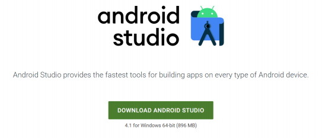
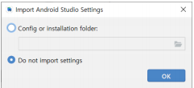
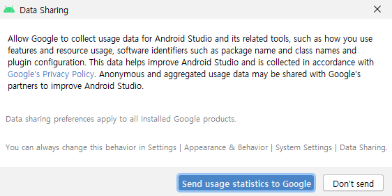
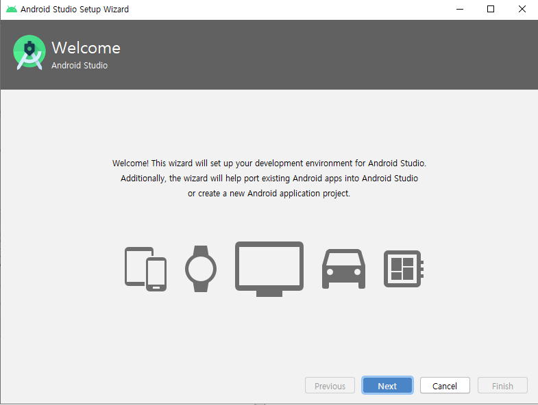
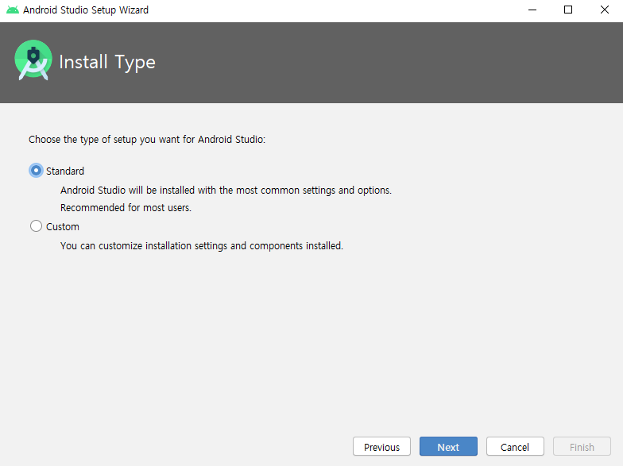
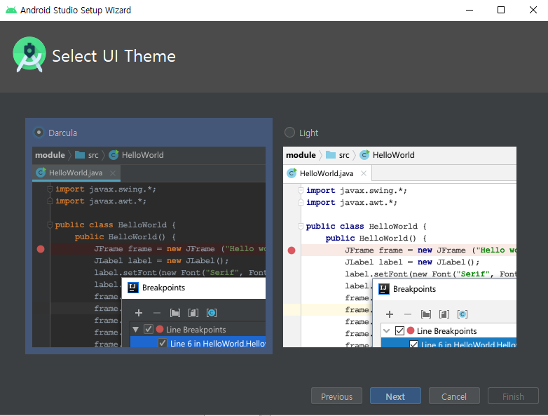
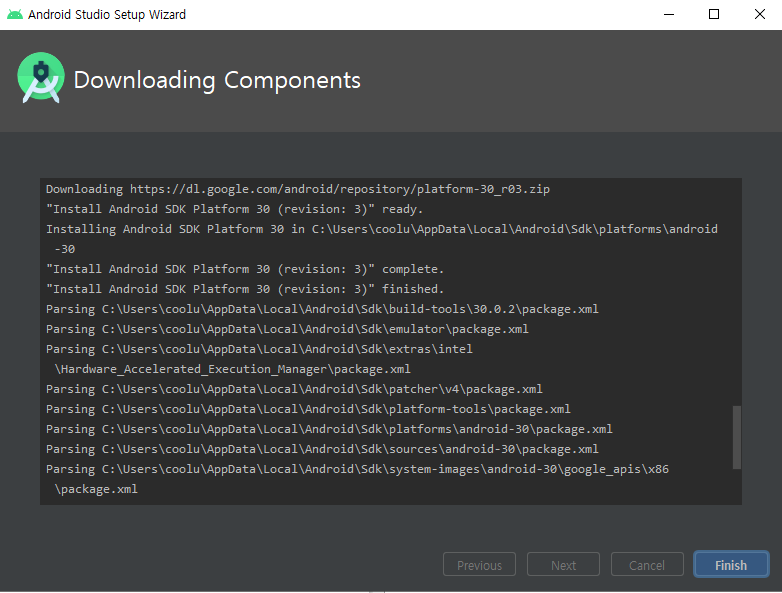

# 개발환경 구축

**Android Studio**

-   https://developer.android.com/studio

  

디폴트 설치

 

**실행**

  

`Do not import settings` > `OK`

 

  

`Don't send`

 

  

`Next`

 

  

`Standard` > `Next`

 

  

 

  

`Finish`

 

  

`Finish`

 

안드로이드폰 > 설정 > 휴대전화 정보 > 소프트웨어 정보 > 안드로이드 버전 : `10`

Android 10 API 버전 : `API level 29`

  