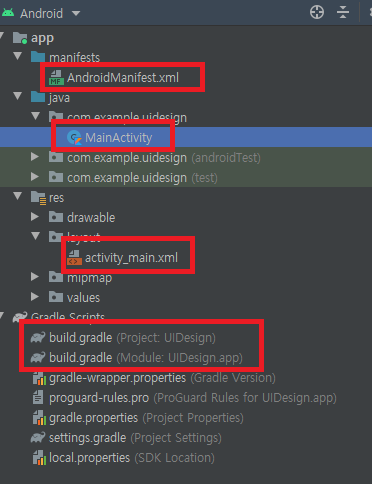
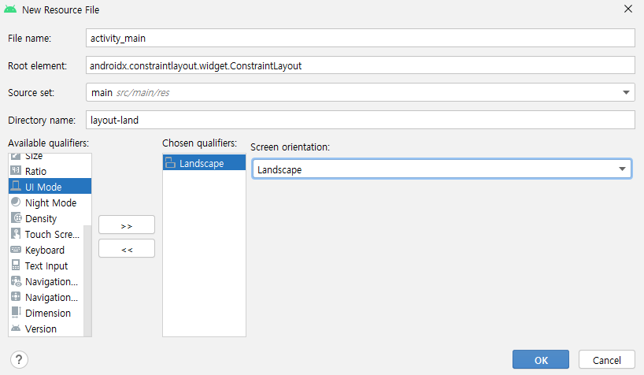

# 화면 디자인

### 첫 번째 프로젝트 만들기

**프로젝트 생성**

  

`Crate New Project`

<br>

  

`Empth Activity` > `Next`

<br>

  

Name : `UIDesign`

Minimum SDK : `API 21 : Android 5.0 (Lolipop)`

`Finish`

<br>

[cf] 최초 구성 시 관련 파일 다운로드로 시간이 다소 걸림 아래 상태바에서 진척도 확인

  

>   Gradle ≒ pip

<br>

[참고] 세계 안드로이드 버전 점유율

  

<br>

안드로이드 폰 > `설정` > `개발자 옵션` > `USB 디버깅`, `USB를 통해 설치된 앱 확인` 활성화

<br>

<br>

**주요 파일 구성**

-   AndroidManifest.xml
    -   앱 명세서
    -   권한 등록, 구성요소 등록
-   소스
    -   프로그램 소스
        -   코틀린, 자바 등의 파일
    -   리소스 소스
        -   그림, 화면 레이아웃 xml 등의 파일
    -   Gradle
        -   프로젝트 설정
        -   외부 라이브러리 의존성 관리

  

<br>

**AndroidManifest.xml**

```xml
<?xml version="1.0" encoding="utf-8"?>
<manifest xmlns:android="http://schemas.android.com/apk/res/android"
    package="com.example.uidesign">

    <application
        android:allowBackup="true"
        android:icon="@mipmap/ic_launcher"
        android:label="@string/app_name"
        android:roundIcon="@mipmap/ic_launcher_round"
        android:supportsRtl="true"
        android:theme="@style/Theme.UIDesign">
        <activity android:name=".MainActivity">
            <intent-filter>
                <action android:name="android.intent.action.MAIN" />

                <category android:name="android.intent.category.LAUNCHER" />
            </intent-filter>
        </activity>
    </application>

</manifest>
```

<br>

**MainActivity.kt**

```kotlin
package com.example.uidesign

import androidx.appcompat.app.AppCompatActivity
import android.os.Bundle

class MainActivity : AppCompatActivity() {
    override fun onCreate(savedInstanceState: Bundle?) {
        super.onCreate(savedInstanceState)
        setContentView(R.layout.activity_main)
    }
}
```

>   `setContentView(R.layout.activity_main)` : layout을 여러개 지정할 수 있다.

<br>

<br>

### 화면 디자인

**res/layout/activity_main.xml**

   

```xml
<?xml version="1.0" encoding="utf-8"?>
<androidx.constraintlayout.widget.ConstraintLayout xmlns:android="http://schemas.android.com/apk/res/android"
    xmlns:app="http://schemas.android.com/apk/res-auto"
    xmlns:tools="http://schemas.android.com/tools"
    android:layout_width="match_parent"
    android:layout_height="match_parent"
    tools:context=".MainActivity">

    <TextView
        android:layout_width="wrap_content"
        android:layout_height="wrap_content"
        android:text="Hello World!"
        app:layout_constraintBottom_toBottomOf="parent"
        app:layout_constraintLeft_toLeftOf="parent"
        app:layout_constraintRight_toRightOf="parent"
        app:layout_constraintTop_toTopOf="parent" />

</androidx.constraintlayout.widget.ConstraintLayout>
```

<br>

**실행**

안드로이드 폰 USB 연결 - USB 디버깅 허용

  

Android Studio

`samsung SM-G965N`  : 핸드폰 `UIDesing` 앱 설치

`Pixel_3a_API_30_x86`  : 애뮬레이터 실행

  

<br>

**레이아웃 관리자**

-   ConstraintLayout
    -   각 컴포넌트간의 제약조건에 따른 위치 배정
    -   디폴트 레이아웃
-   LinearLayout
    -   한쪽 방향 으로만 배치하는 레이아웃
-   RelativeLayout
    -   기준 컴포넌트에 대한 상대 위치로 배치
-   FrameLayout
    -   겹침이 가능한 레이아웃
-   TableLayout
-   GridLayout …

<br>

**뷰 컴포넌트**

-   화면에 나타나는 개별 요소 객체 
-   View 클래스
    -   모든 뷰 컴포넌트의 최상위 부모
-   주요 속성
    -   android:id 
        -   뷰 컴포넌트의 ID
        -   프로그램에서 ID를 이용해 뷰 접근
    -   android:layout_width 
    -   android:layout_height
        -   뷰의 폭과 높이
        -   wrap_content : 내용물의 크기에 맞춤
        -   match_parent : 부모 컴포넌트의 크기에 맞춤 
        -   0dp : 허용된 제약조건에 맞춤
        -   절대값
    -    android:text 
        -   출력할 문자열
-   수정은 GUI에서 또는 code에서 직접 수정

<br>

**TextView의 ID 설정**

-   TextView 선택 후 id 항목 입력

      

```xml
:
    <TextView
        android:id="@+id/txtNormal"
        android:layout_width="wrap_content"
        android:layout_height="wrap_content"
        android:text="Hello World!"
              :
```

<br>

<br>

### **Button**

-   클릭할 수 있는 뷰 컴포넌트
-   click 이벤트 처리 가능
    -   액티비티에서 click 이벤트를 처리하도록 함

<br>

-   실습 : 기존 TextVeiw를 삭제하고 Button을 추가  

    

<br>

-   실습 : id 배정 및 제약조건 설정

      

<br>

-   실습 : 크기 설정, text 속성 설정

      

<br>

-   실습 : 텍스트 색상, 배경 색상 지정

    -   color 속성 검색 후 설정

      

<br>

-   실습 : 텍스트 색상, 배경 색상 지정

    -   color 속성 검색 후 설정

      

```xml
android:backgroundTint="#AE9393"
android:textColor="#FF0000"
```

<br>

**res/layout/activity_main.xml**

```xml
:
    <Button
        android:id="@+id/btnClick"
        android:layout_width="0dp"
        android:layout_height="wrap_content"
        android:layout_marginStart="8dp"
        android:layout_marginTop="8dp"
        android:layout_marginEnd="8dp"
        android:layout_marginBottom="8dp"
        android:backgroundTint="#AE9393"
        android:text="Click"
        android:textColor="#FF0000"
        app:layout_constraintBottom_toBottomOf="parent"
        app:layout_constraintEnd_toEndOf="parent"
        app:layout_constraintStart_toStartOf="parent"
        app:layout_constraintTop_toTopOf="parent" />
</androidx.constraintlayout.widget.ConstraintLayout>
```

<br>

<br>

### TextView

**실습: TextView 글자 크기 설정**

-   `android:textAppearance="@style/TextAppearance.AppCompat.Large"`

      

<br>

**EditText**

-   글자 입력을 위한 뷰 컴포넌트

      

<br>

-   inputType : 어떤 종류의 글자를 입력할 지 지정
    -   email, number, textPassword 등
-   hint
    -   사용자가 입력전에 출력할 문자열
    -   사용자가 입력시작하면 사라짐
    -   html의 placeholder와 동일
-   ems
    -   layout_widht가 wrap_content일 경우 글자 입력전이라 크기 결정 못함
    -   지정한 글자 수의 크기만큼 폭을 가짐
-   maxLength
    -   최대 입력 가능한 문자수
-   lines
    -   화면에 보여줄 라인 수

<br>

<br>

### ImageView

>   이미지 res/mipmap 에 넣는다.

-   `Component Search`에서 검색

      

<br>

-   drop 하는 순간 연결할 이미지 선택 대화 상자 출력 ImageView

      

<br>

-   이미지 선택 후 설정되는 속성

    -   `tools:srcCompat="@tools:sample/avatars"`
    -   추후 변경 가능

-   scaleType 속성

    -   ImageView와 실제그림의 크기 차이가 발생할 때 어떻게 보여줄지 결정
        -   그림의 확대/축소/자르기 결정

      

<br>

<br>

### 실습

    

```xml
:
    <TextView
        android:id="@+id/textView2"
        android:layout_width="wrap_content"
        android:layout_height="wrap_content"
        android:layout_marginStart="8dp"
        android:layout_marginTop="64dp"
        android:text="사용자 ID"
        android:textAppearance="@style/TextAppearance.AppCompat.Medium"
        app:layout_constraintStart_toStartOf="parent"
        app:layout_constraintTop_toTopOf="parent" />

    <EditText
        android:id="@+id/editTextTextPersonName"
        android:layout_width="0dp"
        android:layout_height="wrap_content"
        android:layout_marginStart="8dp"
        android:layout_marginEnd="8dp"
        android:ems="10"
        android:inputType="textPersonName"
        android:text="Name"
        app:layout_constraintBaseline_toBaselineOf="@+id/textView2"
        app:layout_constraintEnd_toEndOf="parent"
        app:layout_constraintHorizontal_bias="1.0"
        app:layout_constraintStart_toEndOf="@+id/textView2" />

    <TextView
        android:id="@+id/textView3"
        android:layout_width="wrap_content"
        android:layout_height="wrap_content"
        android:layout_marginStart="8dp"
        android:layout_marginTop="32dp"
        android:text="비밀번호"
        android:textAppearance="@style/TextAppearance.AppCompat.Medium"
        app:layout_constraintStart_toStartOf="parent"
        app:layout_constraintTop_toBottomOf="@+id/textView2" />

    <EditText
        android:id="@+id/editTextTextPassword2"
        android:layout_width="0dp"
        android:layout_height="wrap_content"
        android:layout_marginStart="8dp"
        android:layout_marginTop="110dp"
        android:layout_marginEnd="8dp"
        android:layout_marginBottom="227dp"
        android:ems="10"
        android:inputType="textPassword"
        app:layout_constraintBottom_toTopOf="@+id/imageView3"
        app:layout_constraintEnd_toEndOf="parent"
        app:layout_constraintHorizontal_bias="0.0"
        app:layout_constraintStart_toEndOf="@+id/textView3"
        app:layout_constraintTop_toTopOf="parent" />

    <Button
        android:id="@+id/button7"
        android:layout_width="0dp"
        android:layout_height="wrap_content"
        android:layout_marginStart="8dp"
        android:layout_marginTop="32dp"
        android:layout_marginEnd="8dp"
        android:text="확인"
        app:layout_constraintEnd_toStartOf="@+id/button9"
        app:layout_constraintStart_toStartOf="parent"
        app:layout_constraintTop_toBottomOf="@+id/editTextTextPassword2" />

    <Button
        android:id="@+id/button9"
        android:layout_width="0dp"
        android:layout_height="wrap_content"
        android:layout_marginStart="8dp"
        android:layout_marginTop="32dp"
        android:layout_marginEnd="8dp"
        android:text="취소"
        app:layout_constraintEnd_toEndOf="parent"
        app:layout_constraintStart_toEndOf="@+id/button7"
        app:layout_constraintTop_toBottomOf="@+id/editTextTextPassword2" />

    <ImageView
        android:id="@+id/imageView3"
        android:layout_width="0dp"
        android:layout_height="0dp"
        android:scaleType="fitCenter"
        app:layout_constraintBottom_toBottomOf="parent"
        app:layout_constraintEnd_toEndOf="parent"
        app:layout_constraintStart_toStartOf="parent"
        app:layout_constraintTop_toBottomOf="@+id/editTextTextPassword2"
        app:srcCompat="@mipmap/moon" />
:
```

>   **수평선 맞추기** : 우클릭 > Show Baseline > Drag&Drop
>
>   **버튼 폭 맞추기** : 서로 제약, layout_width : 0dp

---

<br>

**가로모드 layout 적용하기**

-   `layout` 우클릭 > `new` > `Layout Resource File`

-   File name : `activity_main`

-   `orientation` > `Landscape`

   

<br>

-   모드 : Project Files → 물리적인 저장공간 확인

  

<br>

-   방향에 따라 자동 설정

  

<br>

<br>

### LinearLayout

-   컴포넌트를 한쪽 방향으로만 배치
  
    
    -   orientation 속성으로 결정
        -   horizontal : 가로 방향
    -   vertical: 세로 방향
    
      

<br>

```xml
<?xml version="1.0" encoding="utf-8"?>
<LinearLayout
    xmlns:android="http://schemas.android.com/apk/res/android"
    xmlns:app="http://schemas.android.com/apk/res-auto"
    xmlns:tools="http://schemas.android.com/tools"
    android:layout_width="match_parent"
    android:layout_height="match_parent"
    android:orientation="horizontal"
    tools:context=".MainActivity">
</LinearLayout>
```

<br>

-   `android:orientation="horizontal"`

      

<br>

-   `android:orientation="vertical"`

      

<br>

**LinearLayout의 자식 뷰 속성**

-   `android:layout_weight`
-   `layout_width` 또는 `layout_height`가 `0dp`여야 함
-   비율에 맞춰 크기를 결정

<br>

### 실습

LinearLayout 이용

  

activity_main.xml

```xml
<?xml version="1.0" encoding="utf-8"?>
<LinearLayout xmlns:android="http://schemas.android.com/apk/res/android"
    xmlns:app="http://schemas.android.com/apk/res-auto"
    xmlns:tools="http://schemas.android.com/tools"
    android:layout_width="match_parent"
    android:layout_height="match_parent"
    android:orientation="vertical"
    tools:context=".MainActivity">

    <LinearLayout
        android:layout_width="match_parent"
        android:layout_height="wrap_content"
        android:orientation="horizontal">
        <TextView
            android:layout_width="0dp"
            android:layout_height="wrap_content"
            android:layout_weight="1"
            android:textSize="22sp"
            android:text="이름" />

        <EditText
            android:layout_width="0dp"
            android:layout_height="wrap_content"
            android:layout_weight="2"
            android:ems="10"
            android:inputType="textPersonName"
            android:textSize="22sp"/>
    </LinearLayout>

    <LinearLayout
        android:layout_width="match_parent"
        android:layout_height="wrap_content"
        android:orientation="horizontal">

        <TextView
            android:layout_width="0dp"
            android:layout_height="wrap_content"
            android:layout_weight="1"
            android:textSize="22sp"
            android:text="비밀번호" />
        <EditText
            android:layout_width="0dp"
            android:layout_height="wrap_content"
            android:layout_weight="2"
            android:ems="10"
            android:inputType="textPassword"
            android:textSize="22sp"/>
    </LinearLayout>

    <Button
        android:id="@+id/button5"
        android:layout_width="match_parent"
        android:layout_height="wrap_content"
        android:layout_marginTop="50dp"
        android:textSize="22sp"
        android:text="로그인" />
</LinearLayout>
```

<br>

<br>

### Gradle 정보

  

<br>

<br>