# 프로그램 기본

<br>

### TextView 활용

**프로젝트 생성**

-   File > New > New Project …
-   유형: Empty Activity

-   Project Name: basic_1_usingxml

<br>

**res/layout/activity_main.xml**

```xml
<?xml version="1.0" encoding="utf-8"?>
<androidx.constraintlayout.widget.ConstraintLayout
    xmlns:android="http://schemas.android.com/apk/res/android"
    xmlns:app="http://schemas.android.com/apk/res-auto"
    xmlns:tools="http://schemas.android.com/tools"
    android:layout_width="match_parent"
    android:layout_height="match_parent"
    tools:context=".MainActivity">
    
    <TextView
        android:id="@+id/txtHello"
        android:layout_width="wrap_content"
        android:layout_height="wrap_content"
        android:text="Hello World!"
        app:layout_constraintBottom_toBottomOf="parent"
        app:layout_constraintLeft_toLeftOf="parent"
        app:layout_constraintRight_toRightOf="parent"
        app:layout_constraintTop_toTopOf="parent" />
    
</androidx.constraintlayout.widget.ConstraintLayout>
```

<br>

**액티비티에서 뷰 컴포넌트 제어하기**

-   뷰에 대한 참조가 필요

    `findViewById<뷰클래스>(뷰 ID)`

    -   뷰 ID 지정방식

        `R.<리소스유형>.<뷰 ID>`

-   뷰의 속성 변경

    `뷰참조.속성 = 속성값`

<br>

**자동 import**

`build.gradle(Module)` > `id 'kotlin-android-extensions'` 추가 > `Sync Now`

>   새로운 프로젝트 만들 때 기억하자!

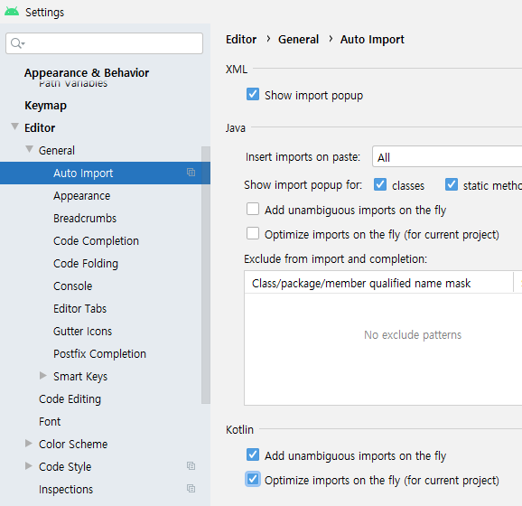  

-   `Setting` > `Editor` > `General` > `Kotlin` > `2가지 체크`

<br>

<br>

### Button 활용

**프로젝트 생성**

-   File > New > New Project …
-   유형: Empty Activity
-   Project Name: basic_1_button

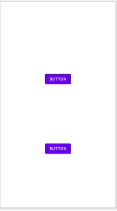  

<br>

**res/layout/activity_main.xml**

```xml
<?xml version="1.0" encoding="utf-8"?>
<androidx.constraintlayout.widget.ConstraintLayout …>
    
    <Button
        android:id="@+id/btn1"
        android:text="button1" …>
    <Button
        android:id="@+id/btn2"
        android:text="button2" …>
    
</androidx.constraintlayout.widget.ConstraintLayout>
```

<br>

**버튼 클릭 이벤트 처리**

-   View.setOnClickListener(핸들러)로 버튼 클릭 시 실행할 코드 작성

-   자바 스타일

    ```java
    btn1.setOnClickListener(
        View.OnClickListener(){
        	// 코드 작성
        }
    )
    ```

-   코틀린 스타일  ☆

    ```kotlin
    btn2.setOnClickListener {
        btn2.apply{
        	// 코드 작성
        }
    }
    ```

-   핸들러는 이벤트가 발생한 뷰 객체 참조를 매개변수로 가짐

    -   it으로 접근 가능

<br>

**MainActivity.kt**

```kotlin
package com.example.basic_1_button

import android.graphics.Color
import androidx.appcompat.app.AppCompatActivity
import android.os.Bundle
import android.widget.Button

class MainActivity : AppCompatActivity() {
    override fun onCreate(savedInstanceState: Bundle?) {
        super.onCreate(savedInstanceState)
        setContentView(R.layout.activity_main)

        var btn2 = findViewById<Button>(R.id.btn2)
        // ID값으로 Control 변수를 사용. kotlin style
        btn2.setOnClickListener {
            btn2.apply{
                text = "Click~~!!"
                setTextColor(Color.parseColor("#333333"))
                setBackgroundColor(Color.parseColor("#FFFF33"))
            }
        }
    }
}
```

>   apply : this를 호출한 인스턴스로 바꿔준다.

<br>

<br>

### TextView 활용

**프로젝트 생성**

-   File > New > New Project …
-   유형: Empty Activity
-   Project Name: basic_1_textview

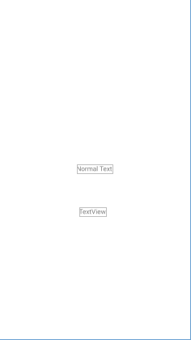  

<br>

**res/layout/activity_main.xml**

```xml
<?xml version="1.0" encoding="utf-8"?>
<androidx.constraintlayout.widget.ConstraintLayout xmlns:android="http://schemas.android.com/apk/res/android"
    xmlns:app="http://schemas.android.com/apk/res-auto"
    xmlns:tools="http://schemas.android.com/tools"
    android:layout_width="match_parent"
    android:layout_height="match_parent"
    tools:context=".MainActivity">

    <TextView
        android:id="@+id/txtNormal"
        android:layout_width="wrap_content"
        android:layout_height="wrap_content"
        android:text="Normal Text"
        app:layout_constraintBottom_toBottomOf="parent"
        app:layout_constraintLeft_toLeftOf="parent"
        app:layout_constraintRight_toRightOf="parent"
        app:layout_constraintTop_toTopOf="parent" />

    <TextView
        android:id="@+id/txtHTML"
        android:layout_width="wrap_content"
        android:layout_height="wrap_content"
        android:text="TextView"
        tools:layout_editor_absoluteX="173dp"
        tools:layout_editor_absoluteY="448dp" />

</androidx.constraintlayout.widget.ConstraintLayout>
```

<br>

**MainActivity.kt**

```kotlin
package com.example.basic_1_textview

import android.graphics.Color
import androidx.appcompat.app.AppCompatActivity
import android.os.Bundle
import android.text.Html
import android.widget.TextView

class MainActivity : AppCompatActivity() {

    var nCount : Int = 0

    override fun onCreate(savedInstanceState: Bundle?) {
        super.onCreate(savedInstanceState)
        setContentView(R.layout.activity_main)

        var txtNormal = findViewById<TextView>(R.id.txtNormal)
        var txtHTML = findViewById<TextView>(R.id.txtHTML)

        txtNormal.setOnClickListener {
            txtNormal.apply {
                setBackgroundColor(Color.RED)
                text = "Clicked!! ${nCount++}"
                setTextColor(Color.WHITE)
                setTextSize(28.0F)

        txtHTML.setOnClickListener {
            // setOnClickListener는 파라메터로 클릭한 Control인 View 객체를 넘겨준다.
            // 이름을 따로 정의하지 않으면, it으로 되어 있다.
            // it을 TextView로 캐스팅하고 사용할 수 있다.
            val htmlText = it as TextView
            htmlText.text = Html.fromHtml(
                    "<h1>Hi</h1>HTML<p style=\"color:red;\">Red</idv>")
    }
}
```

>   HTML도 작성이 가능하다.

<br>

<br>

### EditText 활용

**프로젝트 생성**

-   File > New > New Project …
-   유형: Empty Activity
-   Project Name: basic_1_edittext

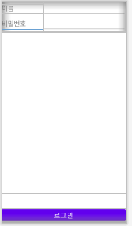  

<br>

**res/layout/activity_main.xml**

```xml
<?xml version="1.0" encoding="utf-8"?>
<LinearLayout xmlns:android="http://schemas.android.com/apk/res/android"
    xmlns:app="http://schemas.android.com/apk/res-auto"
    xmlns:tools="http://schemas.android.com/tools"
    android:layout_width="match_parent"
    android:layout_height="match_parent"
    android:orientation="vertical"
    tools:context=".MainActivity">

    <LinearLayout
        android:layout_width="match_parent"
        android:layout_height="wrap_content"
        android:orientation="horizontal">
        <TextView
            android:layout_width="0dp"
            android:layout_height="wrap_content"
            android:layout_weight="1"
            android:textSize="22sp"
            android:text="이름" />

        <EditText
            android:id="@+id/edtName"
            android:layout_width="0dp"
            android:layout_height="wrap_content"
            android:layout_weight="2"
            android:ems="10"
            android:inputType="textPersonName"
            android:textSize="22sp"/>
    </LinearLayout>

    <LinearLayout
        android:layout_width="match_parent"
        android:layout_height="wrap_content"
        android:orientation="horizontal">

        <TextView
            android:layout_width="0dp"
            android:layout_height="wrap_content"
            android:layout_weight="1"
            android:textSize="22sp"
            android:text="비밀번호" />
        <EditText
            android:id="@+id/edtPassWD"
            android:layout_width="0dp"
            android:layout_height="wrap_content"
            android:layout_weight="2"
            android:ems="10"
            android:inputType="textPassword"
            android:textSize="22sp"/>
    </LinearLayout>

    <TextView
        android:id="@+id/txtViewPassWd"
        android:layout_width="match_parent"
        android:layout_height="match_parent"
        android:layout_weight="1"
        android:textSize="22sp" />

    <Button
        android:id="@+id/btnLogin"
        android:layout_width="match_parent"
        android:layout_height="wrap_content"
        android:layout_marginTop="50dp"
        android:textSize="22sp"
        android:text="로그인" />
</LinearLayout>
```

<br>

**이벤트**

-   입력 포커스 변경
    -   setOnFocusChangeListener()
        -   이벤트를 발생한 뷰
        -   포커스을 얻었는지(true), 잃었는지 여부(false)

```kotlin
edtName.setOnFocusChangeListener() { v, hasFocus ->
}
```

<br>

-   입력 문자 변경
    -   addTextChangedListener()
        -   TextWatcher 익명 구현체

```kotlin
edtPassWD.addTextChangedListener(object:TextWatcher{
    override fun afterTextChanged(s: Editable?) {
    }
    override fun beforeTextChanged(s: CharSequence?,
                                   start: Int, count: Int, after: Int) {
    }
    override fun onTextChanged(s: CharSequence?,
                               start: Int, before: Int, count: Int) {
    }
})
```

<br>

**MainActivity.kt**

```kotlin
package com.example.basic_1_edittext

import android.graphics.Color
import androidx.appcompat.app.AppCompatActivity
import android.os.Bundle
import android.text.Editable
import android.text.TextWatcher
import android.widget.EditText
import kotlinx.android.synthetic.main.activity_main.*

class MainActivity : AppCompatActivity() {
    override fun onCreate(savedInstanceState: Bundle?) {
        super.onCreate(savedInstanceState)
        setContentView(R.layout.activity_main)

        edtName.setOnFocusChangeListener() { v, hasFocus ->
            val edt = v as EditText  // 형 변환  v: Viw --> EditText 타입으로 캐스팅(변환)
            val color = if (hasFocus) {
                Color.TRANSPARENT
            } else {
                Color.LTGRAY
            }
            edt.setBackgroundColor(color)
        }

        edtPassWD.addTextChangedListener(object: TextWatcher {
            override fun afterTextChanged(s: Editable?) {
            }
            override fun beforeTextChanged(s: CharSequence?,
                                           start: Int, count: Int, after: Int) {
            }
            override fun onTextChanged(s: CharSequence?,
                                       start: Int, before: Int, count: Int) {
                txtViewPassWd.text = s
            }


    }
}
```

>   `import kotlinx.android.synthetic.main.activity_main.*` 자동

>   **override 자동 생성** : `edtPassWD.addTextChangedListener(object: TextWatcher {})`
>
>   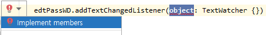  
>
>   `object` > `Implemet members` > 전체 선택 > `OK` 

<br>

<br>

### LogCat 활용

**LogCat**

-   로그 메시지 출력 객체

-   ADB(Android Debuger)에 의한 지원도 가능

-   ADB 명령을 PATH에 추가

    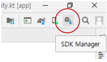  

<br>

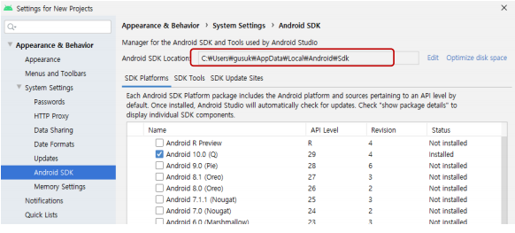  

-   PATH 환경 변수에 "\<Android SDK Location\>\platform-tools" 추가

<br>

**Log 클래스**

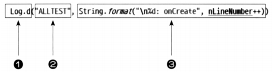  

1.  로그 출력 메서드
2.  로그를 구분 짓기 위한 태그 문자열
3.  로그로 출력할 문자열

<br>

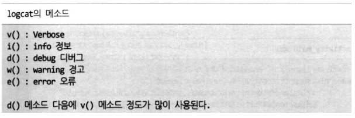  

<br>

**Logcat**

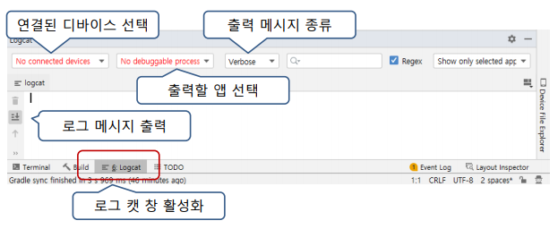  

명령으로 출력시키기

\> `adb logcat -s [검색 문자열]`

<br>

**프로젝트 생성**

-   File > New > New Project …
-   유형: Empty Activity
-   Project Name: basic_2_logcat

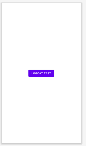  

<br>

**res/layout/activity_main.xml**

```xml
<?xml version="1.0" encoding="utf-8"?>
<androidx.constraintlayout.widget.ConstraintLayout
    xmlns:android="http://schemas.android.com/apk/res/android"
    xmlns:app="http://schemas.android.com/apk/res-auto"
    xmlns:tools="http://schemas.android.com/tools"
    android:layout_width="match_parent"
    android:layout_height="match_parent"
    tools:context=".MainActivity">

    <Button
        android:id="@+id/btnLogcatTest"
        android:layout_width="wrap_content"
        android:layout_height="wrap_content"
        android:text="Logcat Test"
        app:layout_constraintBottom_toBottomOf="parent"
        app:layout_constraintLeft_toLeftOf="parent"
        app:layout_constraintRight_toRightOf="parent"
        app:layout_constraintTop_toTopOf="parent"/>
</androidx.constraintlayout.widget.ConstraintLayout>
```

<br>

**MainActivity.kt**

```kotlin
package com.example.basic_2_logcat

import androidx.appcompat.app.AppCompatActivity
import android.os.Bundle
import android.util.Log
import kotlinx.android.synthetic.main.activity_main.*

class MainActivity : AppCompatActivity() {
    val TAG = "MainActivity"
    var nCount : Int = 0
    val nMaxCount : Int = 10
    override fun onCreate(savedInstanceState: Bundle?) {
        super.onCreate(savedInstanceState)
        setContentView(R.layout.activity_main)
        btnLogcatTest.setOnClickListener {
            Log.d(TAG, "${nCount++} clicked")
            try{
                val nResult = nMaxCount / (nMaxCount - nCount)
                Log.d(TAG, "nMaxCount / (nMaxCount - nCount) is ${nResult} ")
            } catch ( e : Exception ){
                Log.e(TAG, "${nCount} : ${e.toString()}")
            }
        }
    }
}
```

<br>

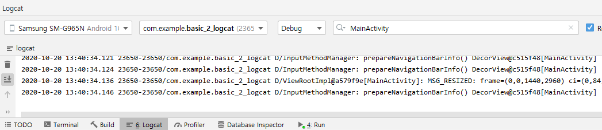  

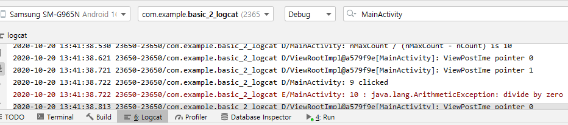  

<br>

<br>

### 간단한 계산기

**프로젝트 생성**

-   File > New > New Project …
-   유형: Empty Activity
-   Project Name: basic_2_calculator

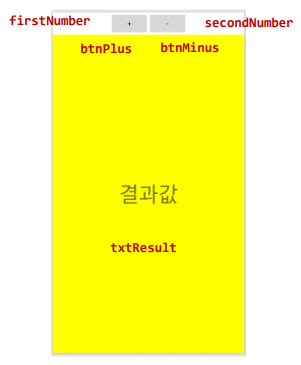  

<br>

**res/layout/activity_main.xml**

-   EditText에 숫자만 입력하도록 설정

    -   android:inputType="number"
    -   android:imeOptions="actionDone"

    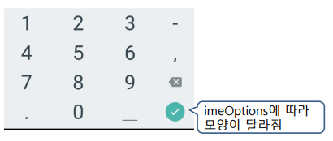  

```xml
<?xml version="1.0" encoding="utf-8"?>
<androidx.constraintlayout.widget.ConstraintLayout xmlns:android="http://schemas.android.com/apk/res/android"
    xmlns:app="http://schemas.android.com/apk/res-auto"
    xmlns:tools="http://schemas.android.com/tools"
    android:layout_width="match_parent"
    android:layout_height="match_parent"
    tools:context=".MainActivity">

    <LinearLayout
        android:id="@+id/linearLayout"
        android:layout_width="match_parent"
        android:layout_height="match_parent"
        android:layout_marginStart="8dp"
        android:layout_marginTop="8dp"
        android:layout_marginEnd="8dp"
        android:layout_marginBottom="600dp"
        android:orientation="horizontal"
        app:layout_constraintBottom_toBottomOf="parent"
        app:layout_constraintEnd_toEndOf="parent"
        app:layout_constraintStart_toStartOf="parent"
        app:layout_constraintTop_toTopOf="parent">

        <EditText
            android:id="@+id/firstNumber"
            android:layout_width="wrap_content"
            android:layout_height="wrap_content"
            android:layout_weight="5"
            android:ems="10"
            android:imeOptions="actionDone"
            android:inputType="number" />

        <Button
            android:id="@+id/btnPlus"
            android:layout_width="wrap_content"
            android:layout_height="wrap_content"
            android:layout_weight="3"
            android:text="+"
            android:textColor="@color/white" />

        <Button
            android:id="@+id/btnMinus"
            android:layout_width="wrap_content"
            android:layout_height="wrap_content"
            android:layout_weight="3"
            android:text="-"
            android:textColor="@color/white" />

        <EditText
            android:id="@+id/secondNumber"
            android:layout_width="wrap_content"
            android:layout_height="wrap_content"
            android:layout_weight="5"
            android:ems="10"
            android:imeOptions="actionDone"
            android:inputType="number" />

    </LinearLayout>

    <TextView
        android:id="@+id/txtResult"
        android:layout_width="wrap_content"
        android:layout_height="wrap_content"
        android:text="결과값"
        android:textAppearance="@style/TextAppearance.AppCompat.Large"
        app:layout_constraintBottom_toBottomOf="parent"
        app:layout_constraintEnd_toEndOf="parent"
        app:layout_constraintStart_toStartOf="parent"
        app:layout_constraintTop_toBottomOf="@+id/linearLayout" />
</androidx.constraintlayout.widget.ConstraintLayout>
```

<br>

**MainActivity.kt**

```kotlin
package com.example.basic_2_calculator

import androidx.appcompat.app.AppCompatActivity
import android.os.Bundle
import kotlinx.android.synthetic.main.activity_main.*

class MainActivity : AppCompatActivity() {
    // 빼기 함수(메소드)
    private fun subNumber(i: Int, i1: Int): Int {
        return i - i1;
    }

    // 더하기 함수(메소드)
    private fun addNumber(i: Int, i1: Int): Int {
        return i + i1;
    }

    // 함수형 예제를 위한 계산함수
    private fun calculate(
        pFunc: (Int, Int) -> Int,
        num1: Int, num2: Int
    ): Int {
        return pFunc(num1, num2)
    }

    override fun onCreate(savedInstanceState: Bundle?) {
        super.onCreate(savedInstanceState)
        setContentView(R.layout.activity_main)

        btnPlus.setOnClickListener { // + 버튼을 눌렀을 때(일반적인 스타일)
            // 입력받은 값이 null인지 채크
            if (firstNumber.text == null || secondNumber.text == null) {
                return@setOnClickListener
            }

            // 입력받은 값이 ""인지 채크
            if (firstNumber.text.length == 0 || secondNumber.text.length == 0) {
                return@setOnClickListener
            }

            // 숫자값을 가져오기
            var first = firstNumber.text.toString()
            var second = secondNumber.text.toString()

            // 문자열을 숫자로 변형하는 방법 : toInt()
            var result = addNumber(first.toInt(), second.toInt())
            txtResult.setText("$result")
        }

        // - 버튼을 눌렀을 때(함수형 프로그래밍 스타일)
        btnMinus.setOnClickListener {

            // 입력받은 값을 검증
            val lstCheck = listOf(firstNumber, secondNumber)
            lstCheck
                .map { if (it == null) return@setOnClickListener else it }
                .map { if (it.text.length < 1) return@setOnClickListener else it }

            // 숫자값을 가져오기
            val lstNumber = lstCheck.map { it.text.toString().toInt() }
            lstNumber.let {
                calculate(
                    ::subNumber,
                    it.get(0), it.get(1)
                )
                    .let { txtResult.text = "${it}" }
            }
        }
    }
}
```

<br>

**실행 결과**

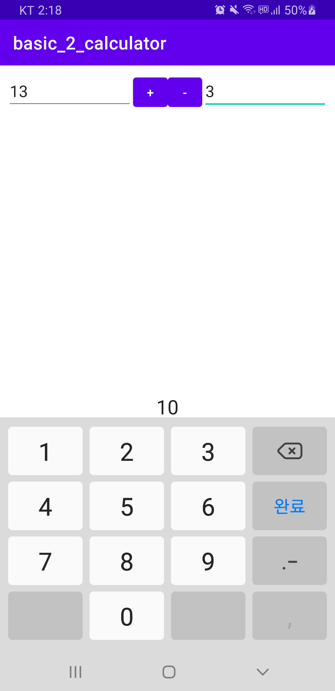  

<br>