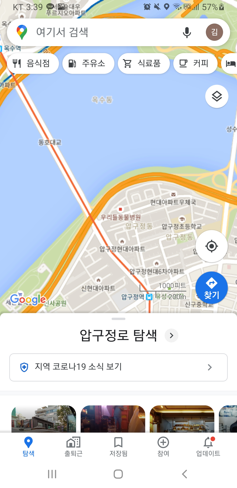
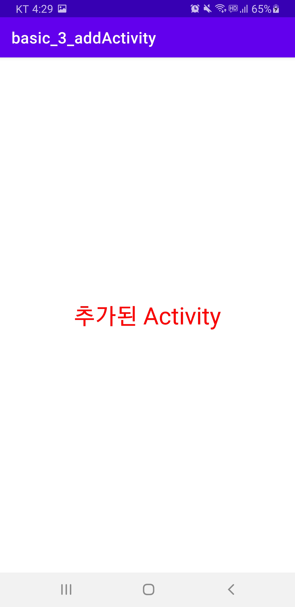

# Activity

>   핸드폰의 한 화면을 Activity라 한다.
>   일반적으로 Activity간 참조를 할 수 없다.

<br>

### Activity Life Cycle

**프로젝트 생성**

-   File > New > New Project …
-   유형: Empty Activity
-   Project Name: basic_2_activitylife

<br>

**Activity Life Cycle 메서드**

-   Activity가 생성되서 운영되고, 종료될 때 까지 각 상태 변경시 호출되는 콜백 메서드

  

>   `Activity running` : 화면 등장
>
>   `onPause()` : 일부분이 가려질 때
>
>   `onStop()` : 완전히 가려질 때

<br>

-   주요 메서드

  

<br>

**MainActivity.kt**

```kotlin
package com.example.basic_2_activitylife

import androidx.appcompat.app.AppCompatActivity
import android.os.Bundle
import android.util.Log

class MainActivity : AppCompatActivity() {
    var nLineNumber = 0

    // Activity가 생성될 때
    override fun onCreate(savedInstanceState: Bundle?) {
        super.onCreate(savedInstanceState)
        setContentView(R.layout.activity_main)
        Log.d("ALLTEST", String.format("\n%d: onCreate", nLineNumber++))
    }

    // Activity가 최초실행될 때
    public override fun onStart() {
        super.onStart()
        Log.d("ALLTEST", String.format("%d: onStart", nLineNumber++))
    }

    // 내 activity 맨앞으로 왔을 때
    public override fun onResume() {
        super.onResume()
        Log.d("ALLTEST", String.format("%d: onResume", nLineNumber++))
    }

    // 내 activity 맨앞에 뭔가가 있을 때
    public override fun onStop() {
        super.onStop()
        Log.d("ALLTEST", String.format("%d: onStop", nLineNumber++))
    }

    // Activity가 완전히 종료될 때
    public override fun onDestroy() {
        super.onDestroy()
        Log.d("ALLTEST", String.format("%d: onDestroy", nLineNumber++))
    }
}
```

<br>


>   세로모드 → 가로모드 시 Logcat
>
>   안드로이드폰은 모드 변경 시 Activity를 다시 생성한다.
>
>   `savedInstanceState` : 모드가 변경되어도 이전 상태가 복원을 위해

<br>

<br>

### Intent의 이해

**Intent 객체**

-   사용자의 의도를 안드로이드 시스템에 알리는 용도
-   컴포넌트간 정보 전달을 위해 사용

<br>

**안드로이드 Component**

-   사용자 정의 컴포넌트는 반드시 AndroidManifest.xml에 등록해야 함

  

<br>

**Component 간의 Intent를 이용한 정보 전달**

  

<br>

**요소별 Intent 전송 방법**

-   startActivity()
-   sendBroadCast()
-   startService()


**Intent로 호출된 컴포넌트에서 전달된 Intent 얻기**

-   getIntent()

<br>

**안드로이드 시스템이 기본 제공하는 Activity 호출**

-   전화걸기

-   웹

-   문자보내기

-   주소록 보기 등

    startActivity(action, uri)

    -   action
        -   Intent.ACTION_SENDTO
        -   Intent.ACTION_VIEW

<br>

**Intent로 정보 전달하기**

  

<br>

**프로젝트 생성**

-   File > New > New Project …
-   유형: Empty Activity
-   Project Name: basic_3_usingIntent

<br>

**res/layout/acivity_main.xml**

```xml
<?xml version="1.0" encoding="utf-8"?>
<androidx.constraintlayout.widget.ConstraintLayout xmlns:android="http://schemas.android.com/apk/res/android"
    xmlns:app="http://schemas.android.com/apk/res-auto"
    xmlns:tools="http://schemas.android.com/tools"
    android:layout_width="match_parent"
    android:layout_height="match_parent"
    tools:context=".MainActivity">

    <LinearLayout
        android:layout_width="match_parent"
        android:layout_height="match_parent"
        android:orientation="vertical"
        tools:layout_editor_absoluteX="151dp"
        tools:layout_editor_absoluteY="180dp">

        <Button
            android:id="@+id/btnSMS"
            android:layout_width="match_parent"
            android:layout_height="wrap_content"
            android:text="SMS 보내기" />

        <Button
            android:id="@+id/btnInternet"
            android:layout_width="match_parent"
            android:layout_height="wrap_content"
            android:text="인터넷이동" />

        <Button
            android:id="@+id/btnMap"
            android:layout_width="match_parent"
            android:layout_height="wrap_content"
            android:text="MAP 연동" />

        <Button
            android:id="@+id/btnMarket"
            android:layout_width="match_parent"
            android:layout_height="wrap_content"
            android:text="구글마켓 연동" />
    </LinearLayout>
</androidx.constraintlayout.widget.ConstraintLayout>
```

<br>

**MainActivity.kt**

```kotlin
package com.example.basic_3_usingintent

import android.content.Intent
import android.net.Uri
import androidx.appcompat.app.AppCompatActivity
import android.os.Bundle
import kotlinx.android.synthetic.main.activity_main.*

class MainActivity : AppCompatActivity() {
    override fun onCreate(savedInstanceState: Bundle?) {
        super.onCreate(savedInstanceState)
        setContentView(R.layout.activity_main)
        setUpUI()
    }

    private fun setUpUI() {
        btnSMS.setOnClickListener{
            // SMS 보내기
            val uri = Uri.parse("smsto:" + "01011112222")
            val intent = Intent(Intent.ACTION_SENDTO, uri)
            intent.putExtra("sms_body", "여기가 문자!!")
            startActivity(intent)
        }

        btnInternet.setOnClickListener{ // 인터넷이동
            //val intent = Intent(Intent.ACTION_DIAL, Uri.parse("tel:" + 114))
            //startActivity(intent)
            val uri = Uri.parse("http://vintageappmaker.tumblr.com/")
            val intent = Intent(Intent.ACTION_VIEW, uri)
            startActivity(intent)
        }

        btnMap.setOnClickListener{ // 지도이동
            val uri = Uri.parse("geo: 37.5310091, 127.0261659")
            val intent = Intent(Intent.ACTION_VIEW, uri)
            startActivity(intent)
        }

        btnMarket.setOnClickListener{ // 마켓으로 이동하기
            val uri = Uri.parse("market://details?id=com.psw.moringcall")
            val intent = Intent(Intent.ACTION_VIEW, uri)
            startActivity(intent)
        }
    }
}
```

<br>

**실행 결과**

          

>   각 버튼을 누르면 이동한다

<br>

<br>

### Activity 추가 & 호출

**프로젝트 생성**

-   File > New > New Project …
-   유형: Empty Activity
-   Project Name: basic_3_addActivity

<br>

**새로운 Activity 추가**

-   패키지 >> New > Activity > Empty Activity

  

-   Activity Name : Main2Activity
-   Layout name : activity_main2

<br>

**AndroidManifest.xml** - 자동 생성

```xml
<?xml version="1.0" encoding="utf-8"?>
<manifest xmlns:android="http://schemas.android.com/apk/res/android"
    package="com.example.basic_3_addactivity">

    <application
        android:allowBackup="true"
        android:icon="@mipmap/ic_launcher"
        android:label="@string/app_name"
        android:roundIcon="@mipmap/ic_launcher_round"
        android:supportsRtl="true"
        android:theme="@style/Theme.Basic_3_addActivity">
        <activity android:name=".Main2Activity"></activity>
        <activity android:name=".MainActivity">
            <intent-filter>
                <action android:name="android.intent.action.MAIN" />

                <category android:name="android.intent.category.LAUNCHER" />
            </intent-filter>
        </activity>
    </application>

</manifest>
```

>   activity 2개 이용 반드시 이곳에 등록되어야한다.
>
>   .Main2Activity : 호출을 통해서만 이용 가능
>
>   .MainActivity : LAUNCHER로 이용 기본

<br>

**Activity 호출**

-   Intent 객체

    -   사용자의 의도를 안드로이드 시스템에 알리는 용도
    -   Activity 호출에 사용
        -   어떤 액티비에서 어떤 액티비티를 호출한다는 정보를 표현
        -   Intent(호출하는 액티비티 참조, 호출할 액티비티 클래스 정보)
    -   startActivity()를 이용해 안드로이드 시스템에 전달

    ```kotlin
    val intent = Intent(this, Main2Activity::class.java)
    startActivity(intent)
    ```

    

<br>

**res/layout/acivity_main.xml**

```xml
<?xml version="1.0" encoding="utf-8"?>
<androidx.constraintlayout.widget.ConstraintLayout xmlns:android="http://schemas.android.com/apk/res/android"
    xmlns:app="http://schemas.android.com/apk/res-auto"
    xmlns:tools="http://schemas.android.com/tools"
    android:layout_width="match_parent"
    android:layout_height="match_parent"
    tools:context=".MainActivity">

    <Button
        android:id="@+id/btnOk"
        android:layout_width="wrap_content"
        android:layout_height="wrap_content"
        android:text="Activity 호출"
        android:textAppearance="@style/TextAppearance.AppCompat.Large"
        app:layout_constraintBottom_toBottomOf="parent"
        app:layout_constraintEnd_toEndOf="parent"
        app:layout_constraintStart_toStartOf="parent"
        app:layout_constraintTop_toTopOf="parent" />
</androidx.constraintlayout.widget.ConstraintLayout>
```

<br>

**res/layout/acivity_main2.xml**

```xml
<?xml version="1.0" encoding="utf-8"?>
<androidx.constraintlayout.widget.ConstraintLayout xmlns:android="http://schemas.android.com/apk/res/android"
    xmlns:app="http://schemas.android.com/apk/res-auto"
    xmlns:tools="http://schemas.android.com/tools"
    android:layout_width="match_parent"
    android:layout_height="match_parent"
    tools:context=".Main2Activity">

    <TextView
        android:id="@+id/textView"
        android:layout_width="wrap_content"
        android:layout_height="wrap_content"
        android:text="추가된 Activity"
        android:textSize="30sp"
        android:textColor="#FF0000"
        android:textAppearance="@style/TextAppearance.AppCompat.Large"
        app:layout_constraintBottom_toBottomOf="parent"
        app:layout_constraintEnd_toEndOf="parent"
        app:layout_constraintStart_toStartOf="parent"
        app:layout_constraintTop_toTopOf="parent" />
</androidx.constraintlayout.widget.ConstraintLayout>
```

<br>

**MainActivity.kt**

```kotlin
package com.example.basic_3_addactivity

import android.content.Intent
import androidx.appcompat.app.AppCompatActivity
import android.os.Bundle
import kotlinx.android.synthetic.main.activity_main.*

class MainActivity : AppCompatActivity() {
    override fun onCreate(savedInstanceState: Bundle?) {
        super.onCreate(savedInstanceState)
        setContentView(R.layout.activity_main)
        btnOk.setOnClickListener {
            val i = Intent(this, Main2Activity::class.java)
            startActivity(i)
        }
    }
}
```

<br>

**Main2Activity.kt** - 자동 생성

```kotlin
package com.example.basic_3_addactivity

import androidx.appcompat.app.AppCompatActivity
import android.os.Bundle

class Main2Activity : AppCompatActivity() {
    override fun onCreate(savedInstanceState: Bundle?) {
        super.onCreate(savedInstanceState)
        setContentView(R.layout.activity_main2)
    }
}
```

<br>

**실행 결과**

    

<br>

<br>

### 다른 Activity에 값 전달

**다른 Activity에 값 전달하는 경우**

-   Activity1 → Acitivty2
    -   매개변수에 해당
-   Activity1← Acitivty2
    -   리턴값에 해당
    -   startActivityForResult()로 호출해야 함
    -   onActivityResult()에서 리턴값 처리

  

<br>

**프로젝트 생성**

-   File > New > New Project …
-   유형: Empty Activity
-   Project Name: basic_3_intentWithData
-   ResultActivity 추가

<br>

**res/layout/acivity_main.xml** - 기존 basic_1_edittext 이용 (ID만 변경)

```xml
<?xml version="1.0" encoding="utf-8"?>
<LinearLayout xmlns:android="http://schemas.android.com/apk/res/android"
    xmlns:app="http://schemas.android.com/apk/res-auto"
    xmlns:tools="http://schemas.android.com/tools"
    android:layout_width="match_parent"
    android:layout_height="match_parent"
    android:orientation="vertical"
    tools:context=".MainActivity">

    <LinearLayout
        android:layout_width="match_parent"
        android:layout_height="wrap_content"
        android:orientation="horizontal">
        <TextView
            android:layout_width="0dp"
            android:layout_height="wrap_content"
            android:layout_weight="1"
            android:textSize="22sp"
            android:text="이름" />

        <EditText
            android:id="@+id/edtId"
            android:layout_width="0dp"
            android:layout_height="wrap_content"
            android:layout_weight="2"
            android:ems="10"
            android:inputType="textPersonName"
            android:textSize="22sp" />

    </LinearLayout>

    <LinearLayout
        android:layout_width="match_parent"
        android:layout_height="wrap_content"
        android:orientation="horizontal">
        <TextView
            android:layout_width="0dp"
            android:layout_height="wrap_content"
            android:layout_weight="1"
            android:textSize="22sp"
            android:text="비밀번호" />

        <EditText
            android:id="@+id/edtPassWD"
            android:layout_width="0dp"
            android:layout_height="wrap_content"
            android:layout_weight="2"
            android:ems="10"
            android:inputType="textPassword"
            android:textSize="22sp" />
    </LinearLayout>

    <TextView
        android:id="@+id/txtMessage"
        android:layout_width="match_parent"
        android:layout_height="wrap_content" />

    <Button
        android:id="@+id/btnLogin"
        android:layout_width="match_parent"
        android:layout_height="wrap_content"
        android:layout_marginTop="50dp"
        android:textSize="22sp"
        android:text="로그인" />
</LinearLayout>
```

<br>

**res/layout/acivity_result.xml**

```xml
<?xml version="1.0" encoding="utf-8"?>
<androidx.constraintlayout.widget.ConstraintLayout xmlns:android="http://schemas.android.com/apk/res/android"
    xmlns:app="http://schemas.android.com/apk/res-auto"
    xmlns:tools="http://schemas.android.com/tools"
    android:layout_width="match_parent"
    android:layout_height="match_parent"
    tools:context=".ResultActivity">

    <TextView
        android:id="@+id/txtMessage2"
        android:layout_width="wrap_content"
        android:layout_height="wrap_content"
        android:layout_marginStart="8dp"
        android:layout_marginTop="8dp"
        android:layout_marginEnd="8dp"
        android:layout_marginBottom="8dp"
        android:text="TextView"
        app:layout_constraintBottom_toBottomOf="parent"
        app:layout_constraintEnd_toEndOf="parent"
        app:layout_constraintStart_toStartOf="parent"
        app:layout_constraintTop_toTopOf="parent" />
</androidx.constraintlayout.widget.ConstraintLayout>
```

<br>

**MainActivity.kt**

```kotlin
package com.example.basic_3_intentwithdata

import android.content.Intent
import android.graphics.Color
import androidx.appcompat.app.AppCompatActivity
import android.os.Bundle
import android.text.Editable
import android.text.TextWatcher
import android.widget.EditText
import kotlinx.android.synthetic.main.activity_main.*

class MainActivity : AppCompatActivity() {

    companion object{ // 어떤 호출인지 상수로 정의
        val REQUEST = 0
        val ID = "ID"
        val PASSWD = "PASSWD"
        val RESULT = "RESULT"
    }

    override fun onCreate(savedInstanceState: Bundle?) {
        super.onCreate(savedInstanceState)
        setContentView(R.layout.activity_main)

        btnLogin.setOnClickListener {
            val i = Intent(this, ResultActivity::class.java)
            i.putExtra(ID, edtId.text.toString())
            i.putExtra(PASSWD, edtPassWD.text.toString())
            startActivityForResult(i, REQUEST)
        }
    } // end of onCreate
    // 호출한 Activity에서 결과값을 받을 때,
    override fun onActivityResult(requestCode: Int, resultCode: Int,
                                  data: Intent?) {
        if(requestCode != REQUEST) return
        data?.getStringExtra(RESULT).let{
            txtMessage.text = it
        }
        super.onActivityResult(requestCode, resultCode, data)
    }
}
```

<br>

**ResultActivity.kt**

```kotlin
package com.example.basic_3_intentwithdata

import androidx.appcompat.app.AppCompatActivity
import android.os.Bundle
import kotlinx.android.synthetic.main.activity_result.*

class ResultActivity : AppCompatActivity() {
    override fun onCreate(savedInstanceState: Bundle?) {
        super.onCreate(savedInstanceState)
        setContentView(R.layout.activity_result)
    }

    override fun onStart() {
        super.onStart()
        // 값이 없으면 리턴
        val i = intent ?: return // 호출에 사용된 Intent
        val sID = i.getStringExtra(MainActivity.ID)
        val sPasswd = i.getStringExtra(MainActivity.PASSWD)
        txtMessage2.text = "아이디: ${sID}\n패스워드: ${sPasswd}"
        i.putExtra(MainActivity.RESULT, txtMessage2.text.toString())
        setResult(MainActivity.REQUEST, i)
    }

}
```

<br>

**실행 결과**

    

<br>

<br>