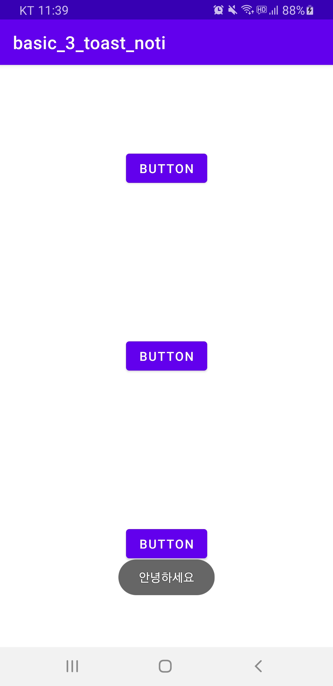
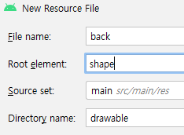
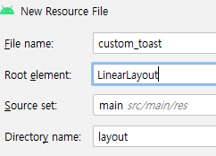
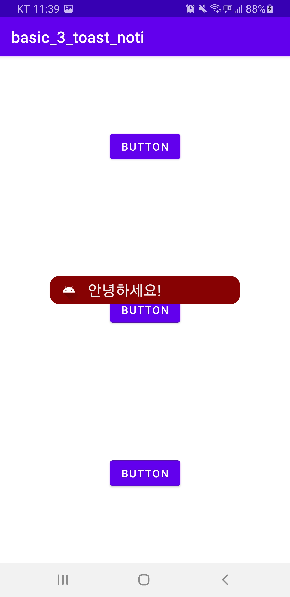

# Toast, Notification

### Toast

**프로젝트 생성**

-   File > New > New Project …
-   유형: Empty Activity
-   Project Name: basic_3_toast_noti

<br>

**res/layout/activity_main.xml**

```xml
<?xml version="1.0" encoding="utf-8"?>
<androidx.constraintlayout.widget.ConstraintLayout xmlns:android="http://schemas.android.com/apk/res/android"
    xmlns:app="http://schemas.android.com/apk/res-auto"
    xmlns:tools="http://schemas.android.com/tools"
    android:layout_width="match_parent"
    android:layout_height="match_parent"
    tools:context=".MainActivity">

    <Button
        android:id="@+id/btnToast"
        android:layout_width="wrap_content"
        android:layout_height="wrap_content"
        android:layout_marginBottom="80dp"
        android:text="Button"
        app:layout_constraintBottom_toTopOf="@+id/btnToast2"
        app:layout_constraintEnd_toEndOf="parent"
        app:layout_constraintStart_toStartOf="parent"
        app:layout_constraintTop_toTopOf="parent" />

    <Button
        android:id="@+id/btnToast2"
        android:layout_width="wrap_content"
        android:layout_height="wrap_content"
        android:layout_marginBottom="80dp"
        android:text="Button"
        app:layout_constraintBottom_toTopOf="@+id/btnNoti"
        app:layout_constraintEnd_toEndOf="parent"
        app:layout_constraintStart_toStartOf="parent"
        app:layout_constraintTop_toBottomOf="@+id/btnToast" />

    <Button
        android:id="@+id/btnNoti"
        android:layout_width="wrap_content"
        android:layout_height="wrap_content"
        android:text="Button"
        app:layout_constraintBottom_toBottomOf="parent"
        app:layout_constraintEnd_toEndOf="parent"
        app:layout_constraintStart_toStartOf="parent"
        app:layout_constraintTop_toBottomOf="@+id/btnToast2" />
</androidx.constraintlayout.widget.ConstraintLayout>
```

<br>

**Toast**

-   사용자에게 간단한 문자열을 짧은 시간 동안 보여줌
-   사용자가 못 보고 놓칠 수 있음


-   `Toast.makeText(Context, String, duration).show()`
    -   duration
        -   `Toast.LENGTH_LONG`
        -   `Toast.LENGTH_SHORT`

<br>

**MainActivity.kt**

```kotlin
package com.example.basic_3_toast_noti

import androidx.appcompat.app.AppCompatActivity
import android.os.Bundle
import android.widget.Toast
import kotlinx.android.synthetic.main.activity_main.*

class MainActivity : AppCompatActivity() {
    override fun onCreate(savedInstanceState: Bundle?) {
        super.onCreate(savedInstanceState)
        setContentView(R.layout.activity_main)
        btnToast.setOnClickListener {
            Toast.makeText(application, "안녕하세요", Toast.LENGTH_LONG).show()
        }
    }
}
```

<br>

**실행 결과** - 1번째 버튼 클릭 시

  

<br>

**사용자 정의 Toast**

-   layout xml을 정의

-   layout xml을 코드로 객체화(inflate)

    ```kotlin
    val layoutInflater = getSystemService(Context.LAYOUT_INFLATER_SERVICE) as LayoutInflater
    val layout = layoutInflater.inflate(<레이아웃 id>, null)
    ```

-   Toast 생성시 사용자 정의 레이아웃을 지정

    ```kotlin
    val toast = Toast(applicationContext)
    toast.setGravity(Gravity.CENTER, 0, 0)
    toast.duration = Toast.LENGTH_LONG
    toast.view = layout
    toast.show()
    ```

<br>

**res/drawable/back.xml**

  

```xml
<?xml version="1.0" encoding="utf-8"?>
<shape
    xmlns:android="http://schemas.android.com/apk/res/android"
    android:shape="rectangle" >
    <corners android:radius="12dp"/>
    <solid android:color="#870303"/>
    <padding
        android:left="0dp"
        android:top="0dp"
        android:right="0dp"
        android:bottom="0dp"/>
    <size
        android:width="270dp"
        android:height="30dp" />
    <stroke
        android:width="3dp"
        android:color="#870303" />
</shape>
```

<br>

**res/layout/custom_toast.xml**

  

```xml
<?xml version="1.0" encoding="utf-8"?>
<LinearLayout
    xmlns:android="http://schemas.android.com/apk/res/android"
    android:orientation="vertical"
    android:layout_gravity="center"
    android:layout_width="wrap_content"
    android:layout_height="wrap_content">

    <LinearLayout
        android:background="@drawable/back"
        android:orientation="horizontal"
        android:weightSum="1"
        android:layout_width="wrap_content"
        android:layout_height="wrap_content">

        <ImageView
            android:src="@drawable/ic_launcher_foreground"
            android:layout_weight="0.2"
            android:layout_width="0dp"
            android:layout_height="40dp"/>

        <TextView
            android:id="@+id/txtMessage"
            android:text="Message"
            android:textColor="#EEEEEE"
            android:textSize="22dp"
            android:layout_gravity="center"
            android:layout_weight="0.8"
            android:layout_width="0dp"
            android:layout_height="wrap_content"/>
        
    </LinearLayout>
</LinearLayout>
```

<br>

**MainActivity.kt**

```kotlin
package com.example.basic_3_toast_noti

import android.content.Context
import androidx.appcompat.app.AppCompatActivity
import android.os.Bundle
import android.view.Gravity
import android.view.LayoutInflater
import android.widget.Toast
import kotlinx.android.synthetic.main.activity_main.*
import kotlinx.android.synthetic.main.custom_toast.view.*

class MainActivity : AppCompatActivity() {
    override fun onCreate(savedInstanceState: Bundle?) {
        super.onCreate(savedInstanceState)
        setContentView(R.layout.activity_main)
        btnToast.setOnClickListener {
            Toast.makeText(application, "안녕하세요", Toast.LENGTH_LONG).show()
        }
        btnToast2.setOnClickListener {
            showCustom("안녕하세요!")
        }
    }

    private fun showCustom( s : String) {
        val layoutInflater = getSystemService(
            Context.LAYOUT_INFLATER_SERVICE) as LayoutInflater
        val layout = layoutInflater.inflate(R.layout.custom_toast, null)
// layout 안의 txtMessage
        layout.txtMessage.text = s
        val toast = Toast(applicationContext)
        toast.setGravity(Gravity.CENTER, 0, 0)
        toast.duration = Toast.LENGTH_LONG
        toast.view = layout
        toast.show()
    }
}
```

<br>

**실행 결과** - 2번째 버튼 클릭 시

  

<br>

<br>

### Notification

**Notification**

-   알림 메시지

>   업데이트되면서 자주 바뀜 확인 필요
>
>   추후 다시

<br>

<br>

<br>

<br>

<br>