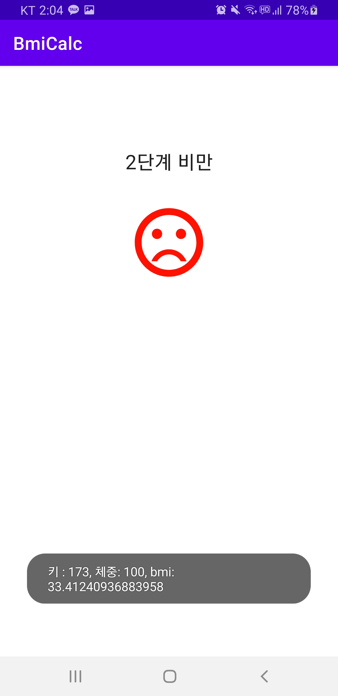

# BMI Calc

### BMI Calc

**프로젝트 생성**

-    프로젝트명 : BmiCalc
-   Activity 유형 : Empty

<br>

  

<br>

**strings.xml**

```xml
<resources>
    <string name="app_name">BmiCalc</string>
    <string name="height">신장</string>
    <string name="weight">체중</string>
    <string name="result">결과보기</string>
</resources>
```

<br>

**activity_main.xml**

```xml
<?xml version="1.0" encoding="utf-8"?>
<androidx.constraintlayout.widget.ConstraintLayout
    xmlns:android="http://schemas.android.com/apk/res/android"
    xmlns:tools="http://schemas.android.com/tools"
    xmlns:app="http://schemas.android.com/apk/res-auto"
    android:layout_width="match_parent"
    android:layout_height="match_parent"
    tools:context=".MainActivity">

    <EditText
        android:id="@+id/heightEditText"
        android:layout_width="wrap_content"
        android:layout_height="wrap_content"
        android:inputType="number"
        android:ems="10"
        app:layout_constraintTop_toTopOf="parent"
        android:layout_marginTop="84dp"
        app:layout_constraintStart_toStartOf="parent"
        android:layout_marginLeft="8dp"
        android:layout_marginStart="8dp"
        app:layout_constraintEnd_toEndOf="parent"
        android:layout_marginEnd="8dp"
        android:layout_marginRight="8dp"
        android:hint="@string/height"
        android:textAppearance="@style/TextAppearance.AppCompat.Large"/>

    <EditText
        android:id="@+id/weightEditText"
        android:layout_width="wrap_content"
        android:layout_height="wrap_content"
        android:inputType="number"
        android:ems="10"
        app:layout_constraintStart_toStartOf="parent"
        android:layout_marginStart="8dp"
        android:layout_marginLeft="8dp"
        android:layout_marginEnd="8dp"
        app:layout_constraintEnd_toEndOf="parent"
        android:layout_marginRight="8dp"
        app:layout_constraintTop_toBottomOf="@+id/heightEditText"
        android:layout_marginTop="16dp"
        android:hint="@string/weight"
        android:textAppearance="@style/TextAppearance.AppCompat.Large"/>

    <Button
        android:id="@+id/resultButton"
        android:layout_width="wrap_content"
        android:layout_height="wrap_content"
        android:text="@string/result"
        app:layout_constraintBottom_toBottomOf="parent"
        app:layout_constraintEnd_toEndOf="parent"
        app:layout_constraintStart_toStartOf="parent"
        android:layout_marginTop="8dp"
        app:layout_constraintTop_toBottomOf="@+id/weightEditText"
        android:textAppearance="@style/TextAppearance.AppCompat.Large"/>
</androidx.constraintlayout.widget.ConstraintLayout>
```

<br>

**Anko 라이브러리**

-   https://github.com/Kotlin/anko 

-   build.gradle(Project)

    ```kotlin
    buildscript {
        ext.kotlin_version = '1.2.51'
        ext.anko_version='0.10.8'
    ```

-   build.gradle(Module: app)

    ```kotlin
    dependencies {
        implementation "org.jetbrains.anko:anko-commons:$anko_version"
        :
    }
    ```

→ `Sync now`

<br>

**toast()/longToast()**

-   Anko Common에서 정의
-   Context의 메서드로 포함
-   예
    -   toast("Hi there!") 
    -   toast(R.string.message)
    -   longToast("Wow, such duration")

<br>

**MainActivity.kt**

```kotlin
package com.example.bmicalc

import androidx.appcompat.app.AppCompatActivity
import android.os.Bundle
import org.jetbrains.anko.toast
import kotlinx.android.synthetic.main.activity_main.*


class MainActivity : AppCompatActivity() {
    override fun onCreate(savedInstanceState: Bundle?) {
        super.onCreate(savedInstanceState)
        setContentView(R.layout.activity_main)
        resultButton.setOnClickListener {
            val height = heightEditText.text.toString().toInt()
            val weight = weightEditText.text.toString().toInt()
            toast("키 : $height, 체중: $weight")
        }
    }
}
```

<br>

**실행 결과**

  

<br>

<br>

### 다른 액티비티 호출

**ResultActivity 생성**

-   File > New > Activity > Empty Activity
    -   Activity Name: ResultActivity
    -   Layout Name: activity_result

<br>

**Vector Image 지원**

-   api level 21 이상에서 지원, 21 미만인 경우 설정 필요
-   build.gradle(Module:app)

```kotlin
    :
android {
    compileSdkVersion 29
    buildToolsVersion "29.0.2"
    defaultConfig {
        applicationId "com.example.bmicalc"
        minSdkVersion 15
        targetSdkVersion 29
        versionCode 1
        versionName "1.0"
        vectorDrawables.useSupportLibrary = true
    :
```

>   api level 21 이상 설정할 필요 없다.

<br>

**이미지 아이콘 생성**

-   res/drawable > New > Vector Asset

    -   Name : ic_baseline_sentiment_satisfied_alt_24

      

<br>

-   res/drawable > New > Vector Asset

    -   Name : ic_baseline_sentiment_dissatisfied_24

      

<br>

-   res/drawable > New > Vector Asset

    -   Name : ic_baseline_sentiment_very_dissatisfied_24

      

<br>

**activity_result.xml**

```xml
<?xml version="1.0" encoding="utf-8"?>
<androidx.constraintlayout.widget.ConstraintLayout
    xmlns:android="http://schemas.android.com/apk/res/android"
    xmlns:tools="http://schemas.android.com/tools"
    xmlns:app="http://schemas.android.com/apk/res-auto"
    android:layout_width="match_parent"
    android:layout_height="match_parent"
    tools:context=".ResultActivity">

    <TextView
        android:id="@+id/resultTextView"
        android:text="결과가 표시되는 곳"
        android:layout_width="wrap_content"
        android:layout_height="wrap_content"
        app:layout_constraintStart_toStartOf="parent"
        app:layout_constraintEnd_toEndOf="parent"
        android:textAppearance="@style/TextAppearance.AppCompat.Large"
        app:layout_constraintTop_toTopOf="parent"
        android:layout_marginTop="100dp"/>

    <ImageView
        android:id="@+id/imageView"
        android:layout_width="100dp"
        android:layout_height="100dp"
        app:srcCompat="@drawable/ic_baseline_sentiment_satisfied_alt_24"
        app:layout_constraintStart_toStartOf="parent"
        app:layout_constraintEnd_toEndOf="parent"
        app:layout_constraintTop_toBottomOf="@+id/resultTextView"
        android:layout_marginTop="32dp"/>
</androidx.constraintlayout.widget.ConstraintLayout>
```

<br>

**Anko 라이브러리**

-   ```
    startActivity<SomeOtherActivity>(
    	Extra Data, …
    )
    ```

-   ```
    startActivity<SomeOtherActivity>(
        "key1" to value1,
        "key2" to value2,
          …
    )
    ```

<br>

**MainActivity.kt**

```kotlin
package com.example.bmicalc

import androidx.appcompat.app.AppCompatActivity
import android.os.Bundle
import org.jetbrains.anko.toast
import kotlinx.android.synthetic.main.activity_main.*
import org.jetbrains.anko.startActivity


class MainActivity : AppCompatActivity() {
    override fun onCreate(savedInstanceState: Bundle?) {
        super.onCreate(savedInstanceState)
        setContentView(R.layout.activity_main)
        resultButton.setOnClickListener {
            val height = heightEditText.text.toString().toInt()
            val weight = weightEditText.text.toString().toInt()

            startActivity<ResultActivity>(
                "height" to height,
                "weight" to weight
            )
        }
    }
}
```

<br>

**ResultActivity.kt**

```kotlin
package com.example.bmicalc

import androidx.appcompat.app.AppCompatActivity
import android.os.Bundle
import kotlinx.android.synthetic.main.activity_result.*
import org.jetbrains.anko.longToast

class ResultActivity : AppCompatActivity() {
    override fun onCreate(savedInstanceState: Bundle?) {
        super.onCreate(savedInstanceState)
        setContentView(R.layout.activity_result)

        val height = intent.getIntExtra("height", 0)
        val weight = intent.getIntExtra("weight", 0)

        val bmi = weight / Math.pow(height / 100.0, 2.0)

        // 결과 표시
        when {
            bmi >= 35 -> resultTextView.text = "고도 비만"
            bmi >= 30 -> resultTextView.text = "2단계 비만"
            bmi >= 25 -> resultTextView.text = "1단계 비만"
            bmi >= 23 -> resultTextView.text = "과체중"
            bmi >= 18.5 -> resultTextView.text = "정상"
            else -> resultTextView.text = "저체중"
        }

        when {
            bmi >= 23 -> imageView.setImageResource(
                R.drawable.ic_baseline_sentiment_very_dissatisfied_24)
            bmi >= 18.5 -> imageView.setImageResource(
                R.drawable.ic_baseline_sentiment_satisfied_alt_24)
            else -> imageView.setImageResource(
                R.drawable.ic_baseline_sentiment_dissatisfied_24)
        }

        longToast("키 : $height, 체중: $weight, bmi: $bmi")
    }
}
```

<br>

**실행 결과**

            

<br>

<br>

### 데이터 저장하고 복원하기

-   데이터 저장하고 복원하기
    -   SharedPreferences에 저장 및 복원
    -   저장 시점
        -   ResultActivity를 호출하기 전
        -   saveData() 정의
    -   복원 시점
        -   onCreate()
        -   loadData() 정의

<br>

**MainActivity.kt**

```kotlin

```

<br>

<br>

<br>

<br>

<br>

<br>

<br>