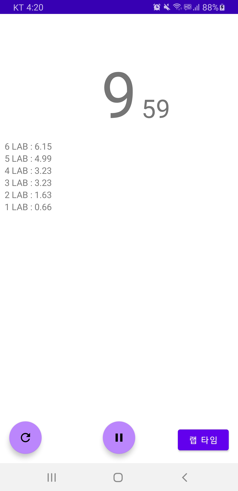

# StopWatch

**프로젝트 생성**

-   프로젝트명: StopWatch
-   Activity 유형: Basic Activity

<br>

**Vector Image**

-   play : `ic_baseline_play_arrow_24`
-   pause : `ic_baseline_pause_24`
-   refresh : `ic_baseline_refresh_24`

<br>

**activity_main.xml**

```xml
<?xml version="1.0" encoding="utf-8"?>
<androidx.constraintlayout.widget.ConstraintLayout xmlns:android="http://schemas.android.com/apk/res/android"
    xmlns:app="http://schemas.android.com/apk/res-auto"
    xmlns:tools="http://schemas.android.com/tools"
    android:layout_width="match_parent"
    android:layout_height="match_parent"
    tools:context=".MainActivity">

    <TextView
        android:id="@+id/secTextView"
        android:layout_width="wrap_content"
        android:layout_height="wrap_content"
        android:text="0"
        android:textSize="100sp"
        app:layout_constraintBottom_toBottomOf="parent"
        app:layout_constraintLeft_toLeftOf="parent"
        app:layout_constraintRight_toRightOf="parent"
        app:layout_constraintTop_toTopOf="parent"
        app:layout_constraintVertical_bias="0.100000024"/>

    <TextView
        android:id="@+id/milliTextView"
        android:layout_width="wrap_content"
        android:layout_height="wrap_content"
        android:text="00"
        android:textSize="40sp"
        app:layout_constraintBaseline_toBaselineOf="@+id/secTextView"
        app:layout_constraintStart_toEndOf="@+id/secTextView"
        android:layout_marginLeft="8dp"
        android:layout_marginStart="8dp"/>

    <com.google.android.material.floatingactionbutton.FloatingActionButton
        android:id="@+id/fab"
        android:layout_width="wrap_content"
        android:layout_height="wrap_content"
        android:clickable="true"
        app:srcCompat="@drawable/ic_baseline_play_arrow_24"
        app:layout_constraintStart_toStartOf="parent"
        app:layout_constraintBottom_toBottomOf="parent"
        app:layout_constraintEnd_toEndOf="parent"
        android:layout_marginBottom="16dp"
        app:backgroundTint="@color/purple_200"
        android:tint="@android:color/white"/>

    <com.google.android.material.floatingactionbutton.FloatingActionButton
        android:id="@+id/resetFab"
        android:layout_width="wrap_content"
        android:layout_height="wrap_content"
        android:layout_marginStart="16dp"
        android:layout_marginLeft="16dp"
        android:layout_marginBottom="16dp"
        android:clickable="true"
        android:tint="@android:color/white"
        app:backgroundTint="@color/purple_200"
        app:layout_constraintBottom_toBottomOf="parent"
        app:layout_constraintStart_toStartOf="parent"
        app:srcCompat="@drawable/ic_baseline_refresh_24" />

    <Button
        android:id="@+id/lapButton"
        android:layout_width="wrap_content"
        android:layout_height="wrap_content"
        android:layout_marginEnd="16dp"
        android:layout_marginRight="16dp"
        android:layout_marginBottom="16dp"
        android:text="랩 타임"
        app:layout_constraintBottom_toBottomOf="parent"
        app:layout_constraintEnd_toEndOf="parent" />

    <ScrollView
        android:layout_width="0dp"
        android:layout_height="0dp"
        app:layout_constraintStart_toStartOf="parent"
        android:layout_marginLeft="8dp"
        android:layout_marginStart="8dp"
        app:layout_constraintEnd_toEndOf="parent"
        android:layout_marginBottom="80dp"
        app:layout_constraintBottom_toBottomOf="parent"
        android:layout_marginTop="8dp"
        app:layout_constraintTop_toBottomOf="@+id/secTextView">
        <LinearLayout
            android:id="@+id/lapLayout"
            android:layout_width="match_parent"
            android:layout_height="wrap_content"
            android:orientation="vertical"/>
    </ScrollView>

</androidx.constraintlayout.widget.ConstraintLayout>
```

<br>

**MainActivity.kt**

```kotlin
package com.example.stopwatch

import android.os.Bundle
import androidx.appcompat.app.AppCompatActivity
import android.widget.TextView
import kotlinx.android.synthetic.main.activity_main.*
import java.util.*
import kotlin.concurrent.timer


class MainActivity : AppCompatActivity() {
    private var time = 0
    private var isRunning = false
    private var timerTask: Timer? = null
    private var lap = 1

    private fun start() {
        fab.setImageResource(R.drawable.ic_baseline_pause_24)
        timerTask = timer(period = 10) {
            time++
            val sec = time / 100
            val milli = time % 100  // timer Thread
            runOnUiThread {  // UI Update (Ui Thread)
                secTextView.text = "$sec"
                milliTextView.text = "$milli"
            }
        }
    }

    private fun pause() {
        fab.setImageResource(R.drawable.ic_baseline_play_arrow_24)
        timerTask?.cancel()
    }

    private fun reset() {
        timerTask?.cancel()

        // Ui Thread가 동작

        // 모든 변수 초기화
        time = 0
        isRunning = false
        fab.setImageResource(R.drawable.ic_baseline_play_arrow_24)
        secTextView.text = "0"
        milliTextView.text = "00"

        // 모든 랩타임을 제거
        lapLayout.removeAllViews()
        lap = 1
    }

    private fun recordLapTime() {
        val lapTime = this.time
        val textView = TextView(this)
        textView.text =
            "$lap LAB : ${lapTime / 100}.${lapTime % 100}"

        // 맨 위에 랩타임 추가
        lapLayout.addView(textView, 0)
        lap++
    }

    override fun onCreate(savedInstanceState: Bundle?) {
        super.onCreate(savedInstanceState)
        setContentView(R.layout.activity_main)
        fab.setOnClickListener {
            isRunning = !isRunning
            if (isRunning) {
                start()
            } else {
                pause()
            }
        }
        resetFab.setOnClickListener {
            reset()
        }
        lapButton.setOnClickListener {
            recordLapTime()
        }
    }
}
```

<br>

**실행 결과**

  

<br>

>   UI update 작업은 UiThread가 해주어야 한다.

<br>