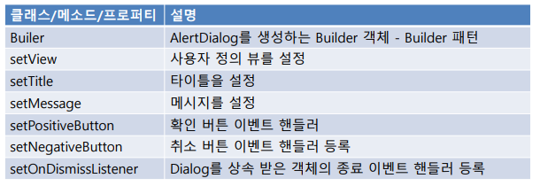
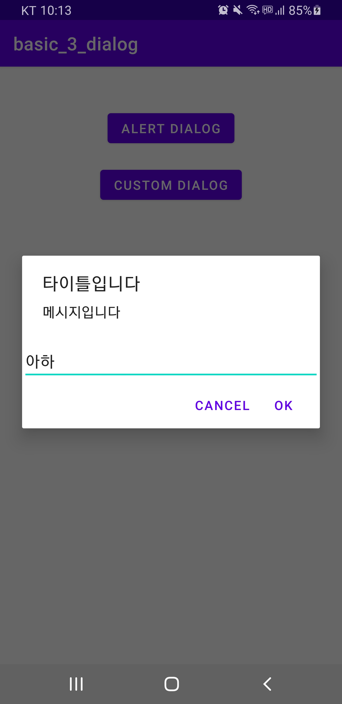
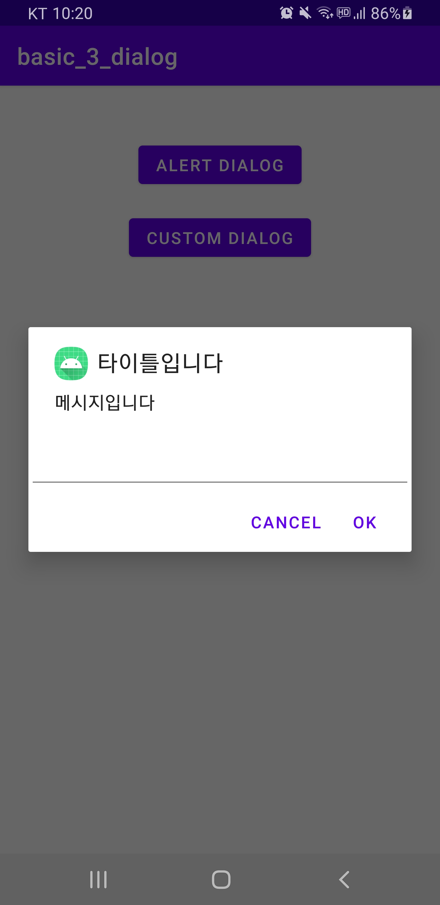
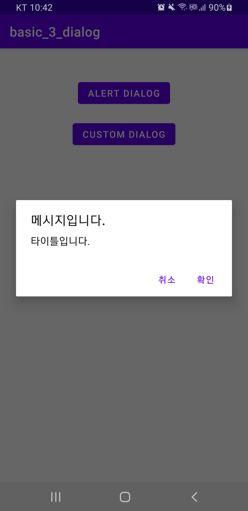
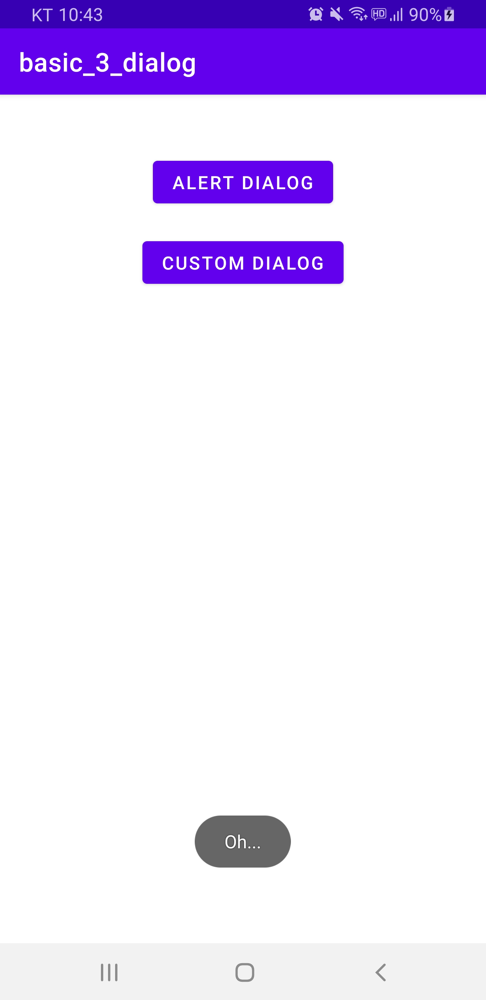
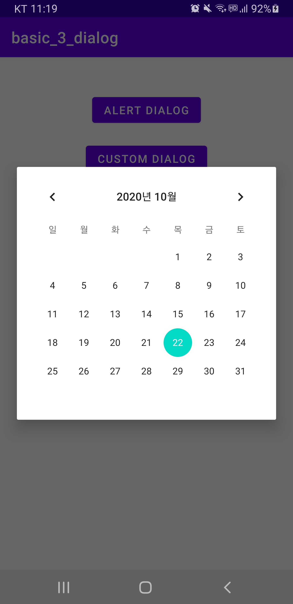
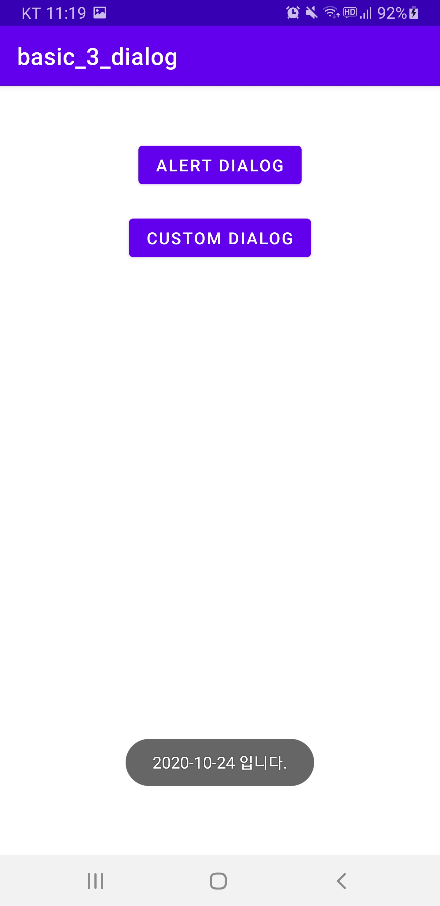
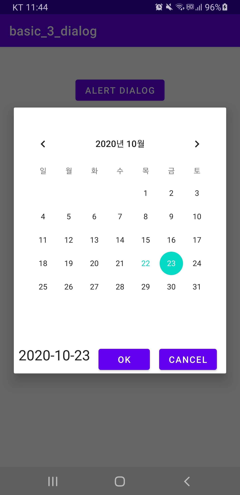
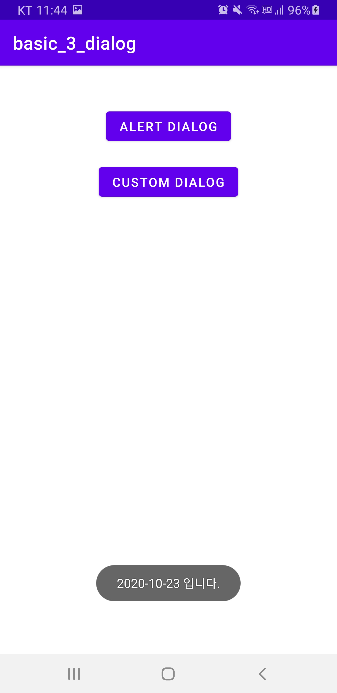

# Dialog

>   Toast : 잠깐 보여준다. 사용자가 놓칠 수 있음
>
>   Noti : 백그라운드 알림
>
>   Dialog : 사용자의 응답을 받아야한다.

<br>

### Dialog

**Dialog 만드는 법**

-   AlertDialog 활용
    -   단순 메시지 출력

-   Dialog 상속 받아 정의
    -   커스텀 레이아웃을 사용하여 화면 구성

<br>

**프로젝트 생성**

-   File > New > New Project …
-   유형: Empty Activity
-   Project Name: basic_3_dialog

<br>

**res/layout/activity_main.xml**

```xml
<?xml version="1.0" encoding="utf-8"?>
<androidx.constraintlayout.widget.ConstraintLayout xmlns:android="http://schemas.android.com/apk/res/android"
    xmlns:app="http://schemas.android.com/apk/res-auto"
    xmlns:tools="http://schemas.android.com/tools"
    android:layout_width="match_parent"
    android:layout_height="match_parent"
    tools:context=".MainActivity">

    <Button
        android:id="@+id/btnAlert"
        android:layout_width="wrap_content"
        android:layout_height="wrap_content"
        android:layout_marginTop="50dp"
        android:text="Alert Dialog"
        app:layout_constraintEnd_toEndOf="parent"
        app:layout_constraintStart_toStartOf="parent"
        app:layout_constraintTop_toTopOf="parent" />

    <Button
        android:id="@+id/btnCustom"
        android:layout_width="wrap_content"
        android:layout_height="wrap_content"
        android:layout_marginTop="20dp"
        android:text="Custom Dialog"
        app:layout_constraintEnd_toEndOf="parent"
        app:layout_constraintStart_toStartOf="parent"
        app:layout_constraintTop_toBottomOf="@+id/btnAlert" />
</androidx.constraintlayout.widget.ConstraintLayout>
```

<br>

### **AlertDialog**

  

<br>

**MainActivity.kt**

```kotlin
package com.example.basic_3_dialog

import androidx.appcompat.app.AppCompatActivity
import android.os.Bundle
import android.text.InputType
import android.widget.EditText
import androidx.appcompat.app.AlertDialog
import kotlinx.android.synthetic.main.activity_main.*

class MainActivity : AppCompatActivity() {
    override fun onCreate(savedInstanceState: Bundle?) {
        super.onCreate(savedInstanceState)
        setContentView(R.layout.activity_main)

        btnAlert.setOnClickListener {
            simpleAlertDialog()
        }
    }

    private fun simpleAlertDialog() {
        val builder = AlertDialog.Builder(this)  // context(컨택스트)

        builder.setTitle("타이틀입니다")

        val input = EditText(this)
        input.inputType = InputType.TYPE_CLASS_TEXT
        builder.setView(input)
        // builder.setIcon(R.mipmap.ic_launcher_round)

        builder.setMessage("메시지입니다")

        builder.setPositiveButton("OK", { dialog, which -> title = input.text.toString() })
        // 앱의 타이틀을 바꿔준다.

        builder.setNegativeButton("Cancel") { 
                dialog, which -> dialog.cancel()
        } // 마지막 매개변수가 람다 함수면 괄호 바깥으로 빼는게 권장 사항

        builder.show()
    }
}
```

<br>

**실행 결과**

    

>   `builder.setIcon(R.mipmap.ic_launcher_round)` 추가 시 아이콘 설정

<br>

<br>

### AnKo 라이브러리 이용

**build.gradle (Module)**

```
dependencies {
   :
    implementation "org.jetbrains.anko:anko:0.10.8"
}
```

<br>

**MainActivity.kt**

```kotlin
package com.example.basic_3_dialog

import androidx.appcompat.app.AppCompatActivity
import android.os.Bundle
import android.text.InputType
import android.widget.EditText
import androidx.appcompat.app.AlertDialog
import kotlinx.android.synthetic.main.activity_main.*
import org.jetbrains.anko.*

class MainActivity : AppCompatActivity() {
    override fun onCreate(savedInstanceState: Bundle?) {
        super.onCreate(savedInstanceState)
        setContentView(R.layout.activity_main)

        btnAlert.setOnClickListener {
            // simpleAlertDialog()
            ankoAlertDialog()
        }
    }

    private fun ankoAlertDialog() {
        alert("타이틀입니다.", "메시지입니다.") {
            yesButton { toast("Oh...")}
            noButton {}
        }.show()
    }

    private fun simpleAlertDialog() {
        val builder = AlertDialog.Builder(this)  // context(컨택스트)

        builder.setTitle("타이틀입니다")

        val input = EditText(this)
        input.inputType = InputType.TYPE_CLASS_TEXT
        builder.setView(input)
        // builder.setIcon(R.mipmap.ic_launcher_round)

        builder.setMessage("메시지입니다")

        builder.setPositiveButton("OK", { dialog, which -> title = input.text.toString() })
        // 앱의 타이틀을 바꿔준다.

        builder.setNegativeButton("Cancel") {
                dialog, which -> dialog.cancel()
        } // 마지막 매개변수가 람다 함수면 괄호 바깥으로 빼는게 권장 사항

        builder.show()
    }
}
```

<br>

**실행 결과**

    


<br>

**영역 밖 및 뒤로가기 터치 시 Alert 제거 현상 방지**

MainActivity.kt

```kotlin
		:
        
        // builder.show()
        builder.setCancelable(false)  // 뒤로가기 버튼을 터치해도 안닫힘
        val dialog = builder.create()
        dialog.setCanceledOnTouchOutside(false)  // 영역 밖에서 터치해도 사라지지 않음
        dialog.show()
    }
}
```

<br>

<br>

### **사용자 정의 Dialog**

-   레이아웃 정의
-   Dialog 클래스를 상속

<br>

**res/layout/dialog_my.xml**

res/layout > New > Layout Resuorce File

File Name : dialog_my

```xml
<?xml version="1.0" encoding="utf-8"?>
<androidx.constraintlayout.widget.ConstraintLayout xmlns:android="http://schemas.android.com/apk/res/android"
    xmlns:app="http://schemas.android.com/apk/res-auto"
    xmlns:tools="http://schemas.android.com/tools"
    android:layout_width="match_parent"
    android:layout_height="match_parent">

    <CalendarView
        android:id="@+id/calendarView"
        android:layout_width="wrap_content"
        android:layout_height="wrap_content"
        android:layout_marginTop="8dp"
        app:layout_constraintTop_toTopOf="parent"
        app:layout_constraintEnd_toEndOf="parent"
        android:layout_marginEnd="8dp"
        android:layout_marginRight="8dp"
        app:layout_constraintStart_toStartOf="parent"
        android:layout_marginLeft="8dp"
        android:layout_marginStart="8dp"
        android:layout_marginBottom="8dp"
        app:layout_constraintBottom_toBottomOf="parent"
        app:layout_constraintHorizontal_bias="0.6"
        app:layout_constraintVertical_bias="0.203"/>

</androidx.constraintlayout.widget.ConstraintLayout>
```

<br>

**MyDialog.kt**

java/com.example.basic_3_dialog > New > Kotlin File/Class

Name : MyDialog

Class 선택

```kotlin
package com.example.basic_3_dialog

import android.app.Dialog
import android.content.Context
import android.os.Bundle
import kotlinx.android.synthetic.main.dialog_my.*

class MyDialog(ctx : Context) : Dialog( ctx ) {
    open var dayString = ""
    override fun onCreate(savedInstanceState: Bundle?) {
        super.onCreate(savedInstanceState)
        setContentView(R.layout.dialog_my)

        // 캘린터 Control의 일정이 바뀔 경우
        // 발생하는 이벤트핸들러 등록 및 구현
        calendarView.setOnDateChangeListener {view, year, month, dayOfMonth ->
            dayString = "${year}-${month+1}-${dayOfMonth} " // 월이 0월부터 시작한다.
            // 월에 +1 해주자!
            dismiss() // 다이얼로그 닫기
        }
    }
}
```

<br>

**MainActivity.kt**

```kotlin
class MainActivity : AppCompatActivity() {
    override fun onCreate(savedInstanceState: Bundle?) {
        :
        btnCustom.setOnClickListener {
            val dlg = MyDialog(this)
            dlg.setOnDismissListener {
                Toast.makeText(this, "${dlg.dayString}입니다.",
                    Toast.LENGTH_LONG).show()
                // 위 두줄 없이 아래처럼도 운용 가능
                // LongToast("${dlg.dayString}입니다.")
            }
            dlg.show()
        }
    }
```

<br>

**실행 결과**

    

<br>

<br>

**날짜를 클릭했을 때 TextView에 보이고 버튼 누르면 대화상자 없어지게 설정하기**

**res/layout/dialog_my.xml**

```xml
<?xml version="1.0" encoding="utf-8"?>
<androidx.constraintlayout.widget.ConstraintLayout xmlns:android="http://schemas.android.com/apk/res/android"
    xmlns:app="http://schemas.android.com/apk/res-auto"
    xmlns:tools="http://schemas.android.com/tools"
    android:layout_width="match_parent"
    android:layout_height="match_parent">

    <CalendarView
        android:id="@+id/calendarView"
        android:layout_width="wrap_content"
        android:layout_height="wrap_content"
        android:layout_marginTop="8dp"
        app:layout_constraintTop_toTopOf="parent"
        app:layout_constraintEnd_toEndOf="parent"
        android:layout_marginEnd="8dp"
        android:layout_marginRight="8dp"
        app:layout_constraintStart_toStartOf="parent"
        android:layout_marginLeft="8dp"
        android:layout_marginStart="8dp"
        android:layout_marginBottom="8dp"
        app:layout_constraintBottom_toBottomOf="parent"
        app:layout_constraintHorizontal_bias="0.6"
        app:layout_constraintVertical_bias="0.203"/>

    <TextView
        android:id="@+id/txtSelectDate"
        android:layout_width="wrap_content"
        android:layout_height="wrap_content"
        android:layout_marginTop="40dp"
        android:text="DATE"
        android:textAppearance="@style/TextAppearance.AppCompat.Large"
        app:layout_constraintStart_toStartOf="@+id/calendarView"
        app:layout_constraintTop_toBottomOf="@+id/calendarView" />

    <Button
        android:id="@+id/btnOk"
        android:layout_width="wrap_content"
        android:layout_height="wrap_content"
        android:layout_marginEnd="16dp"
        android:text="OK"
        app:layout_constraintBaseline_toBaselineOf="@+id/btnCancel"
        app:layout_constraintEnd_toStartOf="@+id/btnCancel" />

    <Button
        android:id="@+id/btnCancel"
        android:layout_width="wrap_content"
        android:layout_height="wrap_content"
        android:layout_marginTop="40dp"
        android:layout_marginEnd="8dp"
        android:text="CANCEL"
        app:layout_constraintEnd_toEndOf="@+id/calendarView"
        app:layout_constraintTop_toBottomOf="@+id/calendarView" />

</androidx.constraintlayout.widget.ConstraintLayout>
```

<br>

**MyDialog.kt**

```kotlin
package com.example.basic_3_dialog

import android.app.Dialog
import android.content.Context
import android.os.Bundle
import kotlinx.android.synthetic.main.dialog_my.*

class MyDialog(ctx : Context) : Dialog( ctx ) {
    open var dayString = ""
    override fun onCreate(savedInstanceState: Bundle?) {
        super.onCreate(savedInstanceState)
        setContentView(R.layout.dialog_my)

        // 캘린터 Control의 일정이 바뀔 경우
        // 발생하는 이벤트핸들러 등록 및 구현
        calendarView.setOnDateChangeListener { view, year, month, dayOfMonth ->
            dayString = "${year}-${month + 1}-${dayOfMonth} " // 월이 0월부터 시작한다.
            // 월에 +1 해주자!
            txtSelectDate.text = dayString
        }

        btnOk.setOnClickListener{
            dismiss() // 다이얼로그 닫기
        }
        btnCancel.setOnClickListener {
            dayString = ""
            dismiss()
        }
    }
}
```

<br>

**실행 결과**

    

>   캘린더 뒤의 Activity의 상태는 **onPause()** 상태이다.

<br>

