# WebBrowser

### 프로젝트 준비

**프로젝트 생성**

-   프로젝트명 : MyWebBrowser

-   Activity 유형 : Basic Activity

-   Anko 라이브러리 추가

    `implementation "org.jetbrains.anko:anko-commons:0.10.8"`

<br>

**AndroidManifest.xml**

```xml
<?xml version="1.0" encoding="utf-8"?>
<manifest xmlns:android="http://schemas.android.com/apk/res/android"
    package="com.example.mywebbrowser">

    <uses-permission android:name="android.permission.INTERNET" />
    :
```

java/com.example.mywebbrowser/`FirstFragment`, `SecondFragment` 삭제

res/layout/`fragment_first.xml`, `fragment_second.xml` 삭제

<br>

<br>

### 화면 구성

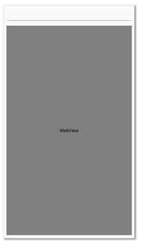  

**activity_main.xml**

-   FloatingActionButton 제거

<br>

**content_main.xml**

```xml
<?xml version="1.0" encoding="utf-8"?>
<androidx.constraintlayout.widget.ConstraintLayout
    xmlns:android="http://schemas.android.com/apk/res/android"
    xmlns:tools="http://schemas.android.com/tools"
    xmlns:app="http://schemas.android.com/apk/res-auto"
    android:layout_width="match_parent"
    android:layout_height="match_parent"
    app:layout_behavior="@string/appbar_scrolling_view_behavior"
    tools:showIn="@layout/activity_main"
    tools:context=".MainActivity">


    <EditText
        android:id="@+id/urlEditText"
        android:layout_width="0dp"
        android:layout_height="wrap_content"
        android:layout_marginStart="8dp"
        android:layout_marginTop="8dp"
        android:layout_marginEnd="8dp"
        android:ems="10"
        android:imeOptions="actionSearch"
        android:inputType="textUri|textPersonName"
        android:text="http://"
        app:layout_constraintEnd_toEndOf="parent"
        app:layout_constraintStart_toStartOf="parent"
        app:layout_constraintTop_toTopOf="parent" />

    <WebView
        android:id="@+id/webView"
        android:layout_width="0dp"
        android:layout_height="0dp"
        app:layout_constraintEnd_toEndOf="parent"
        app:layout_constraintStart_toStartOf="parent"
        app:layout_constraintBottom_toBottomOf="parent"
        android:layout_marginTop="8dp"
        app:layout_constraintTop_toBottomOf="@+id/urlEditText"
        android:layout_marginBottom="8dp"
        android:layout_marginLeft="8dp"
        android:layout_marginStart="8dp"
        android:layout_marginRight="8dp"
        android:layout_marginEnd="8dp" />
</androidx.constraintlayout.widget.ConstraintLayout>
```

>   imeOptions > actionSearch : 키보드 다음키가 Search 아이콘으로 변경
>
>   이것을 이용하여 url을 자동 변경하게 할 것이다.

<br>

**실행 결과**

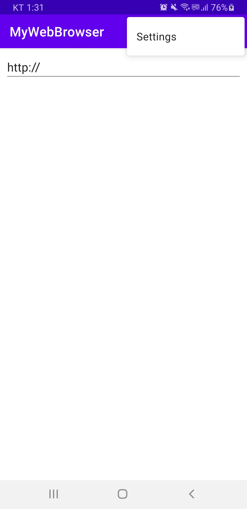  

<br>

<br>

### 웹 브라우저 동작 확인

**MainActivity.kt**

```kotlin
package com.example.mywebbrowser

import android.os.Bundle
import androidx.appcompat.app.AppCompatActivity
import android.view.Menu
import android.view.MenuItem
import android.view.inputmethod.EditorInfo
import android.webkit.WebViewClient
import kotlinx.android.synthetic.main.content_main.*

class MainActivity : AppCompatActivity() {

    override fun onCreate(savedInstanceState: Bundle?) {
        super.onCreate(savedInstanceState)
        setContentView(R.layout.activity_main)

        // 웹뷰 기본 설정
        webView.apply { // this는 webView
            settings.javaScriptEnabled = true
            webViewClient = WebViewClient()
        }
        webView.loadUrl("https://www.google.com")

        // actionSearch 적용 시 url 이동
        urlEditText.setOnEditorActionListener { _, actionId, _ ->
            if (actionId == EditorInfo.IME_ACTION_SEARCH) {
                webView.loadUrl(urlEditText.text.toString())
                true  // 람다 함수 이므로 return 생략 가능
            } else {
                false
            }
        }

        setSupportActionBar(findViewById(R.id.toolbar)) // 아래 두 메뉴 운용을 위함
        
    }

    override fun onCreateOptionsMenu(menu: Menu): Boolean {
        // Inflate the menu; this adds items to the action bar if it is present.
        menuInflater.inflate(R.menu.menu_main, menu)
        return true
    }

    override fun onOptionsItemSelected(item: MenuItem): Boolean {
        // Handle action bar item clicks here. The action bar will
        // automatically handle clicks on the Home/Up button, so long
        // as you specify a parent activity in AndroidManifest.xml.
        return when (item.itemId) {
            R.id.action_settings -> true
            else -> super.onOptionsItemSelected(item)
        }
    }

    // 백 버튼 처리, 없으면 앱 종료
    override fun onBackPressed() {
        if (webView.canGoBack()) {
            webView.goBack()
        } else {
            super.onBackPressed()
        }
    }
}
```

>   http는 버전에 따라 보안상의 이슈로 지원하지 않을 수 있음.
>
>   **http 접근 허용하기**
>
>   AndroidManifest.xml : `android:usesCleartextTraffic="true"` 설정

<br>

**실행 결과**

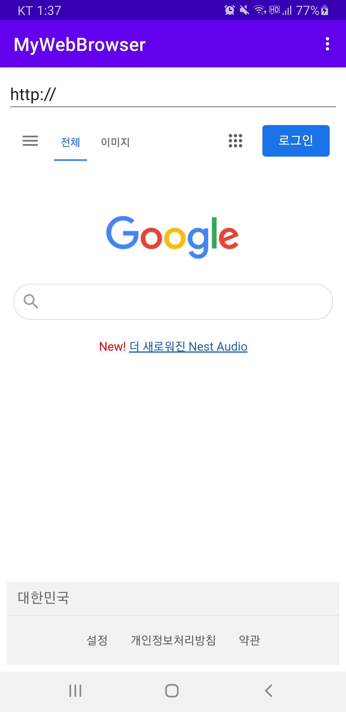  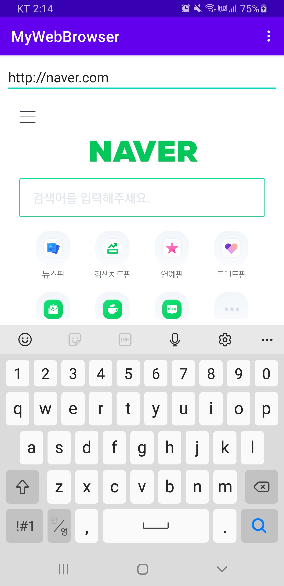  

>   가로모드 변경 시 초기화 된다.

<br>

**뒤로 가기 버튼 3초 안에 한번 더 누를 시 앱 종료**

**MainActivity.kt**

```kotlin
    :
    var backCount = 0  // 뒤로가기 버튼 연속 클릭 횟수
    var counter = 0    // 타이머 함수 실행 횟수

    // 백 버튼 처리, 없으면 앱 종료
    override fun onBackPressed() {
        if (webView.canGoBack()) {
            webView.goBack()
        } else {
            backCount++;
            if(backCount == 1) {
                toast("종료하려면 한번 더 뒤로가기를 누르세요")
                timer(period = 3000) {
                    Log.e("-------", "-------->")
                    if(counter == 1) {
                        backCount = 0
                        counter = 0
                        cancel()
                    } else {
                        counter++
                    }
                }
            } else if (backCount == 2) {
                super.onBackPressed()
            }
        }
    }
}
```

<br>

**실행 결과**

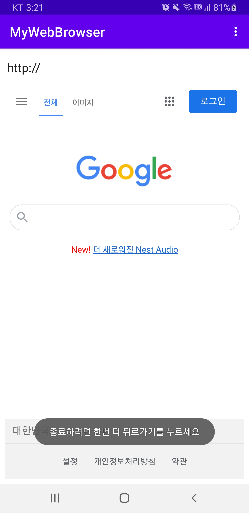  

<br>

<br>

### 메뉴 구성

**메뉴 벡터 이미지 추가**

-   res/drawable > New > Vector Asset
-   Name : ic_baseline_home_24

<br>

**res/menu/menu_main.xml**

```xml
<?xml version="1.0" encoding="utf-8"?>
<menu xmlns:app="http://schemas.android.com/apk/res-auto"
    xmlns:android="http://schemas.android.com/apk/res/android">
    <item android:title="검색 사이트" >
        <menu >
            <item
                android:id="@+id/action_naver"
                android:title="네이버" />
            <item
                android:id="@+id/action_google"
                android:title="구글" />
            <item
                android:id="@+id/action_daum"
                android:title="다음" />
        </menu>
    </item>
    <item android:title="개발자 정보" >
        <menu >
            <item
                android:id="@+id/action_call"
                android:title="연락처" />
            <item
                android:id="@+id/action_send_text"
                android:title="문자 보내기" />
            <item
                android:id="@+id/action_email"
                android:title="이메일 보내기" />
        </menu>
    </item>
    <item
        android:id="@+id/action_home"
        android:icon="@drawable/ic_baseline_home_24"
        android:title="Home"
        app:showAsAction="ifRoom" />  // ActionBar에 공간이 남아있으면 표시
</menu>
```

<br>

<br>

### 메뉴 처리

**MainActivity.kt** 수정

```kotlin
    :
    // 옵션 메뉴 작성
    override fun onOptionsItemSelected(item: MenuItem): Boolean {
        when (item?.itemId) {
            R.id.action_google, R.id.action_home -> { // , 의미 : 또는
                webView.loadUrl("http://www.google.com")
                return true
            }
            R.id.action_naver -> {
                webView.loadUrl("http://www.naver.com")
                return true
            }
            R.id.action_daum -> {
                webView.loadUrl("http://www.daum.net")
                return true
            }
            R.id.action_call -> {
                // 암묵적 intent 호출
                val intent = Intent(Intent.ACTION_DIAL)
                intent.data = Uri.parse("tel:031-123-4567")
                if (intent.resolveActivity(packageManager) != null) {
                    startActivity(intent)
                }
                return true
            }
            R.id.action_send_text -> {
                sendSMS("031-123-4567", webView.url.toString()) // null 이면 null 문자가 내용이 됨
                return true
            }
            R.id.action_email -> {
                webView.url?.let { email("test@example.com", "좋은 사이트", it)}
                return true
            }
        }
        return super.onOptionsItemSelected(item)
    }
    :
```

<br>

**실행 결과**

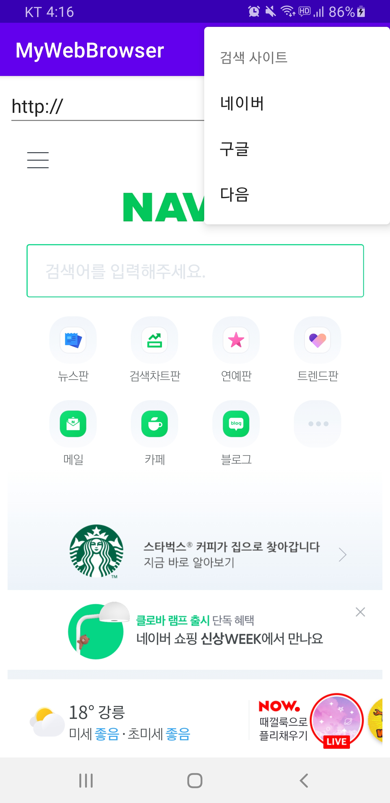  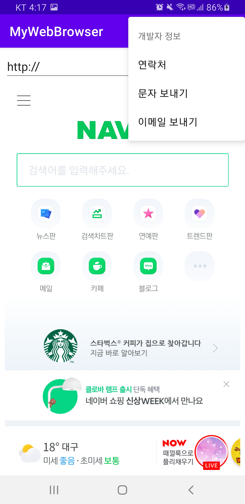  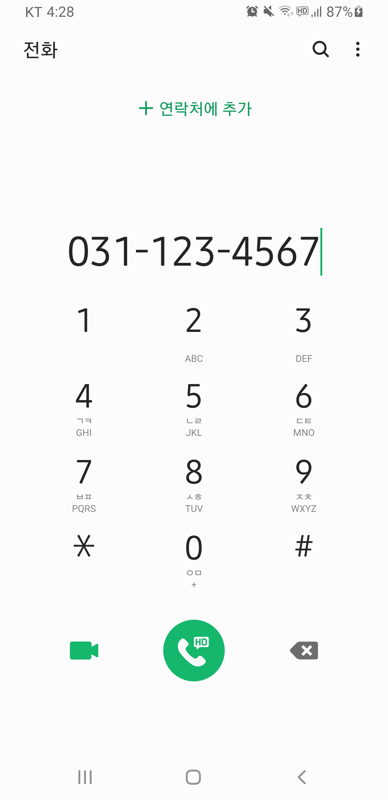  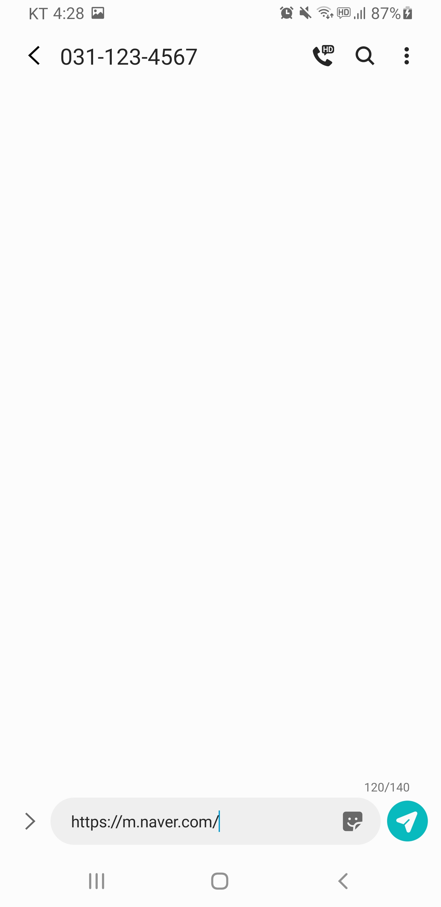  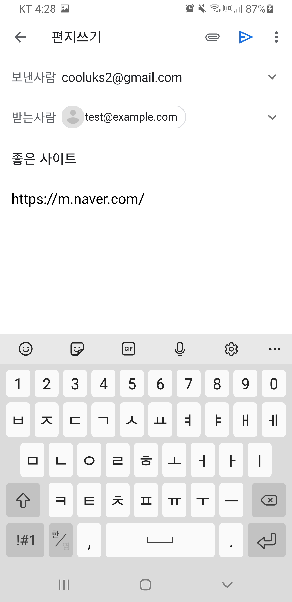  

<br>

<br>

### 컨텍스트 메뉴 구성

-   long Click - 길게 눌렀을 때 메뉴

-   res/menu > New > Menu Resource File

-   Name : menu_context

**res/menu/menu_context.xml**

```xml
<?xml version="1.0" encoding="utf-8"?>
<menu xmlns:android="http://schemas.android.com/apk/res/android">
    <item
        android:id="@+id/action_share"
        android:title="페이지 공유" />
    <item
        android:id="@+id/action_browser"
        android:title="기본 브라우저에서 열기" />
</menu>
```

<br>

### 컨택스트 메뉴 처리

**MainActivity.kt**

```kotlin
class MainActivity : AppCompatActivity() {

    override fun onCreate(savedInstanceState: Bundle?) {
        super.onCreate(savedInstanceState)
        setContentView(R.layout.activity_main)
        :
        
        // 컨텍스트 메뉴 등록
        registerForContextMenu(webView)
    }

    // 컨텍스트 메뉴 작성
    override fun onCreateContextMenu(menu: ContextMenu?, v: View?,
                                     menuInfo: ContextMenu.ContextMenuInfo?) {
        super.onCreateContextMenu(menu, v, menuInfo)
        menuInflater.inflate(R.menu.menu_context, menu)
    }
    override fun onContextItemSelected(item: MenuItem): Boolean {
        when (item?.itemId) {
            R.id.action_share -> {
                webView.url?.let { share(it) }
            }
            R.id.action_browser -> {
                webView.url?.let { browse(it) }
            }
        }
        return super.onContextItemSelected(item)
    }
    :
```

>   webView를 long click 했을 때 실행하겠다.

<br>

**실행 결과**

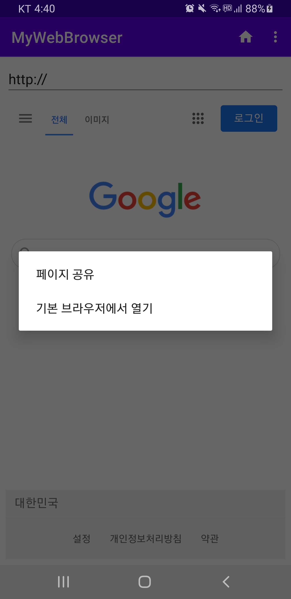  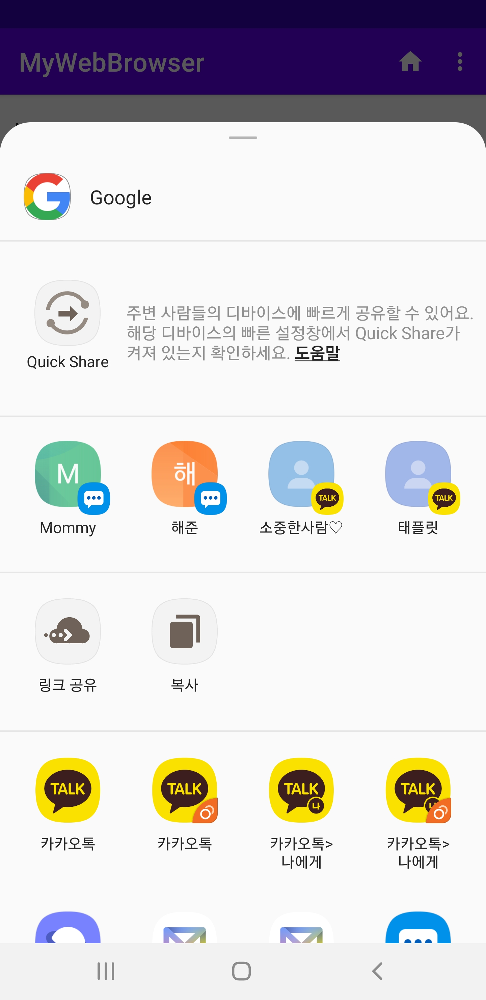  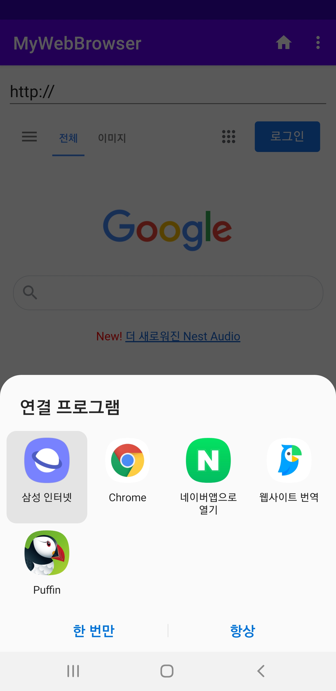  

<br>