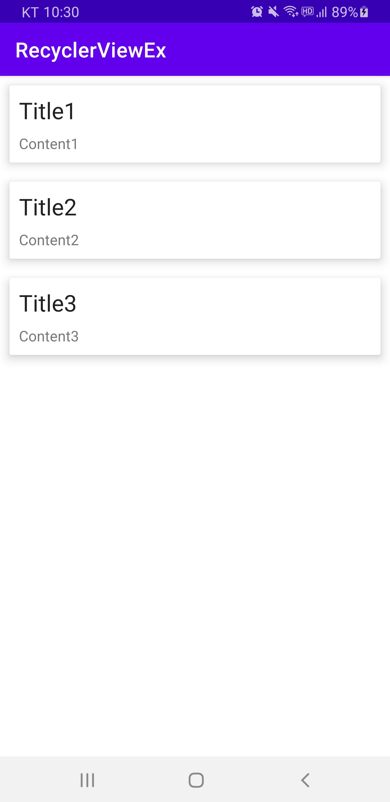
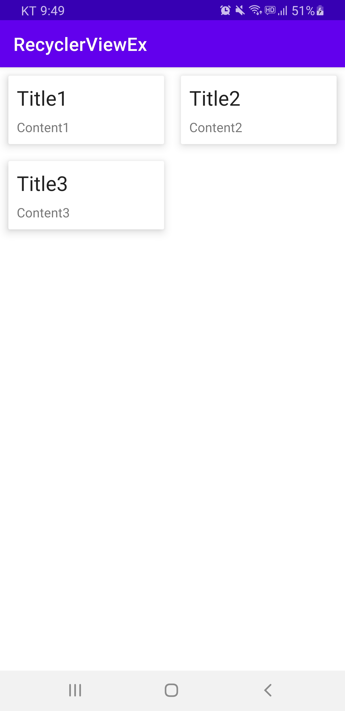

# RecyclerView

**프로젝트 생성**

-   프로젝트명 : RecyclerViewEx

-   Activity 유형 : Empty Activity

<br>

**activity_main.xml**

```xml
<?xml version="1.0" encoding="utf-8"?>
<androidx.constraintlayout.widget.ConstraintLayout xmlns:android="http://schemas.android.com/apk/res/android"
    xmlns:app="http://schemas.android.com/apk/res-auto"
    xmlns:tools="http://schemas.android.com/tools"
    android:layout_width="match_parent"
    android:layout_height="match_parent"
    tools:context=".MainActivity">

    <androidx.recyclerview.widget.RecyclerView
        android:id="@+id/rv_main_list"
        android:layout_width="0dp"
        android:layout_height="0dp"
        app:layout_constraintBottom_toBottomOf="parent"
        app:layout_constraintLeft_toLeftOf="parent"
        app:layout_constraintRight_toRightOf="parent"
        app:layout_constraintTop_toTopOf="parent" />
</androidx.constraintlayout.widget.ConstraintLayout>
```

<br>

**MainData.kt**

-   java/com.example.recyclerviewex > `New` > `Kotlin File/Class` > `Class`

```kotlin
package com.example.recyclerviewex

data class MainData(val title:String, val content:String)
```

>   Adapter 패턴

<br>

**item_main.xml**

-   res/layout > `New` > `Layout Resource File`
    -   File name : `item_main`
    -   Root element : `androidx.cardview.widget.CardView`

```xml
<?xml version="1.0" encoding="utf-8"?>
<androidx.cardview.widget.CardView xmlns:android="http://schemas.android.com/apk/res/android"
    xmlns:app="http://schemas.android.com/apk/res-auto"
    android:layout_width="match_parent"
    android:layout_height="wrap_content"
    android:layout_margin="10dp"
    android:orientation="vertical"
    app:cardElevation="8dp">

    <LinearLayout
        android:layout_width="match_parent"
        android:layout_height="match_parent"
        android:layout_margin="10dp"
        android:orientation="vertical">

        <TextView
            android:id="@+id/tv_main_title"
            android:layout_width="match_parent"
            android:layout_height="wrap_content"
            android:text="TextView"
            android:textAppearance="@style/TextAppearance.AppCompat.Large" />

        <TextView
            android:id="@+id/tv_main_content"
            android:layout_width="match_parent"
            android:layout_height="wrap_content"
            android:layout_marginTop="8dp"
            android:text="TextView"
            android:textAppearance="@style/TextAppearance.AppCompat.Small" />
    </LinearLayout>
</androidx.cardview.widget.CardView>
```

<br>

### RecylerView를 위한 어댑터

-   RecyclerView.Adapter를 상속
    -   T : ViewHolder 클래스
-   오바라이드 메서드
    -   `onCreateViewHolder(parent: ViewGroup, p1: Int): ViewHolder`
        -   아이템과 연관된 ViewHolder 생성 후 이를 리턴
    -   `override fun getItemCount(): Int`
        -   어댑터가 관리하는 아이템의 전체 개수 리턴
    -   `override fun onBindViewHolder(holer: ViewHolder,position: Int)`
        -   ViewHolder의 위젯에 데이터 설정


-   ViewHolder 클래스 정의
    -   어댑터의 내부 클래스로 정의
    -   RecyclerView.ViewHolder 클래스 상속

<br>

**MainAdapter.kt**

-   java/com.example.recyclerviewex > `New` > `Kotlin File/Class` > `Class`

-   어댑터 기본 골격 구성

    ```kotlin
    class MainAdapter : RecyclerView.Adapter<MainAdapter.MainViewHolder>()
    {
        inner class MainViewHolder(itemView: View) :
            RecyclerView.ViewHolder(itemView) {
        }
    }
    ```

    >   오바라이드 메서드를 구현하지 않으면 빨간 밑줄이 나옴 3개 추가해주자.

-   미 구현 메서드 추가

```kotlin
package com.example.recyclerviewex

import android.view.LayoutInflater
import android.view.View
import android.view.ViewGroup
import androidx.recyclerview.widget.RecyclerView
import kotlinx.android.synthetic.main.item_main.view.*

class MainAdapter : RecyclerView.Adapter<MainAdapter.MainViewHolder>()
{
    var items: MutableList<MainData> = mutableListOf(
        MainData("Title1", "Content1"),
        MainData("Title2", "Content2"),
        MainData("Title3", "Content3"))

    // 2번째 호출
    override fun onCreateViewHolder(parent: ViewGroup, p1: Int): MainViewHolder {
        val view = LayoutInflater.from(parent.context)
            .inflate(R.layout.item_main, parent, false)
        return MainViewHolder(view)
    }
    
    // 1번째 호출
    override fun getItemCount(): Int = items.size

    // 4번째 호출
    override fun onBindViewHolder(holder: MainViewHolder,
                                  position: Int) {
        items[position].let { item ->
            with(holder) {
                tvTitle.text = item.title
                tvContent.text = item.content
            }
        }
    }

    // 3번째 호출
    inner class MainViewHolder(itemView: View) : RecyclerView.ViewHolder(itemView) {
        val tvTitle = itemView.tv_main_title
        val tvContent = itemView.tv_main_content
    }
}
```

<br>

**MainActivity.kt**

```kotlin
package com.example.recyclerviewex

import androidx.appcompat.app.AppCompatActivity
import android.os.Bundle
import androidx.recyclerview.widget.LinearLayoutManager
import kotlinx.android.synthetic.main.activity_main.*

class MainActivity : AppCompatActivity() {
    override fun onCreate(savedInstanceState: Bundle?) {
        super.onCreate(savedInstanceState)
        setContentView(R.layout.activity_main)
        rv_main_list.adapter = MainAdapter()
        rv_main_list.layoutManager = LinearLayoutManager(this)
    }
}
```

<br>

**실행 결과**

  

<br>

<br>

### 데이터 MainActivity에서 관리하기 - 실전

**MainActivity.kt**

```kotlin
package com.example.recyclerviewex

import androidx.appcompat.app.AppCompatActivity
import android.os.Bundle
import androidx.recyclerview.widget.LinearLayoutManager
import kotlinx.android.synthetic.main.activity_main.*

class MainActivity : AppCompatActivity() {
    var items: MutableList<MainData> = mutableListOf(
        MainData("Title1", "Content1"),
        MainData("Title2", "Content2"),
        MainData("Title3", "Content3"))

    override fun onCreate(savedInstanceState: Bundle?) {
        super.onCreate(savedInstanceState)
        setContentView(R.layout.activity_main)

        rv_main_list.adapter = MainAdapter(items)
        rv_main_list.layoutManager = GridLayoutManager(this,2)

        // 기존
//        rv_main_list.adapter = MainAdapter()
//        rv_main_list.layoutManager = LinearLayoutManager(this)

//        rv_main_list.adapter = MainAdapter()
//        rv_main_list.layoutManager = GridLayoutManager(this,2) // Linear가 아닌 Grid 방식 운용 시
    }
}
```

<br>

**MainAdapter.kt**

```kotlin
package com.example.recyclerviewex

import android.view.LayoutInflater
import android.view.View
import android.view.ViewGroup
import androidx.recyclerview.widget.RecyclerView
import kotlinx.android.synthetic.main.item_main.view.*

// var이 없으면 지역변수, var을 추가 : 생성자 매개변수 앞에 var이 붙으면 멤버 변수로 활용하겠다는 뜻
class MainAdapter(var items: MutableList<MainData>) : RecyclerView.Adapter<MainAdapter.MainViewHolder>() {
    // var items: MutableList<MainData> = items 를 단축시킨 것

    // 3번째 호출
    inner class MainViewHolder(itemView: View) : RecyclerView.ViewHolder(itemView) {
        val tvTitle = itemView.tv_main_title
        val tvContent = itemView.tv_main_content
    }

    // 2번째 호출
    override fun onCreateViewHolder(parent: ViewGroup, p1: Int): MainViewHolder {
        val view = LayoutInflater.from(parent.context)
            .inflate(R.layout.item_main, parent, false)
        return MainViewHolder(view)
    }

    // 4번째 호출
    override fun onBindViewHolder(holder: MainViewHolder,
                                  position: Int) {
        items[position].let { item ->
            with(holder) {
                tvTitle.text = item.title
                tvContent.text = item.content
            }
        }
    }

    // 1번째 호출
    override fun getItemCount(): Int = items.size

}
```

<br>

**실행 결과**

  