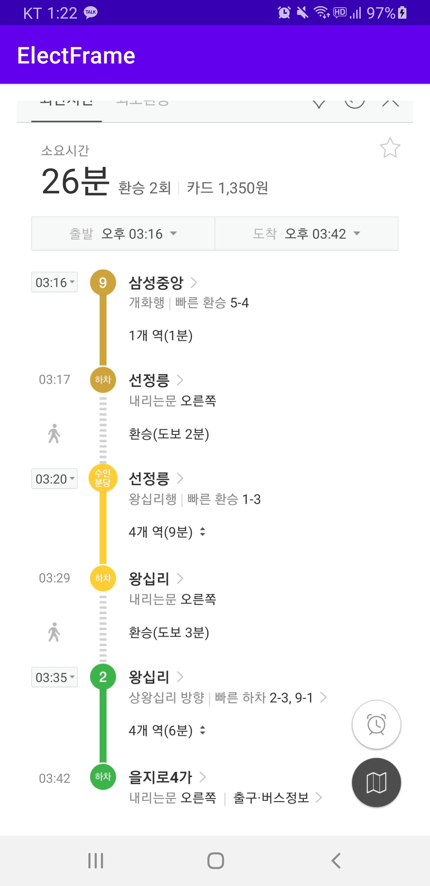
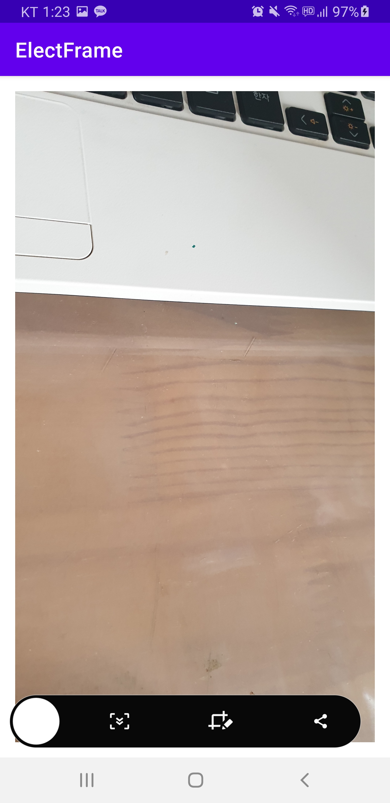

# 전자액자

>   핸드폰의 gallery 이용 밀어내기로 사진 변경

<br>

### 프로젝트 만들기

**프로젝트 생성**

-   프로젝트명 : ElectFrame
-   액티비티 유형 : Empty Activity

<br>

**Glide 라이브러리 추가**

-   build.gradle(Module:app)

    ```
    dependencies {
        implementation 'com.github.bumptech.glide:glide:4.9.0'
        annotationProcessor 'com.github.bumptech.glide:compiler:4.9.0'
        implementation "org.jetbrains.anko:anko-commons:0.10.8"
        :
    ```

    >   이미지 불러오는 라이브러리 + Anko

<br>

### 권한 설정

**AndroidManifest.xml**

```xml
<?xml version="1.0" encoding="utf-8"?>
<manifest xmlns:android="http://schemas.android.com/apk/res/android"
    package="com.example.electframe">

    <uses-permission
        android:name="android.permission.READ_EXTERNAL_STORAGE" />
    :
```

>   permission denied 오류
>
>   AndroidManifest.xml 파일의 application 항목에
>
>   `android:requestLegacyExternalStorage="true"` 추가

<br>

### PhotoFragment

**프래그먼트 만들기**

-   java > com.example.electframe > `New` > `Fragment` > `Fragment(Blank)`
    -   Fragment 명 : PhotoFragment
    -   Fragment Layout 명 : fragment_photo
    -   ~~Include fragment factory method 체크~~ (이전 버전)
    -   ~~Include interface callbacks 체크 해제~~ (이전 버전)

<br>

**fragment_photo.xml**

```xml
<?xml version="1.0" encoding="utf-8"?>
<androidx.constraintlayout.widget.ConstraintLayout
    xmlns:android="http://schemas.android.com/apk/res/android"
    xmlns:app="http://schemas.android.com/apk/res-auto"
    xmlns:tools="http://schemas.android.com/tools"
    android:layout_width="match_parent"
    android:layout_height="match_parent"
    tools:context=".PhotoFragment">

    <ImageView
        android:id="@+id/imageView"
        android:layout_width="match_parent"
        android:layout_height="match_parent"
        android:layout_marginStart="8dp"
        android:layout_marginTop="8dp"
        android:layout_marginEnd="8dp"
        android:layout_marginBottom="8dp"
        app:layout_constraintBottom_toBottomOf="parent"
        app:layout_constraintEnd_toEndOf="parent"
        app:layout_constraintStart_toStartOf="parent"
        app:layout_constraintTop_toTopOf="parent"
        tools:src="@tools:sample/avatars"
        android:scaleType="centerCrop" />
</androidx.constraintlayout.widget.ConstraintLayout>
```

<br>

**PhotoFragment.kt**

```kotlin
package com.example.electframe

import android.os.Bundle
import androidx.fragment.app.Fragment
import android.view.LayoutInflater
import android.view.View
import android.view.ViewGroup


// TODO: Rename parameter arguments, choose names that match
// the fragment initialization parameters, e.g. ARG_ITEM_NUMBER
private const val ARG_URI = "uri"


class PhotoFragment : Fragment() {
    // TODO: Rename and change types of parameters
    private var uri: String? = null

    // 데이터 초기화, View는 아직 없음
    override fun onCreate(savedInstanceState: Bundle?) {
        super.onCreate(savedInstanceState)
        arguments?.let {
            uri = it.getString(ARG_URI)
        }
    }

    // View 생성 (inflate)
    override fun onCreateView(
        inflater: LayoutInflater, container: ViewGroup?,
        savedInstanceState: Bundle?
    ): View? {
        // Inflate the layout for this fragment
        return inflater.inflate(R.layout.fragment_photo, container, false)
    }

    companion object {
        @JvmStatic
        fun newInstance(uri: String) =
            PhotoFragment().apply {
                arguments = Bundle().apply {
                    putString(ARG_URI, uri)
                }
            }
    }
}
```

-   프레그먼트 초기화
    -   Glide 라이브러리로 이미지 로드하기

```kotlin
:
import com.bumptech.glide.Glide
import kotlinx.android.synthetic.main.fragment_photo.*
:
    // 개별 (프래그먼트) 뷰 초기화
    override fun onViewCreated(view: View,
                               savedInstanceState: Bundle?) {
        super.onViewCreated(view, savedInstanceState)

        // Glide로 이미지 로드하기, 이미지 uri를 읽어서 ImageView에 출력하도록 해야함.
        Glide.with(this).load(uri).into(imageView)
        // uri로 파일도 읽어주고, 웹 주소도 읽어준다. 크기 및 회전 등 효과도 가능
    }
	:
}
```

<br>

### ViewPager를 위한 어댑터

java > com.example.electframe > `New` > `Kotlin File/Class` > `Class`

**PhotoPagerAdapter.kt**

```kotlin
package com.example.electframe

import androidx.fragment.app.Fragment
import androidx.fragment.app.FragmentManager
import androidx.fragment.app.FragmentPagerAdapter

class PhotoPagerAdapter(fm: FragmentManager, val uriList: List<String>) : FragmentPagerAdapter(fm) {
    override fun getItem(position: Int): Fragment {
        return PhotoFragment.newInstance(uriList[position])
    }
    override fun getCount(): Int = uriList.size
}
```

<br>

### 메인 화면

**activity_main.xml**

```xml
<?xml version="1.0" encoding="utf-8"?>
<androidx.constraintlayout.widget.ConstraintLayout
    xmlns:android="http://schemas.android.com/apk/res/android"
    xmlns:tools="http://schemas.android.com/tools"
    xmlns:app="http://schemas.android.com/apk/res-auto"
    android:layout_width="match_parent"
    android:layout_height="match_parent"
    tools:context=".MainActivity">


    <androidx.viewpager.widget.ViewPager
        android:id="@+id/viewPager"
        android:layout_width="match_parent"
        android:layout_height="match_parent"
        android:layout_marginStart="8dp"
        android:layout_marginTop="8dp"
        android:layout_marginEnd="8dp"
        android:layout_marginBottom="8dp"
        app:layout_constraintBottom_toBottomOf="parent"
        app:layout_constraintEnd_toEndOf="parent"
        app:layout_constraintStart_toStartOf="parent"
        app:layout_constraintTop_toTopOf="parent" />

</androidx.constraintlayout.widget.ConstraintLayout>
```

<br>

### 런타임 권한 획득

**위험 권한 획득**

-   `onCreate()`에서 권한 획득 여부 조사
    -   ContextCompat.checkSelfPermission()
    -   과거 권한 획득 했었다면 초기화
    -   그렇지 않다면 권한 획득 요청
-   `onRequestPermissionsResult()` 에서 권한 요청 결과 확인
    -   권한을 얻었다면 초기화
    -   그렇지 않다면 종료

<br>

**PermissionChecker 클래스 정의**

-   권한 검사를 일반화하여 지원

<br>

### 권한 검사기

java > com.example.electframe > `New` > `Kotlin File/Class` > `Class`

**PermissionChecker.kt**

```kotlin
package com.example.electframe

import android.content.pm.PackageManager
import androidx.appcompat.app.AppCompatActivity
import androidx.core.app.ActivityCompat
import androidx.core.content.ContextCompat

class PermissionChecker(val activity: AppCompatActivity,
                        val permissions: Array<String>,
                        val requestCode: Int = 1000) {
    fun check(): Boolean {
        val notGranted = permissions.filter {
            ContextCompat.checkSelfPermission(activity, it) !=
                    PackageManager.PERMISSION_GRANTED
        }
        if(notGranted.isEmpty()) { // 권한 획득
            return true
        }
        
        // 미획득 권한이 있는 경우
        ActivityCompat.requestPermissions(activity, permissions, requestCode)
        return false
    }
    
    fun checkGranted(requestCode: Int,
                     permissions: Array<out String>,
                     grantResults: IntArray) : Boolean {
        
        if( requestCode == this.requestCode) {
            val notGranted = permissions.filterIndexed { index, s ->
                grantResults[index]!=PackageManager.PERMISSION_GRANTED
            }
            if(notGranted.isEmpty()) {
                return true
            }
        }
        return false
    }
}
```

<br>

### 런타임 권한 요청 및 검사

**MainActivity.kt**

```kotlin
package com.example.electframe

import android.Manifest
import androidx.appcompat.app.AppCompatActivity
import android.os.Bundle
import org.jetbrains.anko.longToast

class MainActivity : AppCompatActivity() {

    lateinit var permissionChecker: PermissionChecker
    
    override fun onCreate(savedInstanceState: Bundle?) {
        super.onCreate(savedInstanceState)
        setContentView(R.layout.activity_main)

        val permissions = arrayOf(
            Manifest.permission.READ_EXTERNAL_STORAGE)

        permissionChecker = PermissionChecker(this, permissions)
        if (permissionChecker.check()) {
            // 초기화
            longToast("권한 획득 했었음")
        }
    }
    override fun onRequestPermissionsResult(
        requestCode: Int,
        permissions: Array<out String>,
        grantResults: IntArray) {
        super.onRequestPermissionsResult(
            requestCode, permissions,grantResults)

        if(permissionChecker.checkGranted(
                requestCode, permissions,grantResults)){
            // 모든 권한 획득 성공
            // 초기화
            longToast("권한 획득 성공")

        } else {
            // 권한 획득 실패
            longToast("권한 거부 됨")
        }
    }
}
```

<br>

### 미디어 스토어 이미지 획득하기

**이미지 컨텐트 프로바이더로 부터 이미지 목록 얻기**

java > com.example.electframe > `New` > `Kotlin File/Class` > `Class`

**MediaImage.kt**

```kotlin
package com.example.electframe

import android.provider.MediaStore
import android.util.Log
import androidx.appcompat.app.AppCompatActivity

class MediaImage(val ctx: AppCompatActivity) {
    // List는 LinkedList, ArrayList 두 종류가 있다.
    fun getAllPhotos(): ArrayList<String> { // java
        // 모든 사진 정보 가져오기
        val cursor = ctx.contentResolver.query( // select
            MediaStore.Images.Media.EXTERNAL_CONTENT_URI,
            null, // where절
            null,  // groupby절
            null, // having절
            MediaStore.Images.ImageColumns.DATE_TAKEN + " DESC" // orderby절
        )

        val imageUris = ArrayList<String>()

        cursor?.use {
            while (it.moveToNext()) {
                // 사진 경로 Uri 가지고 오기
                val uri = it.getString(it.getColumnIndexOrThrow(
                    MediaStore.Images.Media.DATA))
                Log.d("MainActivity", uri)
                imageUris.add(uri)
            }
        }
        return imageUris
    }
}
```

<br>

### 이미지를 PhotoFragment로 출력하기

**MainActivity.kt**

```kotlin
package com.example.electframe

import android.Manifest
import androidx.appcompat.app.AppCompatActivity
import android.os.Bundle
import kotlinx.android.synthetic.main.activity_main.*
import org.jetbrains.anko.longToast
import kotlin.concurrent.timer

class MainActivity : AppCompatActivity() {

    lateinit var permissionChecker: PermissionChecker

    override fun onCreate(savedInstanceState: Bundle?) {
        super.onCreate(savedInstanceState)
        setContentView(R.layout.activity_main)

        val permissions = arrayOf(
            Manifest.permission.READ_EXTERNAL_STORAGE)

        permissionChecker = PermissionChecker(this, permissions)
        if (permissionChecker.check()) {
            init()
            // 초기화
            longToast("권한 획득 했었음")
        }
    }
    override fun onRequestPermissionsResult(
        requestCode: Int,
        permissions: Array<out String>,
        grantResults: IntArray) {
        super.onRequestPermissionsResult(
            requestCode, permissions,grantResults)

        if(permissionChecker.checkGranted(
                requestCode, permissions,grantResults)){
            init()
            // 모든 권한 획득 성공
            // 초기화
            longToast("권한 획득 성공")

        } else {
            // 권한 획득 실패
            longToast("권한 거부 됨")
        }
    }

    private fun init() {
        val mediaImage = MediaImage(this)
        val adapter = PhotoPagerAdapter(supportFragmentManager, mediaImage.getAllPhotos())

        viewPager.adapter = adapter

        // 3초마다 자동으로 슬라이드
        timer(period = 3000) {
            runOnUiThread {
                if (viewPager.currentItem < adapter.count - 1) {
                    viewPager.currentItem = viewPager.currentItem + 1
                } else {
                    viewPager.currentItem = 0
                }
            }
        }
    }
}
```

<br>

**실행 결과**

>   버전차이인가... 코드가 같아도 나만 실행이 안된다.
>
>   **해결**
>
>   permission denied 오류
>
>   AndroidManifest.xml 파일의 application 항목에
>
>   `android:requestLegacyExternalStorage="true"` 추가

<br>

    