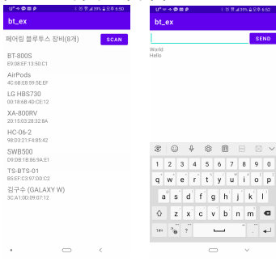
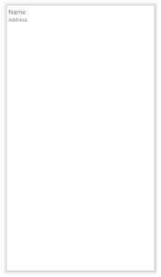
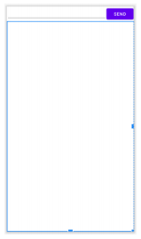
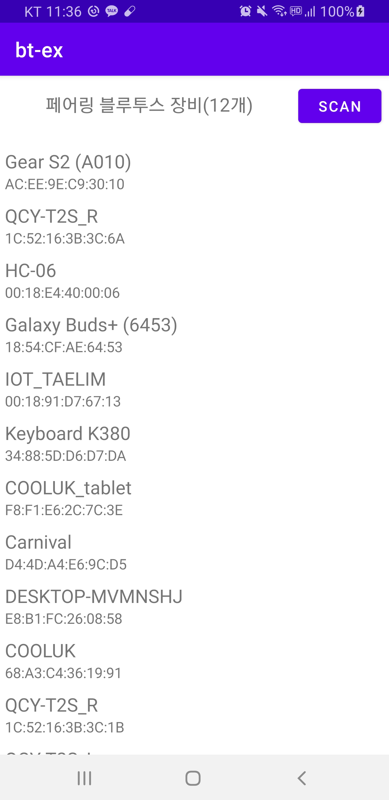

# 안드로이드 블루투스 통신

**스마트 폰으로 아두이노 제어하기**

  

<br>

**요약**

-   권한
    -   android.permission.BLUETOOTH
    -   android.permission.BLUETOOTH_ADMIN
-   스레드 구현
    -   네트워크 작업은 Ui 스레드에서 할 수 없음
    -   연결 및 데이터 수신은 작업 스레드에서 수행

<br>

### 프로젝트 만들기

**프로젝트 생성**

-   프로젝트명 : bt_ex
-   액티비티 유형 : Empty Activity

<br>

**AndroidManifest.xml**

```xml
<manifest xmlns:android="http://schemas.android.com/apk/res/android"
    package="com.example.bt_ex">

    <uses-permission android:name="android.permission.BLUETOOTH" />
    <uses-permission android:name="android.permission.BLUETOOTH_ADMIN" />
    :
```

>   위험 권한은 아님

<br>

**activity_main.xml**

```xml
<?xml version="1.0" encoding="utf-8"?>
<androidx.constraintlayout.widget.ConstraintLayout xmlns:android="http://schemas.android.com/apk/res/android"
    xmlns:app="http://schemas.android.com/apk/res-auto"
    xmlns:tools="http://schemas.android.com/tools"
    android:layout_width="match_parent"
    android:layout_height="match_parent"
    android:orientation="vertical"
    tools:context=".MainActivity">

    <TextView
        android:id="@+id/stateBluetooth"
        android:layout_width="wrap_content"
        android:layout_height="wrap_content"
        android:layout_marginStart="8dp"
        android:layout_marginEnd="8dp"
        android:text=""
        android:textAppearance="@style/TextAppearance.AppCompat.Medium"
        app:layout_constraintBaseline_toBaselineOf="@+id/btnScan"
        app:layout_constraintEnd_toStartOf="@+id/btnScan"
        app:layout_constraintStart_toStartOf="parent" />

    <Button
        android:id="@+id/btnScan"
        android:layout_width="wrap_content"
        android:layout_height="wrap_content"
        android:layout_marginTop="8dp"
        android:layout_marginEnd="8dp"
        android:text="Scan"
        app:layout_constraintEnd_toEndOf="parent"
        app:layout_constraintTop_toTopOf="parent" />

    <androidx.recyclerview.widget.RecyclerView
        android:id="@+id/listDevice"
        android:layout_width="match_parent"
        android:layout_marginTop="16dp"
        app:layoutManager="androidx.recyclerview.widget.LinearLayoutManager"
        app:layout_constraintBottom_toBottomOf="parent"
        app:layout_constraintTop_toBottomOf="@+id/btnScan"
        android:layout_height="0dp" />

</androidx.constraintlayout.widget.ConstraintLayout>
```

<br>

**MainActivity.kt**

```kotlin
package com.example.bt_ex

import android.app.Activity
import android.bluetooth.BluetoothAdapter
import android.bluetooth.BluetoothDevice
import android.content.Intent
import androidx.appcompat.app.AppCompatActivity
import android.os.Bundle
import kotlinx.android.synthetic.main.activity_main.*
import org.jetbrains.anko.AnkoLogger
import org.jetbrains.anko.startActivity
import org.jetbrains.anko.toast

class MainActivity : AppCompatActivity(), AnkoLogger{
    val bluetoothAdapter: BluetoothAdapter? by lazy {
        BluetoothAdapter.getDefaultAdapter()
    }
    private val REQUEST_ENABLE_BT = 100

    override fun onCreate(savedInstanceState: Bundle?) {
        super.onCreate(savedInstanceState)
        setContentView(R.layout.activity_main)
        if( bluetoothAdapter == null) {
            toast("단말기는 블루투스를 지원하지 않습니다.")
            finish()
            return
        }
        checkBluetoothDevices()
        btnScan.setOnClickListener {
            scanDevice()
        }
    }

    fun checkBluetoothDevices() {
        if(bluetoothAdapter!!.isEnabled) {
            stateBluetooth.text ="Bluetooth is Enabled"
            // 블루투스 장치 검색 버튼 활성화
            btnScan.isEnabled = true
            scanDevice()
        } else {
            stateBluetooth.text = "Bluetooth is Not Enabled!"
            var enableBtIntent = Intent(BluetoothAdapter.ACTION_REQUEST_ENABLE)
            startActivityForResult(enableBtIntent, REQUEST_ENABLE_BT)
        }
    }

    override fun onActivityResult(requestCode: Int, resultCode: Int,
                                  data: Intent?) {
        if(requestCode == REQUEST_ENABLE_BT) {
            if(resultCode == Activity.RESULT_OK) {
                // 활성화 요청에 대해 정상적으로 승인을 받음
                stateBluetooth.text ="Bluetooth is Enabled"
                toast("블루투스가 활성화 되었습니다.")
            } else {
                stateBluetooth.text ="Bluetooth is Not Enabled"
                toast("블루투스 활성화 요청이 취소되었거나 예외가 발생하였습니다.")
            }
        }
        super.onActivityResult(requestCode, resultCode, data)
    }

    fun scanDevice() {
        // 페어링되어 있는 디바이스 집합 추출
        val devices = bluetoothAdapter!!.bondedDevices
        if (devices.size == 0) {
            stateBluetooth.text = "연결된 블루투스가 장비가 없습니다."
        } else {
            stateBluetooth.text = "페어링 블루투스 장비(${devices.size}개)"
            val adapter = DeviceAdapter(devices.toList(), ::onIemClick)
            listDevice.adapter = adapter
        }
    }
    fun onIemClick(device: BluetoothDevice) {
        startActivity<BluetoothActivity>("device" to device)
        // toast("${device.name} 선택")
    }
}
```

<br>

<br>

**item_bluetoothdevice.xml**

  

```xml
<?xml version="1.0" encoding="utf-8"?>
<LinearLayout xmlns:android="http://schemas.android.com/apk/res/android"
    android:layout_width="match_parent"
    android:layout_height="wrap_content"
    android:orientation="vertical"
    android:padding="5dp">
    <TextView
        android:id="@+id/txtName"
        android:layout_width="match_parent"
        android:layout_height="wrap_content"
        android:text="Name"
        android:textAppearance="@style/TextAppearance.AppCompat.Medium" />
    <TextView
        android:id="@+id/txtAddress"
        android:layout_width="match_parent"
        android:layout_height="wrap_content"
        android:text="Address"
        android:textAppearance="@style/TextAppearance.AppCompat.Small" />
</LinearLayout>
```

<br>

**DeviceAdapter.kt**

```kotlin
package com.example.bt_ex

import android.bluetooth.BluetoothDevice
import android.view.LayoutInflater
import android.view.View
import android.view.ViewGroup
import androidx.recyclerview.widget.RecyclerView
import kotlinx.android.synthetic.main.item_bluetoothdevice.view.*

class DeviceAdapter(val deviceList: List<BluetoothDevice>,
                    val onItemClick: (device: BluetoothDevice)->Unit ):
    RecyclerView.Adapter<DeviceAdapter.ViewHolder>() {
    class ViewHolder(val layoutView: View) : RecyclerView.ViewHolder(layoutView)
    {
        val txtName = layoutView.txtName
        val txtAddress = layoutView.txtAddress
        fun bind(device: BluetoothDevice) {
            txtName.text = device.name
            txtAddress.text = device.address.toString()
        }
    }

    override fun onCreateViewHolder(parent: ViewGroup, viewType: Int):
            ViewHolder {
        val layout = LayoutInflater.from(parent.context)
            .inflate(R.layout.item_bluetoothdevice, parent, false)
        return ViewHolder(layout)
    }
    override fun getItemCount(): Int = deviceList.size
    override fun onBindViewHolder(holder: ViewHolder, position: Int) {
        val device = deviceList[position]
        holder.bind(device)
        holder.layoutView.setOnClickListener {
            onItemClick(device)
        }
    }
}
```

<br>

<br>

### BluetoothActivity

-   블루투스 연결 및 메시지 송수신 처리
    -   작업스레드를 내부 클래스로 정의
    -   연결 및 데이터 수신은 작업 스레드가 수행

<br>

**activity_bluetooth.xml**

  

```xml
<?xml version="1.0" encoding="utf-8"?>
<LinearLayout
    xmlns:android="http://schemas.android.com/apk/res/android"
    android:layout_width="match_parent"
    android:layout_height="match_parent"
    android:orientation="vertical">
    <LinearLayout
        android:layout_width="match_parent"
        android:layout_height="wrap_content"
        android:orientation="horizontal">
        <EditText
            android:id="@+id/editMessage"
            android:layout_width="0px"
            android:layout_weight="1"
            android:layout_height="wrap_content"/>
        <Button
            android:id="@+id/btnSend"
            android:layout_width="wrap_content"
            android:layout_height="wrap_content"
            android:onClick="onSend"
            android:text="Send" />
    </LinearLayout>
    <TextView
        android:id="@+id/receiveMsgView"
        android:layout_width="match_parent"
        android:layout_height="match_parent"/>
</LinearLayout>
```

<br>

**BluetoothActivity.kt**

```kotlin
package com.example.bt_ex

import android.bluetooth.BluetoothDevice
import android.os.Bundle
import androidx.appcompat.app.AppCompatActivity
import kotlinx.android.synthetic.main.activity_bluetooth.*
import org.jetbrains.anko.toast
import java.io.BufferedReader
import java.io.InputStreamReader
import java.io.OutputStreamWriter
import java.io.PrintWriter
import java.util.*

class BluetoothActivity : AppCompatActivity() {
    var out: PrintWriter? = null

    override fun onCreate(savedInstanceState: Bundle?) {
        super.onCreate(savedInstanceState)
        setContentView(R.layout.activity_bluetooth)

        btnSend.setOnClickListener {
            // 메시지 전송
            out?.print("${editMessage.text}\r\n")
            out?.flush()
            editMessage.setText("")
        }

        val device = intent.getParcelableExtra<BluetoothDevice>("device")!!
        BtWorkThread(device).start()
    }

    inner class BtWorkThread(val device: BluetoothDevice) : Thread() {
        override fun run() {
            try {
                var uuid = UUID.fromString(
                    "00001101-0000-1000-8000-00805F9B34FB"
                );
                val socket = device.createRfcommSocketToServiceRecord(uuid);
                socket.connect();
                runOnUiThread { toast("블루투스 연결 성공") }

                val br = BufferedReader(
                    InputStreamReader(socket.getInputStream())
                )
                out = PrintWriter(OutputStreamWriter(socket.getOutputStream()))

                while (!Thread.currentThread().isInterrupted()) {
                    // 메시지 수신
                    val message = br.readLine();
                    runOnUiThread {
                        receiveMsgView.text =
                            "$message\n${receiveMsgView.text}";
                    }
                }
                socket.close()
            } catch (e: Exception) {
                runOnUiThread { toast("블루투스 연결 실패") }
                finish();
            }
        }
    }
    override fun onDestroy() {
        super.onDestroy();
//        btThread?.interrupt();
    }
}


```

<br>

### 실행 결과

  

<br>


