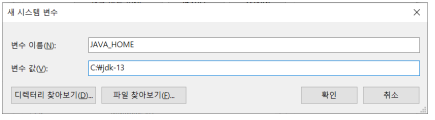
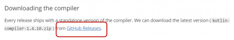
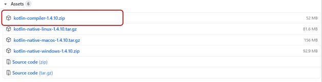
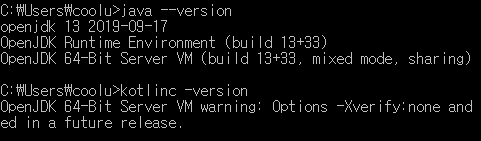

# Kotlin 개발환경 구축

**OpenJDK 설치**

-   https://jdk.java.net/java-se-ri/13

    -   Windows 10 x64 Java Development Kit 다운로드
    -   C:\jdk-13로 압축 해제

-   `JAVA_HOME` 환경 변수 추가

    -   값: `C:\jdk-13`

          

-   PATH 환경변수에 값 추가
    -   `C:\jdk-13\bin`

 

**Kotlin 컴파일러 설치**

-   https://kotlinlang.org/docs/tutorials/command-line.html

        

    

      

-   PATH 환경 변수 값 추가
    -   C:\kotlinc\bin

 

**확인**

-   \> `java --version`
-   \> `kotlinc -version`

  

 

**Vscode Kotlin 확장팩 설치**

-   Kotlin language

  