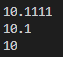
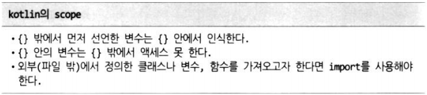

# Kotlin의 기본

### main 함수

-   코틀린 프로그램 실행의 진입점(entry point)

```kotlin
fun main(args : Array<String>){
}
```

<br>

**ex01_first.kt**

```kotlin
package basic

fun main(args : Array<String>){
    println("안녕하세요. kotlin입니다")
    // 종결자 없이도 실행가능
}
```

  

---

>   args 선언하고 사용하지 않아 오류 : 지금은 무시하자
>
>   .kt 파일 → (Kotlinc) → Java + *.jar : java VM 이 있어야한다.

\> `java -jar ex01_first.jar` : 오류 메시지 출력 X

<br>

<br>

### 변수 선언

  

>   `var 변수명 = 값` : 가장 많이쓰는 형식

<br>

**ex02_variable.kt**

```kotlin
package basic

fun varTest() {
    // 1. 변수의 타입을 미리 정함
    var num : Int // 초기화하지 않아도 됨.
    num = 1

    // 2. 변수의 타입을 정하지 않음
    // 아래는 초기화 반드시 해야함.
    // var number; <-- 에러임
    var number = 2
    // 아래도 에러발생
    // number = "";
    // 즉, 선언과 함께 초기화를 하면 알아서 타입을 정하는 기능정도인 듯.
}

fun valTest() {
    // val은 const와 같은 읽기전용값임.
    val num = 1
    val name : String
    name = ""

    // 에러임. 이미 할당한 값을 재할당 못함.
    // msg = "저장";
}

fun main(args : Array<String>){
    // 변수를 정의하는 방법은 2가지
    // "var, val" 구분해야 함.
    varTest() // R/W 가능변수
    valTest() // ReadOnly 변수
}
```

<br>

<br>

### 숫자형 변수

-   Double 
-   Float 
-   Long 
-   Int 
-   Short 
-   Byte

<br>

**ex03_DataType_number.kt**

```kotlin
package basic

fun main(args : Array<String>){
    // 숫자형 DataType 크기 순으로 선언
    var doubleValue : Double = 10.1111
    var floatValue : Float = 10.1f
    var longValue : Long = 10
    var intValue : Int = 10
    var shortValue : Short = 10
    var byteValue : Byte = 10

    println(doubleValue)
    println(floatValue)
    println(intValue)
    
    // 크기변환 후, 대입 : 캐스팅
    // to대입할크기() 메소드를 사용한다.
    // ** as로 형변환은 기본형에서는 안된다. **
    doubleValue = intValue.toDouble()
    intValue = doubleValue.toInt()
}
```

  

---

<br>

<br>

### 문자형 변수(String)

  

<br>

**ex04_DataType_string.kt**

```kotlin
package basic

import java.util.*

fun main(args : Array<String>){
    var sName = "문자열 테스트입니다. "

    // 1.문자열을 추가하는 것은 + 연산자로 가능함 <- Java와 동일
    println (sName + " : 문자열 붙이기")

    // 2. """ 이 안에 줄넘김 문자열이 들어갈 수 있다. """
    var sTest = """
    어떻게 출력 될지..
모르겠지만
    마치 HTML의 <pre>와 비슷할....
        듯
    """
    println(sTest)

    // 3. 문자열 내의 포멧팅 방법
    // linux의 bash와 비슷함.

    var sTest2 = "sName의 값을 가져오는 것: $sName"
    println(sTest2)
    
    // 4. linux bash와 비슷하니
    // ${}안에
    // 함수호출이나 수식처리도 가능함.
    // Date는 자바 객체, 앞에서 import java.util.* 필요
    var sTest3 = "sName의 값을 가져오는 것: ${sName + "움하하하" + Date()}"
    println(sTest3)
}
```

  

---

<br>

<br>

### 범위(scope)

  

<br>

**ex05_scope.kt**

```kotlin
package basic

// ** 변수를 사용하려면 이전(주로 이전 Line)에 선언되어 있어야 한다. **
// 변수를 이해할 수 있는 경우...
// 1. {} 안에서 이전 Line에 선언되어 있다.
// 2. 전역변수(함수 밖{}의 변수)로 이전에 선언되어 있다.
// 3. 클래스 멤버필드로 선언되어 있다.
var gName : String = "전역처리"

fun main(args : Array<String>){
    println(gName);
    
    // {}안의 변수는 {} 밖에서 접근못함.
    if(true){
        var lName = "지역처리"
        println(lName)
        println(gName)
    }
    // 모르는 변수라 에러발생.
    //println(lName)
}
```

  

---

<br>

<br>

### 함수

  

<br>

**ex06_basicfunction.kt**

```kotlin
package basic
// fun 함수명(변수명 : 데이터크기, ...) : 리턴값 { return; }
fun funByReturn(s: String): Any? {
    return s + "-를 입력받았습니다."
}
// Any? : 리턴값 타입

fun funByParameter(i: Int, s: String) {
    println (i.toString() + s)
}

// 한줄 짜리
fun funByInline(i: Int, i1: Int) = i * i1

fun funByNoParam() {
    println ("매개변수 없어요")
}

// 함수를 정의한 변수
val funcVariable = { s : String -> println (s)}
// 람다 함수
var funVarByType : (String) -> Any? = ::funByReturn
// C++ 함수 포인터와 같다.

fun main(args : Array<String>){
    funByNoParam()
    funByParameter(3, " 숫자입니다")
    println (funByReturn("3을 넘기니"))
    println(funByInline(3, 10))

    funcVariable ("함수형 변수 1")
    println( funVarByType("함수형 변수 2") )
}
```

  

---

<br>

<br>

### Any Type

-   동적 타입 운영
-   어떠한 타입의 데이터도 대입 가능

<br>

**ex07_any_type.kt**

```kotlin
package basic

fun main(args : Array <String>){
    // any는 C에서 void*와 같은 역할을 하는 듯.
    // 어떠한 데이터 형의 변수이던간에 담을 수 있는 크기.
    var anything : Any

    anything = 1
    anything = "문자열"
    anything = 111.01010
    anything = 10.00f
    
    // is와 !(not) 연산자로 어떤 데이터 형인지 채크가 가능함.
    if(anything !is String) {
        if (anything is Float) {
            println("float입니다")
        }
    }
}
```

  

---

<br>

<br>

### 제어문

-   if
    -   if() 
    -   if() {} else {} 
    -   if() {} else if() {} … else {}
-   반복문
    -   for()
    -   while()
-   선택문
    -   when() {비교값->{}; 비교값->{}; … }

<br>

**ex08_condition.kt**

```kotlin
package basic

fun ifExample() {
    // 비교문
    //var a : Any? = "aaaa";
    //var a : Any? = 10.00f;
    //var a : Any? = 8;
    var a : Any? = null;

    if (a == "aaaa"){ // ==를 이용한 값비교
        println ("문자:" + a )

    } else if( a is Float ) { // is를 이용한 형비교
        println ("숫자:" + a)

    } else if (a in (0..9) ){ // in을 이용한 범위비교
        println ("0-10까지 숫자")

    } else if (a == null ){
        println ("null!")
    }
}

fun loopExample() {
    // 반복문 for: in과 (시작..끝)으로 반복가능
    for (i in (0..10)){
        println ("i -> " + i )
    }

    // 반복문 while: while(조건){}
    var i : Int = 0;
    while(i < 10){
        i++; println ("$i 입니다.")
    }
}

fun caseExample() {
    //var obj : Any? = "aaaa";
    var obj : Any? = 10.00f
    //var obj : Any? = 8;

    when(obj){
        "aaaa"      ->{println ("문자:" + obj )}
        is Float    ->{println ("숫자:" + obj)}
        in (0 .. 9) ->{println ("0-10까지 숫자")}
        else        ->{println ("???")}
    }
}

fun main(args : Array<String>){
    ifExample()
    loopExample()
    caseExample()
}
```

  

---

<br>

  

<br>

<br>

### 레이블(함수형 프로그래밍의 필수 요소)

  

<br>

**ex09_label.kt**

```kotlin
package basic

fun doubleLoop() {
    for(i in 0 .. 2){
        for (j in 0.. 10){
            if (j == 2) break
            println("i->$i, j->$j")
        }
        println("j loop end")
    }
    println("i loop end")
}

// @레이블 지정 후, break@레이블로 나감
fun ExitDoubleLoop() {
    HereToExit@ for(i in 0 .. 2){
        for (j in 0.. 10){
            if (j == 5) break@HereToExit;
            println("i->$i, j->$j")
        }
        println("j loop end");
    }
    println("i loop end");
}

// 이름없는 함수(람다식)의 리턴
var lambdaReturn = Exit@{
    if(true){
        return@Exit 3
    }
    1000 // return이 생략된 것
}

fun main(args : Array<String>){
    doubleLoop();
    println("=================>")
    ExitDoubleLoop();
    println( lambdaReturn() )
}
```

  

---

<br>

<br>

### 컬렉션

  


  


  

<br>

-   map 메서드

      

<br>

-   filter 메서드

      

<br>

**ex10_collections.kt**

```kotlin
package basic

fun main(args : Array<String>){
    // 읽기전용 - list. 데이터형을 마구 섞어도 된다.
    val lst = listOf(1, "헉", 3.00f, true)
    for (i in 0 .. lst.size- 1){
        println ( lst.get(i).toString() )
    }

    // 수정가능 - List. 데이터형을 미리 정해야 하는 듯.
    println("__________")
    var lstEditable = mutableListOf<String>()

    // add 메소드로 추가
    lstEditable.add("나는야")
    lstEditable.add("우주의")
    lstEditable.add("판타지")
    lstEditable.add("이박사")

    for(s in lstEditable){
        println(s)
    }
    println("__________")

    // remove 메소드로 삭제
    lstEditable.removeAt(0);
    for(s in lstEditable){
        println(s)
    }

    println("__________")

    var m = hashMapOf("고양이" to 1, "강아지" to 2)
    println(m["고양이"])
}
```

  

---

<br>

<br>

### 예외 처리

**ex11_trycatch.kt**

```kotlin
package basic

import java.io.BufferedReader
import java.io.FileReader

fun main(args : Array<String>){
    // try catch를 강제적으로 할 필요가 없다는 말임.
    // 그것보다는 알아서 방어코드를 만들라는 것이 kotlin 철학임.
    try{
        13 / 0
    } catch(e: Exception){
        println(e)
    } finally {
        println("마지막 수행.")
    }

    var zerodivided = 13 / 0;
    println(zerodivided)

    // kotlin은 try .. catch문을 반드시 할필요가 없다.

    val 'in' = BufferedReader(FileReader("file경로명"))
    var s: String?

    s = 'in'.readLine()
    while (s != null) {
        println(s)
        s = 'in'.readLine()
    }
    'in'.close()
}
```

  

---

<br>

```kotlin
    // kotlin은 try .. catch문을 반드시 할필요가 없다.

    val 'in' = BufferedReader(FileReader("file경로명"))
    var s: String?

    s = 'in'.readLine()
    while (s != null) {
        println(s)
        s = 'in'.readLine()
    }
    'in'.close()
}
```

<br>

<br>

### Null 처리

  

<br>

**ex12_variable_null.kt**

```kotlin
package basic

fun main(args : Array<String>){
    // null 채크를 좀 심하게 하는 언어같음.
    // null을 넣는다고 다 들어가지 않음.
    // 변수기본이 null을 대입할 수 없음.
    // 아무래도 null처리로 인한 버그가 많으므로
    // kotlin이라는 언어는 그것을 강하게 제어하겠다는 의지로 보임.
    
    var number : Int? = 10
    number = null
    
    // 사용법: data형 끝에 ?를 붙인다.
}
```

<br>