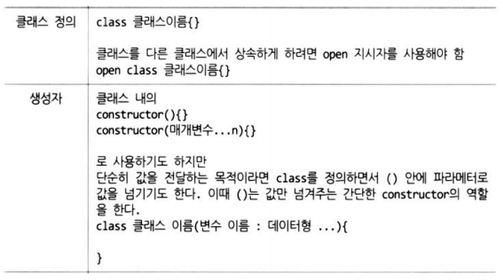
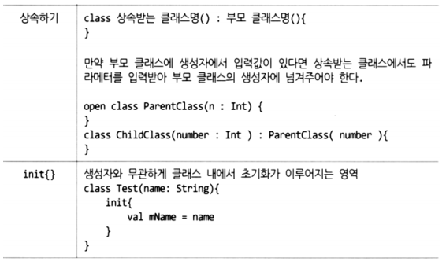
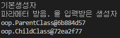
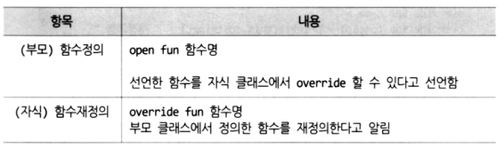
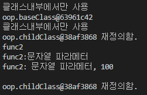
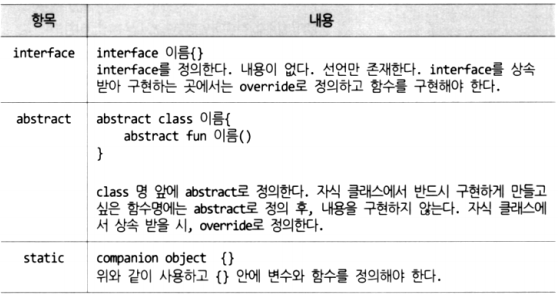
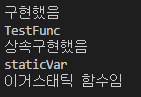
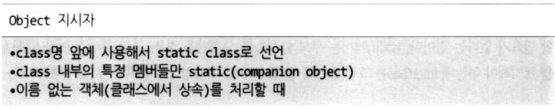
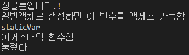
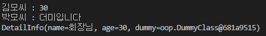

# Kotlin 객체지향 프로그래밍

### 클래스와 상속

  


  

<br>

**ex01_class.kt**

```kotlin
package oop

// class passwd(변수명: 데이터형, ..){} 으로 생성자를 만들어쓰기도 한다.
class TestClass{
    var name : String = "";

    // 기본 생성자
    constructor(){
        println("기본생성자");
    }
    // 오버로딩된 생성자
    constructor(name : String ){
        this.name = name;
        println("$name 을 입력받은 생성자");
    }
}

// kotlin에서는 기본적으로 상속이 거부되어 있다.
// 선조클래스를 open으로 지정해야 한다.
open class ParentClass {
    var name : String = this.toString(); // __str__(self)와 같다.
    fun getMyName() : String = name;
}

// 상속받을 떄는 선조클래스를 "class passwd : 선조클래스명(생성자인자){}"
// 형식으로 해야 한다.
class ChildClass : ParentClass(){
}

fun main(args : Array<String>){
    var obj1 = TestClass();
    var obj2 = TestClass("파라메터 받음.");

    var obj3 = ParentClass();
    println( obj3.getMyName() );

    var obj4 = ChildClass();
    println( obj4.getMyName() );
}
```

  

---

<br>

<br>

### overloading, override

  

<br>

**ex02_polymorphism.kt**

```kotlin
package oop

open class baseClass{
    // 상속받은 클래스에서 오버라이드하려면 선조클래스에서 open으로 정의.
    open var name = "base";
    open fun func1() = println(this.toString());

    // 외부사용금지 .찍고 메소드 사용못함.
    private fun onlyMyFunc() = println("클래스내부에서만 사용");
    constructor(){
        onlyMyFunc();
    }
}

class childClass : baseClass(){
    override var name = "";
    override fun func1() = println(this.toString() + " 재정의함.");
    fun func2() = println("func2");

    // overloding
    fun func2(s : String ) = println("func2:$s ");
    fun func2(s : String, num : Int ) = println("func2: $s, $num ");
}

fun main(args : Array<String>){
    var obj1 = baseClass();
    obj1.func1();

    var obj2 = childClass();
    obj2.func1();
    obj2.func2();
    obj2.func2("문자열 파라메터");
    obj2.func2("문자열 파라메터", 100);

    println()
    var obj3 : baseClass = obj2  // 가능한가? 가능
    obj3.func1()  // 부모, 자식 중 어느 것이 호출되는가?
    // obj3.func2()  // 가능한가? 불가능
}
```

  

---

<br>

<br>

### Interface, abstract, static

  

<br>

```kotlin
package oop
interface SimpleInterface{
    fun TestFunc();
}

class SimpleImp : SimpleInterface{
    override fun TestFunc() = println ("구현했음");
}

abstract class TestAbstract{
    fun TestFunc() = println("TestFunc");
    abstract fun abstractFunc();
}

class TestAbstractImp : TestAbstract(){
    override fun abstractFunc() = println("상속구현했음");
    
    // companion object {} 안에서 구현해야 static 가능
    companion object {
        var staticVar = "staticVar";
        fun staticFunc() = println("이거스태틱 함수임");
    }
}

fun main(args : Array<String>){
    // SimpleInterface
    SimpleImp().TestFunc();
    var obj : SimpleInterface;

    // 추상화
    // 아래 코드는 다음과 같이도 가능함
    // TestAbstractImp().apply { TestFunc(); abstractFunc(); }
    var obj2 = TestAbstractImp();
    obj2.TestFunc();
    obj2.abstractFunc();
    
    // static
    println( TestAbstractImp.staticVar);
    TestAbstractImp.staticFunc() ;
}
```

  

---

<br>

<br>

### object

  

<br>

**ex04_Object.kt**

```kotlin
package oop

object SingleTon {
    var printMSG = { msg : String -> println(msg) }
}

class NormalClass{
    var msg: String = "일반객체로 생성하면 이 변수를 액세스 가능함"
    // companion object {} 안에서 구현해야 static 가능
    companion object {
        var staticVar = "staticVar"
        fun staticFunc()= println("이거스태틱 함수임")
    }
}

abstract class fakeClickHandler{
    var msg : String = "abstract 클래스입니다"
    abstract fun onClick()
}

// object 사용예
fun main(args: Array<String>) {
    // 1. 클래스 전체를 싱글톤으로 사용할 때, 마치 java의 static class
    //var 싱글톤변수 = SingleTon()
    SingleTon.printMSG("싱글톤입니다.!")

    val obj = NormalClass()
    println(obj.msg)
    // 아래는 객체이므로 접근하지 못하는 에러코드임
    // 객체.staticVar

    // 2. 자바의 static method를 사용하듯...
    println( NormalClass.staticVar )
    NormalClass.staticFunc()

    // 3.이름없는 클래스 객체를 만들고 사용할 때...
    // 주로 상속받고 필요한 함수만 오버라이드
    var obj2 = object : fakeClickHandler(){
        fun dummyFunc() = "눌렀다"
        override fun onClick() {
            println(dummyFunc())
        }
    }

    obj2.onClick()
}
```

  

---

<br>

<br>

### data class

  

<br>

**ex05_dataclass.kt**

```kotlin
package oop

class DummyClass{
    var DummyData : String? = null
}

data class BasicInfo(var name : String, var age : Int)

data class DetailInfo(var name : String, var age : Int = 30,
                    var dummy :DummyClass? = null )

fun main(args: Array<String>) {
    var data1 = BasicInfo("김모씨", 30)
    var data2 = DetailInfo(name = "박모씨", dummy = DummyClass().apply{ DummyData = "더미입니다" })
    
    var (name1, age1) = data1
    println ("$name1 : $age1")
    
    var (name2, age2, dummy) = data2
    println ("$name2 : ${dummy?.DummyData}")
    
    // 이 부분이 제일 유용함
    var data3 = data2.copy(name = "회장님")
    println ("${data3.toString()}")
}
```

  

---

<br>