# MongoDB 이해하기

<br>

### 설치

https://www.mongodb.com/

Software > Community Server > Download > 2개 체크 해제

환경변수 PATH 등록 : `C:\Program Files\MongoDB\Server\4.4\bin`

<br>

### 소개

**NoSQL (No SQL DBMS)**

-    NoSQL DBMS의 네 가지 분류

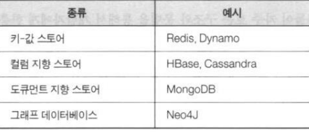  

<br>

### MongoDB 소개

**관계형 모델과 MongDB 모델**

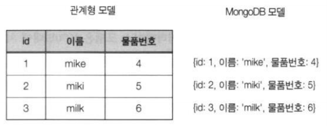  

<br>

**관계형 모델과 MongoDB 모델의 도식 차이**

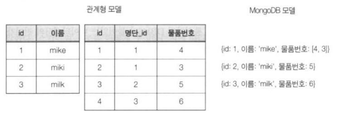  

<br>

### 언제 어떻게 써야 할까?

스키마가 자주 바뀌는 환경

분산 컴퓨팅 환경

  

<br>

**MongoDB 실행**

-   서버 실행

    \> `mongod`

    -   `c:\data\db` 디렉토리가 있어야 함
        -   디폴트 데이터 저장 디렉토리
        -   없으면 에러

-   클라이언트 실행

    \> `mongo`

<br>

### MongoDB 구조

**MongoDB 구성 요소**

  

<br>

**BSON 구조의 도큐먼트 형식**

-   BSON : Binary JSON(JavaScript Object Notaion)

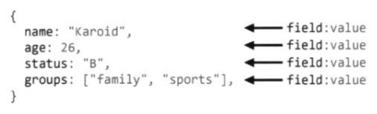  

<br>

**데이터베이스와 컬렉션 생성**

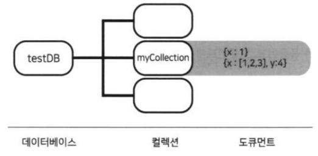  

<br>

**데이터베이스와 컬렉션 생성**

-   데이터베이스 생성
    -   `use 데이터베이스명`
        -   지정한 데이터베이스가 존재하면 그대로 사용
        -   없으면 새로 생성
        -   db 전역변수로 참조
-   컬레션 생성
    -   `db.<collection 명>`으로 문서를 저장
        -   문서가 처음 저장될 때 컬렉션 자동 생성

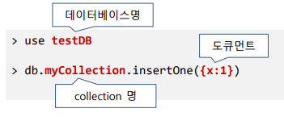  

<br>

**데이터베이스와 컬레션 조회**

-   `db`
    -   현재 사용중인 데이터베이스명 출력
-   `show dbs`
    -   모든 데이터베이스명 출력
-    `show collections`
    -   현재 사용 중인 데이터베이스에 있는 컬렉션 목록 출력

<br>

### 데이터 타입

**BSON 구조의 다양한 데이터 타입**

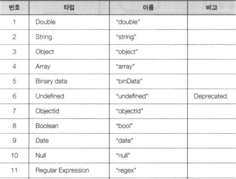  

<br>

**기본 타입**

-   BSON의 값

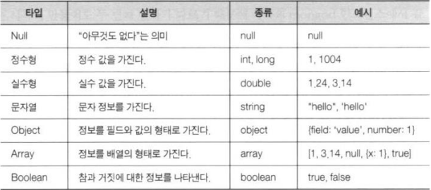  

<br>

**예**

```json
{
    title: "게시글 제목",
    content: "게시글 내용",
    up_vote: 1,
    is_visible: true,
    comments: [
        {username: "홍길동", content: "댓글 내용"},
        {username: "글쓴이", content: "댓글 내용"},
    ]
}
```

<br>

**Timestamp**

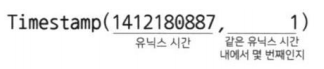  

<br>

**Date**

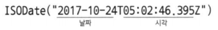  

<br>

**ObjectId**

-   도큐먼트의 _id 필드(Primary Key)
    **UUID**

    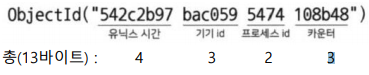  

-   서버에서 발급하는 것이 아니라 클라이언트에서 발급

<br>