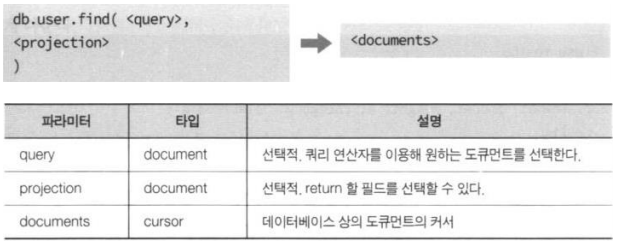
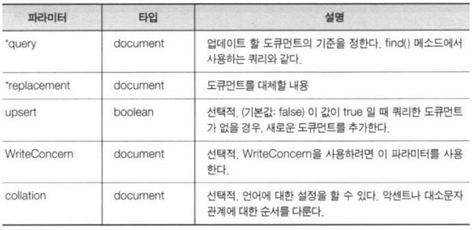
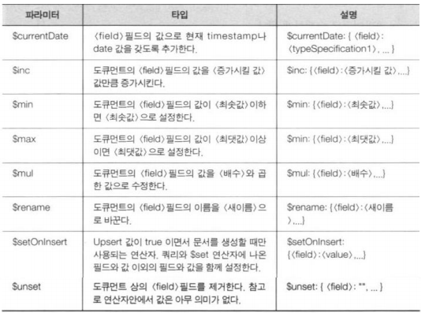
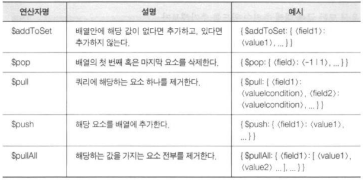
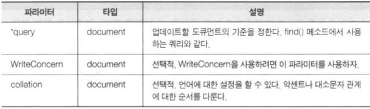

# MongoDB 셸 경험하기

**개발툴**

-   MongoDB for VSCode 확장팩
    -   CONNECTIONS > Create New Playground > `use('testDB');`
-   Azure Cosmos DB 확장팩 (선택)
-   Robomongo
    -   https://robomongo.org/download
    -   Simple GUI for beginners > portable version

<br>

### 컬렉션과 데이터베이스 더 알아보기

**데이터베이스와 컬렉션의 삭제와 수정**

  

<br>

**데이터베이스 상태 조회**

  

<br>

**컬렉션 상태 조회**

  

<br>

**실습**

```shell
> use testDB
> db.createCollection("cappedCollection", {
    capped: true,
    size: 10000
})
> db.cappedCollection.insertOne({x:1})
> db.cappedCollection.find()
```

<br>

```shell
> db.cappedCollection.stats()
```

<br>

```shell
> for(i=0; i<1000; i++) {
	db.cappedCollection.insert({x: i})
}
> db.cappedCollection.find()
```

<br>

```shell
> db.cappedCollection.stats()
```

<br>

### 도큐먼트 생성

**단일 도큐먼트 생성**

  

<br>

**실습**

```shell
> use testDB
> db.user.insertOne({
    username: "karoid",
    password: "1111"
    })
> db.user.find().pretty()
```

<br>

```shell
> use testDB
> db.user.insertOne({
    _id: 2,
    username: "karoid",
    password: "1111"
})
```

<br>

**다수 도큐먼트 생성**

  


  

<br>

**실습**

```shell
> use testDB
> db.user.insertMany([
    {username: "John", password: 4321},
    {username: "K", password: 4221},
    {username: "Mark", password: 5321},
])
```

<br>

```shell
> use testDB
> db.myCollections.insertMany([
    {_id: 13, item: "envelopes", qty: 60},
    {_id: 14, item: "stamps", qty: 110},
    {_id: 14, item: "packing tape", qty: 38},
])
```

>   _id 중복으로 에러가 발생함  
>
>   에러가 발생하면 전체 작업이 취소 됨 → 원자성

<br>

**원자성**

-   MongoDB는 RDBMS의 트랜잭션 처리를 지원하지 않음
-   명령의 원자성으로 이를 대신함
-   MongoDB의 모든 명령은 원자성을 보장
    -   성공하거나 실패하거나
    -   부분 성공은 없음

<br>

**실습**

1.  board 데이터베이스에 작업한다.
2.  자유게시판과 비밀게시판을 생성한다.
3.  자유게시판에 아무 글이나 3개 작성하자.
    특히, 그 중에서 글 하나에는 댓글 하나가 달린 상태로 생성해보자.
4.  비밀게시판 작성자가 'noname' 값을 가지는 글을 하나 작성하자.

<br>

```sql
use board

freeboard_result = db.board.insertOne({name: "자유게시판"})

freeboard_id = freeboard_result.insertedId

db.article.insertMany([
    {
        board_id: freeboard_id,  // F.K.
        title: 'hello',
        content: 'hi, hello1'
    },
    {
        board_id: freeboard_id,
        title: 'hi',
        content: 'hi, hello2',
        author: 'Jeong'
    }
])
    
db.article.insertOne({
    board_id: freeboard_id,
    title: 'hi',
    content: 'hi, hello3',
    author: 'Hong',
    comments: [
        {author: 'Karoid', content: 'hello Hong!'}
    ]
})

secret_id = db.board.insertOne({name: "비밀게시판"}).insertedId

db.article.insertOne({
    board_id: secret_id,
    title: 'my Secret Title',
    content: 'hi, hello1',
    author: 'noname'
})
```

<br>

### 도큐먼트 조회

**도큐먼트 조회**

  

<br>

**쿼리**

-   검색 조건을 도큐먼트 형태로 정의한 것

    **\> `db.containerBox.find({name: "가위"})`**

```sql
use testDB

db.containerBox.insertMany([
    {name: 'bear', weight: 60, category: 'animal'},
    {name: 'bear', weight: 10, category: 'animal'},
    {name: 'cat', weight: 2, category: 'animal'},
    {name: 'phone', weight: 1, category: 'electronic'}
]);
```

결과

```json
{
    "acknowledged" : true,
    "insertedIds" : [ 
        ObjectId("5f83d7a9ff45dca99597ffe0"), 
        ObjectId("5f83d7a9ff45dca99597ffe1"), 
        ObjectId("5f83d7a9ff45dca99597ffe2"), 
        ObjectId("5f83d7a9ff45dca99597ffe3")
    ]
}
```

<br>

**\> `db.containerBox.find()`**

결과

```json
{ "_id" : ObjectId("5eb8e9f95284dfa9e50224e3"), "name" : "bear",
 "weight" : 60, "category" : "animal" }
{ "_id" : ObjectId("5eb8e9f95284dfa9e50224e4"), "name" : "bear",
 "weight" : 10, "category" : "animal" }
{ "_id" : ObjectId("5eb8e9f95284dfa9e50224e5"), "name" : "cat",
 "weight" : 2, "category" : "animal" }
{ "_id" : ObjectId("5eb8e9f95284dfa9e50224e6"), "name" : "phone",
 "weight" : 1, "category" : "electronic" }
```

<br>

**\> `db.containerBox.find({})`**

결과

```json
{ "_id" : ObjectId("5eb8e9f95284dfa9e50224e3"), "name" : "bear",
 "weight" : 60, "category" : "animal" }
{ "_id" : ObjectId("5eb8e9f95284dfa9e50224e4"), "name" : "bear",
 "weight" : 10, "category" : "animal" }
{ "_id" : ObjectId("5eb8e9f95284dfa9e50224e5"), "name" : "cat",
 "weight" : 2, "category" : "animal" }
{ "_id" : ObjectId("5eb8e9f95284dfa9e50224e6"), "name" : "phone",
 "weight" : 1, "category" : "electronic" }
```

<br>

**\> `db.containerBox.find({category:'animal', name:'bear'})`**

결과

```json
{ "_id" : ObjectId("5eb8e9f95284dfa9e50224e3"), "name" : "bear",
 "weight" : 60, "category" : "animal" }
{ "_id" : ObjectId("5eb8e9f95284dfa9e50224e4"), "name" : "bear",
 "weight" : 10, "category" : "animal" }
```

<br>

**점연산자**

```shell
> var myVar = {hello: 'world'}
> myVar.hello
world
> var a = {name: {firstName: 'Karoid', lastName: 'Jeong'}}
> a.name.firstName
Karoid

> db.A.insert(a);

> db.A.find({'name.firstName' : 'Karoid'})
{ "_id" : ObjectId("5eb8ed095284dfa9e50224e7"), "name" :
{ "firstName" : "Karoid", "lastName" : "Jeong" } }
```

<br>

**점연산자 : 배열 검색**

```shell
> db.B.insertMany([
{numbers: [101, 32, 21, 11]},
{numbers: [64, 94, 15]},
{numbers: [52, 68, 75]}
])

> db.B.find({"numbers.0": 52})
```

<br>

**프로젝션**

-   `db.collection.find({조건문서},{프로젝션문서})`
    -   프로젝션 문서의 프로퍼티
    -   프로퍼티명: true : 출력
    -   프로퍼티명: flase : 출력 제외

```shell
> db.containerBox.find({category:'animal', name:'bear'}, {weight:1})
{ "_id" : ObjectId("5eb8e9f95284dfa9e50224e3"), "weight" : 60 }
{ "_id" : ObjectId("5eb8e9f95284dfa9e50224e4"), "weight" : 10 }

> db.containerBox.find({category:'animal', name:'bear'},
{category:0, name:0})
{ "_id" : ObjectId("5eb8e9f95284dfa9e50224e3"), "weight" : 60 }
{ "_id" : ObjectId("5eb8e9f95284dfa9e50224e4"), "weight" : 10 }

> db.containerBox.find({category:'animal', name:'bear'}, {_id:0,
weight:1})
{"weight" : 60 }
{"weight" : 10 }

> db.containerBox.find({},
{name: true, weight: true})
```

<br>

### 도큐먼트 수정

**단일 도큐먼트 교체**

```shell
> db.collection.replaceOne(
    <query>,
    <document>,
    {
        upsert: <boolean>,
        writeConcern: <document>,
        collation: <document>
    }
)
```

-   교체이므로 _id의 값은 변경되지 않음

  

```shell
> use testDB
> db.user.findOne({username: 'Karoid'})
> db.replaceOne({username: 'Karoid'},
    {
        username: 'Karpoid',
        status: 'Sleep',
        points: 100,
        password: 2222
    }
);

> db.findOne({username: 'Karpoid'})
```

<br>

```shell
> db.myCollection.findOne({item: 'abc123'});
> db.myCollection.replaceOne({ item: 'abc123' },
{
    item: 'abc123',
    status: 'P',
    points: 100
},
    { upsert: true }
);

> db.myCollection.findOne({item: 'abc123'});
```

<br>

**도큐먼트 수정**

```shell
> db.collection.updateOne(
    <query>,
    <update>,
    {
        upsert: <boolean>,
        writeConcern: <document>,
        collation: <document>,
        arrayFilters: [ <filterdocument1>, …]
    }
)
```

<br>

```shell
> use testDB;
> db.containerBox.find({}, {_id: false});

> db.containerBox.updateMany({name: 'bear'},
	{$set: {name: 'teddy bear', category: 'tody'}}
);

> db.containerBox.find({}, {_id: false});
```

<br>

  

<br>

**도큐먼트 수정 배열 연산자**

-   배열을 값으로 갖는 필드 수정의 한계
-   배열 요소를 추가하는 수정 방법
    -   배열 요소 중에서 일부를 수정하는 수정 방법
    -   수정할 요소를 선택하는 검색 작업 필요
    -   arrayFilters 파라미터로 지정

  

```shell
db.collection.updateMany({
    {<query conditions>},
    { <update operator>: {"<array>.$[identifier>]": value}},
    { arrayFilters: [{<identifier>: <condition>}]}
})
```

-   `array` : 배열의 필드 이름
-   `identifier` : 배열 요소를 검색하는 조건의 이름
-   `arrayFilter` : identifier에 해당하는 조건 지정

<br>

**배열 요소를 추가하는 수정 방법**

```shell
> db.character.insertMany([
    {name: "x", inventory: ["pen", "cloth", "pen"]},
    {name: "y", inventory: ["book", "cloth"], position: {x: 1, y: 5}},
    {name: "z", inventory: ["wood", "pen"], position: {x: 0, y: 9}}
])

> db.character.updateManu({}, {
    $set: {"inventory.$[penElem]": "pencil"}},
    {arrayFilters: [{penElem: "pen"}]}
}

> db.character.find({"inventory": "pencil"})
```

<br>

쿼리 문서를 지정하고, 이에 해당하는 인덱스를 나타내는 $를 사용하여 수정

```shell
> db.character.updateMany(
    {inventory: "pen"},
    {$set : {"inventory.$": "pencil"}} // 첫 번째 값만 변경
)
    {$set : {"inventory.$[]": "pencil"}} // 검색된 모든 값 변경
```

<br>

**배열 수정 연산자**

  

<br>

**실습**

1.  모든 글에 추천 수 필드를 추가하고 값을 0으로 설정한다.
2.  비밀 게시판 글에 추천 수를 1 증가 시킬 수 있다.
3.  이미 댓글이 달린 자유게시판 글의 내용을 수정할 수 있다.
4.   이미 댓글이 달린 자유게시판 글에 upvote 필드 없이 댓글을 추가한다.
5.  이미 댓글이 달린 글에 방금 달은 댓글에(특징을 기억해서 수정하자) upvote 필드를 값을 0으로 추가하자.

<br>

```shell
> use board
> db.article.updateMany({}, {$set: {upvote:0}})

> secretboard_id = db.board.find({name:"비밀게시판"}).toArray()[0]._id
> db.article.updateMany(
    {board_id: secretboard_id},
    {$inc: {upvote:1}}
)

> freeboard_id = db.board.find({name:"자유게시판"}).toArray()[0]._id
> doc_id = db.article.find({
    board_id: freeboard_id,
    author:"Hong"
}).toArray()[0]._id

> db.article.updateOne({_id: doc_id}, {$set: {content: 'updated'}})

> db.article.updateOne(
    {_id: doc_id},
    {$push: {comments: {author: "Quote", "content: "reply"}}}
)

> db.article.updateOne(
    {_id: doc_id},
    {$set: {"comments.$[karoidcomment].update":0}},
    {arrayFilters: [{"karoidcomment.author": "Quote"}]}
)
```

<br>

### 도큐먼트 삭제 

**도큐먼트 삭제**

```shell
db.collection.deleteOne(
    <query>, {
        writeConcern: <document>,
        collation: <document>
    }
)

db.collection.deleteMany(
    <query>, {
        writeConcern: <document>,
        collation: <document>
    }
)
```

<br>

  

<br>

```shell
> db.character.deleteMany({})
> db.character.drop()
> db.containerBox.deleteMany({ category: "animal"})
```

<br>

**실습**

1.  게시판에 있는 모든 글을 삭제할 수 있다.
2.  모든 게시판을 삭제할 수 있다.
3.  board 데이터베이스를 삭제할 수 있다.

```shell
> db.article.deleteMany({})
> db.article.drop()
> db.board.drop()
> db.dropDatabase()
```

<br>

### 도큐먼트 트랜잭션

**트랜잭션**

-   세션
    -   일정 시간 같은 사용자로부터 들어오는 일련의 요구를 하나의 상태로 보고, 그 상태를 일정하게 유지시키는 기술

```shell
session = db.getMongo().startSession()
session.startTransaction( {
    readConcern: { level: "snapshot" },
    writeConcern: { w: "majority" }
})
<원하는 작업을 수행>

session.commitTransaction(); // 작업 반영
// session.abortTransaction(); // 작업 취소

session.endSession();
```

<br>