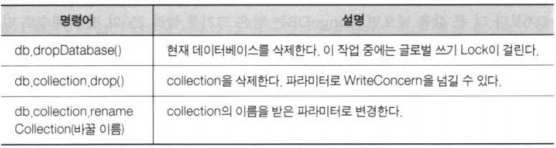
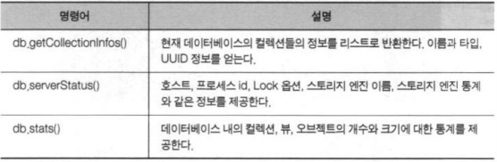
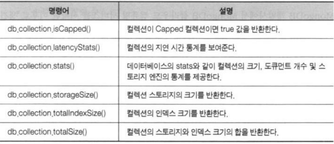
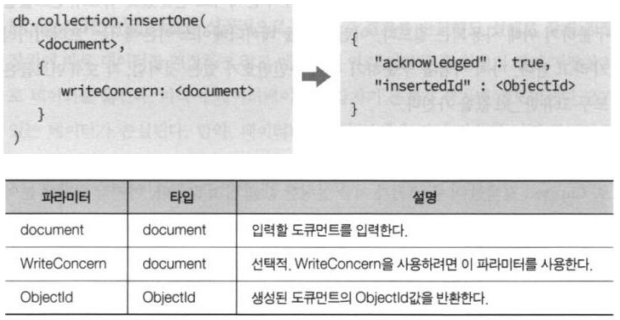
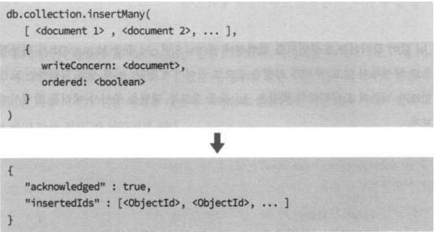
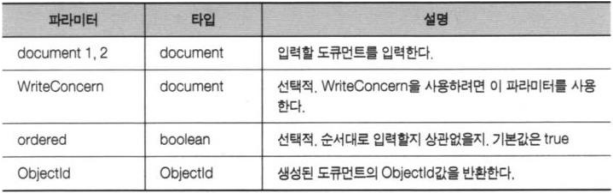

# MongoDB 셸 경험하기

**개발툴**

-   MongoDB for VSCode 확장팩
    -   CONNECTIONS > Create New Playground > `use('testDB');`
-   Azure Cosmos DB 확장팩
-   Robomongo 
    -   https://robomongo.org/download
    -   Simple GUI for beginners > portable version

<br>

### 컬렉션과 데이터베이스 더 알아보기

**데이터베이스와 컬렉션의 삭제와 수정**

  

<br>

**데이터베이스 상태 조회**

  

<br>

**컬렉션 상태 조회**

  

<br>

**실습**

```shell
> use testDB
> db.createCollection("cappedCollection", {
    capped: true,
    size: 10000
})
> db.cappedCollection.insertOne({x:1})
> db.cappedCollection.find()
```

<br>

```shell
> db.cappedCollection.stats()
```

<br>

```shell
> for(i=0; i<1000; i++) {
	db.cappedCollection.insert({x: i})
}
> db.cappedCollection.find()
```

<br>

```shell
> db.cappedCollection.stats()
```

<br>

### 도큐먼트 생성

**단일 도큐먼트 생성**

  

<br>

**실습**

```shell
> use testDB
> db.user.insertOne({
    username: "karoid",
    password: "1111"
    })
> db.user.find().pretty()
```

<br>

```shell
> use testDB
> db.user.insertOne({
    _id: 2,
    username: "karoid",
    password: "1111"
})
```

<br>

**다수 도큐먼트 생성**

  


  

<br>

**실습**

```shell
> use testDB
> db.user.insertMany([
    {username: "John", password: 4321},
    {username: "K", password: 4221},
    {username: "Mark", password: 5321},
])
```

<br>

```shell
> use testDB
> db.myCollections.insertMany([
    {_id: 13, item: "envelopes", qty: 60},
    {_id: 14, item: "stamps", qty: 110},
    {_id: 14, item: "packing tape", qty: 38},
])
```

>   _id 중복으로 에러가 발생함  
>
>   에러가 발생하면 전체 작업이 취소 됨 → 원자성

<br>

**원자성**

-   MongoDB는 RDBMS의 트랜잭션 처리를 지원하지 않음
-   명령의 원자성으로 이를 대신함
-   MongoDB의 모든 명령은 원자성을 보장
    -   성공하거나 실패하거나
    -   부분 성공은 없음

<br>

**실습**

1.  board 데이터베이스에 작업한다.
2.  자유게시판과 비밀게시판을 생성한다.
3.  자유게시판에 아무 글이나 3개 작성하자.
    특히, 그 중에서 글 하나에는 댓 글 하나가 달린 상태로 생성해보자.
4.  비밀게시판 작성자가 'noname' 값을 가지는 글을 하나 작성하자.

<br>

<br>

<br>

<br>

<br>

<br>

<br>

<br>

<br>

<br>

<br>

<br>

<br>