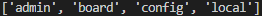
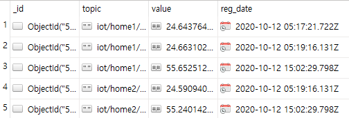
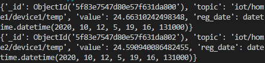

# PyMongo

<br>

**패키지 설치**

-   `pip install pymongo`

<br>

**데이터베이스 접속**

PYMONGO-EX/ex01.py

```python
from pymongo import MongoClient

# db 서버 접속
db_client = MongoClient("mongodb://localhost:27017/")

# 기존 데이터베이스이름 목록 출력
print(db_client.list_database_names())
```

  

---

<br>

**문서 하나 삽입**

PYMONGO-EX/ex02.py

```python
from pymongo import MongoClient
from datetime import datetime
import random

db_client = MongoClient("mongodb://localhost:27017/")

iot_db = db_client['iot_service']  # 데이터베이스 선택, 없으면 자동 생성
sensors_col = iot_db['sensors']  # 컬렉션 선택, 없으면 자동 생성

sensor_value = {
    "topic": "iot/home1/device1/temp",
    "value": 24 + random.random(),
    "reg_date": datetime.utcnow()  # 현재 시간(UTC)
}

x = sensors_col.insert_one(sensor_value)
print(x.inserted_id)
```

  

---

<br>

**여러 개의 문서 삽입**

PYMONGO-EX/ex03.py

```python
from pymongo import MongoClient
from datetime import datetime
import random

db_client = MongoClient("mongodb://localhost:27017/")

iot_db = db_client['iot_service']
sensors_col = iot_db['sensors']

sensor_values = [
    {
        "topic": "iot/home1/device1/temp",
        "value": 24 + random.random(),
        "reg_date": datetime.utcnow()  # 현재 시간
    },
    {
        "topic": "iot/home1/device1/humi",
        "value": 55 + random.random(),
        "reg_date": datetime.utcnow()  # 현재 시간
    },
    {
        "topic": "iot/home2/device1/temp",
        "value": 24 + random.random(),
        "reg_date": datetime.utcnow()  # 현재 시간
    },
    {
        "topic": "iot/home2/device1/humi",
        "value": 55 + random.random(),
        "reg_date": datetime.utcnow()  # 현재 시간
    }
]
x = sensors_col.insert_many(sensor_values)  # 여러 문서 삽입
print(x.inserted_ids)
```

  

---

<br>

**여러 문서 읽기**

PYMONGO-EX/ex04.py

```python
from pymongo import MongoClient
from datetime import datetime
import random

db_client = MongoClient("mongodb://localhost:27017/")

iot_db = db_client['iot_service']
sensors_col = iot_db['sensors']

list = sensors_col.find()

for x in list:
    print(x)
```

  

  

---

<br>

**정렬 하기**

PYMONGO-EX/ex05.py

```python
from pymongo import MongoClient
from datetime import datetime
import random

db_client = MongoClient("mongodb://localhost:27017/")
iot_db = db_client['iot_service']

sensors_col = iot_db['sensors']
list = sensors_col.find().sort("value")  # 내림차순 .sort("value", -1)

for x in list:
    print(x)
```

  

---

<br>

**쿼리 하기**

PYMONGO-EX/ex06.py

```python
from pymongo import MongoClient
from datetime import datetime
import random

db_client = MongoClient("mongodb://localhost:27017/")

iot_db = db_client['iot_service']
sensors_col = iot_db['sensors']

query = {"topic": "iot/home1/device1/humi"}
list = sensors_col.find(query).sort("value")  # .sort("value", -1)

for x in list:
    print(x)

print(type(list))
```

  

---

<br>

**비교연산자로 쿼리 하기**

PYMONGO-EX/ex07.py

```python
from pymongo import MongoClient
from datetime import datetime
import random

db_client = MongoClient("mongodb://localhost:27017/")

iot_db = db_client['iot_service']
sensors_col = iot_db['sensors']

query = {"value": {"$gt": 55.1}}
projection = { "_id" : 0, "topic":1, "value":1}
# topic과 vale만 출력 "reg_date":0 으로도 가능
list = sensors_col.find(query, projection).sort("value")  # .sort("value", -1)

for x in list:
    print(x)
```

  

---

<br>

**하나 업데이트하기**

PYMONGO-EX/ex08.py

```python
from pymongo import MongoClient
from datetime import datetime
import random

db_client = MongoClient("mongodb://localhost:27017/")

iot_db = db_client['iot_service']
sensors_col = iot_db['sensors']

query = {"value":{"$gt":55.1}}
newvalues = {"$set": { "reg_date": datetime.now() }}  # KST
sensors_col.update_one(query, newvalues)

sensor_values = sensors_col.find()
for x in sensor_values:
    print(x)
```

  

  

---

<br>

**여러 개 업데이트하기**

PYMONGO-EX/ex09.py

```python
from pymongo import MongoClient
from datetime import datetime
import random

db_client = MongoClient("mongodb://localhost:27017/")

iot_db = db_client['iot_service']
sensors_col = iot_db['sensors']

query = {"value": {"$gt": 55.1}}
newvalues = {"$set": {"reg_date": datetime.now()}}
sensors_col.update_many(query, newvalues)

sensor_values = sensors_col.find()
for x in sensor_values:
    print(x)
```

  

  

---

<br>

**하나 삭제하기**

PYMONGO-EX/ex10.py

```python
from pymongo import MongoClient
from datetime import datetime
from bson.objectid import ObjectId
import random

db_client = MongoClient("mongodb://localhost:27017/")

iot_db = db_client['iot_service']
sensors_col = iot_db['sensors']

query = {"value":{"$gt":24.1}}

# query = {"_id" : ObjectId("5f83e7547d80e57f631da801")}
# 일반적으로 데이터를 삭제할 땐 id를 받아 삭제를 진행

sensors_col.delete_one(query) # 한개삭제

sensor_values = sensors_col.find()
for x in sensor_values:
    print(x)
```

  

  

---

<br>

**여러 개 삭제하기**

PYMONGO-EX/ex11.py

```python
from pymongo import MongoClient
from datetime import datetime
import random

db_client = MongoClient("mongodb://localhost:27017/")

iot_db = db_client['iot_service']
sensors_col = iot_db['sensors']

query = {"value": {"$lt": 55.1}}
sensors_col.delete_many(query)

sensor_values = sensors_col.find(query)
for x in sensor_values:
    print(x)
```

  

---

<br>

**다른 접근 방법**

PYMONGO-EX/ex12.py

```python
from pymongo import MongoClient
from datetime import datetime
import random

mongodb = MongoClient("mongodb://localhost:27017/")
db = mongodb.iot_service

slist = db.sensors.find()

for x in slist:
    print(x)
```

