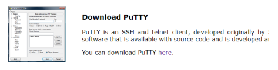

# 라즈베리파이 설치 1 (Image 설치)

### https://www.raspberrypi.org/downloads/


<br>

### 라즈비안 OS 이미지 다운로드

-   크기 2.5G 


<br>

### Win32 Disk Imager 설치

-   https://sourceforge.net/projects/win32diskimager/?source=typ_redirect


<br>

### 라즈비언 이미지 SDCard 심기

-    10분 정도 소요


<br>

### 파티션 구성

-   부팅 및 시스템 설정 파티션(256 MB)
-   주 파티션(6.59 GB)
-   미할당 영역(7.99 GB)
    -   확장 필요


<br>

### SSH 활성화하기

-   boot 파티션에 ssh 파일 생성
    -   확장명 무, 내용 무

### WiFi 접속설정 파일 만들기

-   boot 파티션에 wpa_supplicant.conf 작성

```
ctrl_interface=DIR=/var/run/wpa_supplicant GROUP=netdev
update_config=1
network={
    ssid="네트워크이름"
    psk="네트워크비번"
}
```

부팅 후 우측 상단 와이파이 아이콘에 마우스 올리면 IP 주소 확인 가능

<br>

### 개행문자 조정

-    CRLF -> LF


<br>

### 부팅

-   최초 부팅 약간 시간 걸림

    -   자동 파티션 확장

    -   화면에 아무것도 안 나와도 기다림.

        >   내 IP: 192.168.0.10

        cmd > `ssh pi@192.168.0.10`

        password : raspberry

<br>

<br>

# 라즈베리파이 설치 2 (NOOBS 설치)

### https://www.raspberrypi.org/downloads/


<br>

### NOOBS 다운로드


<br>

### microSD 카드 준비

-   micro SD카드 Fat32 포맷
-   NOOBS_v3_4_0 파일 압축해제
-   파일/디렉토리를 micro SD카드에 복사


<br>

### 장치 연결

-   HDMI, 키보드, 마우스 연결
-   SD카드 장착
-   HDMI 연결 시 반드시 어댑터로 전원공급
    -   USB로 전원공급 시 전류 부족으로 그래픽 환경 지원 못함
    -   무한 재부팅 발생

<br>

### 최초 부팅시 설치할 OS 선택

-   Rasbian (선택)
-   LibreELEC
      <br>
-   INSTALL 메뉴 실행

<br>

<br>

# 라즈베리파이 초기화


<br>


<br>


<br>


<br>

### 무선 마우스 반응 속도

-   sudo nano /boot/cmdline.txt
-   라인 끝에 다음 추가
    -   usbhid.mousepoll=0
        재부팅

<br>

### 시스템 업데이트

-   $ `sudo apt update`
-   $ `sudo apt upgrade`
-   주 1회 간격으로 실행 권장

<br>

### 5인치 터치 LCD

-   터치 드라이버 설치(micro USB 연결 시 불필요)
    -   $ `git clone https://github.com/goodtft/LCD-show.git`
    -   $ `cd LCD-show/ `
    -   $ `chmod +x LCD5-show `
    -   $ `sudo ./LCD5-show`

<br>

### 가상 키패드 설치

-   $ `sudo apt install florence -y`
-   $ `sudo apt install at-spi2-core -y`
-   메뉴 > Universal Access > Florence Virtual Keyboard


<br>

<br>

# 원격 접속 환경 설정 - Headless 환경 -

<br>

## 원격 접속을 위한 VNC와 Putty (Headless 환경)

### 설정

-   Preference->Raspverry Pi Configuration

    

    <br>

### 텍스트 모드 원격 접속

-   Putty 다운로드 및 설치
    -   https://www.putty.org




<br>

### 그래픽 모드 원격 접속

-   라즈베리파이 VNC 접속 허용
    -   기본 설정 > Raspberry Pi Configuration > Interfaces > VNC Enable


-   VNC Viewer (윈도우)
    -   https://www.realvnc.com/en/connect/download/viewer/windows/


-   VNC Viewer
    -   File > New Connection…


<br><br>

# 한글 입력기 및 locale 설정

### 한글 폰트 설치하기(fonts-unfonts-core)

-   $ `sudo apt-get install fonts-unfonts-core`

<br>

### 한글 입력기 설치

-   $ `sudo apt-get install nabi im-config`
-   $ `sudo reboot`

<br>

### 한글 입력기 설정

-   메뉴 > Preference(설정) > Input Method(입력기) > OK


<br>

### 한글 입력기 설정


<br>

### 재기동


<br>

###  locale 설정


<br>

### 한글 전환키 재설정


<br>

<br>

# Samba 설치 - 윈도우즈에서 폴더 공유 -

### 삼바(Samba)

-   리눅스(UNIX-like)와 윈도우간에 파일 및 프린터를 공유 지원 패키지
-   컴퓨터 간 파일 공유등의 서비스 구현
-   SMB/CIFS 프로토콜 사용
-   리눅스 서버를 타운영체제와 파일을 공유할 수 있는 파일서버로도 사용

<br>

### 삼바 설치

-   $ `sudo apt install samba samba-common-bin`

<br>

### 사용자 추가

-   시스템 사용자 id와 삼바 사용자 id 다름
-   smbpasswd로 삼바를 사용할 id를 추가
    -   이 id를 사용하여, 다른 컴퓨터에서 라즈베리파이로 삼바 접속

```
pi@raspberrypi:~ $ sudo smbpasswd -a pi
New SMB password:
Retype new SMB password:
Added user pi.
pi@raspberrypi:~ $
```

<br>

### 삼바 구성 정보 설정

-   pi@raspberrypi:~ $ `sudo nano /etc/samba/smb.conf`

```
[pi]
    comment = pi shared folder
    path = /home/pi
    valid users = pi
    browseable = yes
    guest ok = no
    read only = no
    create mask = 0777
```

>   Ctrl + o 저장

<br>

### samba 재시작

-   pi@raspberrypi:~ $ `sudo service smbd restart`


>   mypi -> 192.168.10

<br>

### 로그인

-   samba에 등록한 사용자 id/password 이용


### 네트워크 드라이브 연결


<br>

<br>

# Python3 설정

### 라즈베리파이의 파이썬

-   /usr/bin에 기본 명령 존재
-   python : python2에 대한 심벌릭 링크
-   pip : pip2의 복사본

<br>

-   python3를 디폴트로 만들기

    $ `cd /usr/bin `

    $ `sudo ln -sf python3.7 python `

    $ `sudo ln -sf python-config python3.7-config `

    $ `sudo cp pip3 pip`

